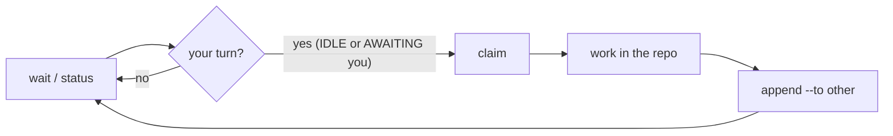

<div align="center">

# M8Shift

_Different agents. Different roles. One coordinated workflow._


**A free and open-source single-file relay that lets two or more AI agents — an active roster (Claude, Codex, Gemini, Vibe, …) — cooperate on the same repository through strict alternation (one writer at a time).**

[](LICENSE)
[](#tests)
[](#install)
[](m8shift.py)
[](#runs-anywhere--no-api-key)
[](docs/en/specification.md#11-developing-m8shift-with-m8shift-dogfooding)

English | [Français](docs/README_fr.md)

</div>

## What is M8Shift?

M8Shift is a **cooperative mutex** for AI agents. When Claude and Codex work on the
same repository, they overwrite each other. M8Shift introduces a single **pen**: at
any moment, exactly one agent is allowed to write; the others wait for their turn and
knows precisely what is expected of it.

M8Shift is **free and open source**, released under the
[Apache License 2.0](LICENSE).

The whole kit fits in **one file**: [`m8shift.py`](m8shift.py). You copy it to the
root of a project, run `init`, and the agents hand off to each other (any roster member to any other) through a
shared `M8SHIFT.md` file. The whole procedure is **embedded in the generated files**,
so the agents need **no human explanation**. *Caveat for interactive UIs* (VS Code, …):
a human still nudges each agent to *resume* between turns — `wait` blocks a process but
does not wake an agent's chat UI. See [Limitations](#limitations).

## Why

When Claude and Codex share a repository, they have no way to take turns: edits
collide and work is lost. M8Shift fixes this with a single exclusive lock (the
**pen**) and one simple rule — **acquire the pen before working** — so no two
agents ever modify the repository at the same time. The coordination state lives
in a versionable file, readable both by eye and by `grep`, and preserved over time.
No daemon, no server, no external dependency — just one Python file and the host
tools' own conventions.

There is also a human reason: different agents bring different judgments. M8Shift was
created to make that contradiction usable — Claude, Codex or another agent can review,
challenge, and hand off work without the maintainer becoming a copy/paste relay. The
human still decides the direction. See [Philosophy](docs/en/philosophy.md).

## Runs anywhere — no API key

M8Shift is a **passive CLI**: the agents drive it with shell commands, so it works on
every surface where Claude Code or Codex run, and it adds **zero credentials**.

| Surface | Works? | Notes |
|---------|--------|-------|
| Terminal / CLI | ✅ | headless (`claude -p`, `codex exec`, cron) can be **fully automated** — see [`examples/headless_runner.py`](examples/headless_runner.py), which emits `M8SHIFT_RUN_ID` and `.m8shift/runtime/runs.jsonl` lifecycle events |
| Desktop app (Mac/Windows) | ✅ | interactive: a human resumes each agent between turns |
| VS Code / JetBrains (IDE) | ✅ | same as desktop |
| Web (claude.ai/code) | ✅ | anywhere the agent can run a shell and read its anchor |

**No API key. No token. No account for M8Shift itself.** `m8shift.py` makes **zero
network calls** (stdlib only, local files) — the agents use whatever subscription or
login you already have. Nothing leaves your machine, there is no per-call cost, and no
vendor lock-in.

## Install

One-line local install for macOS/Linux/WSL/Git Bash:

```bash
curl -fsSL https://raw.githubusercontent.com/M8Shift/M8Shift/main/install.sh | bash -s -- --agents claude,codex
```

Native Windows PowerShell:

```powershell
irm https://raw.githubusercontent.com/M8Shift/M8Shift/main/install.ps1 | iex
```

These installers download `m8shift.py` plus `m8shift-worktree.py` and
`m8shift-runtime.py` into the current directory, verify the files against
`checksums.sha256`, then run
`m8shift.py init --agents claude,codex` through the detected Python 3.8+ interpreter. No `sudo`, no global PATH change,
no background service.

For a pinned release, fetch the installer from the tag and use the same ref for the
downloaded files:

```bash
curl -fsSL https://raw.githubusercontent.com/M8Shift/M8Shift/vX.Y.Z/install.sh | \
  bash -s -- --ref vX.Y.Z --agents claude,codex
```

```powershell
$env:M8SHIFT_INSTALL_REF = "vX.Y.Z"
irm https://raw.githubusercontent.com/M8Shift/M8Shift/vX.Y.Z/install.ps1 | iex
```

Security boundary: Bash and PowerShell both verify downloaded files by default
(`--no-verify` opts out) against the `checksums.sha256` manifest from the selected ref.
That catches corruption or mismatch. For out-of-band trust against a compromised origin,
pin reviewed digests with `--sha256 FILE:HEX` or use a signed release tag.

Manual install:

```bash
cp m8shift.py /my/project/          # the ONLY file you need
cd /my/project
python3 m8shift.py init             # project name = folder name (or --name "X")
```

`init` is idempotent (safe to re-run) and generates:

| generated file              | role |
|-----------------------------|------|
| `M8SHIFT.md`                 | **the** living file: the lock (`LOCK`) + the turn journal |
| `M8SHIFT.protocol.md`        | the full shared instruction (read once by each agent) |
| `CLAUDE.md`, `AGENTS.md`, … | each active agent's canonical anchor (the default pair shown) — a stanza is injected at the top without duplicating or overwriting existing content; the prior file is backed up to `<anchor>.m8shift.bak` |
| `AGENTS.override.md`        | if present, Codex's priority anchor; the stanza is synced there too |

The shipped `m8shift.py` is **English-only**. To generate files in another language,
build a localized single-file variant from the language packs and run that:

```bash
python3 m8shift-i18n.py --langs fr,es --into ./dist   # build EN + fr + es
./dist/m8shift.py init --lang fr                       # then --lang / $M8SHIFT_LANG select it
```

Packs available: **fr, es, it, de, pt, ja, ru, zh-cn** (non-English are machine-translated,
pending review — see [CONTRIBUTING.md](CONTRIBUTING.md)). Use `--agents a,b,c…` to choose the
**active roster** (default `claude,codex`): **all** declared agents relay — the pen holder
hands off to any other member via `--to` — still one writer at a time (degree-1).

**On Windows?** No dependencies (stdlib only) — run via WSL, Git Bash, or the native
PowerShell one-liner above. See [Running on Windows](docs/en/windows.md).

**From a fork / clone?** M8Shift is one file — host it on any Git or GitLab:
`git clone https://gitlab.example.com/you/M8Shift.git`, then `cp m8shift.py /my/project/`
and run `init` as above.

## Quickstart

Each agent runs the same loop: `next → work → append`. `next` is the guarded
shortcut for `wait → claim → peek`: it waits if needed, then claims and prints the
latest handoff addressed to you. `<you>` is your own agent name and `<other>` any
other roster member you hand to (the examples below use the default pair
`claude`/`codex`).

`claude` and `codex` are example roster names, not a limitation. Replace them with
`gemini`, `vibe`, or any other cooperative agent that can read its instructions,
run the CLI, and follow `claim → work → append`.

```bash
./m8shift.py status --for claude   # who holds the pen + what should claude do next?
./m8shift.py watch --for claude    # live read-only status view in a terminal
./m8shift.py next claude           # wait if needed, then claim + show the handoff
./m8shift.py wait claude --once    # rc 0 = your turn (or DONE = stop); rc 3 = not yet

# Acquire the pen BEFORE working (exclusive: only one winner):
./m8shift.py claim claude          # rc 0 = you hold the pen; otherwise not your turn

# ...work in the repository, then close your turn and hand off:
./m8shift.py append claude --to codex \
    --ask  "what you need from the other" \
    --done "what you just did" \
    --files a,b \
    --wait                         # optional: stay blocked until claude's next turn or DONE

# Not your turn? Block until it is, then retry claim:
./m8shift.py wait claude           # polls ~60s (--interval N)
```

**Golden rule:** you only work and write **after acquiring the pen via `claim`**
(`append` is accepted only from `WORKING_<you>`).
Before stopping, run `status --for <you>`; if the relay is not `DONE`, keep waiting,
hand off your own `WORKING_<you>` state with `append`, close it with `done`, or park an
open/no-work session with `pause`.
For a passive live view while agents work, leave `./m8shift.py watch --for <you>
--interval 5` running in a separate terminal; it never claims or changes the relay.

## Documentation

Docs follow the [Diátaxis](https://diataxis.fr/) framework:

- **English documentation index** — [docs/en/README.md](docs/en/README.md) — all English docs in one place.
- **Tutorial** — [docs/en/tutorial.md](docs/en/tutorial.md) — learn the relay step by step.
- **How-to (VS Code)** — [docs/en/vscode-guide.md](docs/en/vscode-guide.md) — run the relay with a Claude/Codex-style pair or any active roster.
- **How-to (Windows)** — [docs/en/windows.md](docs/en/windows.md) — run on Windows (WSL / Git Bash / native).
- **Reference (protocol)** — [docs/en/protocol.md](docs/en/protocol.md) — the shared protocol, states and rules.
- **Reference (spec)** — [docs/en/specification.md](docs/en/specification.md) — the full specification.
- **Explanation (architecture)** — [docs/en/architecture.md](docs/en/architecture.md) — design and operation.
- **Explanation (philosophy)** — [docs/en/philosophy.md](docs/en/philosophy.md) — why the project exists.
RFCs are maintained in English under `docs/en/rfc/`:

| № | RFC | Status |
|----:|-----|--------|
| 001 | [Roster](docs/en/rfc/001-rfc-roster.md) | — |
| 002 | [N agents](docs/en/rfc/002-rfc-n-agents.md) | shipped |
| 003 | [I18n packs](docs/en/rfc/003-rfc-i18n-packs.md) | proposed |
| 004 | [Memory](docs/en/rfc/004-rfc-memory.md) | shipped |
| 005 | [Claim check](docs/en/rfc/005-rfc-claim-check.md) | shipped |
| 006 | [Tasks](docs/en/rfc/006-rfc-tasks.md) | shipped |
| 007 | [Subturn](docs/en/rfc/007-rfc-subturn.md) | rejected |
| 008 | [Worktree companion](docs/en/rfc/008-rfc-worktree-companion.md) | proposed |
| 009 | [Runtime companion](docs/en/rfc/009-rfc-runtime-companion.md) | shipped |
| 010 | [Runtime patterns](docs/en/rfc/010-rfc-runtime-patterns.md) | proposed |
| 011 | [Session history](docs/en/rfc/011-rfc-session-history.md) | — |
| 012 | [Contracts validation](docs/en/rfc/012-rfc-contracts-validation.md) | shipped |
| 013 | [Hosted runtime control plane](docs/en/rfc/013-rfc-hosted-runtime-control-plane.md) | shipped |
| 014 | [Provider management](docs/en/rfc/014-rfc-provider-management.md) | shipped |
| 015 | [Shared tree degree gt1](docs/en/rfc/015-rfc-shared-tree-degree-gt1.md) | rejected |
| 016 | [Cooperative turn request](docs/en/rfc/016-rfc-cooperative-turn-request.md) | shipped |
| 017 | [Stage6 integrations](docs/en/rfc/017-rfc-stage6-integrations.md) | shipped |
| 018 | [Agent runtime architecture](docs/en/rfc/018-rfc-agent-runtime-architecture.md) | shipped |
| 019 | [Input neutral patterns](docs/en/rfc/019-rfc-input-neutral-patterns.md) | shipped |
| 020 | [Headless runner hardening](docs/en/rfc/020-rfc-headless-runner-hardening.md) | shipped |
| 021 | [Pause resume](docs/en/rfc/021-rfc-pause-resume.md) | shipped |
| 022 | [Session reports](docs/en/rfc/022-rfc-session-reports.md) | shipped |
| 023 | [Agent token footprint](docs/en/rfc/023-rfc-agent-token-footprint.md) | shipped |

## How it works

M8Shift stores its state in the `LOCK` block at the top of `M8SHIFT.md`. To work, an
agent must first **take the pen** with `claim` (state `WORKING_<you>`), an
**exclusive acquisition**: if several agents claim at once, only one wins. Because work
happens only while you hold the pen and `append` is accepted only from
`WORKING_<you>`, no two agents ever write the repository concurrently. This
**claim-before-work** rule is the heart of M8Shift.



The lock fields — `holder`, `state`, `agents`, `lang`, `session`, `turn`, `since`,
`expires`, `note` — are one `key: value` per line (easy to `grep`). `holder` is the pen holder
while `WORKING_*`, the awaited baton-owner while `AWAITING_*`, or `none` while
`IDLE`, `PAUSED`, or `DONE`;
`agents` is the active roster (all declared agents, ≥2; default `claude,codex`); states
are `IDLE`, `WORKING_<X>`, `AWAITING_<X>`, `PAUSED`, `DONE` (`<X>` = an active agent, uppercased). Turns are framed by `M8SHIFT:TURN <n> <agent> BEGIN/END`
HTML comments (invisible in
Markdown rendering) and are **immutable** once closed.

Timestamps are stored in UTC (`...Z`) for stable cross-agent comparisons. Human-facing
commands (`status`, `recap`, `history`, `task show`, and `m8shift-worktree.py status`) also
print the user's local time next to UTC, prefixed by the timezone name/offset when
available (otherwise `local`); JSON output stays canonical UTC.
`status` also derives display-only `started` and `duration` lines from the session
ledger; `status --json` exposes them as `session_started_at`,
`session_duration_seconds`, and `session_duration` (`null` when unavailable).

## Guarantees

Verified by the tests and by multi-agent review:

- **Mutex over the work window** — `claim` is the exclusive acquisition of the pen
  (two simultaneous `claim`s ⇒ a single winner); `append` is accepted only from
  `WORKING_<you>`. You work only after a successful `claim`, so no two agents ever
  modify the repository at the same time. `--to` ≠ self (strict alternation).
- **Stale-lock recovery** — `claim --force` reclaims **only a stale lock** (refused
  on an active one); the holder can refresh its own lock. Long-running wrappers
  should refresh at least 5 minutes before `expires`.
- **Guardrails** — `release` / `done` are baton-owner ops (the `holder`: pen holder in WORKING / awaited agent in AWAITING); only `append` requires the pen. `--force --reason TEXT` = audited recovery.
- **Serialized concurrency** — an inter-process lock `.m8shift.lock` (`O_EXCL`, with
  an ownership token) plus atomic writes (unique temp file + `os.replace`, mode
  preserved) ⇒ two concurrent `m8shift.py` runs never corrupt the file.
- **Injection-safe** — single-line fields (line breaks and reserved markers
  rejected); turn bodies neutralized against fake markers.
- **Bounded over time** — `archive` purges old closed turns without touching the
  lock or the seed turn (turn #0).
- **Portable** — empty folder or git repo, paths with spaces/accents,
  case-sensitive or -insensitive filesystems, pre-existing anchors — without
  breakage or duplication.

## Limitations

- **Waking an interactive agent UI.** `wait` blocks a *process* until your turn; it
  does **not** relaunch or wake an agent running in an interactive UI (VS Code, …).
  Between turns a human still nudges each agent (e.g. *"resume M8Shift"*). Fully
  hands-off operation needs a **headless** loop (`claude -p`, `codex exec`, cron)
  wrapping `wait → relaunch the agent → claim` — a host integration, not a change to
  the mutex. A system notification/webhook can *signal* a turn but cannot *wake* the AI
  by itself. An example runner is provided:
  [`examples/headless_runner.py`](examples/headless_runner.py). It supports `--once`,
  manual TTL heartbeat, `M8SHIFT_RUN_ID`, and local `.m8shift/runtime/runs.jsonl`
  lifecycle events. The optional [`m8shift-runtime.py`](m8shift-runtime.py)
  companion adds local presence, operator inbox, progress, and runtime diagnostics
  under `.m8shift/runtime/`.
- **Cooperative, N-agent, advisory** — see the
  [specification](docs/en/specification.md) §8 (cooperative mutex, advisory lock, one
  writer at a time).

## Tests

No external Python dependency (stdlib only):

```bash
python3 -m unittest discover -s tests        # from the repo root
```

**Test suite**: unit tests (pure functions) + CLI regression tests (one per fixed
bug, referenced `NR-n`) covering the claim model, the one-pen mutex, the N-agent relay,
canonical/override anchors, the configurable roster, advisory turn fields, shared
memory, `claim --check`, the tasks board, archive, robustness, and injection safety.

## Positioning — not an orchestrator

M8Shift is a **coordination primitive**, not an agent platform. It deliberately does
**one thing**: ensure that, of the agents already running on a shared repo, only one
writes at a time (strict turn-taking).

Full orchestrators/runtimes (agent frameworks like **LangGraph**, **AutoGen**, **CrewAI**) cover far
more — they *run* the agents: session management, tool dispatch, memory, sub-agents,
parallel **and** sequential workflows. They can take turns too; the real difference is
**scope and footprint**:

| | Orchestrator (e.g. LangGraph) | M8Shift |
|---|------------------------------|--------|
| What it is | a runtime/gateway that **drives** the agents | a single-file **lock** the agents poll |
| Install | a platform to deploy + configure (providers, auth) | `cp m8shift.py` — stdlib, no daemon, no server |
| Credentials | the agents' auth (subscription **or** API key) | **none** — M8Shift never authenticates anything |
| Scope | memory, tools, routing, parallel + sequential | only *who writes, when* |

**What M8Shift gives that a message-routing orchestrator doesn't:**

- 🔒 **A real write-lock on the repo** — exactly one agent writes at a time. An
  orchestrator routes *tasks and messages*; it does not stop two agents editing the
  same files in parallel. M8Shift does (its whole job).
- 🪶 **Zero runtime, zero credentials** — `cp m8shift.py` and go. No server to deploy, no
  provider/auth to configure, no API key, no per-call cost.
- 🤝 **Peer-to-peer, no coordinator** — the agents pass the baton themselves
  (`--to <other>`); there is no central "project-manager" agent deciding the turns.
- 📓 **Durable, readable, git-versioned coordination** — `M8SHIFT.md` *is* the record of
  who did what and what's next — by eye and by `grep`, committed alongside your code.

Reach for an orchestrator when you want a **managed agent team**. Reach for M8Shift when
you just want two agents you already run (Claude Code, Codex, …) to **stop overwriting
each other** — with nothing to install or authenticate. They are **complementary**, not
competing (M8Shift could even be the lock inside a larger setup).

## Roadmap

M8Shift keeps a **single-pen mutex** (one writer at a time) by design — see
[architecture §1.8](docs/en/architecture.md). The current roadmap is:

| Area | Status | Surface | Boundary |
|------|--------|---------|----------|
| N-agent roster, one pen | ✅ Shipped | `init --agents a,b,c…`, directed `append --to <agent>` | all agents can relay; still one writer at a time |
| Read/handoff observability | ✅ Shipped | `recap`, `peek`, `log`, `history`, `status --json`, `watch` | read-only views; no routing decisions |
| Session reports | ✅ Shipped | `session list/show/decisions/report`, `M8SHIFT.session-reports/` | derived Markdown memory; no lock mutation, no invented decisions |
| Advisory pre-claim checks | ✅ Shipped | `claim --check [--files …] [--turns N]` | no pen taken; overlap is advisory |
| Shared memory and tasks | ✅ Shipped | `remember`, `task add/done/drop/list/show`, recap headlines | append-only ledgers; never enforced by the mutex |
| Stage 4 contracts | ✅ Shipped | `append --schema stage4.v1 …`, `contract validate`, `doctor --contracts` | typed metadata is validated only on explicit read-only commands |
| Operator-loop guardrails | ✅ Shipped | `next`, `append --wait`, `status --for`, `request-turn/yield-turn/decline-turn/steer-turn` | prevents lost handoffs and UI-routing deadlocks without creating a second pen |
| Pause / resume | ✅ Shipped | `pause <holder> --reason …`, `resume <agent> --reason …`, `next --resume` | stable open/no-work state: `PAUSED`, `holder=none`, explicit user-scope resume |
| Local integration layer | ✅ Shipped | installers, checksums, version surfaces, `examples/headless_runner.py`, `m8shift-runtime.py` | local convenience layer; no provider SDK in the core |
| Degree-2 parallel work | ✅ Shipped, opt-in | [`m8shift-worktree.py`](docs/en/rfc/008-rfc-worktree-companion.md) | isolated git worktrees; serialized integration pen; core remains degree-1 |
| Provider/runtime companion | ✅ Shipped v1 | `m8shift-runtime.py init/providers/roles/workflows/approve/report` | host-side config and reports; no secrets, no second routing authority |
| `subturn` provenance ledger | ❌ Rejected | [rationale](docs/en/rfc/007-rfc-subturn.md) | redundant with advisory fields and `remember` |
| Hosted control plane / IDE integrations | 🔭 Future companion | [RFC](docs/en/rfc/013-rfc-hosted-runtime-control-plane.md) | optional layer outside the passive core |

New ideas are welcome via an RFC under `docs/en/rfc/`. RFCs are English-only;
localized documentation should link to the canonical English RFC instead of maintaining
translated copies.

**Non-goals** (they would break a M8Shift quality): path-scoped *leases* for concurrent
disjoint writes inside the shared tree (use the
[opt-in worktree companion](docs/en/rfc/008-rfc-worktree-companion.md) instead); a
background daemon / autonomous watcher / push-notifier; running git, builds or APIs (needs auth +
network → an orchestrator); third-party deps or a multi-file package; and "smart"
*derived* memory (dedup / summarize / prune) — the ledger stays a dumb, human-curated
record.

## License

Licensed under the [Apache License 2.0](LICENSE).

## Contributing

Issues and pull requests are welcome — see [CONTRIBUTING.md](CONTRIBUTING.md) (ground
rules + how to add or improve a language pack). M8Shift is a single file by design
([`m8shift.py`](m8shift.py) is the single source of truth — `M8SHIFT.protocol.md` is
generated from it), so keep changes focused and covered by a test in `tests/`. Run
the test suite before opening a PR.

> **Made with ❤ & M8Shift.** M8Shift is improved *with M8Shift*: Claude ⇄ Codex
> coordinate every change through the relay itself — see
> [Developing M8Shift with M8Shift](docs/en/specification.md#11-developing-m8shift-with-m8shift-dogfooding).
> The dogfooding relay is promoted to each stable version after tests pass, so the coordinator
> does not silently drift behind the tool being developed.
