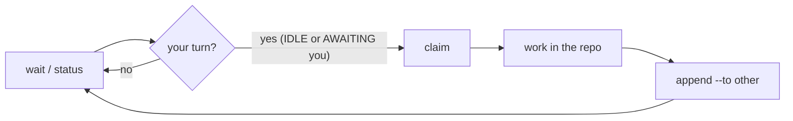

<div align="center">


# M8Shift

_Different agents. Different roles. One coordinated workflow._

**A single-file relay that lets two AI agents — a configurable pair from a roster (Claude, Codex, Gemini, Le Chat, …) — cooperate on the same repository through strict alternation.**

[](LICENSE)
[](#tests)
[](#install)
[](m8shift.py)
[](#runs-anywhere--no-api-key)
[](docs/en/specification.md#11-developing-m8shift-with-m8shift-dogfooding)

English | [Français](docs/README_fr.md)

</div>

---

> **Formerly CoWork.** The project was renamed to **M8Shift** (“Mate Shift” — *mate* = teammate,
> *shift* = handing over the turn). As of **v3.0.0** the tool is **M8Shift-only**: the `cowork.py`
> shim and the CoWork-file compatibility (dual-read, `migrate-brand`) were removed.

## What is M8Shift?

M8Shift is a **cooperative mutex** for AI agents. When Claude and Codex work on the
same repository, they overwrite each other. M8Shift introduces a single **pen**: at
any moment, exactly one agent is allowed to write; the other waits for its turn and
knows precisely what is expected of it.

The whole kit fits in **one file**: [`m8shift.py`](m8shift.py). You copy it to the
root of a project, run `init`, and the two agents hand off to each other through a
shared `M8SHIFT.md` file. The whole procedure is **embedded in the generated files**,
so the agents need **no human explanation**. *Caveat for interactive UIs* (VS Code, …):
a human still nudges each agent to *resume* between turns — `wait` blocks a process but
does not wake an agent's chat UI. See [Limitations](#limitations).

## Why

When Claude and Codex share a repository, they have no way to take turns: edits
collide and work is lost. M8Shift fixes this with a single exclusive lock (the
**pen**) and one simple rule — **acquire the pen before working** — so the two
agents never modify the repository at the same time. The coordination state lives
in a versionable file, readable both by eye and by `grep`, and preserved over time.
No daemon, no server, no external dependency — just one Python file and the host
tools' own conventions.

## Runs anywhere — no API key

M8Shift is a **passive CLI**: the agents drive it with shell commands, so it works on
every surface where Claude Code or Codex run, and it adds **zero credentials**.

| Surface | Works? | Notes |
|---------|--------|-------|
| Terminal / CLI | ✅ | headless (`claude -p`, `codex exec`, cron) can be **fully automated** — see [`examples/headless_runner.py`](examples/headless_runner.py) |
| Desktop app (Mac/Windows) | ✅ | interactive: a human resumes each agent between turns |
| VS Code / JetBrains (IDE) | ✅ | same as desktop |
| Web (claude.ai/code) | ✅ | anywhere the agent can run a shell and read its anchor |

**No API key. No token. No account for M8Shift itself.** `m8shift.py` makes **zero
network calls** (stdlib only, local files) — the agents use whatever subscription or
login you already have. Nothing leaves your machine, there is no per-call cost, and no
vendor lock-in.

## Install

```bash
cp m8shift.py /my/project/          # the ONLY file you need
cd /my/project
python3 m8shift.py init             # project name = folder name (or --name "X")
```

`init` is idempotent (safe to re-run) and generates:

| generated file              | role |
|-----------------------------|------|
| `M8SHIFT.md`                 | **the** living file: the lock (`LOCK`) + the turn journal |
| `M8SHIFT.protocol.md`        | the full shared instruction (read once by each agent) |
| `CLAUDE.md`, `AGENTS.md`, … | each active agent's canonical anchor (the default pair shown) — a stanza is injected at the top without duplicating or overwriting existing content; the prior file is backed up to `<anchor>.cowork.bak` |
| `AGENTS.override.md`        | if present, Codex's priority anchor; the stanza is synced there too |

The shipped `m8shift.py` is **English-only**. To generate files in another language,
build a localized single-file variant from the language packs and run that:

```bash
python3 m8shift-i18n.py --langs fr,es --into ./dist   # build EN + fr + es
./dist/m8shift.py init --lang fr                       # then --lang / $M8SHIFT_LANG select it
```

Packs available: **fr, es, it, de, pt, ja, ru, zh-cn** (non-English are machine-translated,
pending review — see [CONTRIBUTING.md](CONTRIBUTING.md)). Use `--agents a,b` to choose the
relaying pair from the roster (default `claude,codex`; the **first two** names are active,
extra names are stored for the N-agent mode).

**On Windows?** No dependencies (stdlib only) — run via WSL, Git Bash, or
`python m8shift.py <cmd>` in PowerShell. See [Running on Windows](docs/en/windows.md).

**From a fork / clone?** M8Shift is one file — host it on any Git or GitLab:
`git clone https://gitlab.example.com/you/M8Shift.git`, then `cp m8shift.py /my/project/`
and run `init` as above.

## Quickstart

Each agent runs the same loop: `wait → claim → work → append`. `<you>` is your own
agent name and `<other>` the other active agent (the examples below use the default
pair `claude`/`codex`).

```bash
./m8shift.py status                # who holds the pen? (non-blocking)
./m8shift.py wait claude --once    # rc 0 = you may acquire; rc 3 = not yet

# Acquire the pen BEFORE working (exclusive: only one winner):
./m8shift.py claim claude          # rc 0 = you hold the pen; otherwise not your turn

# ...work in the repository, then close your turn and hand off:
./m8shift.py append claude --to codex \
    --ask  "what you need from the other" \
    --done "what you just did" \
    --files a,b

# Not your turn? Block until it is, then retry claim:
./m8shift.py wait claude           # polls ~60s (--interval N)
```

**Golden rule:** you only work and write **after acquiring the pen via `claim`**
(`append` is accepted only from `WORKING_<you>`).

## Documentation

Docs follow the [Diátaxis](https://diataxis.fr/) framework:

- **Tutorial** — [docs/en/tutorial.md](docs/en/tutorial.md) — learn the relay step by step.
- **How-to (VS Code)** — [docs/en/vscode-guide.md](docs/en/vscode-guide.md) — run the relay with Claude + Codex.
- **How-to (Windows)** — [docs/en/windows.md](docs/en/windows.md) — run on Windows (WSL / Git Bash / native).
- **Reference (protocol)** — [docs/en/protocol.md](docs/en/protocol.md) — the shared protocol, states and rules.
- **Reference (spec)** — [docs/en/specification.md](docs/en/specification.md) — the full specification.
- **Explanation (architecture)** — [docs/en/architecture.md](docs/en/architecture.md) — design and operation.

## How it works

M8Shift stores its state in the `LOCK` block at the top of `M8SHIFT.md`. To work, an
agent must first **take the pen** with `claim` (state `WORKING_<you>`), an
**exclusive acquisition**: if two agents claim at once, only one wins. Because work
happens only while you hold the pen and `append` is accepted only from
`WORKING_<you>`, the two agents never write the repository concurrently. This
**claim-before-work** rule is the heart of M8Shift.



The lock fields — `holder`, `state`, `agents`, `turn`, `since`, `expires`, `note`,
`lang` — are one `key: value` per line (easy to `grep`). `holder` is an active agent
or `none`; `agents` is the relaying pair (the first two declared, default
`claude,codex`); states are `IDLE`, `WORKING_<X>`, `AWAITING_<X>`, `DONE` (`<X>` = an
active agent, uppercased). Turns are framed by `M8SHIFT:TURN <n> <agent> BEGIN/END`
HTML comments (invisible in
Markdown rendering) and are **immutable** once closed.

## Guarantees

Verified by the tests and by multi-agent review:

- **Mutex over the work window** — `claim` is the exclusive acquisition of the pen
  (two simultaneous `claim`s ⇒ a single winner); `append` is accepted only from
  `WORKING_<you>`. You work only after a successful `claim`, so two agents never
  modify the repository at the same time. `--to` ≠ self (strict alternation).
- **Stale-lock recovery** — `claim --force` reclaims **only a stale lock** (refused
  on an active one); the holder can refresh its own lock.
- **Guardrails** — `release` / `done` require holding the pen (`--force` = recovery).
- **Serialized concurrency** — an inter-process lock `.m8shift.lock` (`O_EXCL`, with
  an ownership token) plus atomic writes (unique temp file + `os.replace`, mode
  preserved) ⇒ two concurrent `m8shift.py` runs never corrupt the file.
- **Injection-safe** — single-line fields (line breaks and reserved markers
  rejected); turn bodies neutralized against fake markers.
- **Bounded over time** — `archive` purges old closed turns without touching the
  lock or the seed turn (turn #0).
- **Portable** — empty folder or git repo, paths with spaces/accents,
  case-sensitive or -insensitive filesystems, pre-existing anchors — without
  breakage or duplication.

## Limitations

- **Waking an interactive agent UI.** `wait` blocks a *process* until your turn; it
  does **not** relaunch or wake an agent running in an interactive UI (VS Code, …).
  Between turns a human still nudges each agent (e.g. *"resume M8Shift"*). Fully
  hands-off operation needs a **headless** loop (`claude -p`, `codex exec`, cron)
  wrapping `wait → relaunch the agent → claim` — a host integration, not a change to
  the mutex. A system notification/webhook can *signal* a turn but cannot *wake* the AI
  by itself. An example runner is provided:
  [`examples/headless_runner.py`](examples/headless_runner.py).
- **Cooperative, two-agent, advisory** — see the
  [specification](docs/en/specification.md) §8 (cooperative mutex, advisory lock, two
  simultaneous agents).

## Tests

No external Python dependency (stdlib only):

```bash
python3 -m unittest discover -s tests        # from the repo root
```

**74 tests**: unit tests (pure functions) + CLI regression tests (one per fixed
bug, referenced `NR-n`) covering the claim model, mutex, claude/codex concurrency,
canonical/override anchors, the configurable roster, archive, robustness, and
injection safety.

## Positioning — not an orchestrator

M8Shift is a **coordination primitive**, not an agent platform. It deliberately does
**one thing**: ensure that, of the agents already running on a shared repo, only one
writes at a time (strict turn-taking).

Full orchestrators/runtimes (e.g. **[OpenClaw](https://docs.openclaw.ai/)**) cover far
more — they *run* the agents: session management, tool dispatch, memory, sub-agents,
parallel **and** sequential workflows. They can take turns too; the real difference is
**scope and footprint**:

| | Orchestrator (e.g. OpenClaw) | M8Shift |
|---|------------------------------|--------|
| What it is | a runtime/gateway that **drives** the agents | a single-file **lock** the agents poll |
| Install | a platform to deploy + configure (providers, auth) | `cp m8shift.py` — stdlib, no daemon, no server |
| Credentials | the agents' auth (subscription **or** API key) | **none** — M8Shift never authenticates anything |
| Scope | memory, tools, routing, parallel + sequential | only *who writes, when* |

**What M8Shift gives that a message-routing orchestrator doesn't:**

- 🔒 **A real write-lock on the repo** — exactly one agent writes at a time. An
  orchestrator routes *tasks and messages*; it does not stop two agents editing the
  same files in parallel. M8Shift does (its whole job).
- 🪶 **Zero runtime, zero credentials** — `cp m8shift.py` and go. No server to deploy, no
  provider/auth to configure, no API key, no per-call cost.
- 🤝 **Peer-to-peer, no coordinator** — the agents pass the baton themselves
  (`--to <other>`); there is no central "project-manager" agent deciding the turns.
- 📓 **Durable, readable, git-versioned coordination** — `M8SHIFT.md` *is* the record of
  who did what and what's next — by eye and by `grep`, committed alongside your code.

Reach for an orchestrator when you want a **managed agent team**. Reach for M8Shift when
you just want two agents you already run (Claude Code, Codex, …) to **stop overwriting
each other** — with nothing to install or authenticate. They are **complementary**, not
competing (M8Shift could even be the lock inside a larger setup).

## Roadmap

M8Shift keeps a **single-pen mutex** (one writer at a time) by design — see
[architecture §1.8](docs/en/architecture.md). Two staged steps:

1. **Configurable pair (shipped)** — choose the two relaying agents from an
   **extensible roster** via `m8shift.py init --agents a,b`; the first two relay,
   extra names are stored for later. Still **2 simultaneous** (degree-1). See
   [RFC — configurable agent pair](docs/en/rfc-roster.md).
2. **N simultaneous agents** — true multi-agent (degree > 1); a separate, larger
   step with its own future RFC.

**Shipped read / handoff surface** — `recap` (session-start briefing: current LOCK + recent
turns + memory headlines), `peek` (the last handoff addressed to you, parse-free), `log`
(relay timeline), `status --json` (dashboard-/`watch`-friendly), **advisory turn fields** on
`append` (`--branch`/`--commit`/`--tests`/`--next`/`--blocked-on` plus the open
`--field key=value` `x_*` namespace, surfaced by `peek`, never interpreted), and **shared
memory** — `m8shift.py remember <agent> "<note>"` appends to a durable, append-only,
human-curated `M8SHIFT.memory.md` (no pen needed); its headlines lead `recap`'s briefing so an
agent resumes across sessions.

**Planned features** — every item stays single-file, passive and zero-credential
(append-only or read-only over data M8Shift already stores; never a daemon, an
integration, or a second source of truth):

- 🧭 **`claim --check`** *(later)* — advisory, read-only file-overlap collision probe
  (from the `files:` field), without granting a concurrent work window.
- 🌿 **`subturn`** *(later)* — record an agent's own sub-agent fan-out under its turn.
- 🗂️ **Tasks board / block-on** *(maybe)* — an append-only to-do partition; name an
  external dependency as an explicit `blocked_on` wait reason.

**Non-goals** (they would break a M8Shift quality): path-scoped *leases* for concurrent
disjoint writes (that is the stage-2 degree-2 lock, not today's degree-1 pen); a
background daemon / watcher / push-notifier; running git, builds or APIs (needs auth +
network → an orchestrator); third-party deps or a multi-file package; and "smart"
*derived* memory (dedup / summarize / prune) — the ledger stays a dumb, human-curated
record.

## License

Licensed under the [Apache License 2.0](LICENSE).

## Contributing

Issues and pull requests are welcome — see [CONTRIBUTING.md](CONTRIBUTING.md) (ground
rules + how to add or improve a language pack). M8Shift is a single file by design
([`m8shift.py`](m8shift.py) is the single source of truth — `M8SHIFT.protocol.md` is
generated from it), so keep changes focused and covered by a test in `tests/`. Run
the test suite before opening a PR.

> **Made with ❤ & M8Shift.** M8Shift is improved *with M8Shift*: Claude ⇄ Codex
> coordinate every change through the relay itself — see
> [Developing M8Shift with M8Shift](docs/en/specification.md#11-developing-m8shift-with-m8shift-dogfooding).
