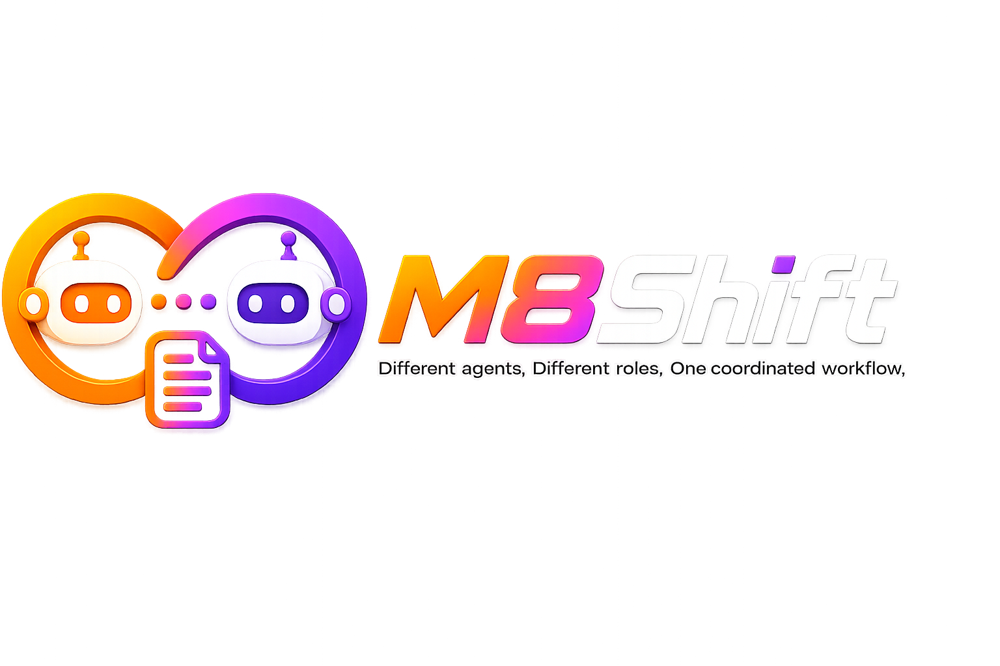
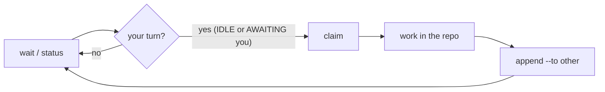

<div align="center">

# M8Shift

_Different agents. Different roles. One coordinated workflow._



**A free and open-source single-file relay that lets two or more AI agents — an active roster (Claude, Codex, Gemini, Vibe, …) — cooperate on the same repository through strict alternation (one writer at a time).**

[](LICENSE)
[](#tests)
[](#install)
[](m8shift.py)
[](#runs-anywhere--no-api-key)
[](docs/en/specification.md#11-developing-m8shift-with-m8shift-dogfooding)

</div>

## 🧭 What is M8Shift?

M8Shift is a **cooperative mutex** for AI agents. When Claude and Codex work on the
same repository, they overwrite each other. M8Shift introduces a single **pen**: at
any moment, exactly one agent is allowed to write; the others wait for their turn and
knows precisely what is expected of it.

M8Shift is **free and open source**, released under the
[Apache License 2.0](LICENSE).

The whole kit fits in **one file**: [`m8shift.py`](m8shift.py). You copy it to the
root of a project, run `init`, and the agents hand off to each other (any roster member to any other) through a
shared `M8SHIFT.md` file. The whole procedure is **embedded in the generated files**,
so the agents need **no human explanation**. *Caveat for interactive UIs* (VS Code, …):
a human still nudges each agent to *resume* between turns — `wait` blocks a process but
does not wake an agent's chat UI. See [Limitations](#limitations).

## 💡 Why

When Claude and Codex share a repository, they have no way to take turns: edits
collide and work is lost. M8Shift fixes this with a single exclusive lock (the
**pen**) and one simple rule — **acquire the pen before working** — so no two
agents ever modify the repository at the same time. The coordination state lives
in a versionable file, readable both by eye and by `grep`, and preserved over time.
No daemon, no server, no external dependency — just one Python file and the host
tools' own conventions.

There is also a human reason: different agents bring different judgments. M8Shift was
created to make that contradiction usable — Claude, Codex or another agent can review,
challenge, and hand off work without the maintainer becoming a copy/paste relay. The
human still decides the direction. See [Philosophy](docs/en/philosophy.md).

<a id="runs-anywhere--no-api-key"></a>

## 🔐 Runs anywhere — no API key

M8Shift is a **passive CLI**: the agents drive it with shell commands, so it works on
every surface where Claude Code or Codex run, and it adds **zero credentials**.

| Surface | Works? | Notes |
|---------|--------|-------|
| Terminal / CLI | ✅ | headless (`claude -p`, `codex exec`, cron) can be **fully automated** — one `m8shift-runtime.py listener start` supervises a whole lane (RFC 047, see [`docs/en/modules/runtime.md`](docs/en/modules/runtime.md)); [`examples/headless_runner.py`](examples/headless_runner.py) runs the individual turns and emits `M8SHIFT_RUN_ID` + `.m8shift/runtime/runs.jsonl` lifecycle events |
| Desktop app (Mac/Windows) | ✅ | interactive: a human resumes each agent between turns |
| VS Code / JetBrains (IDE) | ✅ | same as desktop |
| Web (claude.ai/code) | ✅ | anywhere the agent can run a shell and read its anchor |

**No API key. No token. No account for M8Shift itself.** `m8shift.py` makes **zero
network calls** (stdlib only, local files) — the agents use whatever subscription or
login you already have. Nothing leaves your machine, there is no per-call cost, and no
vendor lock-in.

<a id="install"></a>

## ⚙️ Install

One-line local install for macOS/Linux/WSL/Git Bash:

```bash
curl -fsSL https://raw.githubusercontent.com/M8Shift/M8Shift/main/install.sh | bash -s -- --agents claude,codex
```

Native Windows PowerShell:

```powershell
irm https://raw.githubusercontent.com/M8Shift/M8Shift/main/install.ps1 | iex
```

Core prerequisites (both installers): **Python 3.8+** (stdlib only), write
permission in the target directory, one downloader (`curl`, `wget`, or Python
`urllib` for `install.sh`; `Invoke-WebRequest` for `install.ps1`), and SHA-256
support for the default verification (`sha256sum`, `shasum`, or Python `hashlib`;
`Get-FileHash` on PowerShell). `install.sh` is a **bash** script — pipe it to
`bash`, not `sh` — covering macOS (standard Terminal), Linux, WSL, and Git Bash on
Windows; native Windows uses `install.ps1`. **Git is optional**: only worktree
features (`m8shift-worktree.py`) and anchor case-renaming use it — the core relay
installs and runs without it. No `sudo`/admin rights, no PATH change, no
background service, and no package manager (package managers may provide Python,
e.g. `apt install python3` or `winget install Python.Python.3.12`, but are never
the only path).

These installers download `m8shift.py` plus `m8shift-worktree.py`,
`m8shift-runtime.py`, and `m8shift-context.py` into the current directory, verify
the files against `checksums.sha256`, then run `m8shift.py init --agents
claude,codex` through the detected Python 3.8+ interpreter. Both print the
prerequisites plus one capability line per optional helper (`available` /
`unavailable` / `skipped` / `installed`) before any helper setup; an absent or
unsupported helper degrades with a clear message and never blocks the core
install, and an opted-in helper that fails prints a prominent warning while the
core install continues (exit 0 when the core install succeeded). The two
installers are kept in lockstep for the core components — verified by static
parity tests, and executed end-to-end where `pwsh` is available.

For a read-only terminal dashboard, run `python3 m8shift-top.py`. It consumes
the frozen `status --json` snapshot, uses an alternate screen on capable TTYs,
and delegates byte-for-byte to the existing `watch` output for pipes, dumb
terminals, `--plain`, or `M8SHIFT_NO_ALT_SCREEN`. Keys are display-only: `q`,
`?`, `r`, and navigation; the companion never claims or changes a relay.

Optional aliases let both commands run from any working directory. The helper
uses its own resolved install directory (including on Git Bash/Windows), so the
aliases do not depend on where the shell was opened. Preview the exact marked
block first; this is the default and writes nothing:

```bash
python3 m8shift-aliases.py
```

To append or update that block idempotently, opt in with `--write`. Bash and
Git Bash default to `~/.bashrc`; zsh defaults to `~/.zshrc`:

```bash
python3 m8shift-aliases.py --write --shell zsh
python3 m8shift-aliases.py --write --shell bash
python3 m8shift-aliases.py --write --shell git-bash
```

Use `--rc PATH` for a nonstandard startup file. This helper needs only the same
Python 3.8+ prerequisite as M8Shift; it changes no PATH setting and installs no
package. Restart the shell or `source` the rc path printed after a write.

For a pinned release, fetch the installer from the tag and use the same ref for the
downloaded files:

```bash
curl -fsSL https://raw.githubusercontent.com/M8Shift/M8Shift/vX.Y.Z/install.sh | \
  bash -s -- --ref vX.Y.Z --agents claude,codex
```

```powershell
$env:M8SHIFT_INSTALL_REF = "vX.Y.Z"
irm https://raw.githubusercontent.com/M8Shift/M8Shift/vX.Y.Z/install.ps1 | iex
```

> [!IMPORTANT]
> Bash and PowerShell both verify downloaded files by default (`--no-verify` opts out)
> against the `checksums.sha256` manifest from the selected ref. That catches
> corruption or mismatch. For out-of-band trust against a compromised origin, pin
> reviewed digests with `--sha256 FILE:HEX` or use a signed release tag.

Optional RTK shell-output filtering is available during Bash install:

```bash
curl -fsSL https://raw.githubusercontent.com/M8Shift/M8Shift/main/install.sh | \
  bash -s -- --agents claude,codex --with-rtk
```

`--with-rtk` uses release assets for macOS, Linux, and Git Bash/Windows, verifies
the asset against `checksums.txt` from the same RTK GitHub release tag
(GitHub/TLS trust model), installs the binary under `.m8shift/bin`, records local
provenance, disables RTK telemetry, and identity-pins the RFC 034 adapter
manifest through the explicit project-local adapter opt-in. A binary merely
placed under `.m8shift/bin` is ignored unless that opt-in is active and installer
provenance matches its path and SHA-256. If no prebuilt asset matches the host,
Cargo/Rust source builds are available only with the additional explicit
`--allow-source-build` flag and are pinned to the selected `--rtk-version` tag.
The default `ask` mode only prompts in an interactive terminal; non-interactive
installs skip RTK unless `--with-rtk` is explicit. On native Windows PowerShell,
`install.ps1` never installs RTK or Headroom (no tested native-Windows path —
never a silent source build) and says so with an info line; an `rtk` already on
PATH is still detected, reported, and gets its telemetry disabled. Use Git Bash
or WSL with `install.sh` for those helpers.

Experimental Headroom-compatible context compression stays opt-in:

```bash
curl -fsSL https://raw.githubusercontent.com/M8Shift/M8Shift/main/install.sh | \
  bash -s -- --agents claude,codex --with-headroom
```

`--with-headroom` creates `.m8shift/venvs/headroom`, installs **pinned**
`headroom-ai==0.28.0` + `onnxruntime==1.27.0` + `transformers==5.12.1`, preloads
the `chopratejas/kompress-v2-base` Kompress model so the runtime wrapper stays
offline, and identity-pins the `m8shift-headroom` launcher. The helper is
experimental and fail-closed for the opted-in run (a failed step removes the venv
and reports clearly, while the core install continues with a warning); it is
never attempted without the explicit flag. On macOS
it requires an arm64-native Python (no x86_64 wheel exists). Headroom remains
behind the RFC 042 measurement gate.

For CI or review, inspect the install plan and prerequisites without writing
files (`--help` / `-Help` also prints the prerequisites):

```bash
bash install.sh --dry-run --with-rtk --with-headroom
```

```powershell
.\install.ps1 -DryRun
```

Verify a finished install read-only at any time:

```bash
python3 m8shift.py doctor --install
```

It reports the Python/script versions, local checksum-manifest state, kit
companion drift, generated files, and optional helper states — without network,
repair, or writes. "Core install unhealthy" conditions are warnings; a missing
optional helper (git for worktree features, RTK, Headroom) is `info`, so
`doctor --install --lint` stays green on a healthy-but-minimal install.

Manual install:

```bash
cp m8shift.py /my/project/          # the ONLY file you need
cd /my/project
python3 m8shift.py init             # project name = folder name (or --name "X")
```

`init` is idempotent (safe to re-run) and generates:

| generated file              | role |
|-----------------------------|------|
| `M8SHIFT.md`                 | **the** living file: the lock (`LOCK`) + the turn journal |
| `M8SHIFT.protocol.md`        | the full shared instruction (read once by each agent) |
| `CLAUDE.md`, `AGENTS.md`, … | each active agent's canonical anchor (the default pair shown) — a stanza is injected at the top without duplicating or overwriting existing content; the prior file is backed up to `<anchor>.m8shift.bak` |
| `AGENTS.override.md`        | if present, Codex's priority anchor; the stanza is synced there too |

The shipped `m8shift.py` is **English-only**. To generate files in another language,
build a localized single-file variant from the language packs and run that:

```bash
python3 m8shift-i18n.py --langs fr,es --into ./dist   # build EN + fr + es
./dist/m8shift.py init --lang fr                       # then --lang / $M8SHIFT_LANG select it
```

Packs available: **fr, es, it, de, pt, ja, ru, zh-cn** (non-English are machine-translated,
pending review — see [CONTRIBUTING.md](CONTRIBUTING.md)). Use `--agents a,b,c…` to choose the
**active roster** (default `claude,codex`): **all** declared agents relay — the pen holder
hands off to any other member via `--to` — still one writer at a time (degree-1).

> [!TIP]
> **On Windows?** No dependencies (stdlib only) — run via WSL, Git Bash, or the native
> PowerShell one-liner above. See [Running on Windows](docs/en/windows.md).

> [!TIP]
> **From a fork / clone?** M8Shift is one file — host it on any Git or GitLab:
> `git clone https://gitlab.example.com/you/M8Shift.git`, then
> `cp m8shift.py /my/project/` and run `init` as above.

## 🚀 Quickstart

Each agent runs the same loop: `next → work → append`. `next` is the guarded
shortcut for `wait → claim → peek`: it waits if needed, then claims and prints the
latest handoff addressed to you. `<you>` is your own agent name and `<other>` any
other roster member you hand to (the examples below use the default pair
`claude`/`codex`).

`claude` and `codex` are example roster names, not a limitation. Replace them with
`gemini`, `vibe`, or any other cooperative agent that can read its instructions,
run the CLI, and follow `claim → work → append`.

```bash
./m8shift.py status --for claude   # who holds the pen + what should claude do next?
./m8shift.py watch --for claude    # live read-only status view in a terminal
./m8shift.py next claude           # wait if needed, then claim + show the handoff
./m8shift.py wait claude --once    # rc 0 = your turn (or DONE = stop); rc 3 = not yet

# Acquire the pen BEFORE working (exclusive: only one winner):
./m8shift.py claim claude          # rc 0 = you hold the pen; otherwise not your turn

# ...work in the repository, then close your turn and hand off:
./m8shift.py append claude --to codex \
    --ask  "what you need from the other" \
    --done "what you just did" \
    --files a,b \
    --wait                         # optional: stay blocked until claude's next turn or DONE

# Not your turn? Block until it is, then retry claim:
./m8shift.py wait claude           # polls ~60s (--interval N)
```

> [!IMPORTANT]
> **Golden rule:** you only work and write **after acquiring the pen via `claim`**
> (`append` is accepted only from `WORKING_<you>`).

Before stopping, run `status --for <you>`; if the relay is not `DONE`, keep waiting,
hand off your own `WORKING_<you>` state with `append`, close it with `done`, or park an
open/no-work session with `pause`.

> [!TIP]
> For a passive live view while agents work, leave
> `./m8shift.py watch --for <you> --interval 5` running in a separate terminal; it
> never claims or changes the relay.

## 📚 Documentation

Docs follow the [Diátaxis](https://diataxis.fr/) framework. Start with the
published site, or use the repository-local docs when working from a clone.

| Category | Document |
|----------|----------|
| **Live site** | [m8shift.ai](https://m8shift.ai/) |
| **Documentation index** | [docs/en/README.md](docs/en/README.md) |
| **Getting started** | [tutorial](docs/en/tutorial.md) · [VS Code guide](docs/en/vscode-guide.md) · [Windows](docs/en/windows.md) |
| **Reference** | [protocol](docs/en/protocol.md) · [protocol reference](docs/en/protocol-reference.md) · [specification](docs/en/specification.md) · [agents guide](docs/en/agents-guide.md) |
| **Explanation** | [architecture](docs/en/architecture.md) · [philosophy](docs/en/philosophy.md) · [security audit](docs/en/security-audit.md) · [stage-2 rationale](docs/en/stage2-rationale.md) |
| **RFCs** | [RFC index](docs/en/README.md#rfcs) · [RFC directory](docs/en/rfc/) |

> [!NOTE]
> RFCs are maintained in English under `docs/en/rfc/`. **Numbers are assigned in
> creation order and are permanent** — a number never tracks *implementation* order.
> For example RFC 010 was authored 10th (2026-06-24) but its patterns shipped last, in
> v3.21–v3.27 (2026-06-26); renumbering would break cross-links, git history, and
> issue/MR references, so an RFC keeps its birth number even when implemented much
> later (or never). Dates below are the implementation date (`—` when not
> implemented).

| № | RFC | Description | Status | Implemented | How |
|----:|-----|-------------|--------|-------------|-----|
| 001 | [Roster](docs/en/rfc/001-rfc-roster.md) | Configurable agent roster (early design) | historical / superseded | v2.1.0 · 2026-06-22 | superseded by RFC 002 |
| 002 | [N agents](docs/en/rfc/002-rfc-n-agents.md) | N-agent relay with one shared pen | historical / implemented | v2.4.0 · 2026-06-23 | one-pen routing (`append --to`) |
| 003 | [I18n packs](docs/en/rfc/003-rfc-i18n-packs.md) | Build-time language packs (EN core + 8) | shipped | v3.0.0 · 2026-06-23 | AST injector `m8shift-i18n.py` |
| 004 | [Memory](docs/en/rfc/004-rfc-memory.md) | Shared append-only memory ledger | shipped | v3.2.0 · 2026-06-23 | `remember` / `recap`, pen-free |
| 005 | [Claim check](docs/en/rfc/005-rfc-claim-check.md) | Advisory pre-claim overlap check | shipped | v3.3.0 · 2026-06-23 | `claim --check`, read-only |
| 006 | [Tasks](docs/en/rfc/006-rfc-tasks.md) | Shared append-only task board | shipped | v3.4.0 · 2026-06-23 | `task` event-log, pen-free |
| 007 | [Subturn](docs/en/rfc/007-rfc-subturn.md) | Sub-turn streaming proposal | rejected | — | rejected by adversarial panel |
| 008 | [Worktree companion](docs/en/rfc/008-rfc-worktree-companion.md) | Degree-2 worktree parallelism + serialized integration | implemented v1 | v3.5.0 · 2026-06-24 | `m8shift-worktree.py`; core `LOCK` as integration pen |
| 009 | [Runtime companion](docs/en/rfc/009-rfc-runtime-companion.md) | Local presence / inbox / progress / diagnostics | implemented v1 | v3.15.0 · 2026-06-25 | `m8shift-runtime.py` companion |
| 010 | [Runtime patterns](docs/en/rfc/010-rfc-runtime-patterns.md) | Pattern filter: retained / rejected / deferred | accepted (filter) | v3.21–v3.27 · 2026-06-26 | 6 retained shipped; 13 rejected; RFC 024/025 baselined |
| 011 | [Session history](docs/en/rfc/011-rfc-session-history.md) | Session history ledger + `history` | implemented | v3.7.0 · 2026-06-24 | `M8SHIFT.sessions.jsonl` |
| 012 | [Contracts validation](docs/en/rfc/012-rfc-contracts-validation.md) | Stage-4 contracts + read-only validation | implemented | v3.13.0 · 2026-06-25 | read-only validation surface |
| 013 | [Hosted runtime control plane](docs/en/rfc/013-rfc-hosted-runtime-control-plane.md) | Future hosted / runtime control plane | future / not impl. | — | optional layer outside the passive core |
| 014 | [Provider management](docs/en/rfc/014-rfc-provider-management.md) | Local provider / adapter registry | implemented v1 | v3.16.0 · 2026-06-25 | `m8shift-runtime.py` providers |
| 015 | [Shared tree degree gt1](docs/en/rfc/015-rfc-shared-tree-degree-gt1.md) | True degree > 1 writes in one tree | rejected (research) | — | rejected for the core |
| 016 | [Cooperative turn request](docs/en/rfc/016-rfc-cooperative-turn-request.md) | Cooperative baton request + operator steering | implemented | v3.15.0 · 2026-06-25 | core baton request |
| 017 | [Stage6 integrations](docs/en/rfc/017-rfc-stage6-integrations.md) | Stage-6 closure: local integration layer | implemented | Stage 6 · 2026-06-25 | local layer; heavier integrations deferred |
| 018 | [Agent runtime architecture](docs/en/rfc/018-rfc-agent-runtime-architecture.md) | Local scaffold: roles / workflows / approvals / reports | implemented v1 | v3.16.0 · 2026-06-25 | `m8shift-runtime.py` scaffold |
| 019 | [Input neutral patterns](docs/en/rfc/019-rfc-input-neutral-patterns.md) | Neutral runtime-pattern inventory | curated input / not impl. | — | reference for future RFCs |
| 020 | [Headless runner hardening](docs/en/rfc/020-rfc-headless-runner-hardening.md) | Reference runner: validation / dry-run / timeout / audit | implemented v1 | v3.16.0 · 2026-06-25 | `examples/headless_runner.py` |
| 021 | [Pause resume](docs/en/rfc/021-rfc-pause-resume.md) | Stable `PAUSED` state for idle sessions | implemented v1 | v3.17.0 · 2026-06-25 | core `PAUSED` + `pause` / `resume` |
| 022 | [Session reports](docs/en/rfc/022-rfc-session-reports.md) | Session reports + decision ledger | implemented v1 | v3.18.3 · 2026-06-26 | `report` generated from existing turns |
| 023 | [Agent token footprint](docs/en/rfc/023-rfc-agent-token-footprint.md) | Cut the mandatory protocol read | implemented (Phase 1) | v3.19.0 · 2026-06-26 | split `protocol.md` / `protocol-reference.md` |
| 024 | [Doctor split](docs/en/rfc/024-rfc-doctor-split.md) | Split core doctor vs companion diagnostics | baseline impl. | v3.27.0 · 2026-06-26 | core doctor owns relay hygiene; runtime doctor owns sidecar diagnostics |
| 025 | [Runtime status composition](docs/en/rfc/025-rfc-status-runtime.md) | Runtime status over core + sidecars | baseline impl. | v3.27.0 · 2026-06-26 | `status-runtime [--brief] [--json]`; JSON contract remains separate |
| 026 | [Sidecar retention](docs/en/rfc/026-rfc-sidecar-retention.md) | Bound / prune runtime sidecar ledgers | shipped · hardened | v3.34.2 · 2026-07-01 | `retention prune/apply/policy show`, archive index, malformed-ledger fail-safe, traversal/symlink hardening |
| 027 | [Notifications](docs/en/rfc/027-rfc-notifications.md) | Local notifications for handoffs / stale turns | shipped | v3.32.0 · 2026-07-01 | `m8shift-runtime.py notify`, stdout/file/bell/OS/hook tiers |
| 028 | [Headless command templates](docs/en/rfc/028-rfc-headless-command-templates.md) | Safe headless command templates | shipped | v3.33.0 · 2026-07-01 | provider examples, `argv_by_platform`, strict run-plan validation |
| 029 | [Companion workboard](docs/en/rfc/029-rfc-m8shift-board.md) | Richer companion workboard outside core | draft | — | deferred from RFC 010 |
| 030 | [Tamper evidence](docs/en/rfc/030-rfc-tamper-evidence.md) | Hash-chain tamper-evidence for relay records | draft | — | detection/warning only; git remains the strong anchor |
| 031 | [Decision traceability](docs/en/rfc/031-rfc-decision-traceability.md) | Durable decision records from turn journal | shipped | v3.31.0 · 2026-07-01 | `decisions target/scaffold`, `append --stance`, ADR fallback |
| 032 | [Tiered delegation](docs/en/rfc/032-rfc-tiered-delegation.md) | Capability-tiered delegation charter | Phase 1 shipped | v3.35.0 · 2026-07-01 | `route recommend` advisory only; launch/delegate future |
| 033 | [Context economy](docs/en/rfc/033-rfc-context-economy.md) | Compact task packets with raw-proof retrieval floor | draft policy | — | economy never starves verification |
| 034 | [Companion adapter interface](docs/en/rfc/034-rfc-companion-adapter-interface.md) | Context packs + optional shell-output adapters | shipped · RTK visible | v3.36.0 · 2026-07-01 | `m8shift-context.py status`, RTK ON/OFF, `M8SHIFT_RTK=on/off`, last-pack ratio |
| 035 | [Interactive listener gap](docs/en/rfc/035-rfc-interactive-listener-gap.md) | Distinguish turn detection from interactive host wake-up | baseline addressed by RFC 047/048 | — | waiters detect; listeners invoke |
| 036 | [Token-window exhaustion](docs/en/rfc/036-rfc-token-window-exhaustion.md) | Advisory context headroom, checkpoint, and explicit pause | shipped | v3.36.0 · 2026-07-01 | runtime `headroom` |
| 037 | [Agent context compression backends](docs/en/rfc/037-rfc-agent-context-compression-backends.md) | Digest-based context compression + bounded raw references | Phase D follow-up shipped | v3.40.0 · 2026-07-02 | `m8shift-context.py compress/retrieve`, redaction-before-store, builtin + RTK shell/tool dispatch, explicit/manual opt-in `headroom_ext`, reference-only fail-safe |
| 038 | [Multi-session](docs/en/rfc/038-rfc-multi-session.md) | Parallel named relay sessions with isolated worktrees | draft | — | degree-1 per session; default unchanged |
| 039 | [Model/task routing](docs/en/rfc/039-rfc-model-task-routing.md) | Capability-first model/task routing | Phase 1 shipped | v3.35.0 · 2026-07-01 | operator manifests, no baked-in vendors/prices, no launch |
| 040 | [AI session usage monitoring](docs/en/rfc/040-rfc-ai-session-usage-monitoring.md) | Normalized local usage sidecars and explicit cooldown | shipped phases | v3.53–v3.54 · 2026-07-05 | runtime adapters/snapshot/guard |
| 041 | [Agent skills](docs/en/rfc/041-rfc-agent-skills.md) | Open-format reusable competency definitions | Phase 1 shipped | v3.58.0 · 2026-07-11 | `skills/*/SKILL.md`; advisory doctor |
| 042 | [Compression backend routing](docs/en/rfc/042-rfc-compression-backend-routing.md) | Evidence-gated routing signals for context backends | Phase B shipped | v3.41.0 · 2026-07-02 | Headroom auto-route remains gated |
| 043 | [Routing principle](docs/en/rfc/043-rfc-routing-principle.md) | Canonical feasibility/fitness/cost/evidence decision pipeline | draft principle | — | advisory; instance RFCs remain authoritative |
| 044 | [Complete init companion install](docs/en/rfc/044-rfc-complete-init-companion-install.md) | Version-locked idempotent companion-copy phase | draft | — | no silent clobber |
| 045 | [Module reference examples](docs/en/rfc/045-rfc-module-reference-examples.md) | One English reference page per shipped script | draft | — | generator-backed drift checks proposed |
| 046 | [Interactive/headless runner install](docs/en/rfc/046-rfc-interactive-headless-runner-install.md) | Execution-mode and installed runner/watch surfaces | draft baseline | — | status guard and host lifecycle honesty |
| 047 | [Headless liveness runner/listener](docs/en/rfc/047-rfc-headless-liveness-runner-listener.md) | Bounded runner verdicts and resident listener lifecycle | implemented | v3.47.0 · 2026-07-04 | zero-model wait, one-turn invocation, retry/halt |
| 048 | [Adoption discipline, pack, and update health](docs/en/rfc/048-rfc-adoption-discipline-pack-update-health.md) | Generated discipline pack and source-driven local update | implemented | v3.49–v3.50 · 2026-07-07 | adoption doctor + safe update |
| 049 | [Holder liveness](docs/en/rfc/049-rfc-holder-liveness-stale-claim-hardening.md) | Separate holder liveness from pen TTL; harden stale force-claim and worktree ownership | **implemented — PR A+B+C + A7** (claim-on-pickup liveness) | 2026-07-13 | heartbeat/two-phase recovery, listener producer, worktree guard; `runtime.awaiting_unclaimed` |
| 050 | [Manual multi-agent specialists](docs/en/rfc/050-rfc-manual-multi-agent-specialists.md) | Manual specialist workflow with advisory read-only and isolated worktree lanes; specialists are open-format Agent Skills (`skills/`) | **implemented — Phase 1+1b** (rev 2.2: seed skills + wiring example + advisory `doctor` `skills.*` validation; Phase 2 runtime indexing remains future) | — | reports return to the relay |
| 051 | [Usage advisory in the core display](docs/en/rfc/051-rfc-usage-advisory-in-core-display.md) | Read-only usage line in core `status`/`watch`, fed by the companion sidecar (echo-only, fail-open) | implemented (amendment E #106 + amendment F #42) | 2026-07-13 | unified multi-window line; structural absence is `n/a`, failed read is `unavailable` |
| 052 | [Project compartmentalization & data hygiene](docs/en/rfc/052-rfc-project-compartmentalization-data-hygiene.md) | Deny-by-default project isolation + outbound path/denylist hygiene lint | **complete** (PR1–PR4) | v3.56.0 + v3.57.0 · 2026-07-08 | `doctor --hygiene`/`--hygiene-only`, out-of-repo denylist, opt-in anchor hygiene, one-project session binding |
| 053 | [Shared rules and governed habits](docs/en/rfc/053-rfc-shared-rules-governed-habits.md) | Governed project-local normative rules distinct from memory/skills/preferences | draft | — | quarantine→candidate→proposed→active lifecycle, ≥2 human-scrutinized evidence + human validation, reserved-authority never-list, optional `m8shift-rules.py` companion |
| 054 | [Pre-exhaustion checkpoint and session rotation](docs/en/rfc/054-rfc-pre-exhaustion-session-rotation.md) | Provider-aware checkpoint and operator-confirmed fresh-session rotation | draft / design only | — | extends RFC 036; bounded resume packet, no UI automation |
| 055 | [Wait-on-operator holder state](docs/en/rfc/055-rfc-wait-operator-state.md) | Explicit held-pen marker while blocked on the operator | draft / design only | — | liveness governs; distinct from `PAUSED` and `AWAITING` |
| 056 | [Self-declared agent model provenance](docs/en/rfc/056-rfc-self-declared-agent-model-provenance.md) | Additive model attribution in LOCK, turns, snapshots, and dashboard | implemented | 2026-07-13 | `M8SHIFT_AGENT_MODEL`; explicitly unverified and never routing authority |
| 057 | [Index-accurate checksum manifest](docs/en/rfc/057-rfc-index-accurate-checksum-manifest.md) | Refresh checksummed staged paths from Git-index blobs | implemented | 2026-07-13 | pre-commit refresh after pen guard; pre-push remains backstop |
| 058 | [Go-forward RFC discipline](docs/en/rfc/058-rfc-go-forward-rfc-discipline.md) | Same-PR RFC policy plus RFC-index integrity checks | implemented policy/tooling baseline | 2026-07-14 | advisory doctor and pre-commit findings |
| 059 | [Terminal colour capability](docs/en/rfc/059-rfc-terminal-colour-capability-semantic-rendering.md) | Tiered truecolour/256/ANSI-16/plain semantic dashboard rendering | implemented | 2026-07-14 | colour is redundant; frame width is invariant |
| 060 | [Adaptive terminal geometry](docs/en/rfc/060-rfc-adaptive-terminal-geometry.md) | Real-width flex tracks, exact-height activity viewport, and immediate resize redraws | implemented | 2026-07-14 | no mode flag or width cap; 120-column baseline is stable |
| 061 | [Bounded adaptive activity provision](docs/en/rfc/061-rfc-bounded-adaptive-activity.md) | Parameterized snapshot history, capped viewport, true turn positions, and a visible buffer edge | implemented | 2026-07-14 | default 8; consumer limit capped at 200; no archive read |

## 🔁 How it works

M8Shift stores its state in the `LOCK` block at the top of `M8SHIFT.md`. To work, an
agent must first **take the pen** with `claim` (state `WORKING_<you>`), an
**exclusive acquisition**: if several agents claim at once, only one wins. Because work
happens only while you hold the pen and `append` is accepted only from
`WORKING_<you>`, no two agents ever write the repository concurrently. This
**claim-before-work** rule is the heart of M8Shift.



The lock fields — `holder`, `state`, `agents`, `lang`, `session`, `turn`, `since`,
`expires`, `note` — are one `key: value` per line (easy to `grep`). `holder` is the pen holder
while `WORKING_*`, the awaited baton-owner while `AWAITING_*`, or `none` while
`IDLE`, `PAUSED`, or `DONE`;
`agents` is the active roster (all declared agents, ≥2; default `claude,codex`); states
are `IDLE`, `WORKING_<X>`, `AWAITING_<X>`, `PAUSED`, `DONE` (`<X>` = an active agent, uppercased). Turns are framed by `M8SHIFT:TURN <n> <agent> BEGIN/END`
HTML comments (invisible in
Markdown rendering) and are **immutable** once closed.

Timestamps are stored in UTC (`...Z`) for stable cross-agent comparisons. Human-facing
commands (`status`, `recap`, `history`, `task show`, and `m8shift-worktree.py status`) also
print the user's local time next to UTC, prefixed by the timezone name/offset when
available (otherwise `local`); JSON output stays canonical UTC.
`status` also derives display-only `started` and `duration` lines from the session
ledger; `status --json` exposes them as `session_started_at`,
`session_duration_seconds`, and `session_duration` (`null` when unavailable).

## ✅ Guarantees

Verified by the tests and by multi-agent review:

- **Mutex over the work window** — `claim` is the exclusive acquisition of the pen
  (two simultaneous `claim`s ⇒ a single winner); `append` is accepted only from
  `WORKING_<you>`. You work only after a successful `claim`, so no two agents ever
  modify the repository at the same time. `--to` ≠ self (strict alternation).
- **Stale-lock recovery** — `claim --force` reclaims **only a stale lock** (refused
  on an active one); the holder can refresh its own lock. Long-running wrappers
  should refresh at least 5 minutes before `expires`.
- **Guardrails** — `release` / `done` are baton-owner ops (the `holder`: pen holder in WORKING / awaited agent in AWAITING); only `append` requires the pen. `--force --reason TEXT` = audited recovery.
- **Serialized concurrency** — an inter-process lock `.m8shift.lock` (`O_EXCL`, with
  an ownership token) plus atomic writes (unique temp file + `os.replace`, mode
  preserved) ⇒ two concurrent `m8shift.py` runs never corrupt the file.
- **Injection-safe** — single-line fields (line breaks and reserved markers
  rejected); turn bodies neutralized against fake markers.
- **Bounded over time** — `archive` purges old closed turns without touching the
  lock or the seed turn (turn #0).
- **Portable** — empty folder or git repo, paths with spaces/accents,
  case-sensitive or -insensitive filesystems, pre-existing anchors — without
  breakage or duplication.

<a id="limitations"></a>

## ⚠️ Limitations

> [!WARNING]
> **Waking an interactive agent UI.** `wait` blocks a *process* until your turn; it
> does **not** relaunch or wake an agent running in an interactive UI (VS Code, …).
> Between turns a human still nudges each agent (e.g. *"resume M8Shift"*). Fully
> hands-off operation needs a **headless** loop (`claude -p`, `codex exec`, cron)
> wrapping `wait → relaunch the agent → claim` — a host integration, not a change to
> the mutex. A system notification/webhook can *signal* a turn but cannot *wake* the AI
> by itself.
>
> An example runner is provided: [`examples/headless_runner.py`](examples/headless_runner.py).
> Want to SEE a relay exchange first? [`examples/shift-demos/`](examples/shift-demos/) ships
> four tiny deterministic two-agent exercises (pinned oracles, ~4-6 turns each) you can run
> in minutes (#102).
> It supports `--once`, manual TTL refresh (`claim <agent> --refresh` — extends your own `WORKING` lock only and records an audit-only beat; PROTECTIVE liveness comes from the `heartbeat` verb emitted by managed producers, RFC 049), `M8SHIFT_RUN_ID`, immutable local run
> plans, post-run `LOCK` verification, and local `.m8shift/runtime/runs.jsonl`
> lifecycle/finding events. The optional [`m8shift-runtime.py`](m8shift-runtime.py)
> companion adds local presence, operator inbox, progress, and runtime diagnostics
> under `.m8shift/runtime/`.

> [!TIP]
> **You no longer hand-build that loop.** Since RFC 047 the runtime companion ships a
> supervised listener: one command runs a whole headless lane —
>
> ```bash
> python3 m8shift-runtime.py listener start --agent codex --cmd-file .m8shift/providers/codex.json
> ```
>
> It polls the relay with **zero model spend** while it is not the agent's turn, wakes
> **exactly one** bounded runner turn per handoff, backs off on failures, and after the
> retry budget persists a **visible `HALTED` state** instead of crash-looping (never a
> force-claim — the relay is left for the operator). `--backend launchd|systemd|windows`
> installs it as a user service (definitions never resurrect a halted lane:
> `KeepAlive=false` / `Restart=no`), with a printed fallback to a plain detached process
> when the host cannot run one. `listener stop/status/logs` and the runtime `doctor`
> findings cover the lifecycle — details in
> [`docs/en/modules/runtime.md`](docs/en/modules/runtime.md).
- **Cooperative, N-agent, advisory** — see the
  [specification](docs/en/specification.md) §8 (cooperative mutex, advisory lock, one
  writer at a time).

<a id="tests"></a>

## 🧪 Tests

No external Python dependency (stdlib only):

```bash
python3 -m unittest discover -s tests        # from the repo root
```

**Test suite**: unit tests (pure functions) + CLI regression tests (one per fixed
bug, referenced `NR-n`) covering the claim model, the one-pen mutex, the N-agent relay,
canonical/override anchors, the configurable roster, advisory turn fields, shared
memory, `claim --check`, the tasks board, archive, robustness, and injection safety.

## 🧩 Positioning — not an orchestrator

M8Shift is a **coordination primitive**, not an agent platform. It deliberately does
**one thing**: ensure that, of the agents already running on a shared repo, only one
writes at a time (strict turn-taking).

Full orchestrators/runtimes (agent frameworks like **LangGraph**, **AutoGen**, **CrewAI**) cover far
more — they *run* the agents: session management, tool dispatch, memory, sub-agents,
parallel **and** sequential workflows. They can take turns too; the real difference is
**scope and footprint**:

| | Orchestrator (e.g. LangGraph) | M8Shift |
|---|------------------------------|--------|
| What it is | a runtime/gateway that **drives** the agents | a single-file **lock** the agents poll |
| Install | a platform to deploy + configure (providers, auth) | `cp m8shift.py` — stdlib, no daemon, no server |
| Credentials | the agents' auth (subscription **or** API key) | **none** — M8Shift never authenticates anything |
| Scope | memory, tools, routing, parallel + sequential | only *who writes, when* |

**What M8Shift gives that a message-routing orchestrator doesn't:**

- 🔒 **A real write-lock on the repo** — exactly one agent writes at a time. An
  orchestrator routes *tasks and messages*; it does not stop two agents editing the
  same files in parallel. M8Shift does (its whole job).
- 🪶 **Zero runtime, zero credentials** — `cp m8shift.py` and go. No server to deploy, no
  provider/auth to configure, no API key, no per-call cost.
- 🤝 **Peer-to-peer, no coordinator** — the agents pass the baton themselves
  (`--to <other>`); there is no central "project-manager" agent deciding the turns.
- 📓 **Durable, readable, git-versioned coordination** — `M8SHIFT.md` *is* the record of
  who did what and what's next — by eye and by `grep`, committed alongside your code.

Reach for an orchestrator when you want a **managed agent team**. Reach for M8Shift when
you just want two agents you already run (Claude Code, Codex, …) to **stop overwriting
each other** — with nothing to install or authenticate. They are **complementary**, not
competing (M8Shift could even be the lock inside a larger setup).

## 🗺️ Roadmap

M8Shift keeps a **single-pen mutex** (one writer at a time) by design — see
[architecture §1.8](docs/en/architecture.md). The current roadmap is:

| Area | Status | Surface | Boundary |
|------|--------|---------|----------|
| N-agent roster, one pen | ✅ Shipped | `init --agents a,b,c…`, directed `append --to <agent>` | all agents can relay; still one writer at a time |
| Read/handoff observability | ✅ Shipped | `recap`, `peek`, `log`, `history`, `status --json`, `watch` | read-only views; no routing decisions |
| Session reports | ✅ Shipped | `session list/show/decisions/report`, `M8SHIFT.session-reports/` | derived Markdown memory; no lock mutation, no invented decisions |
| Decision traceability | ✅ Shipped | `decisions target`, `decisions scaffold`, `append --stance`, `docs/decisions/` | durable ADR-style exports from journal turns; markdown fallback when no tracker exists |
| Advisory pre-claim checks | ✅ Shipped | `claim --check [--files …] [--turns N]` | no pen taken; overlap is advisory |
| Shared memory and tasks | ✅ Shipped | `remember`, `task add/done/drop/list/show`, recap headlines | append-only ledgers; never enforced by the mutex |
| Stage 4 contracts | ✅ Shipped | `append --schema stage4.v1 …`, `contract validate`, `doctor --contracts` | typed metadata is validated only on explicit read-only commands |
| Operator-loop guardrails | ✅ Shipped | `next`, `append --wait`, `status --for`, `request-turn/yield-turn/decline-turn/steer-turn` | prevents lost handoffs and UI-routing deadlocks without creating a second pen |
| Agent adoption discipline | ✅ Shipped | `M8SHIFT.agent-pack.md`, compact anchor safety floor, `doctor` adoption checks | gives every agent the same first-read workflow and flags stale/missing adoption files without changing lock authority |
| Local source-driven update | ✅ Shipped | `update --target DIR --source DIR`, `doctor --source DIR` | updates adopted projects from a newer local copy while preserving relay state; default runner refresh covers only installed, checksum-proven runner artifacts |

| Pause / resume | ✅ Shipped | `pause <holder> --reason …`, `resume <agent> --reason …`, `next --resume` | stable open/no-work state: `PAUSED`, `holder=none`, explicit user-scope resume |
| Local integration layer | ✅ Shipped | installers, checksums, version surfaces, `examples/headless_runner.py`, `m8shift-runtime.py` | local convenience layer; no provider SDK in the core |
| Degree-2 parallel work | ✅ Shipped, opt-in | [`m8shift-worktree.py`](docs/en/rfc/008-rfc-worktree-companion.md) | isolated git worktrees; serialized integration pen; core remains degree-1 |
| Provider/runtime companion | ✅ Shipped v1 | `m8shift-runtime.py init/providers/roles/workflows/approve/report` | host-side config and reports; no secrets, no second routing authority |
| Local notifications | ✅ Shipped | `m8shift-runtime.py notify`, `watch` notification path | stdout/file/bell/OS/hook tiers; advisory only, no daemon, no network in M8Shift |
| `subturn` provenance ledger | ❌ Rejected | [rationale](docs/en/rfc/007-rfc-subturn.md) | redundant with advisory fields and `remember` |
| Hosted control plane / IDE integrations | 🔭 Future companion | [RFC](docs/en/rfc/013-rfc-hosted-runtime-control-plane.md) | optional layer outside the passive core |

To refresh the live relay scripts from a verified merged checkout, first preview and
then explicitly apply the reversible wrapper. It requires a clean checkout whose
`HEAD` exactly matches `origin/main`, refuses an active `WORKING_*` relay through the
RFC 048 updater, never writes `M8SHIFT.md`, and retains a rollback snapshot:

```bash
python3 scripts/m8shift-self-update.py --source /path/to/M8Shift --target /path/to/project
python3 scripts/m8shift-self-update.py --source /path/to/M8Shift --target /path/to/project --apply
```

New ideas are welcome via an RFC under `docs/en/rfc/`. RFCs are English-only;
localized documentation should link to the canonical English RFC instead of maintaining
translated copies.

> [!CAUTION]
> **Non-goals** (they would break a M8Shift quality): path-scoped *leases* for
> concurrent disjoint writes inside the shared tree (use the
> [opt-in worktree companion](docs/en/rfc/008-rfc-worktree-companion.md) instead); a
> background daemon / autonomous watcher / push-notifier; running git, builds or APIs
> (needs auth + network → an orchestrator); third-party deps or a multi-file package;
> and "smart" *derived* memory (dedup / summarize / prune) — the ledger stays a dumb,
> human-curated record.

## 📄 License

Licensed under the [Apache License 2.0](LICENSE).

## 🤝 Contributing

Issues and pull requests are welcome — see [CONTRIBUTING.md](CONTRIBUTING.md) (ground
rules + how to add or improve a language pack). M8Shift is a single file by design
([`m8shift.py`](m8shift.py) is the single source of truth — `M8SHIFT.protocol.md` is
generated from it), so keep changes focused and covered by a test in `tests/`. Run
the test suite before opening a PR.

> **Made with ❤ & M8Shift.** M8Shift is improved *with M8Shift*: Claude ⇄ Codex
> coordinate every change through the relay itself — see
> [Developing M8Shift with M8Shift](docs/en/specification.md#11-developing-m8shift-with-m8shift-dogfooding).
> The dogfooding relay is promoted to each stable version after tests pass, so the coordinator
> does not silently drift behind the tool being developed.
