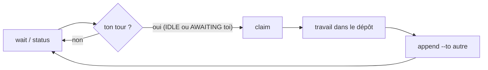

<div align="center">


# M8Shift

_Des agents différents. Des rôles différents. Un seul workflow coordonné._

**Un relais en fichier unique qui permet à deux agents IA — un couple configurable depuis un roster (la liste d'agents disponibles : Claude, Codex, Gemini, Le Chat, …) — de coopérer sur le même dépôt par alternance stricte.**

[](../LICENSE)
[](#tests)
[](#installation)
[](../m8shift.py)
[](#tourne-partout--sans-clé-api)
[](../docs/fr/cahier-des-charges.md#11-développer-m8shift-avec-m8shift-dogfooding)

[English](../README.md) | Français

</div>

---

> **Anciennement CoWork.** Le projet a été renommé **M8Shift** (« Mate Shift » — *mate* = coéquipier,
> *shift* = passage du tour). Les noms canoniques sont désormais `m8shift.py`, `M8SHIFT.md` et les
> marqueurs `M8SHIFT:*`. **Les projets CoWork existants continuent de fonctionner sans rien changer** :
> les anciens `COWORK.md` / `.cowork.lock` / `COWORK:*` sont lus **et** écrits en place (aucun fichier
> orphelin), `cowork.py` reste un shim déprécié, et `m8shift.py migrate-brand` renomme le tout quand tu
> le décides. Les anciens noms restent pris en charge au moins jusqu'à la prochaine version majeure.

## Qu'est-ce que M8Shift ?

M8Shift est un **mutex coopératif** pour agents IA. Quand Claude et Codex travaillent sur le
même dépôt, ils s'écrasent mutuellement. M8Shift introduit un unique **stylo** : à
tout instant, exactement un agent est autorisé à écrire ; l'autre attend son tour et
sait précisément ce qu'on attend de lui.

Tout le kit tient dans **un seul fichier** : [`m8shift.py`](../m8shift.py). Vous le copiez à la
racine d'un projet, lancez `init`, et les deux agents se passent la main via un
fichier `M8SHIFT.md` partagé. Toute la procédure est **embarquée dans les fichiers
générés**, donc les agents n'ont besoin d'**aucune explication humaine**. *Réserve pour
les UI interactives* (VS Code, …) : un humain relance quand même chaque agent pour qu'il
*reprenne* entre les tours — `wait` bloque un processus mais ne réveille pas l'UI de chat
d'un agent. Voir [Limites](#limites).

## Pourquoi

Quand Claude et Codex partagent un dépôt, ils n'ont aucun moyen de prendre les tours :
les modifications entrent en collision et le travail est perdu. M8Shift corrige cela avec un
unique verrou exclusif (le **stylo**) et une règle simple — **acquérir le stylo avant de
travailler** — pour que les deux agents ne modifient jamais le dépôt en même temps. L'état de
coordination vit dans un fichier versionnable, lisible à l'œil comme par `grep`, et préservé
dans le temps. Pas de démon, pas de serveur, pas de dépendance externe — juste un fichier
Python et les conventions propres des outils hôtes.

## Tourne partout — sans clé API

M8Shift est un **CLI passif** : les agents le pilotent par des commandes shell, donc il
fonctionne sur toutes les surfaces où tournent Claude Code ou Codex, et il n'ajoute
**aucun identifiant**.

| Surface | Marche ? | Notes |
|---------|----------|-------|
| Terminal / CLI | ✅ | en *headless* (`claude -p`, `codex exec`, cron) c'est **entièrement automatisable** — voir [`examples/headless_runner.py`](../examples/headless_runner.py) |
| Application desktop (Mac/Windows) | ✅ | interactif : un humain relance chaque agent entre les tours |
| VS Code / JetBrains (IDE) | ✅ | comme le desktop |
| Web (claude.ai/code) | ✅ | partout où l'agent peut lancer un shell et lire son ancrage |

**Aucune clé API. Aucun jeton. Aucun compte pour M8Shift lui-même.** `m8shift.py` ne fait
**aucun appel réseau** (stdlib uniquement, fichiers locaux) — les agents utilisent
l'abonnement ou la connexion que tu as déjà. Rien ne quitte ta machine, aucun coût par
appel, aucun verrouillage propriétaire.

## Installation

```bash
cp m8shift.py /mon/projet/           # le SEUL fichier dont vous avez besoin
cd /mon/projet
python3 m8shift.py init              # nom du projet = nom du dossier (ou --name "X")
```

`init` est idempotent (relançable sans risque) et génère :

| fichier généré              | rôle |
|-----------------------------|------|
| `M8SHIFT.md`                 | **le** fichier vivant : le verrou (`LOCK`) + le journal des tours |
| `M8SHIFT.protocol.md`        | l'instruction partagée complète (lue une fois par chaque agent) |
| `CLAUDE.md`, `AGENTS.md`, … | l'ancrage canonique de chaque agent actif (le couple par défaut est montré) — une strophe est injectée en tête sans dupliquer ni écraser le contenu existant ; le fichier précédent est sauvegardé dans `<ancrage>.cowork.bak` |
| `AGENTS.override.md`        | s'il est présent, l'ancrage prioritaire de Codex ; la strophe y est synchronisée aussi |

Utilisez `--lang en|fr` pour choisir la langue des fichiers générés (**anglais par
défaut**). Utilisez `--agents a,b` pour choisir le couple du relais dans le roster
(défaut `claude,codex` ; les **deux premiers** noms sont actifs, les noms
supplémentaires sont stockés pour le futur mode N agents).

**Sous Windows ?** Aucune dépendance (stdlib uniquement) — lancez via WSL, Git Bash,
ou `python m8shift.py <cmd>` dans PowerShell. Voir [Lancer sous Windows](../docs/fr/windows.md).

**Depuis un fork / clone ?** M8Shift tient en un fichier — hébergez-le sur n'importe quel
Git ou GitLab : `git clone https://gitlab.example.com/you/M8Shift.git`, puis
`cp m8shift.py /mon/projet/` et lancez `init` comme ci-dessus.

## Démarrage rapide

Chaque agent exécute la même boucle : `wait → claim → work → append`. `<toi>` est ton
propre nom d'agent et `<autre>` l'autre agent actif (les exemples ci-dessous utilisent
le couple par défaut `claude`/`codex`).

```bash
./m8shift.py status                # qui détient le stylo ? (non bloquant)
./m8shift.py wait claude --once    # rc 0 = vous pouvez acquérir ; rc 3 = pas encore

# Acquérir le stylo AVANT de travailler (exclusif : un seul gagnant) :
./m8shift.py claim claude          # rc 0 = vous détenez le stylo ; sinon ce n'est pas votre tour

# ...travaillez dans le dépôt, puis clôturez votre tour et passez la main :
./m8shift.py append claude --to codex \
    --ask  "ce dont vous avez besoin de l'autre" \
    --done "ce que vous venez de faire" \
    --files a,b

# Pas votre tour ? Bloquez jusqu'à ce qu'il arrive, puis relancez claim :
./m8shift.py wait claude           # interroge ~60s (--interval N)
```

**Règle d'or :** vous ne travaillez et n'écrivez **qu'après avoir acquis le stylo via `claim`**
(`append` n'est accepté que depuis `WORKING_<toi>`).

## Documentation

La documentation suit le cadre [Diátaxis](https://diataxis.fr/) :

- **Tutoriel** — [docs/fr/tutoriel.md](../docs/fr/tutoriel.md) — apprenez le relais pas à pas.
- **Guide (VS Code)** — [docs/fr/guide-vscode.md](../docs/fr/guide-vscode.md) — lancez le relais avec Claude + Codex.
- **Guide (Windows)** — [docs/fr/windows.md](../docs/fr/windows.md) — lancez sous Windows (WSL / Git Bash / natif).
- **Référence (protocole)** — [docs/fr/protocole.md](../docs/fr/protocole.md) — le protocole partagé, les états et les règles.
- **Référence (cahier des charges)** — [docs/fr/cahier-des-charges.md](../docs/fr/cahier-des-charges.md) — la spécification complète.
- **Explication (architecture)** — [docs/fr/architecture.md](../docs/fr/architecture.md) — conception et fonctionnement.

## Comment ça marche

M8Shift stocke son état dans le bloc `LOCK` en tête de `M8SHIFT.md`. Pour travailler, un
agent doit d'abord **prendre le stylo** avec `claim` (état `WORKING_<toi>`), une
**acquisition exclusive** : si deux agents font `claim` en même temps, un seul gagne. Comme le
travail n'a lieu que pendant que vous détenez le stylo et que `append` n'est accepté que depuis
`WORKING_<toi>`, les deux agents n'écrivent jamais le dépôt en concurrence. Cette
règle **claim-avant-travail** est le cœur de M8Shift.



Les champs du verrou — `holder`, `state`, `agents`, `turn`, `since`, `expires`,
`note`, `lang` — sont un `key: value` par ligne (faciles à `grep`er). `holder` est un
agent actif ou `none` ; `agents` est le couple du relais (les 2 premiers déclarés,
défaut `claude,codex`) ; les états sont `IDLE`, `WORKING_<X>`, `AWAITING_<X>`, `DONE`
(`<X>` = un agent actif, en majuscules). Les tours sont encadrés par des commentaires
HTML `M8SHIFT:TURN <n> <agent> BEGIN/END` (invisibles dans
le rendu Markdown) et sont **immuables** une fois clos.

## Garanties

Vérifiées par les tests et par revue multi-agents :

- **Mutex sur la fenêtre de travail** — `claim` est l'acquisition exclusive du stylo
  (deux `claim`s simultanés ⇒ un seul gagnant) ; `append` n'est accepté que depuis
  `WORKING_<toi>`. Vous ne travaillez qu'après un `claim` réussi, donc deux agents ne
  modifient jamais le dépôt en même temps. `--to` ≠ soi-même (alternance stricte).
- **Récupération de verrou périmé** — `claim --force` ne réclame **qu'un verrou périmé** (refusé
  sur un verrou actif) ; le détenteur peut rafraîchir son propre verrou.
- **Garde-fous** — `release` / `done` exigent de détenir le stylo (`--force` = récupération).
- **Concurrence sérialisée** — un verrou inter-processus `.m8shift.lock` (`O_EXCL`, avec
  un jeton de propriété) plus des écritures atomiques (fichier temporaire unique + `os.replace`, mode
  préservé) ⇒ deux exécutions concurrentes de `m8shift.py` ne corrompent jamais le fichier.
- **Sûr contre l'injection** — champs sur une seule ligne (sauts de ligne et marqueurs
  réservés rejetés) ; corps des tours neutralisés contre les faux marqueurs.
- **Borné dans le temps** — `archive` purge les anciens tours clos sans toucher au
  verrou ni au tour d'amorçage (tour #0).
- **Portable** — dossier vide ou dépôt git, chemins avec espaces/accents,
  systèmes de fichiers sensibles ou insensibles à la casse, ancrages préexistants — sans
  casse ni duplication.

## Limites

- **Réveiller l'UI d'un agent interactif.** `wait` bloque un *processus* jusqu'à ton
  tour ; il ne **relance ni ne réveille** un agent tournant dans une UI interactive
  (VS Code, …). Entre les tours, un humain relance quand même chaque agent (p. ex.
  *« reprends M8Shift »*). Une opération entièrement autonome exige une boucle **headless (sans interface)**
  (`claude -p`, `codex exec`, cron) enveloppant `wait → relancer l'agent → claim` — une
  intégration à l'hôte, pas une modification du mutex. Une notification système/webhook
  peut *signaler* un tour mais ne peut pas *réveiller* l'IA à elle seule. Un exemple de
  lanceur est fourni : [`examples/headless_runner.py`](../examples/headless_runner.py).
- **Coopératif, deux agents, verrou conseillé** — voir le
  [cahier des charges](../docs/fr/cahier-des-charges.md) §8 (mutex coopératif, verrou
  conseillé, deux agents simultanés).

## Tests

Aucune dépendance Python externe (stdlib uniquement) :

```bash
python3 -m unittest discover -s tests        # depuis la racine du dépôt
```

**74 tests** : tests unitaires (fonctions pures) + tests de régression CLI (un par
bug corrigé, référencé `NR-n`) couvrant le modèle de claim, le mutex, la concurrence claude/codex,
les ancrages canoniques/override, le roster configurable, l'archive, la robustesse et la sûreté face à l'injection.

## Positionnement — ce n'est pas un orchestrateur

M8Shift est une **primitive de coordination**, pas une plateforme d'agents. Il fait
volontairement **une seule chose** : garantir que, parmi les agents déjà lancés sur un
dépôt partagé, un seul écrit à la fois (alternance stricte).

Les orchestrateurs/runtimes complets (p. ex. **[OpenClaw](https://docs.openclaw.ai/)**)
couvrent bien plus — ils *font tourner* les agents : gestion de session, dispatch
d'outils, mémoire, sous-agents, workflows **parallèles et** séquentiels. Eux aussi
savent alterner ; la vraie différence est le **périmètre et l'empreinte** :

| | Orchestrateur (p. ex. OpenClaw) | M8Shift |
|---|---------------------------------|--------|
| Nature | un runtime/gateway qui **pilote** les agents | un **verrou** mono-fichier que les agents interrogent |
| Installation | une plateforme à déployer + configurer (providers, auth) | `cp m8shift.py` — stdlib, ni daemon ni serveur |
| Identifiants | l'auth des agents (abonnement **ou** clé API) | **aucun** — M8Shift ne s'authentifie jamais |
| Périmètre | mémoire, outils, routage, parallèle + séquentiel | seulement *qui écrit, quand* |

**Ce que M8Shift apporte qu'un orchestrateur de messages ne donne pas :**

- 🔒 **Un vrai verrou d'écriture sur le dépôt** — exactement un agent écrit à la fois. Un
  orchestrateur route des *tâches et messages* ; il n'empêche pas deux agents d'éditer
  les mêmes fichiers en parallèle. M8Shift, si (c'est tout son rôle).
- 🪶 **Zéro runtime, zéro identifiant** — `cp m8shift.py` et c'est parti. Aucun serveur à
  déployer, aucun provider/auth à configurer, aucune clé API, aucun coût par appel.
- 🤝 **Pair-à-pair, sans coordinateur** — les agents se passent le bâton eux-mêmes
  (`--to <autre>`) ; pas d'agent « chef de projet » central qui décide des tours.
- 📓 **Coordination durable, lisible, versionnée Git** — `M8SHIFT.md` *est* la trace de qui
  a fait quoi et de la suite — à l'œil et au `grep`, committée avec ton code.

Prends un orchestrateur quand tu veux une **équipe d'agents gérée**. Prends M8Shift quand
tu veux juste que deux agents que tu lances déjà (Claude Code, Codex, …) **arrêtent de
s'écraser** — sans rien installer ni authentifier. Ils sont **complémentaires**, pas
concurrents (M8Shift pourrait même être le verrou au sein d'un montage plus large).

## Roadmap

M8Shift conserve un **mutex à stylo unique** (un seul écrivain à la fois) par
conception — voir [architecture §1.8](../docs/fr/architecture.md). Deux étapes :

1. **Couple configurable (livré)** — choisir les deux agents du relais dans un
   **roster extensible** via `m8shift.py init --agents a,b` ; les deux premiers
   relaient, les noms supplémentaires sont stockés pour plus tard. Toujours
   **2 simultanés** (degré 1). Voir [RFC — couple d'agents configurable](../docs/fr/rfc-roster.md).
2. **N agents simultanés** — vrai multi-agent (degré > 1) ; une étape distincte et
   plus lourde, avec son propre RFC futur.

**Fonctionnalités prévues** — chaque item reste mono-fichier, passif et zéro-identifiant
(append-only ou lecture seule sur des données que M8Shift stocke déjà ; jamais un daemon,
une intégration, ni une seconde source de vérité) :

- 🧠 **Mémoire partagée + recap** *(prochain)* — un `M8SHIFT.memory.md` durable, append-only,
  que les agents tiennent à la main (`m8shift.py remember`), + un `m8shift.py recap` en
  lecture seule (LOCK courant + derniers tours + entêtes mémoire) pour reprendre d'une
  session à l'autre.
- 📨 **Handoff structuré + peek** *(prochain)* — champs de tour optionnels et consultatifs
  (`branch` / `commit` / `tests` / `next`, écriture seule) + `m8shift.py peek` pour lire la
  dernière passation en un appel.
- 📊 **Timeline + status JSON** *(prochain)* — `m8shift.py log` (chronologie du relais) et
  `status --json` pour des tableaux de bord (compatible `watch`).
- 🧭 **`claim --check`** *(plus tard)* — sonde consultative, en lecture seule, de
  chevauchement de fichiers (depuis le champ `files:`), sans ouvrir de fenêtre de travail
  concurrente.
- 🌿 **`subturn`** *(plus tard)* — consigner le fan-out de sous-agents d'un agent sous son tour.
- 🗂️ **Tableau de tâches / block-on** *(peut-être)* — une partition de to-do append-only ;
  nommer une dépendance externe comme raison d'attente `blocked_on` explicite.

**Non-goals** (briseraient une qualité de M8Shift) : *baux* par chemin pour des écritures
disjointes concurrentes (c'est le verrou degré 2 de l'étape 2, pas le stylo degré 1
d'aujourd'hui) ; un daemon / watcher / push de notifications en arrière-plan ; lancer git,
des builds ou des API (auth + réseau → un orchestrateur) ; des dépendances tierces ou un
paquet multi-fichiers ; et une mémoire *dérivée* « intelligente » (dédup / résumé / purge)
— le registre reste une trace bête, curée à la main.

## Licence

Sous licence [Apache License 2.0](../LICENSE).

## Contribuer

Les issues et pull requests sont les bienvenues. M8Shift est un fichier unique par conception
([`m8shift.py`](../m8shift.py) est la source de vérité unique — `M8SHIFT.protocol.md` en est
généré), donc gardez les changements ciblés et couverts par un test dans `tests/`. Lancez
la suite de tests avant d'ouvrir une PR.
