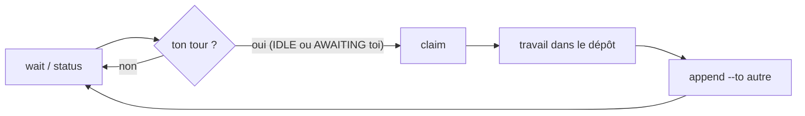

<div align="center">

# M8Shift

_Des agents différents. Des rôles différents. Un seul workflow coordonné._


**Un relais libre et open source en fichier unique qui permet à deux agents IA ou plus — un roster actif (Claude, Codex, Gemini, Le Chat, …) — de coopérer sur le même dépôt par alternance stricte, avec un seul écrivain à la fois.**

[](../LICENSE)
[](#tests)
[](#installation)
[](../m8shift.py)
[](#tourne-partout--sans-clé-api)
[](../docs/en/specification.md#11-developing-m8shift-with-m8shift-dogfooding)

[English](../README.md) | Français

</div>

## Qu'est-ce que M8Shift ?

M8Shift est un **mutex coopératif** pour agents IA. Quand plusieurs agents comme
Claude et Codex travaillent sur le même dépôt, ils s'écrasent mutuellement.
M8Shift introduit un unique **stylo** : à tout instant, exactement un agent est
autorisé à écrire ; les autres attendent leur tour et savent précisément ce qu'on
attend d'eux.

M8Shift est **libre et open source**, publié sous
[licence Apache 2.0](../LICENSE).

Tout le kit tient dans **un seul fichier** : [`m8shift.py`](../m8shift.py). Vous le copiez à la
racine d'un projet, lancez `init`, et les agents du roster se passent la main via un
fichier `M8SHIFT.md` partagé. Toute la procédure est **embarquée dans les fichiers
générés**, donc les agents n'ont besoin d'**aucune explication humaine**. *Réserve pour
les UI interactives* (VS Code, …) : un humain relance quand même chaque agent pour qu'il
*reprenne* entre les tours — `wait` bloque un processus mais ne réveille pas l'UI de chat
d'un agent. Voir [Limites](#limites).

## Pourquoi

Quand plusieurs agents partagent un dépôt, ils n'ont aucun moyen de prendre les tours :
les modifications entrent en collision et le travail est perdu. M8Shift corrige cela avec un
unique verrou exclusif (le **stylo**) et une règle simple — **acquérir le stylo avant de
travailler** — pour qu'aucun couple d'agents ne modifie le dépôt en même temps. L'état de
coordination vit dans un fichier versionnable, lisible à l'œil comme par `grep`, et préservé
dans le temps. Pas de démon, pas de serveur, pas de dépendance externe — juste un fichier
Python et les conventions propres des outils hôtes.

Il y a aussi une raison humaine : des agents différents apportent des jugements différents.
M8Shift a été créé pour rendre ce contradictoire exploitable — Claude, Codex ou un autre
agent peuvent relire, challenger et se passer le travail sans que le mainteneur devienne
un simple relais de copier-coller. L'humain garde la décision d'orientation. Voir
[Philosophie](fr/philosophie.md).

## Tourne partout — sans clé API

M8Shift est un **CLI passif** : les agents le pilotent par des commandes shell, donc il
fonctionne sur toutes les surfaces où tournent Claude Code ou Codex, et il n'ajoute
**aucun identifiant**.

| Surface | Marche ? | Notes |
|---------|----------|-------|
| Terminal / CLI | ✅ | en *headless* (`claude -p`, `codex exec`, cron) c'est **entièrement automatisable** — voir [`examples/headless_runner.py`](../examples/headless_runner.py) |
| Application desktop (Mac/Windows) | ✅ | interactif : un humain relance chaque agent entre les tours |
| VS Code / JetBrains (IDE) | ✅ | comme le desktop |
| Web (claude.ai/code) | ✅ | partout où l'agent peut lancer un shell et lire son ancrage |

**Aucune clé API. Aucun jeton. Aucun compte pour M8Shift lui-même.** `m8shift.py` ne fait
**aucun appel réseau** (stdlib uniquement, fichiers locaux) — les agents utilisent
l'abonnement ou la connexion que tu as déjà. Rien ne quitte ta machine, aucun coût par
appel, aucun verrouillage propriétaire.

## Installation

Installation locale en une ligne pour macOS/Linux/WSL/Git Bash :

```bash
curl -fsSL https://raw.githubusercontent.com/M8Shift/M8Shift/main/install.sh | bash -s -- --verify --agents claude,codex
```

PowerShell Windows natif :

```powershell
irm https://raw.githubusercontent.com/M8Shift/M8Shift/main/install.ps1 | iex
```

Ces installateurs téléchargent `m8shift.py`, `m8shift-worktree.py` et
`m8shift-runtime.py` dans le répertoire courant, vérifient les fichiers avec
`checksums.sha256`,
puis lancent `m8shift.py init --agents claude,codex` avec l'interpréteur Python 3.8+
détecté. Pas de `sudo`, pas de modification du PATH global, pas de service en arrière-plan.

Pour une release épinglée, récupérez l'installateur depuis le tag et utilisez la
même ref pour les fichiers téléchargés :

```bash
curl -fsSL https://raw.githubusercontent.com/M8Shift/M8Shift/vX.Y.Z/install.sh | \
  bash -s -- --ref vX.Y.Z --verify --agents claude,codex
```

```powershell
$env:M8SHIFT_INSTALL_REF = "vX.Y.Z"
irm https://raw.githubusercontent.com/M8Shift/M8Shift/vX.Y.Z/install.ps1 | iex
```

Limite de sécurité : `--verify` côté Bash et la vérification par défaut côté
PowerShell contrôlent les fichiers téléchargés avec le manifeste `checksums.sha256`
de la ref choisie. Cela détecte une corruption ou une incohérence. Pour une confiance
hors bande face à une origine compromise, épinglez des digests relus avec
`--sha256 FILE:HEX` ou utilisez un tag de release signé.

Installation manuelle :

```bash
cp m8shift.py /mon/projet/           # le SEUL fichier dont vous avez besoin
cd /mon/projet
python3 m8shift.py init              # nom du projet = nom du dossier (ou --name "X")
```

`init` est idempotent (relançable sans risque) et génère :

| fichier généré              | rôle |
|-----------------------------|------|
| `M8SHIFT.md`                 | **le** fichier vivant : le verrou (`LOCK`) + le journal des tours |
| `M8SHIFT.protocol.md`        | l'instruction partagée complète (lue une fois par chaque agent) |
| `CLAUDE.md`, `AGENTS.md`, … | l'ancrage canonique de chaque agent actif (le couple par défaut est montré) — une strophe est injectée en tête sans dupliquer ni écraser le contenu existant ; le fichier précédent est sauvegardé dans `<ancrage>.m8shift.bak` |
| `AGENTS.override.md`        | s'il est présent, l'ancrage prioritaire de Codex ; la strophe y est synchronisée aussi |

Le `m8shift.py` fourni dans le dépôt est **anglais uniquement**. Pour générer des
fichiers dans une autre langue, construisez une variante mono-fichier localisée avec
`m8shift-i18n.py`, puis lancez `init --lang <code>` avec une langue incluse dans cette
variante. Utilisez `--agents a,b,c…` pour choisir le **roster actif** (défaut
`claude,codex`) : tous les agents déclarés relaient, et le détenteur passe le stylo à
n'importe quel autre membre via `--to`, toujours avec un seul écrivain à la fois.

**Sous Windows ?** Aucune dépendance (stdlib uniquement) — lancez via WSL, Git Bash,
ou le one-liner PowerShell natif ci-dessus. Voir [Lancer sous Windows](fr/windows.md).

**Depuis un fork / clone ?** M8Shift tient en un fichier — hébergez-le sur n'importe quel
Git ou GitLab : `git clone https://gitlab.example.com/you/M8Shift.git`, puis
`cp m8shift.py /mon/projet/` et lancez `init` comme ci-dessus.

## Démarrage rapide

Chaque agent exécute la même boucle : `next → travail → append`. `next` est le
raccourci protégé pour `wait → claim → peek` : il attend si besoin, puis claim et
affiche la dernière passation qui vous est adressée. `<toi>` est ton propre nom
d'agent et `<autre>` l'agent destinataire auquel tu passes le stylo (les exemples
ci-dessous utilisent le couple par défaut `claude`/`codex`).

```bash
./m8shift.py status --for claude   # qui détient le stylo + que doit faire claude ?
./m8shift.py watch --for claude    # vue live en lecture seule dans un terminal
./m8shift.py next claude           # attend si besoin, puis claim + affiche la passation
./m8shift.py wait claude --once    # rc 0 = votre tour (ou DONE = stop) ; rc 3 = pas encore

# Acquérir le stylo AVANT de travailler (exclusif : un seul gagnant) :
./m8shift.py claim claude          # rc 0 = vous détenez le stylo ; sinon ce n'est pas votre tour

# ...travaillez dans le dépôt, puis clôturez votre tour et passez la main :
./m8shift.py append claude --to codex \
    --ask  "ce dont vous avez besoin du destinataire" \
    --done "ce que vous venez de faire" \
    --files a,b \
    --wait                         # optionnel : attendre le prochain tour de claude ou DONE

# Pas votre tour ? Bloquez jusqu'à ce qu'il arrive, puis relancez claim :
./m8shift.py wait claude           # interroge ~60s (--interval N)
```

**Règle d'or :** vous ne travaillez et n'écrivez **qu'après avoir acquis le stylo via `claim`**
(`append` n'est accepté que depuis `WORKING_<toi>`).
Avant de vous arrêter, lancez `status --for <toi>` ; si le relais n'est pas `DONE`,
restez en attente, passez votre propre `WORKING_<toi>` avec `append`, fermez-le avec
`done`, ou garez une session ouverte sans travail avec `pause`.
Pour suivre le relais sans relancer `status` à la main, laissez
`./m8shift.py watch --for <toi> --interval 5` tourner dans un terminal séparé ; il
ne claim pas et ne modifie jamais le relais.

## Documentation

La documentation suit le cadre [Diátaxis](https://diataxis.fr/) :

- **Index documentation française** — [docs/fr/README.md](../docs/fr/README.md) — tous les documents français au même endroit.
- **Tutoriel** — [docs/fr/tutoriel.md](../docs/fr/tutoriel.md) — apprenez le relais pas à pas.
- **Guide (VS Code)** — [docs/fr/guide-vscode.md](../docs/fr/guide-vscode.md) — lancez le relais avec un duo type Claude/Codex ou n'importe quel roster actif.
- **Guide (Windows)** — [docs/fr/windows.md](../docs/fr/windows.md) — lancez sous Windows (WSL / Git Bash / natif).
- **Référence (protocole)** — [docs/fr/protocole.md](../docs/fr/protocole.md) — le protocole partagé, les états et les règles.
- **Référence (cahier des charges)** — [docs/fr/cahier-des-charges.md](../docs/fr/cahier-des-charges.md) — la spécification complète.
- **Explication (architecture)** — [docs/fr/architecture.md](../docs/fr/architecture.md) — conception et fonctionnement.
- **Explication (philosophie)** — [docs/fr/philosophie.md](../docs/fr/philosophie.md) — pourquoi le projet existe.
- **Audit sécurité** — [docs/en/security-audit.md](../docs/en/security-audit.md) _(en)_ — audit du code, de la coordination et des surfaces prompt.
- **RFC** — les RFC sont maintenues uniquement en anglais sous `docs/en/rfc/` afin d'éviter une double maintenance ; les liens ci-dessous pointent vers cette source canonique.
- **RFC (historique de sessions)** — [docs/en/rfc/rfc-session-history.md](../docs/en/rfc/rfc-session-history.md) _(en)_ — registre de sessions et `history`.
- **RFC (compagnon worktree)** — [docs/en/rfc/rfc-worktree-companion.md](../docs/en/rfc/rfc-worktree-companion.md) _(en)_ — concurrence degré 2 optionnelle par worktrees isolés.
- **RFC (compagnon runtime)** — [docs/en/rfc/rfc-runtime-companion.md](../docs/en/rfc/rfc-runtime-companion.md) _(en)_ — compagnon local livré : présence, inbox opérateur, progression et diagnostics.
- **RFC (architecture runtime agent)** — [docs/en/rfc/rfc-agent-runtime-architecture.md](../docs/en/rfc/rfc-agent-runtime-architecture.md) _(en)_ — scaffold local livré : rôles, workflows, approvals, providers et rapports.
- **RFC (gestion des fournisseurs)** — [docs/en/rfc/rfc-provider-management.md](../docs/en/rfc/rfc-provider-management.md) _(en)_ — registry local livré pour mapper les identités d'agents vers des commandes argv sûres.
- **RFC (durcissement headless runner)** — [docs/en/rfc/rfc-headless-runner-hardening.md](../docs/en/rfc/rfc-headless-runner-hardening.md) _(en)_ — validation, dry-run, timeout de tour et audit des timeouts.
- **RFC (demande coopérative de tour)** — [docs/en/rfc/rfc-cooperative-turn-request.md](../docs/en/rfc/rfc-cooperative-turn-request.md) _(en)_ — `request-turn`, `yield-turn`, `decline-turn`, `steer-turn --force` pour les blocages d'UI interactives.
- **RFC (pause/reprise)** — [docs/en/rfc/rfc-pause-resume.md](../docs/en/rfc/rfc-pause-resume.md) _(en)_ — état stable `PAUSED` pour session ouverte sans tâche active.
- **RFC (rapports de session)** — [docs/en/rfc/rfc-session-reports.md](../docs/en/rfc/rfc-session-reports.md) _(en)_ — rapports Markdown et décisions dérivés des tours existants.
- **RFC (contrats et validation)** — [docs/en/rfc/rfc-contracts-validation.md](../docs/en/rfc/rfc-contracts-validation.md) _(en)_ — Stage 4 livré : passations typées, décisions de revue, flags dédiés, `contract validate` et `doctor --contracts`.
- **RFC (plan de contrôle runtime/hébergé)** — [docs/en/rfc/rfc-hosted-runtime-control-plane.md](../docs/en/rfc/rfc-hosted-runtime-control-plane.md) _(en)_ — supervision optionnelle hors cœur.
- **RFC (gestion des fournisseurs)** — [docs/en/rfc/rfc-provider-management.md](../docs/en/rfc/rfc-provider-management.md) _(en)_ — registre futur d'adaptateurs pour Claude, Codex, Gemini, Vibe et autres agents coopératifs.
- **RFC (degré > 1 dans un même arbre)** — [docs/en/rfc/rfc-shared-tree-degree-gt1.md](../docs/en/rfc/rfc-shared-tree-degree-gt1.md) _(en)_ — sujet de recherche rejeté pour le cœur au profit des worktrees isolés.

## Comment ça marche

M8Shift stocke son état dans le bloc `LOCK` en tête de `M8SHIFT.md`. Pour travailler, un
agent doit d'abord **prendre le stylo** avec `claim` (état `WORKING_<toi>`), une
**acquisition exclusive** : si plusieurs agents font `claim` en même temps, un seul gagne. Comme le
travail n'a lieu que pendant que vous détenez le stylo et que `append` n'est accepté que depuis
`WORKING_<toi>`, aucun couple d'agents n'écrit le dépôt en concurrence. Cette
règle **claim-avant-travail** est le cœur de M8Shift.



Les champs du verrou — `holder`, `state`, `agents`, `lang`, `session`, `turn`,
`since`, `expires`, `note` — sont un `key: value` par ligne (faciles à `grep`er). `holder` est le
détenteur du stylo en `WORKING_*`, l'agent attendu en `AWAITING_*`, ou `none` en
`IDLE`, `PAUSED` ou `DONE` ; `agents` est le roster actif complet (≥2, défaut
`claude,codex`) ; les états sont `IDLE`, `WORKING_<X>`, `AWAITING_<X>`, `PAUSED`, `DONE`
(`<X>` = un agent actif, en majuscules). Les tours sont encadrés par des commentaires
HTML `M8SHIFT:TURN <n> <agent> BEGIN/END` (invisibles dans
le rendu Markdown) et sont **immuables** une fois clos.

Les timestamps sont stockés en UTC (`...Z`) pour stabiliser les comparaisons entre
agents et machines. Les commandes humaines (`status`, `recap`, `history`, `task show`,
`m8shift-worktree.py status`) affichent aussi l'heure locale utilisateur, préfixée
par le nom/offset de fuseau quand disponible (sinon `local`) ; les sorties JSON
restent en UTC canonique.
`status` dérive aussi les lignes d'affichage `started` et `duration` depuis le ledger
de session ; `status --json` les expose via `session_started_at`,
`session_duration_seconds` et `session_duration` (`null` quand indisponible).

## Garanties

Vérifiées par les tests et par revue multi-agents :

- **Mutex sur la fenêtre de travail** — `claim` est l'acquisition exclusive du stylo
  (plusieurs `claim`s simultanés ⇒ un seul gagnant) ; `append` n'est accepté que depuis
  `WORKING_<toi>`. Vous ne travaillez qu'après un `claim` réussi, donc aucun couple
  d'agents ne modifie le dépôt en même temps. `--to` ≠ soi-même (alternance stricte).
- **Récupération de verrou périmé** — `claim --force` ne réclame **qu'un verrou périmé** (refusé
  sur un verrou actif) ; le détenteur peut rafraîchir son propre verrou. Les wrappers
  de tours longs devraient rafraîchir au moins 5 minutes avant `expires`.
- **Garde-fous** — `release` / `done` sont des opérations de détenteur du bâton (`holder` :
  détenteur du stylo en WORKING / agent attendu en AWAITING) ; seul `append` exige
  `WORKING_<toi>`. `--force` = récupération.
- **Concurrence sérialisée** — un verrou inter-processus `.m8shift.lock` (`O_EXCL`, avec
  un jeton de propriété) plus des écritures atomiques (fichier temporaire unique + `os.replace`, mode
  préservé) ⇒ deux exécutions concurrentes de `m8shift.py` ne corrompent jamais le fichier.
- **Sûr contre l'injection** — champs sur une seule ligne (sauts de ligne et marqueurs
  réservés rejetés) ; corps des tours neutralisés contre les faux marqueurs.
- **Borné dans le temps** — `archive` purge les anciens tours clos sans toucher au
  verrou ni au tour d'amorçage (tour #0).
- **Portable** — dossier vide ou dépôt git, chemins avec espaces/accents,
  systèmes de fichiers sensibles ou insensibles à la casse, ancrages préexistants — sans
  casse ni duplication.

## Limites

- **Réveiller l'UI d'un agent interactif.** `wait` bloque un *processus* jusqu'à ton
  tour ; il ne **relance ni ne réveille** un agent tournant dans une UI interactive
  (VS Code, …). Entre les tours, un humain relance quand même chaque agent (p. ex.
  *« reprends M8Shift »*). Une opération entièrement autonome exige une boucle **headless (sans interface)**
  (`claude -p`, `codex exec`, cron) enveloppant `wait → relancer l'agent → claim` — une
  intégration à l'hôte, pas une modification du mutex. Une notification système/webhook
  peut *signaler* un tour mais ne peut pas *réveiller* l'IA à elle seule. Un exemple de
  lanceur est fourni : [`examples/headless_runner.py`](../examples/headless_runner.py).
  Le compagnon optionnel [`m8shift-runtime.py`](../m8shift-runtime.py) ajoute la présence locale,
  l'inbox opérateur, la progression et les diagnostics sous `.m8shift/runtime/`.
- **Coopératif, roster N-agent, verrou conseillé** — voir la
  [spécification anglaise](../docs/en/specification.md) §8 (mutex coopératif,
  verrou conseillé, un seul écrivain à la fois).

## Tests

Aucune dépendance Python externe (stdlib uniquement) :

```bash
python3 -m unittest discover -s tests        # depuis la racine du dépôt
```

La suite couvre les fonctions pures et les régressions CLI : modèle de claim, mutex,
roster N-agent, ancrages canoniques/override, champs consultatifs, mémoire partagée,
`claim --check`, tableau de tâches, archive, robustesse et sûreté face à l'injection.

## Positionnement — ce n'est pas un orchestrateur

M8Shift est une **primitive de coordination**, pas une plateforme d'agents. Il fait
volontairement **une seule chose** : garantir que, parmi les agents déjà lancés sur un
dépôt partagé, un seul écrit à la fois (alternance stricte).

Les orchestrateurs/runtimes complets (frameworks d'agents comme **LangGraph**, **AutoGen**, **CrewAI**)
couvrent bien plus — ils *font tourner* les agents : gestion de session, dispatch
d'outils, mémoire, sous-agents, workflows **parallèles et** séquentiels. Eux aussi
savent alterner ; la vraie différence est le **périmètre et l'empreinte** :

| | Orchestrateur (p. ex. LangGraph) | M8Shift |
|---|---------------------------------|--------|
| Nature | un runtime/gateway qui **pilote** les agents | un **verrou** mono-fichier que les agents interrogent |
| Installation | une plateforme à déployer + configurer (providers, auth) | `cp m8shift.py` — stdlib, ni daemon ni serveur |
| Identifiants | l'auth des agents (abonnement **ou** clé API) | **aucun** — M8Shift ne s'authentifie jamais |
| Périmètre | mémoire, outils, routage, parallèle + séquentiel | seulement *qui écrit, quand* |

**Ce que M8Shift apporte qu'un orchestrateur de messages ne donne pas :**

- 🔒 **Un vrai verrou d'écriture sur le dépôt** — exactement un agent écrit à la fois. Un
  orchestrateur route des *tâches et messages* ; il n'empêche pas plusieurs agents d'éditer
  les mêmes fichiers en parallèle. M8Shift, si (c'est tout son rôle).
- 🪶 **Zéro runtime, zéro identifiant** — `cp m8shift.py` et c'est parti. Aucun serveur à
  déployer, aucun provider/auth à configurer, aucune clé API, aucun coût par appel.
- 🤝 **Pair-à-pair, sans coordinateur** — les agents se passent le bâton eux-mêmes
  (`--to <autre>`) ; pas d'agent « chef de projet » central qui décide des tours.
- 📓 **Coordination durable, lisible, versionnée Git** — `M8SHIFT.md` *est* la trace de qui
  a fait quoi et de la suite — à l'œil et au `grep`, committée avec ton code.

Prends un orchestrateur quand tu veux une **équipe d'agents gérée**. Prends M8Shift quand
tu veux juste que les agents que tu lances déjà (Claude Code, Codex, …) **arrêtent de
s'écraser** — sans rien installer ni authentifier. Ils sont **complémentaires**, pas
concurrents (M8Shift pourrait même être le verrou au sein d'un montage plus large).

## Roadmap

M8Shift conserve un **mutex à stylo unique** (un seul écrivain à la fois) par
conception. Deux étapes :

1. **Roster N-agent, un seul stylo (livré)** — déclarer n'importe quel roster de ≥2
   agents via `m8shift.py init --agents a,b,c…` ; tous relaient, et le détenteur passe
   le stylo à n'importe quel autre membre via `--to`, toujours avec un seul écrivain
   à la fois (degré 1).
2. **N écrivains concurrents (livré, opt-in)** — vrai degré 2 via le compagnon
   **`m8shift-worktree.py`** : les agents travaillent en parallèle dans des **worktrees
   git isolés**, et un unique **stylo d'intégration** sérialisé les fusionne sans risque
   — `claim`/`done`/`integrate`/`drop`/`status`, avec un `git merge --no-ff --no-commit`,
   un sentinel LOCK `integrating:<id>@<sha>` (qui bloque une reprise TTL en plein merge)
   et une passation `--to` sur tout chemin (jamais bloqué). Le cœur degré 1 reste à un
   écrivain à la fois ; le compagnon ajoute la concurrence par-dessus.
   Voir [RFC — compagnon worktree](en/rfc/rfc-worktree-companion.md) _(en)_.

**Surfaces lecture / passation livrées** — `recap`, `peek`, `log`, `history`
(historique des sessions : agents, tours, état, version), `status --json`,
champs consultatifs sur `append` (`--branch`/`--commit`/`--tests`/`--next`/
`--blocked-on` + namespace ouvert `--field key=value`), mémoire partagée
`remember`, sonde consultative `claim --check`, et tableau de tâches
`task add/done/drop/list/show`. Ces surfaces restent append-only ou read-only sur
des données déjà stockées par M8Shift ; elles ne pilotent jamais le mutex.

**État de la roadmap** — la roadmap de degré 1 est complète, **et le degré 2 est livré**
([compagnon opt-in `m8shift-worktree.py`](en/rfc/rfc-worktree-companion.md), étape 2). Le dernier candidat degré 1,
`subturn`, a été rejeté : les champs consultatifs couvrent la provenance au moment de
l'append, et `remember` couvre le streaming durable en cours de tour.

**Non-goals** (briseraient une qualité de M8Shift) : *baux* par chemin pour des écritures
disjointes concurrentes dans l'arbre partagé (utiliser plutôt le
[compagnon worktree optionnel](en/rfc/rfc-worktree-companion.md)) ;
un daemon / watcher autonome / push de notifications en arrière-plan ; lancer git, des builds
ou des API (auth + réseau → un orchestrateur) ; des dépendances tierces ou un paquet
multi-fichiers ; et une mémoire *dérivée* « intelligente » (dédup / résumé / purge) —
le registre reste une trace bête, curée à la main.

## Licence

Sous licence [Apache License 2.0](../LICENSE).

## Contribuer

Les issues et pull requests sont les bienvenues. M8Shift est un fichier unique par conception
([`m8shift.py`](../m8shift.py) est la source de vérité unique — `M8SHIFT.protocol.md` en est
généré), donc gardez les changements ciblés et couverts par un test dans `tests/`. Lancez
la suite de tests avant d'ouvrir une PR.
