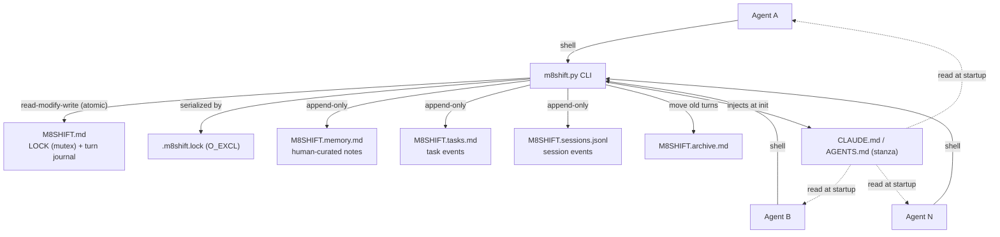
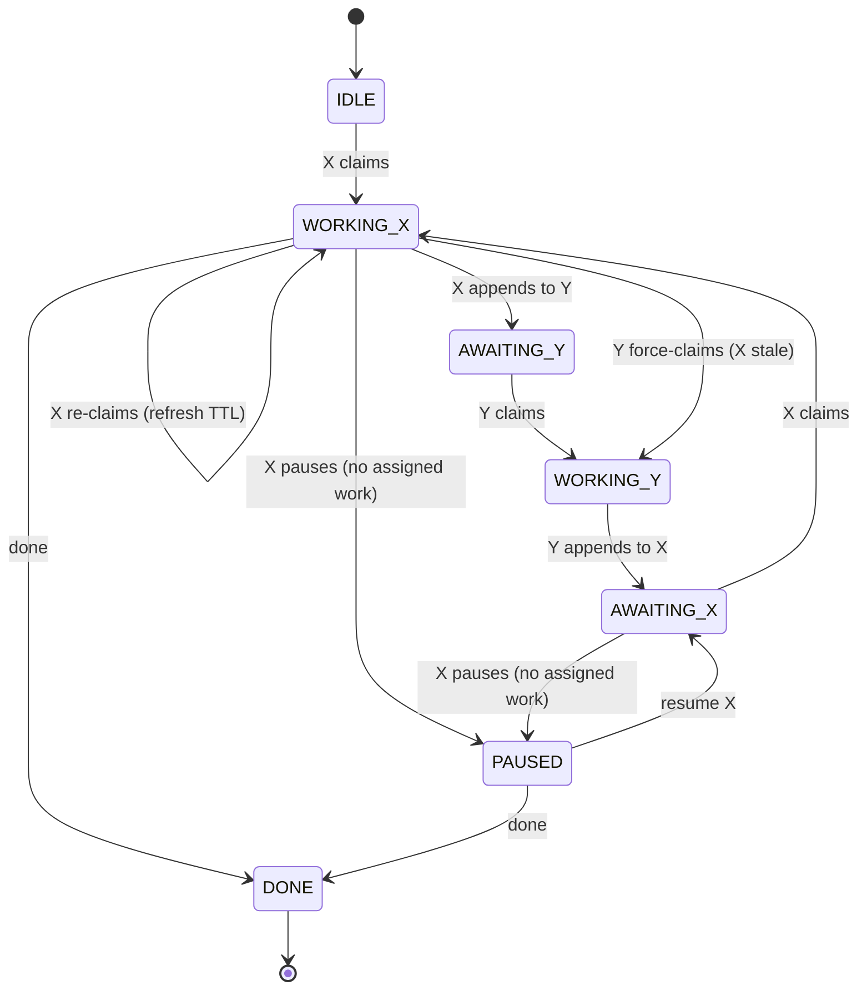
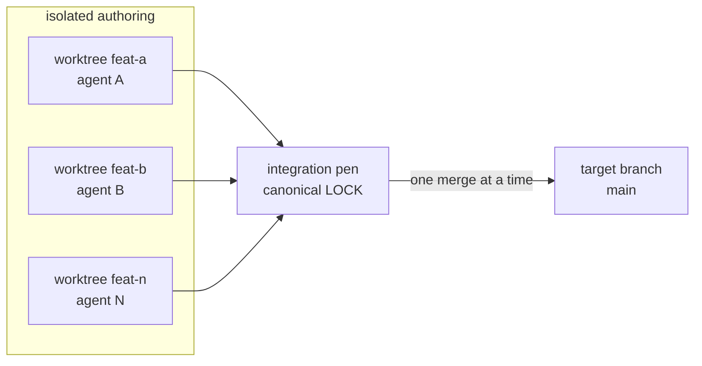
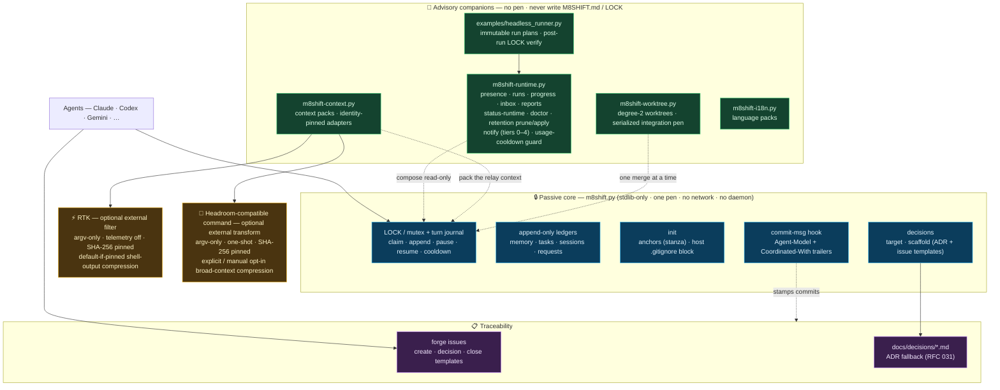
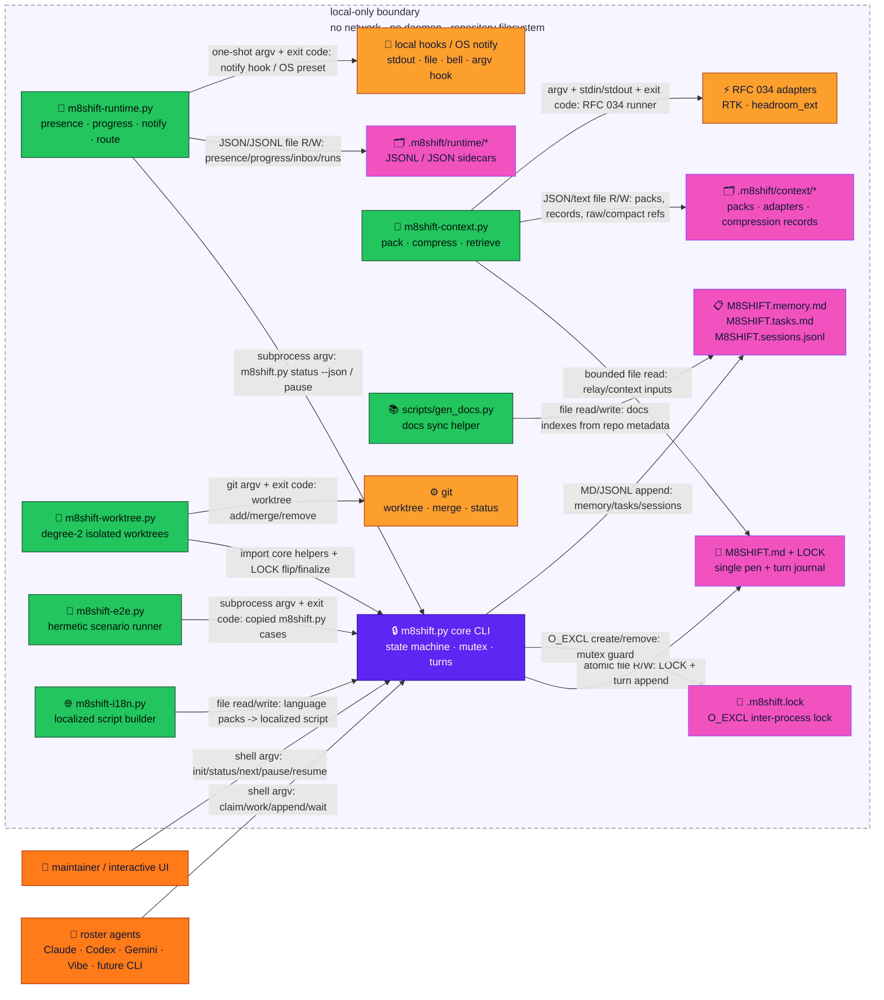
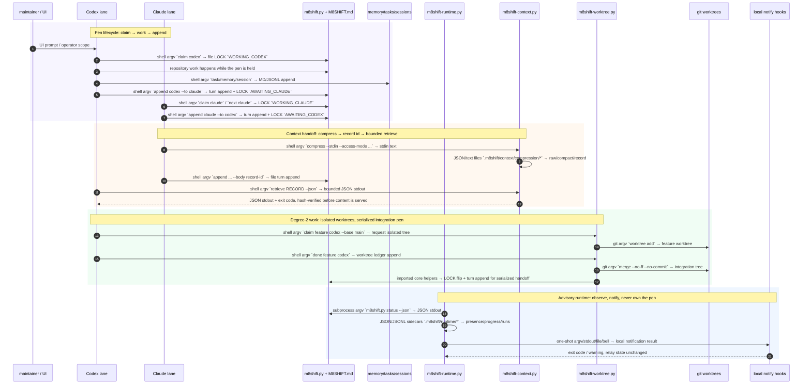
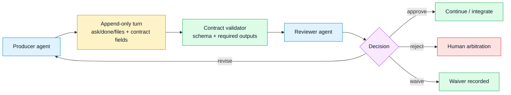

# 🏛️ Architecture Document — M8Shift

> **Status**: `Current` · **Version**: protocol v1 · **Review**: 2026-06-24
>
> This architecture reflects the current v3 model: active roster of ≥2 agents, one
> core pen (degree-1), append-only/read-only side ledgers, session history, i18n packs,
> the opt-in [`m8shift-worktree.py`](rfc/008-rfc-worktree-companion.md) companion for degree-2 isolated worktree
> concurrency, and the local `m8shift-runtime.py` companion for presence/inbox/progress sidecars.
> For command-level rules, see [protocol.md](protocol.md) and
> [specification.md](specification.md).

This document follows the multi-view *Architecture Document* template
(`architecture-document-template`, B. Florat, CC BY-SA 4.0), adapted to a
single-file tool. Each view follows the **Constraints → Requirements →
Solution** pattern. Marked *N/A* (not applicable) wherever the template assumes
an enterprise infrastructure that is not relevant here.

## Document structure

| View | Concerns | Audience |
|------|----------|----------|
| [1. Application](#1--application-view) | Context, actors, data, interfaces, application architecture | PO, architects, maintainer |
| [2. Development](#2--development-view) | Stack, patterns, tests, configuration, versioning | Developers, QA |
| [3. Infrastructure & **Operations**](#3--infrastructure--operations-view) | Hosting, operations, backup, DR, monitoring, support | Operations, maintainer |
| [4. Security](#4--security-view) | Integrity, confidentiality, authz, traceability | Security |
| [5. Sizing](#5--sizing-view) | Storage, compute, memory, response time | Capacity planning |

---

## 1. 📋 Application View

### 1.1 General context

M8Shift is a **coordination tool for an active roster of two or more AI agents**
(Claude, Codex, Gemini, Vibe, …) working on the same repository. The core
materializes a **single pen**: only one roster member writes to the shared tree at a
time, the others wait for their turn. Core coordination state lives in a readable,
versionable file `M8SHIFT.md`, with append-only side ledgers for memory, tasks and
sessions. The tool is a **self-contained Python script**
(`m8shift.py`) that self-installs into any project via `init`.

**Position in the information system**: a coordination layer *above* the host
repository; it depends on no service, exposes no port, and stores nothing
outside the repository. Cross-cutting across all projects (books, code,
sites, …).

**Product intent**: M8Shift was created to make contradictory multi-agent work
usable. Different agents can produce different technical, editorial, legal or
design judgments; the relay lets them exchange and challenge work directly while
the human maintainer remains the arbiter. See [philosophy.md](philosophy.md).

### 1.2 Actors

| Actor | Type | Role |
|-------|------|------|
| active agent ×N | AI agents | the configured active roster (default `claude,codex`); each reads its own anchor (`CLAUDE.md`, `AGENTS.md`, …) and operates the relay on its side |
| maintainer | human | deploys, arbitrates, reads the log (`M8SHIFT.md`, git) |

### 1.3 Nature and sensitivity of data

| Process | Data handled | Classification | C | I | A | T |
|---------|--------------|----------------|---|---|---|---|
| Coordination | Lock state + turn log (`M8SHIFT.md`) | = sensitivity of the host repository | Low | **High** | Medium | **High** |

> C=Confidentiality, I=Integrity, A=Availability, T=Traceability. Integrity and
> traceability take precedence (the log is the record of who did what).

### 1.4 Constraints

- **A single state file**, readable by eye and by `grep`, versionable in clear text.
- **Zero dependencies**: Python 3.8+ stdlib only; no installation.
- **Portable**: any project, any FS, paths with spaces/accents.
- **N agents, one core writer** by design (`init --agents a,b,c…`); true parallel
  authoring is opt-in through isolated worktrees, not through the core relay.

### 1.5 Requirements

See [specification](specification.md) §4–5. In summary: mutual exclusion, atomicity,
agent autonomy, robustness, bounded history, observability, session history,
timezone-prefixed local-time display, i18n, and optional worktree-based parallelism.

### 1.6 Target application architecture

**Components**: (a) the `LOCK` block = state machine; (b) the append-only turn
log; (c) the anchors carrying the *stanza* of self-instruction; (d) the
`m8shift.py` CLI; (e) passive side ledgers (`memory`, `tasks`, `sessions`, `requests`) used only
by read-only or append-only commands; (f) the optional
[`m8shift-worktree.py`](rfc/008-rfc-worktree-companion.md) companion; (g) the optional
`m8shift-runtime.py` companion for advisory runtime sidecars.

**State machine** (`X`, `Y` = any two active roster members):

**Degree-2 opt-in companion**:

The companion keeps parallel work in separate git worktrees and serializes merge-back
through the canonical root's LOCK. It does not change the core one-pen invariant.

**Relay loop** (one round):

### 1.6.1 Module map — the full system (core + companions)

The product grew past a single file into a **passive core plus advisory companions**. Nothing below
the core holds the pen, writes `M8SHIFT.md`, requires the network, or runs a daemon; each companion is
opt-in and fully removable. Colour: 🔒 core · 🧩 companions · ⚡ optional external · 📋 traceability.

### 1.6.2 Module-communication schema — channels and boundaries

This view makes the communication channels explicit. All arrows are local: there is no hosted
control plane, no network dependency, and no daemon in the core path. Colours use the canonical
[brand palette](brand/color-palette.md): orange for human/agent entry points, purple for the passive
core, green for advisory companions, amber for local external adapters, pink for durable records.

### 1.6.3 Inter-application agent flow — major scenarios

**Arrow verification against code paths.**

| Diagram arrow | Code path checked |
|---------------|-------------------|
| agents/human → `m8shift.py` via shell argv | `m8shift.py` argparse command handlers (`cmd_claim`, `cmd_append`, `cmd_wait`, `cmd_next`, `cmd_pause`, `cmd_resume`) |
| `m8shift.py` → `M8SHIFT.md` / `.m8shift.lock` | core lock mutation path uses the repository state file plus `.m8shift.lock` `O_EXCL` guard before atomic state writes |
| `m8shift.py` → memory/tasks/sessions | core side-ledger commands append Markdown/JSONL rows; they do not grant companion write authority over the pen |
| `m8shift-runtime.py` → core | `load_core()` imports `m8shift.py`; `run_core_json()` invokes `[python, CORE_PATH, ...]` and parses JSON stdout |
| `m8shift-runtime.py` → runtime sidecars/hooks | runtime constants under `.m8shift/runtime/*`; notification tiers write prompt/event/log files or run one-shot argv hooks |
| `m8shift-context.py` → adapters | `safe_run_adapter_process()` wraps the RFC 034 argv-only adapter runner with bounded stdout/stderr and exit-code handling |
| `m8shift-context.py` → compression store | `cmd_compress()` writes raw/compact/record files under `.m8shift/context/compression`; `cmd_retrieve()` returns bounded JSON/text after hash checks |
| `m8shift-worktree.py` → core/git | `load_core()` imports core helpers; `git()` calls `git -C ...`; `cmd_integrate()` merges in an integration worktree then finalizes through the core lock |
| `m8shift-e2e.py` → copied core | `run_case()` copies `m8shift.py` into a temp directory and drives it through subprocess argv/exit codes |

**What each module serves.** The **core** is the mutex + immutable journal + the self-installing
stanza; it is the only writer of relay state. **`m8shift-runtime.py`** turns that state into
observability + advisory operations (presence, progress, notifications, usage cooldowns, bounded
retention) without ever holding the pen. **`m8shift-context.py`** compresses the hand-off context
into referenced packs and compression records. When [RTK](rfc/034-rfc-companion-adapter-interface.md)
is present and identity-pinned, it runs it as an argv-only, telemetry-off shell-output filter; when
an adapter-compatible Headroom command is present, identity-pinned, and explicitly selected with
`--backend headroom_ext` or manually enabled through `backends.headroom_ext.auto_enabled`, it may run
`headroom_ext` as an argv-only broad-context transform; RFC 042 access-mode signals are recorded but
do not drive routing until the measured gate opens.
**`m8shift-worktree.py`**
is the only sanctioned parallel-write path (degree-2), serialising merges through the canonical
`LOCK`. **`headless_runner.py`** executes one hardened, immutable run plan and verifies the `LOCK`
afterwards. Decisions and their contradictions are recorded through the **forge templates** or the
**ADR fallback** — tool-independent by design.

### 1.7 Application flow matrix

| Source | Destination | Channel | Mode |
|--------|-------------|---------|------|
| agent | `M8SHIFT.md` | local file system | R/W |
| `m8shift.py init` | each active agent's anchor (default `CLAUDE.md`, `AGENTS.md`), `AGENTS.override.md` (if present), `M8SHIFT.protocol.md` | local file system | W |
| agent | `M8SHIFT.archive.md` | local file system | W (append) |
| `m8shift.py init` / `done` | `M8SHIFT.sessions.jsonl` | local file system | W (append) |
| agent | `M8SHIFT.memory.md`, `M8SHIFT.tasks.md` | local file system | W (append), R for recap/list/show |
| agent/operator | `M8SHIFT.requests.md` | local file system | W (append), R for status/next hints |
| `m8shift-worktree.py` | `.m8shift/worktrees/*`, canonical `M8SHIFT.md` | local file system + Git | W, serialized integration |
| `m8shift-runtime.py` | `.m8shift/runtime/*` | local file system | W (advisory sidecars only) |

### 1.8 Concurrency model — a mutex, not a semaphore

M8Shift is, at its core, a **mutex** (mutual exclusion): exactly **one** agent holds
the "pen" at any instant. It is **not a semaphore** — a semaphore would allow *k*
simultaneous holders (counter); M8Shift's degree of concurrency is strictly **1**.
This is the central invariant: *one agent modifies the repository at a time.*

It is not a single textbook mutex, though: it **composes four classic primitives**
on **two levels**.

| Classic concept | In M8Shift |
|-----------------|-----------|
| **OS mutex** (low level) | `.m8shift.lock` opened with `O_CREAT\|O_EXCL`: a real OS lock that serializes the **critical section** = the read-modify-write of `M8SHIFT.md`. The *enforced* technical mutex. |
| **Owned application lock** (high level) | the `WORKING_<agent>` state in the LOCK block: a **named, owned** lock held across the whole **work window** (not just during a single command). The *semantic* mutex protecting the shared resource (the repo). |
| **Lease / TTL** (anti-deadlock) | `expires` (30-min TTL) + ownership token: the **lease-based distributed-lock** pattern (ZooKeeper ephemeral nodes, Redlock). If the holder dies, the lease expires → `claim --force`. If the holder is alive during a long turn, a wrapper should refresh with `claim <me>` at T-5 min. |
| **Monitor / condition variable + baton** | `wait <agent>` polls until `AWAITING_<self>` (a **condition wait**); the explicit handoff `--to <other>` is **token-passing** (a baton / token ring). |

Two properties set it apart from a strict in-process mutex:

- **Cooperative / advisory, not enforced.** The OS cannot prevent a third process
  from editing the repository — the real critical section (an agent editing files)
  is not hardware-lockable. M8Shift *enforces* that you cannot **record** a turn
  without holding the pen (`append` ⇐ `WORKING_<self>`), but the exclusivity of the
  *work itself* relies on the discipline `claim → work → append` (see
  [specification](specification.md) §8).
- **Re-entrant for the holder.** The current holder may re-`claim` to refresh its
  lease — a holder-recursive lock. Long-running wrappers should do that at least
  **5 minutes before** `expires`, not at the last second.

**Why this matters.** Generalizing to an active roster of N agents keeps the core degree
at **1**: the baton is passed among participants, but only one can edit the shared tree.
Degree-2 exists only as an opt-in companion that isolates concurrent work in separate
git worktrees and serializes integration.

### 1.9 Stage 4 contracts and validation — shipped read-only extension

Stage 4 is implemented as a read-only extension. The engine stores required handoff
fields (`ask`, `done`, `files`), advisory metadata (`branch`, `commit`, `tests`, `next`,
`blocked_on`, `x_*`), and typed contract metadata (`schema`, `relation`, `role_from`,
`role_to`, `requires`, `expected_output`, `evidence`, `decision`, `waiver_reason`,
`permissions`). `contract validate` and `doctor --contracts` check that metadata without
mutating the `LOCK`.

Legend: blue = agents, yellow = persisted turn data, green = validation or accepted
continuation, purple = explicit decision, red = human escalation.

The architectural boundary is deliberate: validation reads the append-only turn history and can
report warnings or strict errors, but it does not route work, grant permissions, run tools, or
mutate the `LOCK`. Host/UI permission enforcement can be layered around M8Shift, while the core
remains a passive single-file relay. The implementation contract is tracked in
[RFC — Stage 4 contracts and validation](rfc/012-rfc-contracts-validation.md).

---

## 2. 🛠️ Development View

### 2.1 Software stack

| Item | Choice |
|------|--------|
| Language | Python **3.8+** |
| Dependencies | **No Python dependencies** (stdlib: `argparse`, `contextlib`, `datetime`, `os`, `re`, `subprocess`, `sys`, `tempfile`, `time`); Git optional, to preserve a case rename in the index |
| Distribution | **a single file** `m8shift.py` (embedded templates) |
| Tests | stdlib `unittest` — `tests/test_m8shift.py`, `tests/test_worktree.py` |

### 2.2 Notable patterns

- **Atomic write**: `write()` → a **single** temporary file (`mkstemp`) then
  `os.replace` (POSIX atomic). **All** writes go through it, including the archive.
- **Inter-process lock**: commands that mutate state take `.m8shift.lock`
  (`O_CREAT|O_EXCL`) and do the read-modify-write *inside it* → two concurrent
  `m8shift.py` processes are serialized (no double IDLE start); an abandoned lock
  is reclaimed after 60 s.
- **Input validation**: single-line fields (newlines and reserved markers
  rejected); body neutralized (anti-injection against forged turns).
- **Single source of truth**: the protocol, the `M8SHIFT.md` template, and the
  stanza are constants in `m8shift.py`; `docs/en/protocol.md` is a *generation* of
  `m8shift.PROTOCOL["en"]` (byte-for-byte regression test `test_protocol_docs_in_sync`).
- **Idempotent, priority injection**: the stanza is delimited by `M8SHIFT:STANZA`
  markers, moved/refreshed at the top without duplication. Case variants are
  normalized to the canonical name on any FS (`git mv -f` if Git is available and
  the file is tracked, in order to update the index); `AGENTS.override.md`, which
  takes priority for Codex in the same folder, is synchronized if it exists. If
  only a Claude anchor pre-existed, the new `AGENTS.md` receives a bridge to its
  shared instructions; no bridge is added when a Codex instruction already
  existed.
- **Markers in HTML comments**: invisible to Markdown rendering, `grep`-able.

### 2.3 Test strategy

180 tests, with no external Python dependency: unit tests (pure functions and parsers)
plus CLI regression tests in isolated subprocesses (claim→append model, mutex,
N-agent concurrency with a single winner, canonical/override anchors, memory, tasks,
session history, timezone-prefixed local-time display, archive, doctor, worktree companion, robustness,
anti-injection, LOCK schema). Command:
`python3 -m unittest discover -s tests`.

### 2.4 Configuration management, encoding, time zones

- **Config**: none; everything is embedded. `init` takes `--name` / `--agents a,b,c…`
  (active roster) / `--lang <bundled-code>` / `--force`.
- **Encoding**: UTF-8 everywhere (explicit on read/write).
- **Time zones**: all stored timestamps are **UTC** ISO-8601 (`...Z`); human-facing
  commands also display the user's local time next to UTC, prefixed by the timezone
  name/offset when available (otherwise `local`), while JSON stays UTC-only.
- **Logging**: standard output (`✓`/`refused`/`…` messages), no log file.

### 2.5 Branching & versioning policy

A `dev/vX.Y.x` branch per sprint, merge + tag on `main`. The **protocol** is
versioned (v1): any **breaking** change to the `LOCK`/`TURN`/marker format increments
the version and preserves the ability to read existing `M8SHIFT.md` files. The roster
`agents:` field is a **backward-compatible optional** addition within v1 (old readers
ignore it; safe for the default `claude,codex` pair — a custom roster needs a
roster-aware script).

---

## 3. 🏗️ Infrastructure & Operations View

> This is the **operations** view: how it runs, is backed up, is monitored, and
> is brought back up.

### 3.1 Hosting constraints

- **No server, no network service, no port.** The "infrastructure" is the **host
  repository's file system**. *Datacenter availability, DR category, firewall,
  certificates: N/A.*
- **On-demand** execution: each command is a short-lived process (no daemon).

### 3.2 Operations requirements

| ID | Requirement |
|----|-------------|
| EX-1 | Anti-deadlock: an abandoned lock is recoverable without intervention (TTL 30 min + `claim --force`). |
| EX-2 | Durability over time: `M8SHIFT.md` stays bounded (archiving). |
| EX-3 | Tool-free observability: state is readable via `status` or `grep`. |

### 3.3 Operations solution

#### Startup / shutdown
No startup order: `m8shift.py init` deploys, and the relay "runs" through the
agents' successive invocations. "Shutdown" = `done <agent>` (state `DONE`).

#### Scheduled operations & monitoring
- **Poll**: each idle agent calls `wait <self>` (loop ~60 s, `--interval N`) or
  `wait <self> --once` (a single check, non-blocking, for an external loop).
- **Monitoring**: `m8shift.py status` (lock + last turn); in black-box mode,
  `grep -E '^state:|^holder:' M8SHIFT.md`. For a terminal that refreshes by itself,
  `m8shift.py watch --for <agent> --interval 5` repeats the same read-only view
  without claiming, handing off, or repairing anything.
- **Deadlock detection**: `status` flags a **stale** lock (`WORKING_*` + `now >
  expires`) → recovery via `claim <self> --force`.
- **Open/no-work parking**: when the session must stay open but no agent has active
  work, the current holder uses `pause <holder> --reason …`; `PAUSED` has
  `holder=none` and requires explicit `resume <agent> --reason …`.

#### Maintenance mode
Manual editing of the `LOCK` block is possible (trivial `key: value` format); in
case of doubt, `init --force` resets the lock to `IDLE` without losing the
archived history.

#### Backup & restore
- **Backup**: `M8SHIFT.md`, `M8SHIFT.archive.md`, and `M8SHIFT.sessions.jsonl` are **versioned by git** (the
  host repository is the backup; RPO = last commit).
- **Restore**: `git checkout` of the file; the archive retains the history of
  purged turns.
- **Atomicity**: `os.replace` guarantees a half-written state file is never read
  (no corruption on interruption).

#### Logging
The **turn log** IS the functional log (who, what, when, ask/done). CLI output
goes to stdout. No PII beyond the task content entered.

### 3.4 Disaster recovery plan (DR)

| Disaster | Recovery |
|----------|----------|
| Abandoned lock (crashed agent) | TTL 30 min then `claim --force` (EX-1) |
| `M8SHIFT.md` corrupted/lost | `git checkout` or `init --force` (restarts at `IDLE`, archive preserved) |
| `m8shift.py` lost | copy the single file back from this repo; `init` regenerates the rest |

**RTO**: a few seconds (one command). **RPO**: last git commit.

### 3.5 Decommissioning

Delete `M8SHIFT.md`, `M8SHIFT.protocol.md`, `M8SHIFT.archive.md`, `M8SHIFT.sessions.jsonl`, and the stanza
from `CLAUDE.md`, `AGENTS.md`, and, where applicable, `AGENTS.override.md`
(between the `M8SHIFT:STANZA` markers). No external resource to release.

### 3.6 Support contacts

| Level | Contact |
|-------|---------|
| Maintainer | the repository owner (see the host where you cloned it) |
| Source | your own Git / GitLab host — fork & clone (e.g. `git clone https://gitlab.example.com/you/M8Shift.git`) |

---

## 4. 🔒 Security View

### 4.1 Threat model

A **cooperative** mutex, not an application-level one: designed for two
**trusted** agents. No strong security boundary between them; protection is
procedural.

### 4.2 Integrity
- Turns are **immutable by convention**: the tool never rewrites a closed turn
  (nothing at the FS level prevents it under manual editing).
- **Atomic** write (`mkstemp` + `os.replace`) and read-modify-write
  **serialized** by `.m8shift.lock` (`O_EXCL`).
- Guardrails: write refused out of turn; `--to` ≠ self; `release`/`done` require
  holding the pen; **anti-injection** (single-line fields, neutralized body).

### 4.3 Confidentiality
`M8SHIFT.md` may contain task content → **same classification as the host
repository**. No secret to be stored in it. No encryption (out of scope).

### 4.4 Authentication / Authorization
- **Authn**: none; relies on local file system permissions.
- **Authz**: "identity" is declarative (`claude`/`codex`); state guardrails
  prevent out-of-turn actions. `--force` is an explicit *override* reserved for
  recovery (a malicious actor could use it — accepted by the cooperative model).

### 4.5 Traceability & auditability
The turn log + the git history provide a complete audit trail (who took the pen,
when, and to do what). `note`/`since` timestamp each transition.

---

## 5. 📊 Sizing View

### 5.1 Constraints
Negligible footprint; no SAN, no database.

### 5.2 Resource estimate

| Resource | Order of magnitude |
|----------|--------------------|
| `M8SHIFT.md` storage | a few KB; **bounded** by `archive` (≈ LOCK + last N turns); session metadata is in append-only `M8SHIFT.sessions.jsonl` |
| Archive | grows linearly; purgeable / compressible offline |
| CPU / memory | a short Python invocation; negligible |
| Response time | command < ~100 ms (except blocking monitors such as `wait` / `watch`, intentionally poll-based) |

### 5.3 Dynamic sizing
The only load parameter is the poll interval (`wait --interval N`,
`watch --interval N`); `--once` allows monitoring with no wait cost.

---

## Glossary

| Term | Definition |
|------|------------|
| **Pen / lock** | The exclusive right to write, materialized by the `LOCK` block. |
| **Turn (`TURN`)** | One agent's speaking slot, delimited by `BEGIN`/`END`, immutable once closed. |
| **Stanza** | Self-instruction block injected into `CLAUDE.md`/`AGENTS.md` between `M8SHIFT:STANZA` markers. |
| **Stale lock** | A `WORKING_*` whose `expires` has passed → reclaimable with `--force`. |
| **Paused session** | `PAUSED` lock state: session open, no pen holder, waiting for explicit user scope and `resume`. |
| **TTL** | Validity duration of a working lock (30 min). |
