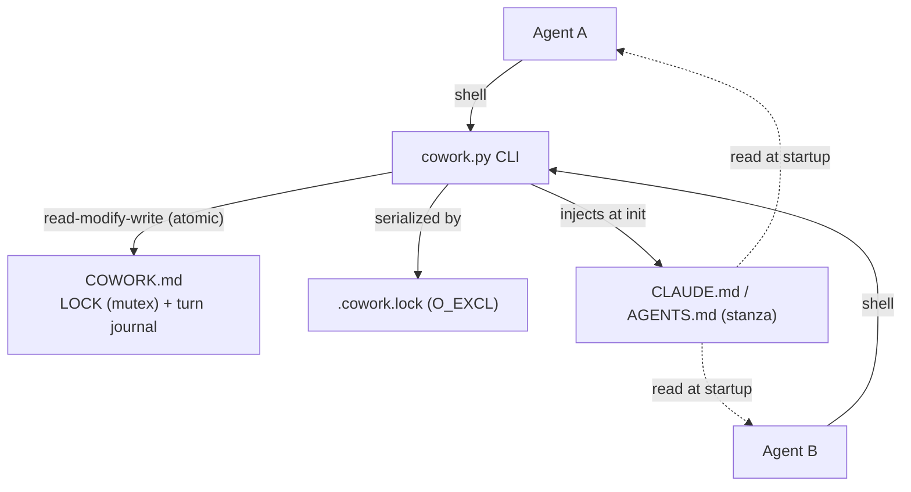
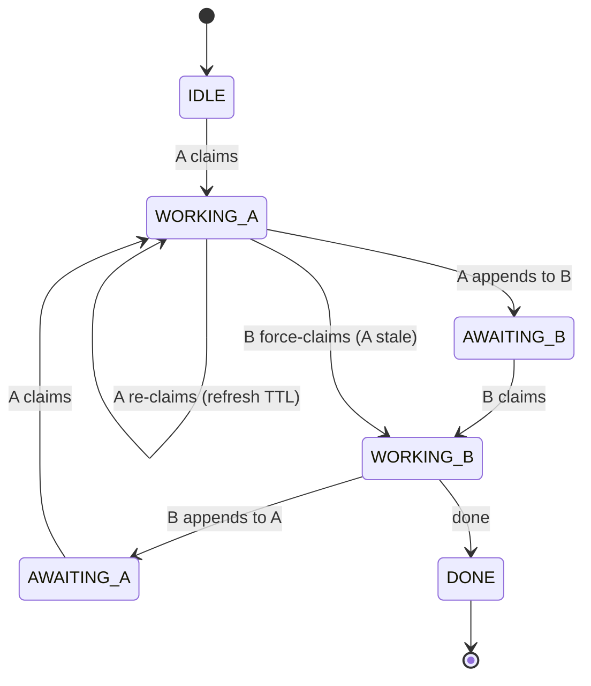
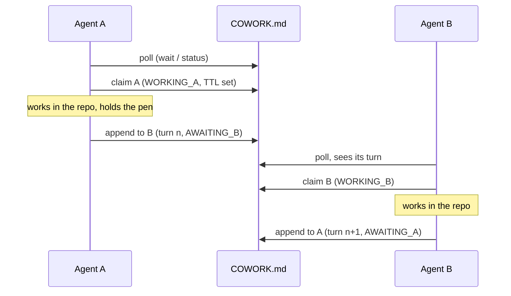

# 🏛️ Architecture Document — CoWork

> **Status**: `Approved` · **Version**: protocol v1 · **Review**: 2026-06-21

This document follows the multi-view *Architecture Document* template
(`architecture-document-template`, B. Florat, CC BY-SA 4.0), adapted to a
single-file tool. Each view follows the **Constraints → Requirements →
Solution** pattern. Marked *N/A* (not applicable) wherever the template assumes
an enterprise infrastructure that is not relevant here.

## Document structure

| View | Concerns | Audience |
|------|----------|----------|
| [1. Application](#1--application-view) | Context, actors, data, interfaces, application architecture | PO, architects, maintainer |
| [2. Development](#2--development-view) | Stack, patterns, tests, configuration, versioning | Developers, QA |
| [3. Infrastructure & **Operations**](#3--infrastructure--operations-view) | Hosting, operations, backup, DR, monitoring, support | Operations, maintainer |
| [4. Security](#4--security-view) | Integrity, confidentiality, authz, traceability | Security |
| [5. Sizing](#5--sizing-view) | Storage, compute, memory, response time | Capacity planning |

---

## 1. 📋 Application View

### 1.1 General context

`cowork` is a **coordination tool for two AI agents** (a configurable pair; by default Claude, Codex) working on
the same repository. It materializes a **single pen**: only one agent writes at a
time, the other waits for its turn. All coordination state lives in a single,
versionable file `COWORK.md`. The tool is a **self-contained Python script**
(`cowork.py`) that self-installs into any project via `init`.

**Position in the information system**: a coordination layer *above* the host
repository; it depends on no service, exposes no port, and stores nothing
outside the repository. Cross-cutting across all projects (books, code,
sites, …).

### 1.2 Actors

| Actor | Type | Role |
|-------|------|------|
| active agent ×2 | AI agents | the configured relaying pair (default `claude`/`codex`); each reads its own anchor (`CLAUDE.md`, `AGENTS.md`, …) and operates the relay on its side |
| maintainer | human | deploys, arbitrates, reads the log (`COWORK.md`, git) |

### 1.3 Nature and sensitivity of data

| Process | Data handled | Classification | C | I | A | T |
|---------|--------------|----------------|---|---|---|---|
| Coordination | Lock state + turn log (`COWORK.md`) | = sensitivity of the host repository | Low | **High** | Medium | **High** |

> C=Confidentiality, I=Integrity, A=Availability, T=Traceability. Integrity and
> traceability take precedence (the log is the record of who did what).

### 1.4 Constraints

- **A single state file**, readable by eye and by `grep`, versionable in clear text.
- **Zero dependencies**: Python 3.8+ stdlib only; no installation.
- **Portable**: any project, any FS, paths with spaces/accents.
- **Two agents** by design (a configurable pair; degree-1 relay, default claude ⇄ codex).

### 1.5 Requirements

See [specification](specification.md) §4–5 (EF-1→11, ENF-1→6). In summary:
mutual exclusion, atomicity, agent autonomy, robustness, durability over time.

### 1.6 Target application architecture

**Components**: (a) the `LOCK` block = state machine; (b) the append-only turn
log; (c) the anchors carrying the *stanza* of self-instruction; (d) the
`cowork.py` CLI (commands init/status/wait/claim/append/release/done/archive).

**State machine** (`A`, `B` = the two active agents — by default `claude`, `codex`):

**Relay loop** (one round):

### 1.7 Application flow matrix

| Source | Destination | Channel | Mode |
|--------|-------------|---------|------|
| agent | `COWORK.md` | local file system | R/W |
| `cowork.py init` | each active agent's anchor (default `CLAUDE.md`, `AGENTS.md`), `AGENTS.override.md` (if present), `COWORK.protocol.md` | local file system | W |
| agent | `COWORK.archive.md` | local file system | W (append) |

### 1.8 Concurrency model — a mutex, not a semaphore

CoWork is, at its core, a **mutex** (mutual exclusion): exactly **one** agent holds
the "pen" at any instant. It is **not a semaphore** — a semaphore would allow *k*
simultaneous holders (counter); CoWork's degree of concurrency is strictly **1**.
This is the central invariant: *one agent modifies the repository at a time.*

It is not a single textbook mutex, though: it **composes four classic primitives**
on **two levels**.

| Classic concept | In CoWork |
|-----------------|-----------|
| **OS mutex** (low level) | `.cowork.lock` opened with `O_CREAT\|O_EXCL`: a real OS lock that serializes the **critical section** = the read-modify-write of `COWORK.md`. The *enforced* technical mutex. |
| **Owned application lock** (high level) | the `WORKING_<agent>` state in the LOCK block: a **named, owned** lock held across the whole **work window** (not just during a single command). The *semantic* mutex protecting the shared resource (the repo). |
| **Lease / TTL** (anti-deadlock) | `expires` (30-min TTL) + ownership token: the **lease-based distributed-lock** pattern (ZooKeeper ephemeral nodes, Redlock). If the holder dies, the lease expires → `claim --force`. |
| **Monitor / condition variable + baton** | `wait <agent>` polls until `AWAITING_<self>` (a **condition wait**); the explicit handoff `--to <other>` is **token-passing** (a baton / token ring). |

Two properties set it apart from a strict in-process mutex:

- **Cooperative / advisory, not enforced.** The OS cannot prevent a third process
  from editing the repository — the real critical section (an agent editing files)
  is not hardware-lockable. CoWork *enforces* that you cannot **record** a turn
  without holding the pen (`append` ⇐ `WORKING_<self>`), but the exclusivity of the
  *work itself* relies on the discipline `claim → work → append` (see
  [specification](specification.md) §8).
- **Re-entrant for the holder.** The current holder may re-`claim` to refresh its
  lease — a holder-recursive lock.

**Why this matters for the roadmap.** Generalizing to a configurable pair of agents
(claude, codex, lechat, …) keeps the degree at **1**: the baton is simply passed
among the chosen participants rather than between a hard-wired claude/codex. It
stays a **token-passing mutex** — it does *not* become a counting semaphore (that
would mean *k > 1* agents writing concurrently, which is an explicit non-goal).

---

## 2. 🛠️ Development View

### 2.1 Software stack

| Item | Choice |
|------|--------|
| Language | Python **3.8+** |
| Dependencies | **No Python dependencies** (stdlib: `argparse`, `contextlib`, `datetime`, `os`, `re`, `subprocess`, `sys`, `tempfile`, `time`); Git optional, to preserve a case rename in the index |
| Distribution | **a single file** `cowork.py` (embedded templates) |
| Tests | stdlib `unittest` — `tests/test_cowork.py` |

### 2.2 Notable patterns

- **Atomic write**: `write()` → a **single** temporary file (`mkstemp`) then
  `os.replace` (POSIX atomic). **All** writes go through it, including the archive.
- **Inter-process lock**: commands that mutate state take `.cowork.lock`
  (`O_CREAT|O_EXCL`) and do the read-modify-write *inside it* → two concurrent
  `cowork.py` processes are serialized (no double IDLE start); an abandoned lock
  is reclaimed after 60 s.
- **Input validation**: single-line fields (newlines and reserved markers
  rejected); body neutralized (anti-injection against forged turns).
- **Single source of truth**: the protocol, the `COWORK.md` template, and the
  stanza are constants in `cowork.py`; `docs/en/protocol.md` and
  `docs/fr/protocole.md` are a *generation* of `cowork.PROTOCOL[lang]` (byte-for-byte
  regression test `test_protocol_docs_in_sync`).
- **Idempotent, priority injection**: the stanza is delimited by `COWORK:STANZA`
  markers, moved/refreshed at the top without duplication. Case variants are
  normalized to the canonical name on any FS (`git mv -f` if Git is available and
  the file is tracked, in order to update the index); `AGENTS.override.md`, which
  takes priority for Codex in the same folder, is synchronized if it exists. If
  only a Claude anchor pre-existed, the new `AGENTS.md` receives a bridge to its
  shared instructions; no bridge is added when a Codex instruction already
  existed.
- **Markers in HTML comments**: invisible to Markdown rendering, `grep`-able.

### 2.3 Test strategy

46 tests, with no external Python dependency: unit tests (pure functions:
`other`, `parse_iso`/`iso`, `get_lock`/`set_lock`, `stanza_for`, `clean_body`)
plus CLI regression tests in an isolated subprocess (claim→append model, mutex,
**claude/codex concurrency** with a single winner, canonical/override anchors,
archive, robustness, anti-injection, LOCK schema). Command:
`python3 -m unittest discover -s tests`.

### 2.4 Configuration management, encoding, time zones

- **Config**: none; everything is embedded. `init` takes `--name` / `--agents a,b`
  (the relaying pair) / `--lang en|fr` / `--force`.
- **Encoding**: UTF-8 everywhere (explicit on read/write).
- **Time zones**: all timestamps in **UTC** ISO-8601 (`...Z`).
- **Logging**: standard output (`✓`/`refused`/`…` messages), no log file.

### 2.5 Branching & versioning policy

A `dev/vX.Y.x` branch per sprint, merge + tag on `main`. The **protocol** is
versioned (v1): any **breaking** change to the `LOCK`/`TURN`/marker format increments
the version and preserves the ability to read existing `COWORK.md` files. The roster
`agents:` field is a **backward-compatible optional** addition within v1 (old readers
ignore it; safe for the default `claude,codex` pair — a custom roster needs a
roster-aware script).

---

## 3. 🏗️ Infrastructure & Operations View

> This is the **operations** view: how it runs, is backed up, is monitored, and
> is brought back up.

### 3.1 Hosting constraints

- **No server, no network service, no port.** The "infrastructure" is the **host
  repository's file system**. *Datacenter availability, DR category, firewall,
  certificates: N/A.*
- **On-demand** execution: each command is a short-lived process (no daemon).

### 3.2 Operations requirements

| ID | Requirement |
|----|-------------|
| EX-1 | Anti-deadlock: an abandoned lock is recoverable without intervention (TTL 30 min + `claim --force`). |
| EX-2 | Durability over time: `COWORK.md` stays bounded (archiving). |
| EX-3 | Tool-free observability: state is readable via `status` or `grep`. |

### 3.3 Operations solution

#### Startup / shutdown
No startup order: `cowork.py init` deploys, and the relay "runs" through the
agents' successive invocations. "Shutdown" = `done <agent>` (state `DONE`).

#### Scheduled operations & monitoring
- **Poll**: each idle agent calls `wait <self>` (loop ~60 s, `--interval N`) or
  `wait <self> --once` (a single check, non-blocking, for an external loop).
- **Monitoring**: `cowork.py status` (lock + last turn); in black-box mode,
  `grep -E '^state:|^holder:' COWORK.md`.
- **Deadlock detection**: `status` flags a **stale** lock (`WORKING_*` + `now >
  expires`) → recovery via `claim <self> --force`.

#### Maintenance mode
Manual editing of the `LOCK` block is possible (trivial `key: value` format); in
case of doubt, `init --force` resets the lock to `IDLE` without losing the
archived history.

#### Backup & restore
- **Backup**: `COWORK.md` and `COWORK.archive.md` are **versioned by git** (the
  host repository is the backup; RPO = last commit).
- **Restore**: `git checkout` of the file; the archive retains the history of
  purged turns.
- **Atomicity**: `os.replace` guarantees a half-written state file is never read
  (no corruption on interruption).

#### Logging
The **turn log** IS the functional log (who, what, when, ask/done). CLI output
goes to stdout. No PII beyond the task content entered.

### 3.4 Disaster recovery plan (DR)

| Disaster | Recovery |
|----------|----------|
| Abandoned lock (crashed agent) | TTL 30 min then `claim --force` (EX-1) |
| `COWORK.md` corrupted/lost | `git checkout` or `init --force` (restarts at `IDLE`, archive preserved) |
| `cowork.py` lost | copy the single file back from this repo; `init` regenerates the rest |

**RTO**: a few seconds (one command). **RPO**: last git commit.

### 3.5 Decommissioning

Delete `COWORK.md`, `COWORK.protocol.md`, `COWORK.archive.md`, and the stanza
from `CLAUDE.md`, `AGENTS.md`, and, where applicable, `AGENTS.override.md`
(between the `COWORK:STANZA` markers). No external resource to release.

### 3.6 Support contacts

| Level | Contact |
|-------|---------|
| Maintainer | the repository owner (see the host where you cloned it) |
| Source | your own Git / GitLab host — fork & clone (e.g. `git clone https://gitlab.example.com/you/CoWork.git`) |

---

## 4. 🔒 Security View

### 4.1 Threat model

A **cooperative** mutex, not an application-level one: designed for two
**trusted** agents. No strong security boundary between them; protection is
procedural.

### 4.2 Integrity
- Turns are **immutable by convention**: the tool never rewrites a closed turn
  (nothing at the FS level prevents it under manual editing).
- **Atomic** write (`mkstemp` + `os.replace`) and read-modify-write
  **serialized** by `.cowork.lock` (`O_EXCL`).
- Guardrails: write refused out of turn; `--to` ≠ self; `release`/`done` require
  holding the pen; **anti-injection** (single-line fields, neutralized body).

### 4.3 Confidentiality
`COWORK.md` may contain task content → **same classification as the host
repository**. No secret to be stored in it. No encryption (out of scope).

### 4.4 Authentication / Authorization
- **Authn**: none; relies on local file system permissions.
- **Authz**: "identity" is declarative (`claude`/`codex`); state guardrails
  prevent out-of-turn actions. `--force` is an explicit *override* reserved for
  recovery (a malicious actor could use it — accepted by the cooperative model).

### 4.5 Traceability & auditability
The turn log + the git history provide a complete audit trail (who took the pen,
when, and to do what). `note`/`since` timestamp each transition.

---

## 5. 📊 Sizing View

### 5.1 Constraints
Negligible footprint; no SAN, no database.

### 5.2 Resource estimate

| Resource | Order of magnitude |
|----------|--------------------|
| `COWORK.md` storage | a few KB; **bounded** by `archive` (≈ LOCK + last N turns) |
| Archive | grows linearly; purgeable / compressible offline |
| CPU / memory | a short Python invocation; negligible |
| Response time | command < ~100 ms (except the blocking `wait`, intentionally ~60 s/poll) |

### 5.3 Dynamic sizing
The only load parameter is the poll interval (`wait --interval N`); `--once`
allows monitoring with no wait cost.

---

## Glossary

| Term | Definition |
|------|------------|
| **Pen / lock** | The exclusive right to write, materialized by the `LOCK` block. |
| **Turn (`TURN`)** | One agent's speaking slot, delimited by `BEGIN`/`END`, immutable once closed. |
| **Stanza** | Self-instruction block injected into `CLAUDE.md`/`AGENTS.md` between `COWORK:STANZA` markers. |
| **Stale lock** | A `WORKING_*` whose `expires` has passed → reclaimable with `--force`. |
| **TTL** | Validity duration of a working lock (30 min). |
