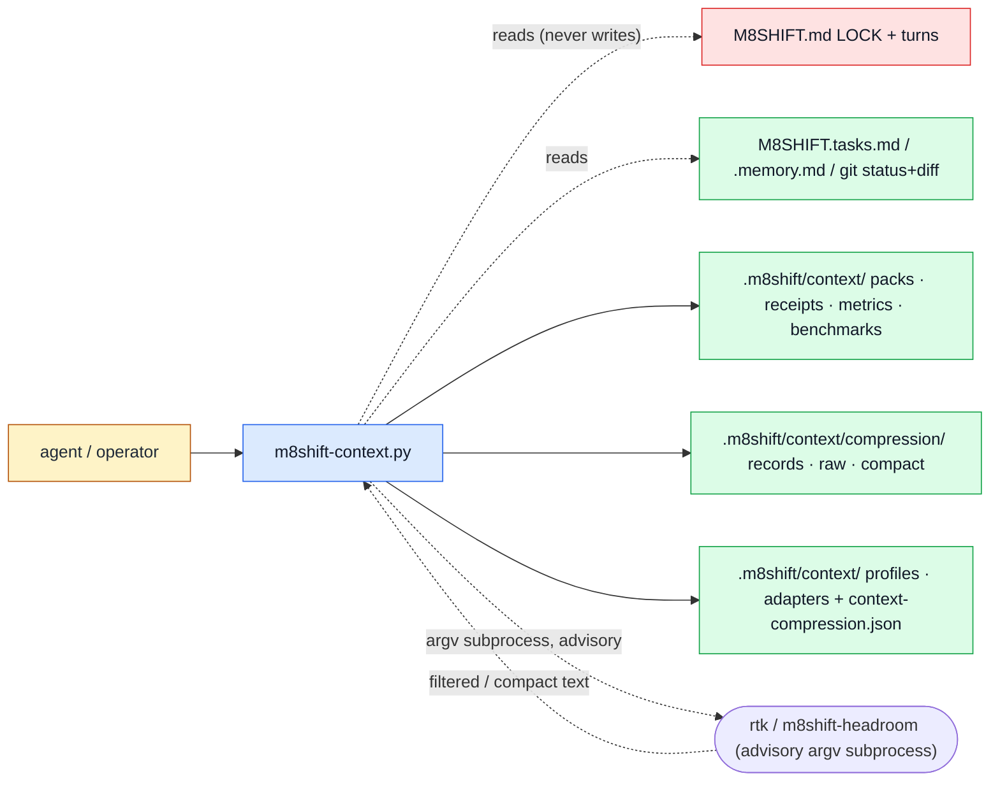

# Context companion (`m8shift-context.py`)

See the [module index](./README.md).

## Purpose

`m8shift-context.py` is the optional context companion. It **owns** referenced context packs (per-role operational views of the relay), redacted compression and bounded-retrieval records, per-role profiles, adapter manifests, and the bounded, argv-only execution of advisory adapters — the built-in digest, the RTK shell-output filter, and the optional Headroom (`headroom_ext`) prose adapter. It does **not** own the one-pen relay: it only *reads* `M8SHIFT.md` (lock and turns) and never writes the LOCK, never decides who may write, and never edits the core relay or repository code. Every artifact it emits is explicitly labeled operational orientation, not evidence — originals, logs, tests, and diffs remain the source of truth.

## Ownership diagram



| Color | Meaning |
|-------|---------|
| Blue | executable module (`m8shift-context.py`) |
| Green | generated local state under `.m8shift/` |
| Red | relay LOCK authority (`M8SHIFT.md`) — read-only to this script |
| Amber | human or agent actor |

The external adapters (`rtk`, `m8shift-headroom`) are drawn unstyled: they are neither M8Shift state nor the lock. They are invoked only as local argv subprocesses and are strictly **advisory** — they never write core state.

## Command surface

`Mutates` is FILE mutation only: **read-only**, **local-state** (writes under `.m8shift/` or `M8SHIFT.*`), **repository-code**, or **external** (none in M8Shift core).

| Command | Mutates | Reads | Writes | Notes |
|---|---|---|---|---|
| `init` | local-state | existing scaffold (skips unless `--force`) | `.m8shift/context/profiles/*.json`, `adapters/*.json`, `README.md`, `.m8shift/context-compression.json` | scaffolds companion; pins adapter identities; disables RTK telemetry if RTK is present and pinned |
| `pack` | read-only, or local-state with `--write`/`--output` | `M8SHIFT.md`, `M8SHIFT.tasks.md`, `M8SHIFT.memory.md`, `git status/diff`, profile, adapter manifest, `--include` files | pack `.md` + receipt + `metrics.jsonl` only when `--write`/`--output` | prints pack to stdout by default; `--adapter auto` uses pinned RTK for the git summary, else native |
| `receipt` | read-only | `.m8shift/context/receipts/*.json` | none | shows one receipt (`--id`) or the latest |
| `metrics` | read-only | `.m8shift/context/metrics.jsonl` | none | proxy + optional real token counts per pack |
| `compress` | local-state | stdin or `--input` file, `context-compression.json`, adapter manifest | `compression/records/*.json`, `raw/*.raw.txt`, `compact/*.compact.txt` | redacts secrets **before** store; fail-closed to reference-only; invokes RTK/Headroom subprocess for those backends |
| `retrieve` | read-only | compression record + its raw/compact file | none | bounded window/grep; verifies stored sha256 before serving |
| `status` | read-only | `metrics.jsonl`, RTK manifest, `PATH` | none | prints RTK adapter state (on/off, pinned) |
| `benchmark` | read-only, or local-state with `--write` | `--real-tokens` JSON (optional) | `.m8shift/context/benchmarks.jsonl` only when `--write` | built-in fixtures; ship gate needs real token reduction |
| `adapters init` | local-state | existing manifests (skips unless `--force`) | `.m8shift/context/adapters/*.json` | writes shipped RTK + Headroom manifests |
| `adapters list` | read-only | adapters dir | none | lists known adapter names |
| `adapters show <name>` | read-only | one adapter manifest | none | pretty-prints the manifest |
| `adapters check [name]` | read-only | adapter manifest(s) | none | validates; exit 1 on any error finding |
| `adapters run <name>` | read-only | stdin or `--input` file + manifest | none (prints result) | bounded argv-only subprocess; advisory; requires the pinned external tool |
| `doctor` | read-only | config, profiles, metrics, receipts, adapters | none | diagnostics; exit 1 on any error finding |

## Inputs and outputs

**Files read.** `M8SHIFT.md` (LOCK block + `M8SHIFT:TURN` handoff turns), `M8SHIFT.tasks.md`, `M8SHIFT.memory.md`, `git status --short --branch` / `git diff --stat` / `git diff --name-only` (git absence is tolerated — empty summary, no crash), `.m8shift/context-compression.json`, `.m8shift/context/profiles/<role>.json`, `.m8shift/context/adapters/<name>.json`, and any `pack --include` / `compress --input` / `retrieve` target path (all resolved through `safe_join`, which rejects paths that escape the project root).

**Files written** (all local state under `.m8shift/`): context packs `context/packs/*.md`; receipts `context/receipts/*.json`; `context/metrics.jsonl`; `context/benchmarks.jsonl`; role profiles `context/profiles/*.json`; adapter manifests `context/adapters/*.json`; the config `context-compression.json`; and per compression record a JSON record (`context/compression/records/*.json`), a redacted raw reference (`compression/raw/*.raw.txt`), and a compact digest (`compression/compact/*.compact.txt`). Writes are atomic (temp file + `os.replace`); the two compression payloads are staged as `.pending` files and swapped in only after the record is assembled.

**Environment variables.** `M8SHIFT_ROOT` sets the project root when `--root` is absent (falls back to the script directory). `PATH` is used to resolve adapter executables and is the only variable passed to subprocesses, plus any names listed in an adapter manifest's `requires_env`. (`$M8SHIFT_ADAPTER_MODE` / `$M8SHIFT_ADAPTER_MODE_ARGS` are manifest command-template placeholders, not process environment reads.)

**Exit behavior.** Most commands return `0`. Any hard error (missing/invalid record, unsafe id or grep pattern, path escaping root, adapter failure under a `fail_closed` policy, missing `--stdin`/`--input`) exits non-zero via a `m8shift-context:` message. `adapters check` and `doctor` return `1` when any finding has severity `error`. `benchmark --require-real-tokens` returns `1` when the ship gate does not show a real token reduction.

## Safe examples

```bash
# mutates-local-state — scaffold profiles, adapter manifests, and compression config
python3 m8shift-context.py init
```

```bash
# safe — build a reviewer pack and print it to stdout (no files written; native path)
python3 m8shift-context.py pack --profile reviewer --no-rtk
```

```bash
# mutates-local-state — store a redacted, retrievable digest of noisy shell output
printf 'make: *** [build] Error 2\nexit code 2\n' \
  | python3 m8shift-context.py compress --type shell_output --stdin
```

```bash
# requires-optional-adapter — real prose compression via the pinned Headroom adapter
python3 m8shift-context.py compress --backend headroom_ext --type report --input notes.md
```

The `shell_output` example uses the built-in digest in a bare project (RTK is not bundled). The Headroom example needs `install.sh --with-headroom` to have created and pinned the local `m8shift-headroom` launcher; without it the explicit backend fails closed to a redacted reference-only record.

## Failure modes

- **`compress requires --stdin or --input` / `adapter run requires --stdin or --input`.** No input source was given; pipe content on stdin or pass a project-relative `--input` file.
- **`record not found or invalid: <id>`** (retrieve). The record id is wrong or the record JSON is missing/malformed. List `context/compression/records/` to find valid ids.
- **`record <id> raw hash mismatch; refusing to serve evidence`.** The stored raw/compact file no longer matches the sha256 in the record — it was edited or truncated. The bounded reference is no longer trustworthy; re-run `compress` on the original source.
- **`compression.config_missing` / `config_unreadable` / `config_schema`** (doctor / compress findings). The config is absent or invalid, so compression enters the fail-safe: it still redacts and stores, but produces reference-only digests instead of compact ones. Recover with `init --force` to rewrite `context-compression.json`.
- **`reference-only: <reason>`** printed after `compress`. The requested backend was unavailable, invalid, or failed. The record still holds the redacted raw plus a reference-only digest; retrieve the bounded raw for evidence, or fix the backend and re-run.
- **Adapter check errors** — `adapter.executable_missing`, `adapter.program_not_allowed`, `adapter.trusted_executable`, `adapter.program_identity_mismatch`. The manifest is invalid or the executable is not identity-pinned (missing, off-allowlist, wrong path, or a sha256 drift). Recover with `adapters init --force` while a trusted `rtk`/`m8shift-headroom` is on `PATH`.
- **`adapter mode 'git-diff' is forbidden: ...`.** RTK's `git-diff` mode is intentionally blocked — it is lossy for hunks and unsafe for review. Read raw diffs instead. RTK itself is a **lossy semantic filter** (err/test/log modes), not a compressor: it has no standalone compression percentage, so never treat a "compressed" RTK pack as evidence.
- **`unsafe grep pattern: ...`** (retrieve `--grep`). The pattern is too long, contains a NUL byte, or uses a nested/repeated wildcard quantifier. Simplify the expression.
- **`... escapes project root`.** A `--include`, `--input`, `--output`, or record path resolved outside the project root and was refused. Use a path inside the root.

A note on numbers: the `compression_ratio` in a record is the byte reduction of the **stored digest** (a redacted head/tail excerpt plus extracted signals), estimated as `bytes // 4` proxy tokens — it is not the backend's own compression ratio. The Headroom adapter is the only real compressor here (~45–55% on prose; it errors on shell output), and even then the recorded ratio reflects the excerpt that was stored, not Headroom's internal reduction.

## Related RFCs and tests

Owning and directly-related RFCs:

- [RFC 034 — Companion adapter interface](../rfc/034-rfc-companion-adapter-interface.md) (adapter manifests, bounded argv-only execution, advisory authority)
- [RFC 037 — Agent context compression backends](../rfc/037-rfc-agent-context-compression-backends.md) (built-in digest, RTK, Headroom, redaction, bounded retrieval)
- [RFC 042 — Compression backend routing](../rfc/042-rfc-compression-backend-routing.md) (content-type routing, `--access-mode` / `--whole-content` advisory signals)
- [RFC 023 — Agent token footprint](../rfc/023-rfc-agent-token-footprint.md) (why packs reference instead of paste)
- [RFC 045 — Module reference executable examples](../rfc/045-rfc-module-reference-examples.md) (defines this page)

Implementation tests:

- `tests/test_m8shift_context.py` — packs, receipts, metrics, compression, redaction, bounded retrieval, adapter validation and execution, doctor.
- `tests/test_m8shift_headroom.py` — the optional `m8shift-headroom` launcher used by the `headroom_ext` backend.
