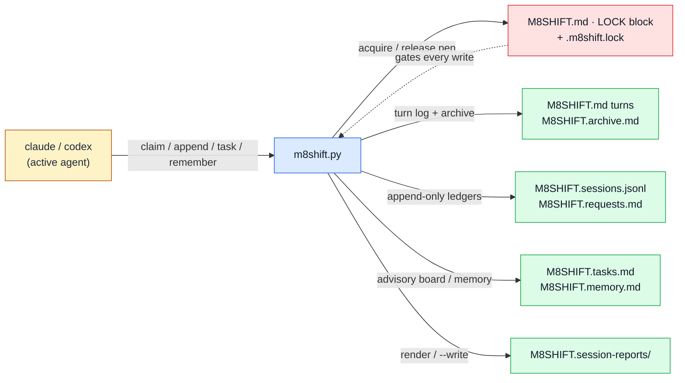

# Core relay

See the [module index](./README.md).

## Purpose

`m8shift.py` is the single-file relay engine and the **only** module with write
authority over coordination state. It **owns** the one-pen mutex (the `LOCK` block
in `M8SHIFT.md` plus the inter-process `.m8shift.lock`), the numbered turn ledger
(`M8SHIFT.md` + `M8SHIFT.archive.md`), the session ledger and Markdown session
reports (`M8SHIFT.sessions.jsonl`, `M8SHIFT.session-reports/`), the cooperative
turn-request ledger (`M8SHIFT.requests.md`), the shared task board
(`M8SHIFT.tasks.md`), the shared memory notes (`M8SHIFT.memory.md`), and the
read-only core `doctor`/`contract` health checks. It does **not** own runtime
presence/inbox/progress (that is `m8shift-runtime.py`), context packs or
compression/retrieval (that is `m8shift-context.py`), isolated worktree lanes
(`m8shift-worktree.py`), Headroom adapter launching (`m8shift-headroom.py`),
language-pack builds (`m8shift-i18n.py`), or the e2e harness (`m8shift-e2e.py`).
The core is passive: no network, no daemon, no API key — agents drive it with shell
commands.

## Ownership diagram



Legend:

| Color | Meaning |
|-------|---------|
| Blue | executable module |
| Green | generated local state |
| Red | relay LOCK authority |
| Amber | human or agent actor |

## Command surface

`Mutates` classifies **file** mutation only: **read-only** (no writes),
**local-state** (writes under `M8SHIFT.*` or `.m8shift/`), or **repository-code**
(writes tracked project files). Nothing here is **external** — the core never
touches the network or an external service.

| Command | Mutates | Reads | Writes | Notes |
|---------|---------|-------|--------|-------|
| `init [--name --agents --lang --force --gitignore/--no-gitignore --companions/--full/--with-* --companion-source --force-companions]` | local-state + repository-code | folder contents, existing anchors | `M8SHIFT.md`, `M8SHIFT.protocol*.md`, anchor stanza in `CLAUDE.md`/`AGENTS.md`, `.gitignore` block, `.m8shift/` hooks + `kit.json`, copied companions | idempotent re-inject; `M8SHIFT.md` preserved unless `--force` |
| `status [--json --brief --for A]` | read-only | LOCK, `M8SHIFT.sessions.jsonl` | none | prints UTC + local time; `--for` adds next-action hint |
| `may-i-write A` / `guard A` | read-only | LOCK | none | rc 0 only while A holds a valid `WORKING` pen (point-in-time, TOCTOU) |
| `watch [--for --interval --clear --changes-only --once]` | read-only | LOCK | none | passive live monitor; no claim/force/daemon |
| `doctor [--lint --json --security --contracts --severity-min]` | read-only | relay files, `.m8shift.lock`, ledgers | none | never repairs; rc 1 with `--lint` on findings ≥ threshold |
| `contract validate [--strict --json --all --severity-min]` | read-only | turns | none | Stage-4 advisory contract check; rc 1 with `--strict` |
| `recap [--turns --memory --tasks --brief]` | read-only | LOCK, turns, memory, tasks | none | one-shot briefing |
| `peek A` | read-only | turns | none | last handoff to A; rc 3 if not A's turn |
| `log [--limit --all --oneline]` | read-only | turns (+archive with `--all`) | none | relay timeline |
| `history [--limit --oneline --json]` | read-only | `M8SHIFT.sessions.jsonl` | none | folded session history |
| `session {list,show,decisions,report}` | read-only (`report --write` = local-state) | sessions ledger, turns | `M8SHIFT.session-reports/` only with `report --write` | refuses reserved output paths |
| `decisions target [--set --json]` | read-only (`--set` = local-state) | `.m8shift/decisions.json` | `.m8shift/decisions.json` | advisory traceability target |
| `decisions scaffold [--session --target --single --title --status --json]` | repository-code | session turns | `docs/decisions/NNNN-*.md` or `DECISIONS.md` | ADR/Markdown scaffold |
| `wait A [--once --interval]` | read-only | LOCK | none | blocks until A's turn; `--once` rc 3 if not yet |
| `next A [--once --interval --force --resume --reason]` | local-state | LOCK, turns | LOCK | wait, then claim + peek |
| `claim A [--force] [--check --files --turns]` | local-state (`--check` read-only) | LOCK, turns | LOCK | exclusive acquire; `--force` reclaims a **stale** lock only |
| `append A --to B [--ask --done --files --body --allow-large-body --wait --field … contract/sugar flags]` | local-state | LOCK | turn in `M8SHIFT.md`, LOCK, `M8SHIFT.sessions.jsonl` | needs `WORKING_A`; closes turn + hands off |
| `request-turn A --to H --reason` | local-state | LOCK | `M8SHIFT.requests.md` | audit only; no LOCK change |
| `yield-turn H --request N --to A [--reason]` | local-state | LOCK, requests | LOCK, requests | holder yields to requestor |
| `decline-turn H --request N --reason` | local-state | requests | requests | holder keeps the pen |
| `steer-turn A --from H --request N --force --reason` | local-state | LOCK, requests | LOCK, requests | redirect an idle `AWAITING` holder |
| `remember A "note"` | local-state | none | `M8SHIFT.memory.md` | durable advisory note; no pen needed |
| `pause H --reason` | local-state | LOCK | LOCK (→ `PAUSED`) | park an open session with no active task |
| `cooldown --until --reason [--for --source --wait-interval --replace]` | local-state | LOCK | LOCK (→ `PAUSED`) | park for an external usage cooldown |
| `resume A --reason` | local-state | LOCK | LOCK | resume a `PAUSED` session for one agent |
| `task {add,done,drop}` | local-state | tasks | `M8SHIFT.tasks.md` | advisory to-do ledger; no pen needed |
| `task {list,show}` | read-only | tasks | none | open tasks / one task's event history |
| `release A --to B [--force --reason]` | local-state | LOCK, turns | LOCK | hand off with no body; refuses to bounce a pending incoming turn unless `--force --reason` |
| `done A [--force --reason]` | local-state | LOCK | LOCK (→ `DONE`) | close the session |
| `archive [--keep N]` | local-state | turns | `M8SHIFT.md`, `M8SHIFT.archive.md` | move old closed turns (never turn #0) |

## Inputs and outputs

**Files read:** `M8SHIFT.md` (LOCK + turns), `M8SHIFT.archive.md`,
`M8SHIFT.protocol*.md`, `M8SHIFT.memory.md`, `M8SHIFT.tasks.md`,
`M8SHIFT.sessions.jsonl`, `M8SHIFT.requests.md`, `.m8shift.lock`,
`.m8shift/decisions.json`.

**Files written:** the same local-state set (LOCK/turns/ledgers/memory/tasks), plus
on `init` the protocol files, the anchor stanza inside `CLAUDE.md`/`AGENTS.md`, the
marker-delimited `.gitignore` block, `.m8shift/` hooks + `kit.json`, and copied
companion scripts; on `decisions scaffold` a tracked `docs/decisions/NNNN-*.md` or
`DECISIONS.md`; on `session report --write` a file under `M8SHIFT.session-reports/`.
All writes are atomic (unique temp file + `os.replace`) and preserve the target's
mode.

**Environment variables:** `M8SHIFT_ROOT` rebases every runtime coordination path
onto a canonical repo root (used by the §8 worktree companion so a worktree
coordinates against the one shared `M8SHIFT.md`/`.m8shift.lock`); `M8SHIFT_LANG`
sets the default generated-file language (below `--lang`). `M8SHIFT_AGENT_MODEL`
and `M8SHIFT_AGENT` are consumed by the **generated Git hooks** (`commit-msg`
provenance trailer, advisory `pre-commit` guard), not by the relay runtime itself.

**Exit behavior:** rc 0 = success / your turn / free. rc 3 = "not yet" for the
non-blocking probes (`wait --once`, `peek`, `next --once`, `may-i-write`/`guard`
when the pen is not validly held). rc 1 = refusal or corruption (missing/invalid
`M8SHIFT.md`, `claim` refused because it is not your turn or the lock is still
valid, `append` without a held pen, internal lock busy, `--to` self-handoff,
bouncing a pending turn without `--force`). `doctor --lint` and `contract validate
--strict` exit 1 when findings reach `--severity-min`.

## Safe examples

```bash
# safe — read-only, runs in any initialized project
python3 m8shift.py status --for claude
```

```bash
# safe — CI-friendly lint, never writes or repairs
python3 m8shift.py doctor --lint --json
```

```bash
# mutates-local-state — acquire the pen, then close the turn and hand off
python3 m8shift.py claim claude
python3 m8shift.py append claude --to codex \
  --ask "review the LOCK diagram" --done "drafted core-relay.md" --files docs/en/modules/core-relay.md
```

```bash
# mutates-local-state — append one durable memory note (no pen needed)
python3 m8shift.py remember claude "core-relay page owns the mutex + ledgers"
```

## Failure modes

- **`M8SHIFT.md not found — run ./m8shift.py init first.`** — no relay in this
  folder (or `M8SHIFT_ROOT` points at an un-init'd root). Run `init`.
- **`{file} corrupted (invalid LOCK …)` / `LOCK block not found`** — the mutex
  header was hand-edited or truncated. Recover with `init --force` (resets only the
  lock; turns are preserved unless you also reset the file).
- **`refused: state=…, holder=… — it is not your turn.`** — you tried to `claim`
  while another agent holds or is awaited. Wait (`wait <you>`), do not touch files.
- **`refused: <holder>'s lock is still valid (expires …). --force only reclaims a
  stale lock`** — `--force` is intentionally refused on a live pen; you cannot steal
  it from an active agent. Only after `now > expires` is a `claim --force` allowed.
- **`refused: you do not hold the pen (state=…)`** — `append` requires
  `WORKING_<you>`; run `claim` first.
- **`refused: <holder> is integrating (<ref>)`** — an in-flight worktree merge is
  not a reclaimable lock; wait or recover through `m8shift-worktree.py`.
- **`refused: latest turn #N is addressed to <agent>`** — `release` will not bounce
  an unread incoming turn; `peek` then answer with `append`, or use `release --force
  --reason TEXT` for an intentional, audited empty handback.
- **`internal lock busy (another m8shift.py is writing) — retry.`** — the
  `.m8shift.lock` is held by a concurrent process; retry. A crashed holder's lock is
  taken over automatically after 60 s.
- **rc 3 from `wait --once`/`peek`/`next --once`/`guard`** — not an error: simply
  "not your turn yet". Keep polling or `wait`.

## Related RFCs and tests

Owning RFCs (`docs/en/rfc/`): [001 roster](../rfc/001-rfc-roster.md),
[002 n-agents](../rfc/002-rfc-n-agents.md), [004 memory](../rfc/004-rfc-memory.md),
[005 claim-check](../rfc/005-rfc-claim-check.md), [006 tasks](../rfc/006-rfc-tasks.md),
[007 subturn](../rfc/007-rfc-subturn.md),
[011 session-history](../rfc/011-rfc-session-history.md),
[016 cooperative-turn-request](../rfc/016-rfc-cooperative-turn-request.md),
[021 pause-resume](../rfc/021-rfc-pause-resume.md),
[022 session-reports](../rfc/022-rfc-session-reports.md),
[023 agent-token-footprint](../rfc/023-rfc-agent-token-footprint.md),
[024 doctor-split](../rfc/024-rfc-doctor-split.md),
[029 m8shift-board](../rfc/029-rfc-m8shift-board.md),
[030 tamper-evidence](../rfc/030-rfc-tamper-evidence.md),
[031 decision-traceability](../rfc/031-rfc-decision-traceability.md),
[038 multi-session](../rfc/038-rfc-multi-session.md),
[044 complete-init-companion-install](../rfc/044-rfc-complete-init-companion-install.md),
[045 module-reference-examples](../rfc/045-rfc-module-reference-examples.md).

Tests (`tests/`): [`tests/test_m8shift.py`](../../../tests/test_m8shift.py) — the
core relay suite covering init, claim/append mutex, turns/archive, ledgers, memory,
tasks, cooperative turn requests, pause/resume/cooldown, session reports, and the
read-only `doctor`/`contract` checks.
