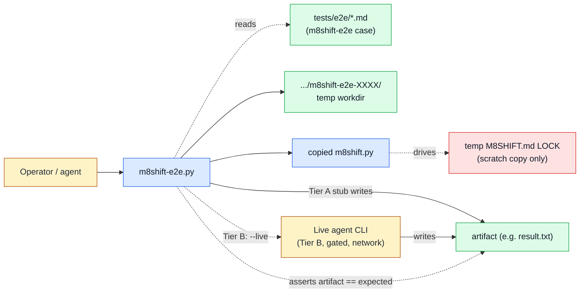

# E2E harness (`m8shift-e2e.py`)

See the [module index](./README.md).

## Purpose

`m8shift-e2e.py` owns M8Shift's local smoke-scenario and regression harness: it takes a
Markdown case file, spins up a throwaway temporary directory, copies `m8shift.py` into
it, and drives a full relay round-trip (`init` -> `claim` -> `status` -> `append`)
against that copy while asserting that a named artifact matches an expected value. It
owns exactly two things: the case format (a fenced ` ```m8shift-e2e ` block) and the
single assertion path shared by both tiers. It does **not** own the relay protocol, the
real project pen/LOCK, or any live agent behavior — the harness is advisory and hermetic
by default. Tier A uses a local integer-arithmetic stub with no model and no network;
Tier B (`--live`) is an opt-in, env-gated path that substitutes a configured agent CLI
and is the only path where network is permitted. It does not own the compression,
runtime, worktree, context, or i18n companions.

## Ownership diagram



Legend:

| Color | Meaning |
|-------|---------|
| Blue | executable module |
| Green | generated local state |
| Red | relay LOCK authority |
| Amber | human or agent actor |

Note: the LOCK the harness exercises lives only inside the disposable temp workdir's
copied `m8shift.py`. The harness never touches the real project's `M8SHIFT.md` or pen.

## Command surface

The script exposes a single command (no subparsers): one positional `case` plus flags.

| Command | Mutates | Reads | Writes | Notes |
|---------|---------|-------|--------|-------|
| `python3 m8shift-e2e.py <case>` | local state (temp dir only) | case `.md`, `m8shift.py` | temp workdir: copied `m8shift.py`, `M8SHIFT.md`, `.m8shift/`, artifact; deleted at end | Tier A hermetic stub; no model, no network |
| `python3 m8shift-e2e.py <case> --keep` | local state (temp dir only) | same as above | same, but temp workdir is **kept** and its path printed | for debugging a failed case |
| `python3 m8shift-e2e.py <case> --live` | external (opt-in, gated) | case `.md`, `m8shift.py`, `M8SHIFT_LIVE_E2E`, `M8SHIFT_E2E_AGENT_CMD` | temp workdir + whatever the agent CLI writes there; may use network | Tier B; **skips cleanly (exit 0)** when the gate is off |
| `python3 m8shift-e2e.py <case> --m8shift-py PATH` | local state (temp dir only) | case `.md`, `m8shift.py` at `PATH` | temp workdir | override which `m8shift.py` is copied (default: sibling of the harness) |
| `python3 m8shift-e2e.py --version` | read-only | none | stdout | prints `m8shift-e2e.py <VERSION>` |
| `python3 m8shift-e2e.py --help` | read-only | none | stdout | argparse usage |

`Mutates` classifies **file** mutation only. On Tier A every write lands in a
`tempfile.mkdtemp(prefix="m8shift-e2e-")` directory that is removed on exit (unless
`--keep`), so there is no persistent local-state or repository mutation and no external
side effect. On Tier B (`--live`) the configured agent CLI runs and may reach the
network, which is why that row is classified `external`.

## Inputs and outputs

**Files read**

- The positional `case` Markdown file. It must contain one fenced ` ```m8shift-e2e `
  block of `key: value` lines (blank lines and `#` comments ignored). Required keys:
  `name`, `artifact`, `expression`, `expected`. Any missing key is fatal.
- `m8shift.py` — copied into the temp workdir. Default path is the harness's sibling
  (`HERE/m8shift.py`); override with `--m8shift-py`.

**Files written**

- A fresh temp workdir per run (`m8shift-e2e-*`) containing the copied `m8shift.py`,
  the relay state produced by `init`/`claim`/`append` (`M8SHIFT.md`, `.m8shift/`), and
  the artifact named by the case (e.g. `result.txt`). On Tier A the artifact is written
  by the local stub as `compute(expression) + "\n"`; on Tier B the agent CLI writes it.
- The workdir is deleted at the end unless `--keep` is given, in which case its path is
  printed (`kept <path>`).
- The artifact path is confined to the temp workdir: `artifact` may not escape via `..`
  or an absolute path, and may not equal the workdir root.

**Environment variables honored**

- `M8SHIFT_LIVE_E2E` — truthy (`1`, `true`, `yes`, `on`) is required to attempt Tier B.
- `M8SHIFT_E2E_AGENT_CMD` — argv template for the live agent, `shlex`-split and never
  shell-evaluated. The literal token `{prompt}` is substituted with the generated prompt.
- `M8SHIFT_PROMPT` — set by the harness (not read) so the agent can also read the prompt
  from the environment.

**Exit behavior**

- Exit `0` on a passing case, and on a clean Tier B skip when the gate is off (prints
  `SKIP Tier B live e2e: <reason>`).
- Non-zero (`SystemExit` with a message) on: missing/invalid fenced block or case line;
  a missing required key; an expression using anything but integer literals with `+`,
  `-`, `*`; an artifact path that escapes the workdir; an artifact mismatch; or a failure
  of any copied-`m8shift.py` subcommand it drives.

## Safe examples

```bash
# safe — Tier A hermetic run; writes only to a temp dir that is deleted on exit
python3 m8shift-e2e.py tests/e2e/arithmetic.md
```

```bash
# mutates-local-state — keep the throwaway workdir to inspect relay state / the artifact
python3 m8shift-e2e.py tests/e2e/arithmetic.md --keep
```

```bash
# safe — Tier B is opt-in; with the gate off it skips cleanly and exits 0
python3 m8shift-e2e.py tests/e2e/arithmetic.md --live
```

```bash
# illustrative — Tier B live run; requires a resolvable agent CLI and uses the network
M8SHIFT_LIVE_E2E=1 M8SHIFT_E2E_AGENT_CMD='codex exec {prompt}' \
  python3 m8shift-e2e.py tests/e2e/arithmetic.md --live
```

## Failure modes

- `... : missing ` ```m8shift-e2e ` fenced block` — the case file has no
  ` ```m8shift-e2e ` block. Add one with the four required keys.
- `... : missing required key '<key>'` / `invalid case line N` — a `name`, `artifact`,
  `expression`, or `expected` key is absent or a line lacks a `:`. Fix the case block.
- `case expression must use only integer literals with +, -, or *` /
  `invalid expression ...` — the `expression` used `/`, `**`, `%`, `//`, floats, strings,
  or names. Restrict it to integer `+`, `-`, `*`.
- `artifact path must stay inside the e2e work directory` — `artifact` used `..`, an
  absolute path, or resolved to the workdir root. Use a plain relative filename.
- `... : artifact mismatch for '<name>': <got> != <expected>` — the produced artifact did
  not equal `expected` + newline. On Tier A check the `expression`/`expected` pair; on
  Tier B check what the agent actually wrote.
- `command failed: ...` — a driven `m8shift.py` subcommand (`init`/`claim`/`status`/
  `append`) exited non-zero; the captured stdout/stderr follow the message. Re-run with
  `--keep` and inspect the workdir.
- `SKIP Tier B live e2e: <reason>` — not a failure (exit 0). Reasons: `M8SHIFT_LIVE_E2E
  not truthy`, `M8SHIFT_E2E_AGENT_CMD unset`, or `agent CLI '<cmd>' not found on PATH`.
  Set the env vars and ensure the agent binary is on `PATH` to actually run Tier B.

## Related RFCs and tests

- Owning RFC: [RFC 045 Module reference and executable examples](../rfc/045-rfc-module-reference-examples.md)
  (this module page and the examples policy).
- Related RFCs: [RFC 023 Agent token footprint](../rfc/023-rfc-agent-token-footprint.md),
  [RFC 012 Contracts and validation](../rfc/012-rfc-contracts-validation.md),
  [RFC 020 Headless runner hardening](../rfc/020-rfc-headless-runner-hardening.md).
- Case fixture: [`tests/e2e/arithmetic.md`](../../../tests/e2e/arithmetic.md) — the
  reference deterministic-arithmetic case used by both tiers.
- Implementation tests: [`tests/test_m8shift.py`](../../../tests/test_m8shift.py),
  class `TestDeterministicE2E` — covers the Tier A run, the Tier B clean-skip gate, the
  env-gate ordering, `artifact_path` traversal rejection, and `compute`/`read_case`
  validation.
