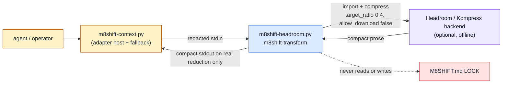

# Headroom adapter launcher (`m8shift-headroom.py`)

See the [module index](./README.md).

## Purpose

`m8shift-headroom.py` is a deliberately narrow, offline launcher that lets M8Shift
route already-redacted context through the optional Headroom / Kompress compression
backend. It **owns** exactly one job: read redacted text on stdin, hand it to the
Kompress transform as plain data (never as chat or user messages), enforce offline
guards, and print a compact result to stdout **only** when the backend delivers a
verified reduction. It **does not own** the pen or the relay `M8SHIFT.md` LOCK, any
turn/session state, adapter selection or fallback policy (that lives in
`m8shift-context.py`), local sidecars under `.m8shift/`, model downloads, or the
Kompress model itself. It writes no files and touches no repository code — it is a
pure stdin→stdout filter that fails closed (empty stdout) whenever the backend is
missing, offline model data is unavailable, or the result does not actually shrink.

> Kompress is a real semantic compressor and yields genuine reduction (~45–55%) on
> **prose**; it degrades or errors on shell/log-shaped text, which is why this
> wrapper validates a real token/length reduction and otherwise refuses to emit.
> This launcher is **not** RTK: RTK is a separate, mode-specific *lossy semantic
> filter* (e.g. `rtk err`/`test`/`git-log`) selectable in `m8shift-context.py`, not
> a compressor, and has no standalone compression percentage.

## Ownership diagram



Legend:

| Color | Meaning |
|-------|---------|
| Blue | executable module (this script) |
| Green | generated local state — **none**; this module writes no files |
| Red | relay `M8SHIFT.md` LOCK authority — **never touched** by this module |
| Amber | human or agent actor / caller |
| Purple | optional external compression backend (installed separately) |

The data flow is stdin → wrapper → optional Kompress backend → stdout. There is no
green local-state node because the module persists nothing, and the red LOCK node is
shown only to state explicitly that this launcher never reads or writes it.

## Command surface

| Command | Mutates | Reads | Writes | Notes |
|---------|---------|-------|--------|-------|
| `python3 m8shift-headroom.py m8shift-transform <mode>` | read-only (no file writes) | stdin (≤ 2 MiB) | stdout only | forces offline env + blocks sockets, redacts secrets, calls Kompress `compress(..., target_ratio=0.4, allow_download=False)`; prints compact text only on a verified reduction, else empty stdout |
| `python3 m8shift-headroom.py --version` | read-only | none | stdout | prints `m8shift-headroom.py 3.58.0` |
| `python3 m8shift-headroom.py --help` | read-only | none | stdout | argparse usage; the subcommand is required |

`<mode>` is a required positional argument. In normal operation `m8shift-context.py`
supplies it by expanding `$M8SHIFT_ADAPTER_MODE` in the configured adapter command
`["m8shift-headroom", "m8shift-transform", "$M8SHIFT_ADAPTER_MODE"]`; the wrapper
itself only forwards the string into the Kompress prompt as
`m8shift_headroom_mode=<mode>`.

## Inputs and outputs

**Files read:** none. Input is stdin only, bounded to `MAX_STDIN_BYTES` = 2 MiB
(2·1024·1024); anything larger fails closed. Empty/whitespace-only stdin also fails
closed.

**Files written:** none. Output is stdout only, capped at `MAX_STDOUT_CHARS` =
200,000 characters (excess is truncated with a `[m8shift-headroom: output
truncated]` marker). A trailing newline is appended. Diagnostics go to stderr with a
`m8shift-headroom:` prefix and never include stdin or dependency output.

**Python imports:** `headroom.transforms.kompress_compressor`
(`KompressCompressor`, `KompressConfig`) from the active Python environment — this is
the optional adapter, resolved via the normal module path (e.g. `PYTHONPATH`).

**Environment variables:** the wrapper does not consume env vars for configuration;
instead it **forces** an offline set before importing/running Headroom:
`HEADROOM_OFFLINE=1`, `HF_HUB_OFFLINE=1`, `HF_DATASETS_OFFLINE=1`,
`TRANSFORMERS_OFFLINE=1`, `HF_HUB_DISABLE_TELEMETRY=1`. It also installs a socket
guard that raises `NetworkBlocked` on any `connect`/`create_connection`/`getaddrinfo`
during the transform.

**Processing:** stdin is passed through `conservative_redact` (strips `bearer`
tokens and `api_key`/`token`/`secret`/`password` assignments) as defense-in-depth,
even though callers send already-redacted context. The result is only accepted if
token counts show `compressed < original`, or — when the backend exposes no counts —
if the compact output is under 90% of the redacted length.

**Exit behavior:**

| Code | Meaning |
|------|---------|
| `0` | success — verified reduction; compact text on stdout |
| `69` | `HeadroomUnavailable` or `NetworkBlocked` (EX_UNAVAILABLE): backend missing/unimportable, compression failed, network attempted, input empty/over-limit, or no real reduction. Empty stdout. |
| `70` | any other unexpected exception (EX_SOFTWARE); fails closed, no stdin/dependency echo |
| `2` | argparse usage error (missing/unknown subcommand) |

(The `return 64` fallthrough in `main` is defensive and effectively unreachable
because the subparser is `required=True`.)

## Safe examples

```bash
# safe — print the wrapper version, no I/O beyond stdout
python3 m8shift-headroom.py --version
```

```bash
# safe — fail-closed demonstration: with no Headroom/Kompress installed, the wrapper
# writes nothing to stdout, blocks the network, and exits 69 (EX_UNAVAILABLE)
printf 'decision: keep the offline wrapper\n' \
  | python3 m8shift-headroom.py m8shift-transform report; echo "exit=$?"
```

```bash
# requires-optional-adapter — real compression path (installed via
# install.sh --with-headroom); prints compact prose only on a verified reduction
printf 'long redacted prose about decisions, paths, and findings ...\n' \
  | python3 m8shift-headroom.py m8shift-transform report
```

```bash
# illustrative — how m8shift-context.py invokes the adapter; mode comes from
# $M8SHIFT_ADAPTER_MODE, redacted context arrives on stdin
m8shift-headroom m8shift-transform "$M8SHIFT_ADAPTER_MODE" < redacted_context.txt
```

## Failure modes

- **`Kompress unavailable (<ExcType>)` → exit 69.** The `headroom` package is not
  importable. Install the optional adapter (`install.sh --with-headroom`) or let
  `m8shift-context.py` fall back to its next backend.
- **`Kompress compression failed (<ExcType>)` → exit 69.** The backend imported but
  raised while compressing (e.g. missing `onnxruntime`/`torch`, or non-prose
  shell/log input Kompress cannot compress). Fails closed; context host falls back.
- **`network disabled for offline Headroom wrapper` → exit 69.** A dependency tried
  network I/O; the socket guard blocked it. Ensure the Kompress model is preloaded
  locally at install time (`ensure_background_download`) so no runtime download is
  needed.
- **`empty stdin` / `stdin exceeds wrapper limit` → exit 69.** Input was empty or
  exceeded 2 MiB. Trim the context before piping.
- **`headroom did not reduce token count` / `did not reduce compact length` → exit
  69.** The backend returned output that is not actually smaller; the wrapper refuses
  to emit a non-reducing result so callers never pay for a worse payload.
- **`headroom wrapper failed (<ExcType>)` → exit 70.** An unexpected error; stdin and
  dependency output are never echoed.

**Recovery:** every failure path leaves stdout empty and exits non-zero, so
`m8shift-context.py` treats it as an adapter miss and automatically falls back to its
next configured backend (an RTK filter mode, or plain/`none`). No manual recovery is
needed for the pipeline; to actually enable compression, install the optional
Headroom/Kompress adapter and preload its offline model.

## Related RFCs and tests

Owning / directly relevant RFCs:

- [RFC 034 — Companion adapter interface](../rfc/034-rfc-companion-adapter-interface.md) (adapter contract, allowed programs, argv-only invocation)
- [RFC 037 — Agent context compression backends](../rfc/037-rfc-agent-context-compression-backends.md) (Headroom/Kompress as a compression backend)
- [RFC 042 — Compression backend routing](../rfc/042-rfc-compression-backend-routing.md) (when this launcher is selected vs. RTK/none)
- [RFC 045 — Module reference executable examples](../rfc/045-rfc-module-reference-examples.md) (this page's template and drift checks)

Implementation tests:

- [`tests/test_m8shift_headroom.py`](../../../tests/test_m8shift_headroom.py) — version surface, offline-env + socket-block enforcement, non-user-message framing, conservative redaction, fail-closed on import error / missing backend / no reduction, and supported result shapes.
- [`tests/test_m8shift_context.py`](../../../tests/test_m8shift_context.py) — adapter selection and fallback around this launcher in the context host.
