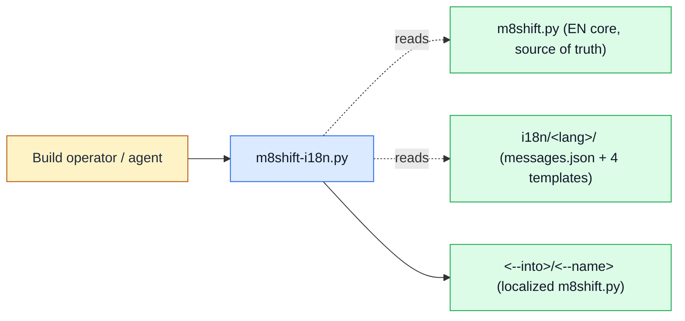

# I18n builder (`m8shift-i18n.py`)

See the [module index](./README.md).

## Purpose

`m8shift-i18n.py` **owns language-pack build and script generation**: it validates translation packs under `i18n/<lang>/` and splices the English-only core (`m8shift.py`) together with the chosen packs into one self-contained, localized `m8shift.py`. It does **not** own the authored pack content (translators write `messages.json` and the four template bodies), it does **not** own runtime language *selection* (the built file's `--lang` / `$M8SHIFT_LANG` picks among the bundled languages at run time), and it never touches the relay pen/LOCK, session state, or `.m8shift/` — it is a pure, deterministic build tool that reads inputs and emits one file. The English core stays the source of truth for message keys and structure; each rebuild from the same inputs is byte-identical.

## Ownership diagram



Legend:

| Color | Meaning |
|-------|---------|
| Blue | executable module |
| Green | generated local state / build inputs and outputs |
| Red | relay LOCK authority (not touched by this module) |
| Amber | human or agent actor |

This module has no red node: it is a build tool and never reads or writes the relay LOCK.

## Command surface

`m8shift-i18n.py` has no subcommands; it dispatches on flags into two modes (check vs. build), plus `--version`.

| Command | Mutates | Reads | Writes | Notes |
|---------|---------|-------|--------|-------|
| `python3 m8shift-i18n.py --check LANG` | read-only | `m8shift.py` (EN core), `i18n/<LANG>/messages.json` + `protocol.md`/`stanza.txt`/`seed.txt`/`bridge.txt` | none | validates one pack and exits; prints `pack 'LANG': OK`; non-zero with a bulleted diagnostic on any defect |
| `python3 m8shift-i18n.py --langs fr,es [--into DIR] [--name FILE]` | repository code (generated build artifact) | `m8shift.py` (EN core), `i18n/<lang>/*` for each requested lang | `<DIR>/<FILE>` (default `./m8shift.py`, mode `0755`) | builds one self-contained localized script; codes are de-duplicated and sorted; empty `--langs` writes an EN-only copy; deterministic (byte-identical rebuild) |
| `python3 m8shift-i18n.py --version` | read-only | none | none | prints `m8shift-i18n.py 3.59.0` |

`Mutates` classifies file effects only: `--check` and `--version` are read-only; a build writes a generated `.py` file (project/repository code) into the operator-chosen `--into` directory. Nothing here is external — no network or external service is contacted.

## Inputs and outputs

**Files read**
- `m8shift.py` (the EN core, resolved next to the script) — imported to read the ordered `MESSAGES["en"]` keys/values (English fallback), plus `PROTOCOL`, `KNOWN_LANGS`, and `LANGS`.
- For each requested language, `i18n/<lang>/`:
  - `messages.json` — a subset of the EN message keys, each value format-safe against the EN placeholders.
  - `protocol.md`, `stanza.txt`, `seed.txt`, `bridge.txt` — the four required non-empty template bodies (`PROTOCOL`, `STANZA`, `COWORK`/seed, `BRIDGE` families).

**Files written**
- Build mode only: `<--into>/<--name>` (default `./m8shift.py`), set executable (`0755`). `--into` is created if missing. `--check` and `--version` write nothing.

**Environment variables**
- None are honored by the builder. (`$M8SHIFT_LANG` is a *runtime* selector consumed by the *built* `m8shift.py`, not by this build tool.)

**Exit behavior** — exits non-zero (via a `m8shift-i18n:` message, or an `AssertionError` on a round-trip failure) when:
- `--name` is not a plain file name (contains a path separator, `os.altsep`, or is absolute);
- a pack directory is missing, or a pack is invalid (`--check` failures listed below);
- a requested language is already bundled in the EN core, or is not in `KNOWN_LANGS` (`en, fr, es, it, de, pt, ja, ru, zh-cn`);
- the spliced file fails to compile cleanly (compilation warnings are promoted to errors);
- a required splice anchor is not present exactly once in the core;
- an injected constant does not round-trip byte-for-byte against its pack body, or `LANGS` is not `("en", *langs)`;
- the resolved output path escapes `--into`.

On success it prints `wrote <path>  (languages: en, ...)` and exits `0`.

## Safe examples

```bash
# safe — validate the French pack against the EN core; read-only, prints "pack 'fr': OK"
python3 m8shift-i18n.py --check fr
```

```bash
# safe — print the builder version and exit
python3 m8shift-i18n.py --version
```

```bash
# mutates-local-state — build an en+fr+es localized m8shift.py into a throwaway dir
python3 m8shift-i18n.py --langs fr,es --into ./out
```

```bash
# illustrative — build en+fr, then run the built file selecting French at runtime
python3 m8shift-i18n.py --langs fr --into ./out
python3 ./out/m8shift.py --lang fr status
```

## Failure modes

- **`--name must be a plain file name, not a path`** — you passed something like `../m8shift.py` or an absolute path. Pass a bare file name; the destination directory is `--into`.
- **`pack not found: <dir>`** — `i18n/<lang>/` does not exist. Create the pack (or check the language code).
- **`pack '<lang>' invalid:`** followed by bullets — `--check` found defects. Common ones:
  - *`messages.json missing` / `invalid JSON`* — add or fix the JSON.
  - *`unknown message keys (not in EN)`* — the pack defines keys the EN core doesn't; remove them (the EN core is the key authority).
  - *`message 'k' is not format-safe`* — a translated value renamed/added a `{placeholder}` or left a stray brace, so `tr(...).format(...)` would raise at run time; match the EN placeholders exactly.
  - *`<file> missing or empty`* — all four template bodies are required and non-empty.
  - *`<file> contains a triple-quote sequence`* / *`ends in an odd run of backslashes`* — the body would break or escape the emitted `"""…"""` constant; remove the `"""` / balance the trailing backslashes.
  - *`stanza.txt must use the {begin}/{end} marker placeholders`* / *`inlines a structural marker`* — the stanza is a `str.format` template; use `{begin}`/`{end}`, never literal `M8SHIFT:LOCK`/`M8SHIFT:STANZA`/`COWORK:` markers.
  - *`<file> is not a safe str.format template`* — a stray or literal brace in a `str.format` body; escape it as `{{`/`}}` or use an allowed placeholder.
- **`core already bundles '<lang>'`** — the EN core must stay English-only; do not rebuild against a core that already contains that language.
- **`'<lang>' is not in KNOWN_LANGS`** — add the code to `KNOWN_LANGS` in the core first, or correct the code.
- **`built file failed to compile cleanly`** — the spliced result did not compile (or raised a warning-as-error); usually a malformed template body that slipped past `--check`.
- **`expected exactly one anchor '…', found N`** — the core's splice anchors changed or duplicated; the builder and core are out of step.
- **`… round-trip` (AssertionError)** — an injected constant does not equal its pack body byte-for-byte; indicates a splice bug, not a user error.
- **`output path escapes --into`** — the resolved output (via a symlink or `..`) lands outside `--into`; point `--into`/`--name` inside the intended directory.

Recovery: run `--check <lang>` on each language first to isolate pack defects before building — the build re-runs the same validation per language, so a clean `--check` is a prerequisite for a clean build.

## Related RFCs and tests

- Owning RFC: [RFC 003 — i18n packs](../rfc/003-rfc-i18n-packs.md) (pack layout, EN-only core, build/inject model).
- Documentation RFC: [RFC 045 — Module reference executable examples](../rfc/045-rfc-module-reference-examples.md) (this page's template).
- Context: [RFC 023 — Agent token footprint](../rfc/023-rfc-agent-token-footprint.md) (why localized builds stay a single self-contained file).
- Tests: [`tests/test_m8shift.py`](../../../tests/test_m8shift.py) — class `TestInjector` (`test_all_repo_packs_pass_check`, `test_pack_messages_are_format_safe`, `test_multi_language_build_and_run`, `test_name_rejects_path_escape`, `test_output_name_must_stay_inside_output_dir`); `InjectedFRBase` builds an en+fr file via `m8shift-i18n.py` for the localized-runtime suite; `test_i18n_packs_remain_whole` and `test_prompt_guardrails_are_present_in_core_and_packs` guard pack integrity.
