# Runtime companion (`m8shift-runtime.py`)

See the [module index](./README.md).

## Purpose

`m8shift-runtime.py` is the optional, host-side runtime companion for the core relay. It **owns** the local, advisory sidecar surface under `.m8shift/`: per-agent **presence** lanes (`watch`), the **operator inbox** (`operator`), **long-turn progress** notes (`progress`), **turn-ready/stale/blocked/done notifications** (`notify`, with `stdout`/`file`/`bell`/`os`/`hook` tiers), bounded read-only peer **consultations** (`consult`), the **provider/agent registry** (`providers`) with the RFC 073 vendor-neutral **agent-CLI adapter registry** behind every managed launch (`m8shift.agent-cli-adapter.v1` — provider-keyed `launch_argv`/`stop`/`resume`/`health` dispatch), RFC 072 exact-identity **fleet bootstrap and reconciliation** (`fleet`) extended by the RFC 073 slice-2 **detached durable control plane** (`fleet supervise --detach`, persisting crash-consistent records under `.m8shift/runtime/fleet/`), **advisory model/task routing** (`route recommend`), **local approval** records (`approve`), **run reports** (`report`), **bounded JSONL retention** (`retention`), **role/workflow contracts** (`roles`/`workflows`), the RFC 047 **headless listener lifecycle** (`listener start/stop/status/logs` — supervising `examples/headless_runner.py` lanes), and read-only **headroom** estimation and **doctor** diagnostics. It does **not** own the pen: it never edits `M8SHIFT.md` or the LOCK directly; fleet enrollment is explicitly holder-attributed and delegates each mutation to core `roster add`. A consultation is a one-shot provider subprocess at the pinned physical project root, never a relay turn: it cannot claim, append, release, complete, or derive authority from `WORKING_*`. The listener is a **supervisor, not a routing authority**: it polls the LOCK read-only, launches at most one bounded runner turn per wake, and the runner *child* performs the normal relay workflow (`claim --refresh` TTL extension, `append`) through the core. Since RFC 049 PR B, an EXPLICITLY LAUNCHED listener additionally makes two bounded core argv calls while its child turn is alive — `claim <agent> --refresh` near TTL/2 (TTL extension + audit-only beat) and `heartbeat <agent> --source runtime-listener --cadence-seconds N` (the PROTECTIVE beat) — and still never plain-claims, force-claims, appends, releases or completes; all pen authority and binding checks stay in `m8shift.py`. It reads the relay state through `m8shift.py` (subprocess `status --json` / imported helpers) and delegates any pen action — roster enrollment, a `headroom --checkpoint` session report, or a `headroom --pause-on` pause — back to the core so the LOCK stays single-owner. It performs no network mutation; the only external calls are best-effort OS-notifier/hook subprocesses under the `os`/`hook` notify tiers, an explicitly invoked consult child, the runner/provider child a listener wake launches, and — for the `launchd`/`systemd`/`windows` listener and detached fleet-supervisor backends — explicit bounded argv calls to the local service manager (`launchctl`/`systemctl`/`schtasks`/`taskkill`); all of these are host-local processes, never a network service.

## Ownership diagram

```mermaid
flowchart LR
    user["Operator / agent"]:::actor
    script["m8shift-runtime.py"]:::script
    core["m8shift.py (core relay)"]:::script
    presence[".m8shift/runtime/presence.json"]:::state
    ledgers[".m8shift/runtime/*.jsonl&#8203;<br/>inbox · progress · runs · approvals"]:::state
    consults[".m8shift/runtime/consults.jsonl&#8203;<br/>digest-only advisory exchanges"]:::state
    notify[".m8shift/runtime/notify/*"]:::state
    registry[".m8shift/providers.json + routing/*.json"]:::state
    adapters["agent-CLI adapter registry&#8203;<br/>m8shift.agent-cli-adapter.v1&#8203;<br/>launch_argv · stop · resume · health"]:::script
    supervisor["fleet supervisor&#8203;<br/>(fleet supervise [--detach])"]:::script
    fleetstore[".m8shift/runtime/fleet/*&#8203;<br/>control.json · lanes/ · sessions/&#8203;<br/>jobs/ (+ attempts) · events.jsonl"]:::state
    listeners[".m8shift/runtime/listeners/*&#8203;<br/>pid · state · backend · service defs&#8203;<br/>+ logs/&lt;agent&gt;-listener.log"]:::state
    runner["examples/headless_runner.py&#8203;<br/>(one bounded turn)"]:::script
    lock["M8SHIFT.md LOCK"]:::lock

    user --> script
    script -- "watch" --> presence
    script -- "operator / progress / approve" --> ledgers
    script -- "consult terminal record" --> consults
    script -- "notify" --> notify
    script -- "providers / route (read)" --> registry
    script -- "managed launch compile (provider-keyed)" --> adapters
    script -- "fleet supervise [--detach]" --> supervisor
    supervisor -- "control/lane/session records + events" --> fleetstore
    supervisor -- "stop/resume/health intent" --> adapters
    script -- "listener start/stop/status/logs" --> listeners
    script -. "liveness while child alive: claim --refresh + heartbeat (core argv)" .-> core
    script -. "listener wakes ONE runner turn" .-> runner
    runner -. "claim --refresh / append via core" .-> core
    script -. "status / headroom read relay via core" .-> core
    core -- "sole owner" --> lock
    script -. "headroom --checkpoint / --pause-on delegate to core" .-> core

    classDef actor fill:#fef3c7,stroke:#b45309,color:#1f2937
    classDef script fill:#dbeafe,stroke:#2563eb,color:#111827
    classDef state fill:#dcfce7,stroke:#16a34a,color:#111827
    classDef lock fill:#fee2e2,stroke:#dc2626,color:#111827
```



Legend:

| Color | Meaning |
|-------|---------|
| Blue | executable module |
| Green | generated local state |
| Red | relay LOCK authority |
| Amber | human or agent actor |

The dashed edges are the boundary: the companion never directly **writes** the LOCK — it reads via core helpers/`status --json` (or, for the listener's wake/liveness decisions, its own bounded direct read-only parser) and delegates every mutation (headroom checkpoint/pause, the RFC 049 liveness calls) to `m8shift.py` argv. It never writes `M8SHIFT.md` itself. The runner child owns the normal relay workflow; the explicitly launched listener's own core surface is exactly two bounded liveness argv calls while its child is alive (`claim --refresh` near TTL/2 and the protective `heartbeat` verb, RFC 049 PR B) — it never plain-claims, appends, releases or completes, and it writes the LOCK only through those core verbs, never directly.

## Command surface

`Mutates` classifies FILE mutation only. `read-only` = no writes; `local-state` = writes under `M8SHIFT.*` or `.m8shift/`; no command performs `repository-code` or `external` (network) mutation. (`headroom --checkpoint` is the one exception that reaches project files — it delegates a session-report write to the core. The `listener` service backends additionally register/unregister the generated definition with the *user's* service manager via explicit bounded argv calls — host-local, never network.)

| Command | Mutates | Reads | Writes | Notes |
|---------|---------|-------|--------|-------|
| `init [--agents CSV] [--force] [--json]` | local-state | roster via core (falls back to `claude,codex`) | `.m8shift/README.md`, `roles/*.md`, `workflows/default-code-review.json`, `policies/approvals.md`, `providers.json`, `routing/{models,skills}.json`, `runtime/presence.json`, `runtime/notify.config.json`, `.gitignore` | Scaffolds the optional companion tree; only writes missing files unless `--force`. |
| `watch <agent> [--session S] [--run R] [--interval 5] [--stale-after 300] [--no-progress-warn-after 0] [--no-progress-block-after 0] [--once] [--takeover-stale] [--no-notify] [--json]` | local-state | `M8SHIFT.md` LOCK (via core), `runs.jsonl`/`progress.jsonl`, `notify.config.json` | `runtime/presence.json`, `notify/*` + `notify/log.jsonl` | Advisory one-lane-per-agent presence loop; refreshes presence, emits a resume prompt, and (unless `--json`/`--no-notify`) a notification. Owning a lane held by a *different, fresh* session is refused; `--takeover-stale` only overrides a stale lane. |
| `notify config [--enable stdout,file,bell,os,hook] [--os-preset ...] [--hook-argv ... \| --hook-json ...] [--dedup-window-seconds N] [--show] [--json]` | local-state (config) | `notify.config.json` | `notify.config.json` (only when a flag changes it) | `target=config` edits notification settings; `stdout` is always kept. |
| `notify <agent> --event turn-ready\|stale\|blocked\|done [--message M] [--prompt-file F] [--json]` | local-state | `notify.config.json`, LOCK (via core) | `notify/<agent>.prompt`, `notify/<agent>.event.json`, `notify/log.jsonl` | One-shot notification across configured tiers with dedup; `os`/`hook` tiers spawn a best-effort local subprocess (never `shell=True`), degrading to stdout/file on failure. |
| `operator <agent> --mode followup\|collect\|interrupt\|status [--idempotency-key K] <message>` | local-state | roster via core, `idempotency.jsonl` | `runtime/inbox/<agent>.jsonl`, `idempotency.jsonl` | Queues one operator message with a required-behavior hint; a repeated `--idempotency-key` is ignored. |
| `progress <agent> --run R <message>` | local-state | roster via core | `runtime/progress.jsonl` | Appends one long-turn progress event. |
| `status-runtime [<agent>] [--brief] [--json]` | read-only | core `status --json`, `presence.json`, `inbox/*`, `runs.jsonl`, `progress.jsonl`, headroom inputs, context RTK adapter status | none | Aggregate human/JSON view of relay + runtime sidecars + headroom + surfaced context-pack status. |
| `headroom [<agent>] [--json] [--checkpoint] [--pause-on warning\|high] [--reason R] [--window-status ...] [--window-reason ...] [threshold flags]` | read-only (default); local-state + delegated session-report write with `--checkpoint`/`--pause-on` | `M8SHIFT.md` turns (via core), `runs.jsonl` checkpoints | `runs.jsonl` (checkpoint record) and, via core subprocess, a session report + `pause` | Local proxy estimate of context-window pressure. `--pause-on` requires `<agent>` + `--reason` and delegates the actual pause to `m8shift.py`. |
| `doctor [--json] [--stale-after 300]` | read-only | core status, runtime ledgers/config, providers/routing, fleet-job records, listener state, gitignore | none | Exits `1` on error findings. Includes RFC 047 `listener.*`, RFC 072 `fleet.job_*`, `runtime.stale_state`, and `runtime.rtk_adoption`; never queries a service manager. |
| `consult --from A --to B --brief-file FILE [--timeout 120] [--max-output-bytes 65536] [--save-response PATH]` | local-state | bounded UTF-8 brief, responder provider row, operator denylist | `runtime/consults.jsonl`; optional private response artifact under `runtime/` | One shell-free, process-group-bounded advisory invocation. The provider row must carry an explicit `consult` argv plus structured `sandbox=read_only`, physical-root cwd, literal-prompt, and `sandbox_argv` evidence. Default response sink is stdout; `--save-response` accepts only a non-existing kit-relative path under `.m8shift/runtime/`. |
| `providers init [--agents CSV] [--force]` | local-state | roster via core | `.m8shift/providers.json` | Writes the host-side registry (with opt-in `examples`). Managed Codex/Claude rows expose `model: UNSET`; Gemini rows pin the probed CLI default `gemini-2.5-pro` and require API-key env before launch. |
| `providers list [--json]` / `providers show <agent>` | read-only | `providers.json` | none | Inspect registry entries, including the visible model pin. |
| `providers check [<agent>] [--json]` | read-only | `providers.json`, `os.environ` for `requires_env` | none | Validates argv arrays, modes, env allowlists, model/profile/effort safe tokens, one literal prompt marker, and absence of competing managed flags; exits `1` on any `error`. |
| `providers render <agent> [--prompt P] [--run R] [--json]` | read-only | `providers.json` | none | Selects the platform argv, compiles the provider model/profile/effort flags, then substitutes `$M8SHIFT_*`. Does **not** launch anything; managed Codex/Claude rows fail closed on an absent/invalid/`UNSET` model. |
| `fleet plan\|health --spec FILE [--json]` | read-only | fleet spec, roster, provider registry, exact identity/listener sidecars | none | Validates `m8shift.fleet.spec.v1` (curated template + explicit model only) and reports desired/observed diff or health. |
| `fleet apply --spec FILE --by HOLDER [--json]` | local-state + delegated core mutation | fleet spec, provider templates, live holder via core | exact identity artifacts, provider rows, fleet events; core roster membership through `roster add` | Idempotent fail-closed bootstrap. It never writes the LOCK directly and never creates a shared identity-neutral anchor. |
| `fleet reconcile\|stop\|resume --spec FILE [--backend local] [--runner PATH] [--grace 10] [--dry-run] [--json]` | local-state (`--dry-run` = read-only) | bootstrapped fleet + listener state, durable lane/session records, per-agent usage holds | fleet events, durable lane records, and existing listener sidecars/processes | Batch lifecycle. Stop deliberately preserves membership. Reconciliation refuses any incomplete identity/provider/roster bootstrap and runs the durable start-identity preflight before any process action. |
| `fleet supervise --spec FILE [lifecycle flags] [--poll-interval 20] [--max-ticks 0] [--detach] [--reconcile-control]` | local-state (`--dry-run` = read-only) | fleet plan, all listener lanes, and the durable store (`control.json`, `lanes/*`, `sessions/*`, supervisor pid/backend records) | the crash-consistent `runtime/fleet/` control plane: `control.json`, `lanes/<agent>.json`, `sessions/<ref>.json`, `events.jsonl`, `supervisor.pid`/`.log`/`.backend.json` and — with `--detach` on a service backend — the generated service definition | One durable control-plane process reconciles the declared lanes each tick; it does not claim or append. Startup runs PID start-identity reconciliation (adopt / restart-once / defer-unverified / fail-closed `needs_reconciliation`); SIGTERM/SIGINT persist `state=stopped`; a provably-reused stale `running` pid is taken over. `--detach` installs the single control plane through `launchd`/user-`systemd`/Windows when available, else an honest local detached fallback (no logout/reboot restart guarantee). See the [detached durable control plane](#detached-durable-fleet-control-plane-rfc-073-slice-2) section. |
| `fleet jobs plan --spec FILE [--json]` | read-only | jobs spec + immutable lifecycle records | none | Shows ordered state; provider exit is never completion. |
| `fleet jobs submit --spec FILE --by INTEGRATOR [--json]` | local-state | live holder + jobs spec | immutable batch/per-job specs + fleet event | The live holder must be the declared integrator; changed retries fail closed. |
| `fleet jobs assign --spec FILE --by INTEGRATOR [--json]` | local-state + delegated worktree mutation | immutable jobs, live holder, ownership | assignment records + RFC 008 producer worktrees | At most two active isolated lanes, one per producer, never the target branch. |
| `fleet jobs attempt --id ID --by PRODUCER --provider-exit N [--json]` | local-state + verification subprocess | immutable job + worktree | immutable attempt plan/result + fleet event | Success requires provider exit zero and the exact shell-free recipe to exit zero in the worktree. |
| `fleet jobs integrate --id ID --by INTEGRATOR --to AGENT [--json]` | delegated merge/core handoff/drop + local-state | verified evidence, relay designation, ownership | integration records + RFC 008 merge/handoff/drop | Producers cannot self-integrate; only the designated integrator can serialize the merge, handoff, and removal. |
| `route recommend --task-type T [--skill S] [--input-tokens 0] [--self MODEL] [--json]` | read-only | `routing/models.json`, `routing/skills.json` | none | Advisory: recommends the cheapest model clearing the floor/capabilities/context and returns the declarative effort, or fail-safes to the pen holder. Never launches; exits `1` on manifest error. |
| `roles list [--json]` / `roles show <name>` | read-only | `.m8shift/roles/*.md` | none | Behavioral role contracts. |
| `workflows list [--json]` / `workflows show <name>` | read-only | `.m8shift/workflows/*.json` | none | Local workflow definitions. |
| `approve <run> <gate> --by X --decision approved\|rejected\|waived [--reason R]` | local-state | — | `runtime/approvals.jsonl` | Appends one local human/agent approval record. |
| `report <run> [--json] [--write]` | read-only (default); local-state with `--write` | `runs.jsonl`, `progress.jsonl`, `approvals.jsonl` | `.m8shift/runs/<run>/report.md` (only with `--write`) | Summarizes one run id. |
| `retention prune [--keep 1000] [--no-archive] [--json]` | local-state | all runtime JSONL ledgers | rewrites each ledger to the last N rows; appends pruned rows to `runtime/archive/` unless `--no-archive` | Fixed-row-cap prune. |
| `retention apply [--dry-run] [--no-archive] [--json]` | local-state (no-op unless policy present + enabled) | `runtime/retention.json`, ledgers | pruned ledgers + `runtime/archive/` | Applies the opt-in retention policy; exits `1` on policy error. |
| `retention policy show [--json]` | read-only | `runtime/retention.json` | none | Shows the effective policy (`absent`/`configured`/`malformed`); exits `1` on policy error. |
| `listener start --agent A (--cmd-file F \| --provider \| --notify-only) [--backend auto\|local\|launchd\|systemd\|windows] [--dry-run] [--foreground] [--restart] [--poll-interval 20] [--max-ticks 0] [--max-retries 3] [--max-backoff 300] [--runner PATH] [--service-payload]` | local-state (`--dry-run` = read-only) | LOCK fields (direct read-only parse), target usage hold, optional provider profile, listener sidecars, `runs.jsonl` | `runtime/listeners/<A>.pid` + `<A>.json` + optional backend/log files | RFC 047 supervisor. Provider-backed invokers accept `mode=headless/hybrid` and the legacy local-execution alias `mode=local`; only `mode=interactive` fails with stable cause `provider_mode_interactive` before PID/state/provider work. `--notify-only --provider` still validates the registry row but skips this invocation-mode gate because it launches no provider. Notify-only reuses the same durable lifecycle and configured local notification tiers while setting `can_invoke_agent=false`, `can_notify=true`; it never launches a runner and human reactivation remains required. |
| `listener stop --agent A [--grace 10]` | local-state | `<A>.pid`, `<A>.backend.json` | removes `<A>.pid` (only after confirmed death) + the generated service definition and backend record | TERM the **whole process group**, wait `--grace` seconds, then KILL (Windows: `taskkill /PID <pid> /T /F`, never POSIX signals). Also runs the recorded service-manager uninstall argv steps and deletes the generated definition (path-contained to `runtime/listeners/`), even when no process was left to kill. Exits `1` if the pid survives TERM/KILL (pid file kept for inspection). |
| `listener status --agent A [--json] [--repair]` | read-only (`--repair` may remove a stale pid file) | `<A>.pid`/`<A>.json`/`<A>.backend.json`; read-only service-manager query when the recorded backend matches the host | `<A>.pid` removal only with `--repair` on a **stale** pid | Renders lifecycle state plus separate `process_resident`, `can_invoke_agent`, `can_notify`, and `survives_parent_exit` evidence. `--repair` never touches a live listener. |
| `listener logs --agent A [--tail 50]` | read-only | `runtime/logs/<A>-listener.log` | none | Prints the last N log lines; exits non-zero when no log exists for the agent. |

## Adapter registry (`m8shift.agent-cli-adapter.v1`)

Since RFC 073 slice 1, every managed provider launch dispatches through a formal, provider-keyed **agent-CLI adapter registry** inside this companion. An adapter implements four lifecycle methods plus the separately gated consult compiler and returns **normalized intent/observation data only** — process creation, signalling, retry, persistence, and relay verification stay in the generic runner/supervisor, and an adapter never gains relay authority:

| Method | Contract |
|--------|----------|
| `launch_argv(row, prompt, run_id, platform)` | compiles one shell-free argv array; managed model/profile/effort/identity fields come only from the validated `providers.json` row, spliced at the single literal `$M8SHIFT_PROMPT` marker |
| `stop(process_ref, mode)` | returns a normalized `graceful`/`force` **intent** with the process-group strategy; the generic supervisor performs the actual termination |
| `resume(row, prompt, session_ref, ...)` | renders a resume attempt only when the adapter declares probed resume support; the baseline **fails closed** (`<provider> adapter does not declare resume support`) |
| `health(process_ref, session_ref)` | returns a normalized lifecycle observation with `relay_completion` always `false` — an adapter can never imply an authored relay transition |
| `compile_consult(row, prompt, root, ...)` | fails closed unless the row provides a separate consult argv and structured `sandbox=read_only` attestation whose exact evidence occurs in the compiled argv; a closed denylist rejects competing write-capable selectors and the generic layer invents no vendor flag |

Registered adapters in this release:

- **`openai-codex`** — managed; compiles `--profile`/`--model`/`--config model_reasoning_effort=...` plus the exact-identity artifact (`--config developer_instructions=...`) from the validated row. **Byte-identical** to the pre-registry launch compiler (conformance fixtures).
- **`anthropic-claude`** — managed; compiles `--model`/`--effort` plus the exact-identity artifact (`--append-system-prompt-file`). **Byte-identical** to the pre-registry launch compiler.
- **`google-gemini`** — a live managed adapter probed against Gemini CLI
  `0.51.0`: `-m/--model`, `-p/--prompt`, and text/JSON output are present; the
  generated API-key-only row pins `gemini-2.5-pro`, requires and allowlists
  `GEMINI_API_KEY`, and tolerates diagnostic stderr independently from stdout.
  Health reports installed/probed version evidence but never relay completion.
  Native resume remains fail-closed: the probed `--resume` accepts only a
  project-local index or `latest`, not M8Shift's opaque bound session ref.
- **`mistral-vibe`** — a source-validated declarative stub based on upstream
  Mistral Vibe 2.20.0. Generated/example rows use `vibe -p PROMPT`, require and
  allowlist `MISTRAL_API_KEY`, and point to the confirmed `AGENTS.md` project
  anchor. It is deliberately not managed/live: health stays `unknown`, resume
  fails closed, and a local version/capability probe is required before
  promotion.

Dispatch is keyed solely by the row's `provider`; an **unknown provider retains the existing explicit declarative-argv behavior** (the safe baseline adapter). Registering a new provider requires no generic call-site or core change — `register_adapter` validates the provider key and refuses duplicates. The interface never executes a shell string, never persists or prints a raw session reference, never signals a process itself, and never infers relay completion.

Consult argv and its read-only attestation are operator-owned configuration and
therefore part of the operator trust boundary, not cryptographic proof about a
provider. The compiler verifies exact evidence and rejects a closed set of known
competing write selectors, but operators must still audit provider-specific argv
when provisioning or changing a consult policy.

## Detached durable fleet control plane (RFC 073 slice 2)

`fleet supervise` is the single RFC 072 control plane; RFC 073 slice 2 makes it **durable**. It persists schema-versioned, project/identity/provider/model-bound records with fsync + atomic replace under the git-ignored store:

```text
.m8shift/runtime/fleet/
  control.json                 # m8shift.fleet.control.v1 — supervisor pid + start identity + spec digest + state
  lanes/<agent>.json           # m8shift.fleet.lane.v1 — per-lane pid, start ref, session ref, desired, status
  sessions/<ref>.json          # m8shift.fleet.session.v1 — opaque, project/agent/adapter/model-bound
  jobs/<job-id>/*              # immutable RFC 072 job/assignment/attempt/integration evidence
  events.jsonl                 # append-only fleet event journal
  supervisor.pid · supervisor.lock · supervisor.log · supervisor.backend.json
  (+ the generated service definition with `--detach` on a service backend)
```

Startup reconciles the store against **PID start identity** (Linux: boot-id + `/proc` start tick; other POSIX: `ps -o lstart=`; Windows: the process-creation time via the Win32 API) before any process action, partitioning every lane four ways:

| Persisted ref vs live probe | Outcome |
|-----------------------------|---------|
| both known and **equal** | **adopt** the exact live survivor — no launch, no signal |
| both known and **differing** | the pid was provably reused — **restart** a missing desired-running lane exactly **once** |
| persisted ref known, probe failed this tick | **defer** — adopt unverified, no lifecycle action, re-verify on a later tick |
| live pid, **empty** persisted ref | can never self-verify — **fail closed** to `needs_reconciliation` (recorded visibly; never a duplicate launch) |

The same identity logic protects the supervisor itself: SIGTERM/SIGINT are converted into a clean shutdown that persists `state=stopped`; after a reboot that left `control.json` at `running`, a provably-reused pid is **taken over** instead of crash-looping under a native KeepAlive unit, while an unverifiable identity refuses a possible second supervisor until `--reconcile-control` confirms the previous one is stopped. `fleet stop` clears a provably-dead supervisor's control. Adapter `health`, optional `resume` (with fresh-listener reconstruction as the mandatory fallback), and process-group `stop` intent mediate lane lifecycle through the registry above, and active per-agent usage holds are checked before any launch.

`fleet supervise --detach` installs this one control plane through the **existing listener backend seam** — a launchd LaunchAgent, a user `systemd` unit, or a Windows service definition (`native-service` durability tier, `native-on-failure` restart policy) — and otherwise starts an **honest local detached fallback** that prints exactly what it guarantees: it survives frontend/terminal exit but offers **no logout/reboot restart guarantee**. Backend selection reuses the `M8SHIFT_LISTENER_BACKEND_PROBE` seam, so deterministic tests never touch a real service manager. The relay stays portable and authoritative if the ignored store is deleted; only local orchestration history is lost.

Slice 2C serializes the startup guard with `supervisor.lock` (`O_EXCL`), and a
local detached parent reports success only after the child publishes verifiable
running control. `fleet resolve --spec FILE (--lane AGENT | --control) --by NAME
--reason TEXT [--resolution stopped|restart]` is the sole explicit repair path
for ambiguous durable state. It records `fleet.operator_resolved`; it never
signals an ambiguous PID. A desired-running lane resolved as `restart` is cleared
to stopped and starts once on the next reconciliation after the operator confirms
the prior process is gone.

## Inputs and outputs

**Files read**

- `M8SHIFT.md` — the LOCK/roster: most companion reads go through `m8shift.py` (`status --json` subprocess or imported `load_or_die`/`get_lock`/`active_agents`); the listener's wake/liveness decisions use its own bounded direct read-only parser. Neither path grants authority.
- `.m8shift/runtime/*` — `presence.json`, `runs.jsonl`, `consults.jsonl`, `progress.jsonl`, `approvals.jsonl`, `idempotency.jsonl`, `inbox/<agent>.jsonl`, `notify.config.json`, `notify/log.jsonl`, `usage-watchers/<agent>.json`, `retention.json`.
- `.m8shift/providers.json` and `.m8shift/routing/{models,skills}.json` — registry and advisory routing manifests. The generated skills manifest carries a five-class provider-neutral table: `mechanical-edit` (economy→balanced, low), `documentation-edit` (balanced, medium), `implementation` (balanced→flagship, high), `review-critique` (balanced→flagship, high), and pinned `adversarial-verify` (flagship, xhigh). It is price-free and advisory only (`launch=false`); RFC 066 remains separate.
- `.m8shift/providers/*.json` — operator-owned `m8shift.listener.profile.v1` listener profiles (argv array, `cwd`, `env_allowlist`, `start_on_idle`); scanned for the at-most-one-starter guard and `doctor`.
- `.m8shift/runtime/listeners/<agent>.pid` / `<agent>.json` / `<agent>.backend.json` and `.m8shift/runtime/logs/<agent>-listener.log` — listener process, state, backend-record, and log sidecars (`listener status/logs`, `doctor`).
- `.m8shift/runtime/fleet/jobs/*` — immutable job, assignment, attempt, integration, and completion evidence used by `fleet jobs` and `doctor`.
- `.m8shift/runtime/fleet/control.json`, `fleet/lanes/<agent>.json`, `fleet/sessions/<ref>.json`, `fleet/supervisor.pid`/`supervisor.backend.json` — the durable control-plane records read strictly (absence is distinct from corruption; a corrupt or half-written record fails closed) by the `fleet` lifecycle commands.
- For the listener loop only: the `M8SHIFT.md` LOCK fields, parsed **read-only** to decide sleep vs wake — a missing or invalid relay is neutral (the loop waits; it never repairs and never launches).
- `.m8shift/roles/*.md`, `.m8shift/workflows/*.json`, `.m8shift/policies/*.md` — contracts scaffolded by `init`.
- `.m8shift/context/adapters/rtk-shell-output.json` and `.m8shift/context/metrics.jsonl` — surfaced read-only by `status-runtime`/`doctor` (owned by the context companion, see the honesty note below).

**Files written** (all under `M8SHIFT.*` / `.m8shift/`, atomically via `os.replace`; JSONL appends use `O_APPEND|O_NOFOLLOW` with symlink rejection and mode `0600`)

- `runtime/presence.json` (`watch`), `runtime/inbox/<agent>.jsonl` (`operator`), `runtime/progress.jsonl` (`progress`), `runtime/approvals.jsonl` (`approve`), `runtime/idempotency.jsonl`, `runtime/runs.jsonl` (`headroom --checkpoint`).
- `runtime/consults.jsonl` (`m8shift.consult.exchange.v1`) contains exactly one terminal advisory record per accepted consult: redacted brief plus digest/bytes, compiled-argv digest (never argv), opaque root fingerprint, sandbox/cwd/prompt attestations, bounds, closed classification, response digest/bytes/truncation, and sink reference. Provider response bodies never enter the ledger. `--save-response` writes the bounded body privately (`0600`) under `runtime/`; stdout remains the default sink.
- `runtime/notify.config.json`, `runtime/notify/<agent>.prompt`, `runtime/notify/<agent>.event.json`, `runtime/notify/log.jsonl` (`notify`).
- `runtime/archive/*` (retention archival), `.m8shift/runs/<run>/report.md` (`report --write`).
- `runtime/fleet/jobs/*` and `runtime/fleet/events.jsonl` — immutable RFC 072 job evidence. Worktree creation/merge/removal is delegated to `m8shift-worktree.py`; relay handoff remains core-mediated.
- `runtime/fleet/control.json`, `runtime/fleet/lanes/<agent>.json`, `runtime/fleet/sessions/<ref>.json` — crash-consistent RFC 073 slice-2 control-plane records (fsync + atomic replace), plus `runtime/fleet/supervisor.pid`/`supervisor.log`/`supervisor.backend.json` and — with `fleet supervise --detach` on a service backend — the generated service definition in the same directory (`fleet supervise`, `fleet reconcile/stop/resume`).
- INDIRECT, core-mediated only (RFC 049 PR B, while a listener's child turn is alive): the LOCK `expires` field (`claim --refresh` near TTL/2) and `.m8shift/holder-heartbeats/<agent>.json` (the protective `heartbeat` verb) — both through bounded `m8shift.py` argv calls, never written by this companion directly.
- `runtime/listeners/<agent>.pid`, `runtime/listeners/<agent>.json` (`m8shift.listener.state.v1`: phase `polling`/`backoff`/`halted`, consecutive failures, last run id/classification, `start_on_idle`, runtime version), `runtime/listeners/<agent>.backend.json` (`m8shift.listener.backend.v1`: installed backend, label, service file, uninstall argv steps, last error), and — for `launchd`/`systemd`/`windows` backends — the generated service definition (`<label>.plist` / `<label>.service` / `<label>.task.json`) in the same directory (`listener start/stop`).
- `runtime/logs/<agent>-listener.log` — the listener's loop log, rotated **writer-side at 5 MiB, keeping 3 generations** (`<log>.1`…`<log>.3`, oldest dropped). `runs.jsonl` is explicitly exempt from this rotation: it is the runtime ledger and only the `retention` commands may prune it.
- The `init`/`providers init` scaffold set listed in the command table, plus a `.m8shift/.gitignore` marking `runtime/`, `runs/`, `cache/`, `tmp/` as ignored generated state.

**Environment variables honored**

- `M8SHIFT_RTK` — self-declared `on`/`off` (accepts `1/true/yes/on/enabled/rtk` and `0/false/no/off/disabled/native`), recorded into the presence row's `rtk` field. Any other value warns and is treated as `off`.
- `CI` — forces headless behavior: the `bell`, `os`, and `hook` notification tiers are skipped (also skipped when stdout is not a TTY).
- Provider entries may declare `requires_env`; `providers check` verifies those names exist in `os.environ`.
- `M8SHIFT_DENYLIST` (or the RFC 052 default config path) redacts protected terms from the durable consult brief; credential-shaped values are also redacted. The original brief is sent only to the explicitly selected local provider subprocess.
- Provider-backed managed launches pass the validated row model to the runner as
  `--agent-model`; the runner records it in the immutable plan and injects
  `M8SHIFT_AGENT_MODEL` directly into the child environment, overriding a
  conflicting ambient allowlisted value. RFC 056 attribution remains unverified.
- `M8SHIFT_LISTENER_BACKEND_PROBE` — JSON object overriding the backend-probe facts (`platform`, `launchctl`, `systemctl`, `schtasks`, `gui_session`, `user_session`, `protected_folder`); a test/debug seam so backend selection never has to touch a real service manager. An invalid value exits on `listener start` and becomes a `listener.backend_probe` warning in `doctor`.
- `M8SHIFT_LISTENER_LOG_MAX_BYTES` — overrides the 5 MiB listener-log rotation threshold (invalid/non-positive values fall back to the default).
- `M8SHIFT_LISTENER_DETACHED` — internal marker set on the detached child so the loop knows it owns its log/pid files; not for operator use.

**Exit behavior**

- Precondition/validation failures call `sys.exit("m8shift-runtime: <message>")` → message to stderr, non-zero exit (e.g. bad `--interval`, unknown notify tier, unsafe session/run id, a lane owned by a fresh different session without `--takeover-stale`, `--pause-on` without `<agent>`/`--reason`).
- `watch` returns `2` when the `--no-progress-block-after` threshold trips (companion loop blocked); `0` on `--once`; otherwise it loops.
- `doctor`, `providers check`, `route recommend`, `retention apply`, `retention policy show` return `1` when an `error`-severity finding is present, else `0`.
- `providers render` exits non-zero if the entry is missing, invalid, has no argv,
  or is a launchable managed Codex/Claude row without a valid model pin.
- `listener start` exits non-zero on an invalid agent/flags/profile, a live listener without `--restart`, a second IDLE starter, a missing runner script, or a failed **required** service-manager install step (the error is persisted in `<agent>.backend.json` for `doctor`). The supervising loop itself returns `0` when the relay reaches `DONE` or `--max-ticks` is hit. `listener stop` returns `1` when the pid survives TERM/KILL; `listener logs` exits non-zero when the log is missing. All other commands return `0` on success.

## Safe examples

```bash
# mutates-local-state — scaffold the optional companion tree under .m8shift/
python3 m8shift-runtime.py init
```

```bash
# safe — read-only aggregate view of relay + runtime sidecars + headroom (JSON)
python3 m8shift-runtime.py status-runtime --json
```

```bash
# mutates-local-state — append a long-turn progress note for one run
python3 m8shift-runtime.py progress claude --run demo-run "compiled; running tests"
```

```bash
# illustrative — advisory model pick; needs populated .m8shift/routing/*.json,
# prints a recommendation only (never launches a model)
python3 m8shift-runtime.py route recommend --task-type adversarial-verify --input-tokens 8000
```

```bash
# safe — validate the listener profile and print the full launch plan (backoff
# ladder, runner argv preview, rendered service definition); writes NOTHING
python3 m8shift-runtime.py listener start --agent codex \
  --cmd-file .m8shift/providers/codex.json --dry-run
```

```bash
# mutates-local-state — supervise one headless lane (detached local backend),
# inspect it, then stop it (process group + any installed service definition)
python3 m8shift-runtime.py listener start --agent codex --cmd-file .m8shift/providers/codex.json
python3 m8shift-runtime.py listener status --agent codex --json
python3 m8shift-runtime.py listener logs --agent codex --tail 20
python3 m8shift-runtime.py listener stop --agent codex
```

```bash
# pure plan, holder-attributed bootstrap, then one fleet control-plane loop
python3 m8shift-runtime.py fleet plan --spec fleet.json --json
python3 m8shift-runtime.py fleet apply --spec fleet.json --by codex
python3 m8shift-runtime.py fleet supervise --spec fleet.json
```

```bash
# safe — plan the DETACHED durable control plane (selected backend, durability
# tier, rendered service definition); writes NOTHING and installs nothing
python3 m8shift-runtime.py fleet supervise --spec fleet.json --detach --dry-run --json
```

## Failure modes

- **`lane '<agent>' is already owned by session '<x>'; rerun with --takeover-stale only after it is stale`** (`watch`) — a second managed runtime is claiming a live lane. Use a distinct `--session`, or wait; only pass `--takeover-stale` once the other lane is genuinely stale (`--takeover-stale` on a still-fresh lane is also refused).
- **`watch` exits `2`** — the `--no-progress-block-after` window elapsed with no new progress/run event. This is advisory: record progress, inspect `status-runtime`/`doctor`, or ask the operator for a handoff. No automatic force recovery is ever performed.
- **`notify` warnings `runtime.notify_os` / `runtime.notify_hook` … "not found; degraded to stdout/file"** — the configured OS notifier or hook argv[0] is not on `PATH` (or the hook looks like a shell string / has a non-literal placeholder). Notifications still land via `stdout`/`file`; fix the argv or `--os-preset`.
- **`notify suppressed: dedup`** — an identical `agent`+`event` fired inside the dedup window; expected, not an error. Lower `--dedup-window-seconds` if you need it sooner.
- **`unknown agent <a>` / `--by must be an agent/operator name`** — the name is not in the `M8SHIFT.md` roster (or fails the `[a-z][a-z0-9_-]*` shape). Register it through the core first.
- **`unsafe run id` / `unsafe --session value`** — the id contains `/`, `\`, `:`, `.`/`..`, or illegal characters. Use a plain slug.
- **`refusing to append through symlink …`** — a path under `.m8shift/runtime/` is (or traverses) a symlink. The companion refuses to follow it; remove the symlink.
- **`doctor` / `providers check` findings** — `error` severity means a broken registry/manifest/ledger (bad schema, argv-as-string, missing `requires_env`, malformed JSONL) and a non-zero exit; `warning`/`info` (stale presence, missing anchor, no-progress) are advisory. Malformed JSONL/JSON sidecars are reported as diagnostics, never as core relay failures.
- **`runtime.awaiting_unclaimed`** (`doctor`) — the named agent holds a handed-off
  `AWAITING_*` turn without a claim lease. If that agent has started work, it must claim now —
  including for read-only review — so peers receive a visible `WORKING_*` expiry/liveness signal.
- **`route recommend` → "fail-safe to pen-holder"** — the task-type is unknown or no model clears the floor/capabilities/context; routing is advisory and defers to whoever holds the pen rather than guessing.
- **`headroom --pause-on` errors** — missing `<agent>` or `--reason`, or the target is not the holder / not in a pausable state; the pause is delegated to `m8shift.py` and fails loudly rather than touching the LOCK here.
- **`retention apply` prints "no-op"** — `retention.json` is absent or `enabled:false`. Populate and enable the policy, or use `retention prune --keep N` for a one-shot fixed cap.
- **`listener for '<agent>' is already running (pid N); stop it first or rerun with --restart`** — one listener per agent lane. `--restart` replaces the live process *and* clears a persisted halted phase; a stale pid file (process dead) is repaired automatically before start and reported.
- **`listener status` shows `STALE`** — the pid file exists but the process is gone (crash, reboot). Repair with `listener status --repair`, `listener stop`, or a fresh `listener start`; `doctor` reports it as `listener.dead`.
- **`listener status` shows `HALTED`** — the loop hit `--max-retries` consecutive failed turns (`non_completion`/`stuck_working`/`invalid_relay`/infrastructure classes; `external_transition` and `suspended` are neutral and never burn the budget). The halt is **persisted** in `<agent>.json`: it survives process restarts and is honored by OS service managers too (generated definitions use launchd `KeepAlive=false` / systemd `Restart=no`, so nothing resurrects a halted lane). A halted loop stays resident for `status`/`logs` but launches nothing; inspect the logs and the relay, then clear it explicitly with `listener start --restart`. No force-claim is ever attempted — the relay is left for operator recovery.
- **`approval_required:provider_permission_allowlist`** — a bounded provider-output signature was corroborated by both a non-zero provider exit and a failed relay classification. The invocation is terminal after one attempt; raw provider text is never journaled. Adapt `.m8shift/PROVIDER-PERMISSIONS.md` to the provider's documented policy syntax, verify a bounded turn, then restart. Headless/full init profiles scaffold that placeholder-only guide and the generated bootstrap runbook records the audited `request-turn` → operator `steer-turn --force` recovery recipe.
- **`backend <requested> → local: <reason>`** — the requested/auto backend cannot be hosted and the start visibly degrades to the portable local detach. Printed reasons include: `launchctl`/`systemctl`/`schtasks` not available on this host, no GUI session for a launchd LaunchAgent (SSH), no systemd user session (`XDG_RUNTIME_DIR` missing), and — under `auto` only — a project under a macOS protected folder. Semantics never change with the backend; only the lifecycle wrapper does.
- **`listener.protected_folder`** (`doctor`) — the project sits under a macOS TCC-protected user folder (`~/Documents`, `~/Desktop`, `~/Downloads`, iCloud Drive), where a launchd LaunchAgent is often denied access (`Operation not permitted`). `--backend auto` already falls back to `local` there; an **explicit** `--backend launchd` still proceeds as the operator's choice. Use `--backend local` or grant the service access.
- **`listener.backend_failed`** (`doctor` / `listener status` service error) — a required service-manager install step failed; the one-line error is persisted in `<agent>.backend.json` so you can see *why* the service is absent. Fix the reported cause or fall back to `--backend local`.
- **`fleet supervisor already alive (pid N)`** — the control plane is a singleton and the persisted start identity matches the live pid. Stop it (`fleet stop --spec …`) instead of starting a second one.
- **`durable supervisor pid identity is unverifiable; rerun with --reconcile-control after confirming the previous supervisor is stopped`** — the live probe failed this tick or the persisted ref was never recorded, so the companion cannot prove the old supervisor is gone and refuses a possible second one. Confirm it is stopped, then rerun with `--reconcile-control`. (A *provably* reused pid — both refs known and differing — is taken over automatically instead.)
- **`durable lane <agent> … needs_reconciliation`** (also `listener <agent> pid differs from its durable lane` / `requires explicit reconciliation`) — a live pid without, or mismatched against, its persisted start identity. Fail-closed by design: nothing is launched, adopted, or signalled; inspect the lane record and the process, then stop and restart the lane explicitly.

`doctor` emits nine advisory `listener.*` findings (RFC 047 Phase E; all read-only, never repairing):

| Finding | Severity | Meaning |
|---------|----------|---------|
| `listener.not_installed` | warning | an agent is configured for headless use (`providers.json` `mode=headless/hybrid` or a listener profile) but no listener was ever started |
| `listener.dead` | warning | pid file exists but the process is gone |
| `listener.backend_failed` | warning | the installed service backend recorded a failure |
| `listener.protected_folder` | warning | macOS protected-folder project; launchd likely to fail |
| `listener.version_skew` | warning | listener state / core / runner version differs from this companion |
| `listener.repeated_non_completion` | warning | ≥ 2 consecutive failed turns in the state sidecar or a trailing `non_completion` streak in `runs.jsonl` |
| `listener.halted` | warning | a persisted halted phase awaits an explicit `listener start --restart` |
| `listener.multiple_starters` | warning | more than one agent has `start_on_idle=true` |
| `listener.log_too_large` | info | a listener log reached the rotation threshold; the owning listener rotates it at its next write |

Consult provisioning adds two graduated, advisory-only doctor findings. An exact,
byte-identical `providers init` scaffold is an expected fresh-kit state and emits
neither warning. Once the registry differs from that scaffold,
`providers.registry_empty` warns when it has no structurally launchable active row
and names `providers init` plus explicit row configuration as the remedy.
`consult.kit_incomplete` is emitted only for the observed compound condition: that
edited registry has no launchable row **and** the kit has no handshake-compatible
reference runner; its remedy is the canonical `m8shift.py init --profile headless`.
A missing runner alone remains owned by the existing listener preflight and is not
duplicated here. Doctor also validates every `consults.jsonl` row against
`m8shift.consult.exchange.v1` and the closed
`completed|timed_out|launch_refused|provider_failed|invalid_output` classification
enum.

**Honesty note on the surfaced RTK / compression line.** `status-runtime` and `doctor` display a context-adapter status such as `RTK: ON (pinned, compressing packs)` plus a `last pack` `compression_ratio`. These are **read-only surfaces of the context companion's state**, not runtime work: RTK here is the identity-pinned (`sha256`) `rtk-shell-output` adapter, a **mode-specific lossy semantic filter** for shell output (e.g. `rtk err`/`test`/`git-log`) — it is **not** a compressor and has no standalone compression percentage. The `compression_ratio` shown comes from `.m8shift/context/metrics.jsonl`, which the context companion writes for its own prose-compression backend (Kompress/Headroom), and is unrelated to RTK. This module neither compresses nor filters; it only reports what the context companion recorded.

## Related RFCs and tests

- Owning design: [RFC 009 — Runtime companion](../rfc/009-rfc-runtime-companion.md) and [RFC 010 — Runtime patterns](../rfc/010-rfc-runtime-patterns.md).
- Command families: [RFC 014 — Provider management](../rfc/014-rfc-provider-management.md), [RFC 024 — Doctor split](../rfc/024-rfc-doctor-split.md), [RFC 025 — Status-runtime](../rfc/025-rfc-status-runtime.md), [RFC 026 — Sidecar retention](../rfc/026-rfc-sidecar-retention.md), [RFC 027 — Notifications](../rfc/027-rfc-notifications.md), [RFC 039 — Model/task routing](../rfc/039-rfc-model-task-routing.md) and [RFC 043 — Routing principle](../rfc/043-rfc-routing-principle.md), [RFC 040 — AI session usage monitoring](../rfc/040-rfc-ai-session-usage-monitoring.md) and [RFC 036 — Token-window exhaustion](../rfc/036-rfc-token-window-exhaustion.md) (headroom), [RFC 047 — Headless liveness: runner final-state and listener lifecycle](../rfc/047-rfc-headless-liveness-runner-listener.md) (the `listener` family; builds on [RFC 020 — Headless runner hardening](../rfc/020-rfc-headless-runner-hardening.md), [RFC 028 — Headless command templates](../rfc/028-rfc-headless-command-templates.md), and [RFC 046 — Interactive/headless modes](../rfc/046-rfc-interactive-headless-runner-install.md)), [RFC 072 — Exact-identity fleet bootstrap](../rfc/072-rfc-exact-identity-fleet-bootstrap.md) and [RFC 073 — Adapter registry and detached orchestration](../rfc/073-rfc-adapter-registry-detached-durability.md) (the `fleet` family and the agent-CLI adapter registry; build on [RFC 067 — Detached vendor-neutral CLI orchestration](../rfc/067-rfc-detached-vendor-neutral-cli-orchestration.md)).
- Module reference: [RFC 045 — Module reference and executable examples](../rfc/045-rfc-module-reference-examples.md).
- Related: [RFC 034 — Companion adapter interface](../rfc/034-rfc-companion-adapter-interface.md), [RFC 037 — Agent context compression backends](../rfc/037-rfc-agent-context-compression-backends.md), [RFC 042 — Compression backend routing](../rfc/042-rfc-compression-backend-routing.md), [RFC 044 — Complete initialization and companion install](../rfc/044-rfc-complete-init-companion-install.md), [RFC 023 — Agent token footprint](../rfc/023-rfc-agent-token-footprint.md).
- Tests: [`tests/test_m8shift_headroom.py`](../../../tests/test_m8shift_headroom.py) (headroom estimation and checkpoint records); [`tests/test_m8shift.py`](../../../tests/test_m8shift.py) `TestRFC047ListenerPR1` / `TestRFC047ListenerPR2` (listener lifecycle, backoff, halted persistence, backend selection/fallback, rotation, doctor findings), `TestRFC047PhaseA` (runner classification and `claim --refresh`), `TestRFC072FleetPlan` (fleet plan/apply/lifecycle, durable survivor adoption, restart-once, defer-unverified, fail-closed empty-ref lanes, stale-control takeover, immutable jobs and integrator gates), and the `TestRuntimeCompanion` adapter-registry conformance tests (`test_agent_cli_adapter_registry_dispatch_and_live_gemini`, `test_gemini_adapter_launch_bytes_and_fail_closed_key_requirement`, `test_managed_adapter_launch_is_byte_identical_to_pre_registry_compiler`).
