# Runtime companion (`m8shift-runtime.py`)

See the [module index](./README.md).

## Purpose

`m8shift-runtime.py` is the optional, host-side runtime companion for the core relay. It **owns** the local, advisory sidecar surface under `.m8shift/`: per-agent **presence** lanes (`watch`), the **operator inbox** (`operator`), **long-turn progress** notes (`progress`), **turn-ready/stale/blocked/done notifications** (`notify`, with `stdout`/`file`/`bell`/`os`/`hook` tiers), the **provider/agent registry** (`providers`), **advisory model/task routing** (`route recommend`), **local approval** records (`approve`), **run reports** (`report`), **bounded JSONL retention** (`retention`), **role/workflow contracts** (`roles`/`workflows`), and read-only **headroom** estimation and **doctor** diagnostics. It does **not** own the pen: it never edits `M8SHIFT.md` or the LOCK directly, never becomes an authority for whose turn it is, and never routes turns. It reads the relay state through `m8shift.py` (subprocess `status --json` / imported helpers) and delegates any pen action — a `headroom --checkpoint` session report or a `headroom --pause-on` pause — back to the core so the LOCK stays single-owner. It performs no network mutation; the only external calls are best-effort OS-notifier/hook subprocesses under the `os`/`hook` notify tiers.

## Ownership diagram

```mermaid
flowchart LR
    user["Operator / agent"]:::actor
    script["m8shift-runtime.py"]:::script
    core["m8shift.py (core relay)"]:::script
    presence[".m8shift/runtime/presence.json"]:::state
    ledgers[".m8shift/runtime/*.jsonl&#8203;<br/>inbox · progress · runs · approvals"]:::state
    notify[".m8shift/runtime/notify/*"]:::state
    registry[".m8shift/providers.json + routing/*.json"]:::state
    lock["M8SHIFT.md LOCK"]:::lock

    user --> script
    script -- "watch" --> presence
    script -- "operator / progress / approve" --> ledgers
    script -- "notify" --> notify
    script -- "providers / route (read)" --> registry
    script -. "status / headroom read relay via core" .-> core
    core -- "sole owner" --> lock
    script -. "headroom --checkpoint / --pause-on delegate to core" .-> core

    classDef actor fill:#fef3c7,stroke:#b45309,color:#1f2937
    classDef script fill:#dbeafe,stroke:#2563eb,color:#111827
    classDef state fill:#dcfce7,stroke:#16a34a,color:#111827
    classDef lock fill:#fee2e2,stroke:#dc2626,color:#111827
```



Legend:

| Color | Meaning |
|-------|---------|
| Blue | executable module |
| Green | generated local state |
| Red | relay LOCK authority |
| Amber | human or agent actor |

The dashed edges are the boundary: the companion only ever **reads** the LOCK (through the core) and **delegates** the two pen actions it can trigger to `m8shift.py`. It never writes `M8SHIFT.md` itself.

## Command surface

`Mutates` classifies FILE mutation only. `read-only` = no writes; `local-state` = writes under `M8SHIFT.*` or `.m8shift/`; no command performs `repository-code` or `external` (network) mutation. (`headroom --checkpoint` is the one exception that reaches project files — it delegates a session-report write to the core.)

| Command | Mutates | Reads | Writes | Notes |
|---------|---------|-------|--------|-------|
| `init [--agents CSV] [--force] [--json]` | local-state | roster via core (falls back to `claude,codex`) | `.m8shift/README.md`, `roles/*.md`, `workflows/default-code-review.json`, `policies/approvals.md`, `providers.json`, `routing/{models,skills}.json`, `runtime/presence.json`, `runtime/notify.config.json`, `.gitignore` | Scaffolds the optional companion tree; only writes missing files unless `--force`. |
| `watch <agent> [--session S] [--run R] [--interval 5] [--stale-after 300] [--no-progress-warn-after 0] [--no-progress-block-after 0] [--once] [--takeover-stale] [--no-notify] [--json]` | local-state | `M8SHIFT.md` LOCK (via core), `runs.jsonl`/`progress.jsonl`, `notify.config.json` | `runtime/presence.json`, `notify/*` + `notify/log.jsonl` | Advisory one-lane-per-agent presence loop; refreshes presence, emits a resume prompt, and (unless `--json`/`--no-notify`) a notification. Owning a lane held by a *different, fresh* session is refused; `--takeover-stale` only overrides a stale lane. |
| `notify config [--enable stdout,file,bell,os,hook] [--os-preset ...] [--hook-argv ... \| --hook-json ...] [--dedup-window-seconds N] [--show] [--json]` | local-state (config) | `notify.config.json` | `notify.config.json` (only when a flag changes it) | `target=config` edits notification settings; `stdout` is always kept. |
| `notify <agent> --event turn-ready\|stale\|blocked\|done [--message M] [--prompt-file F] [--json]` | local-state | `notify.config.json`, LOCK (via core) | `notify/<agent>.prompt`, `notify/<agent>.event.json`, `notify/log.jsonl` | One-shot notification across configured tiers with dedup; `os`/`hook` tiers spawn a best-effort local subprocess (never `shell=True`), degrading to stdout/file on failure. |
| `operator <agent> --mode followup\|collect\|interrupt\|status [--idempotency-key K] <message>` | local-state | roster via core, `idempotency.jsonl` | `runtime/inbox/<agent>.jsonl`, `idempotency.jsonl` | Queues one operator message with a required-behavior hint; a repeated `--idempotency-key` is ignored. |
| `progress <agent> --run R <message>` | local-state | roster via core | `runtime/progress.jsonl` | Appends one long-turn progress event. |
| `status-runtime [<agent>] [--brief] [--json]` | read-only | core `status --json`, `presence.json`, `inbox/*`, `runs.jsonl`, `progress.jsonl`, headroom inputs, context RTK adapter status | none | Aggregate human/JSON view of relay + runtime sidecars + headroom + surfaced context-pack status. |
| `headroom [<agent>] [--json] [--checkpoint] [--pause-on warning\|high] [--reason R] [--window-status ...] [--window-reason ...] [threshold flags]` | read-only (default); local-state + delegated session-report write with `--checkpoint`/`--pause-on` | `M8SHIFT.md` turns (via core), `runs.jsonl` checkpoints | `runs.jsonl` (checkpoint record) and, via core subprocess, a session report + `pause` | Local proxy estimate of context-window pressure. `--pause-on` requires `<agent>` + `--reason` and delegates the actual pause to `m8shift.py`. |
| `doctor [--json] [--stale-after 300]` | read-only | core status, `presence.json`, all runtime JSONL, `notify.config.json`, `providers.json`, `routing/*`, gitignore | none | Read-only diagnostics; exits `1` if any finding is `error` severity. |
| `providers init [--agents CSV] [--force]` | local-state | roster via core | `.m8shift/providers.json` | Writes the host-side registry (with opt-in `examples`). |
| `providers list [--json]` / `providers show <agent>` | read-only | `providers.json` | none | Inspect registry entries. |
| `providers check [<agent>] [--json]` | read-only | `providers.json`, `os.environ` for `requires_env` | none | Validates the registry (argv arrays, modes, env allowlists); exits `1` on any `error`. |
| `providers render <agent> [--prompt P] [--run R] [--json]` | read-only | `providers.json` | none | Renders the platform-selected argv with `$M8SHIFT_*` substituted. Does **not** launch anything; exits non-zero if the entry is missing/invalid/argv-less. |
| `route recommend --task-type T [--skill S] [--input-tokens 0] [--self MODEL] [--json]` | read-only | `routing/models.json`, `routing/skills.json` | none | Advisory: recommends the cheapest model clearing the floor/capabilities/context, or fail-safes to the pen holder. Never launches; exits `1` on manifest error. |
| `roles list [--json]` / `roles show <name>` | read-only | `.m8shift/roles/*.md` | none | Behavioral role contracts. |
| `workflows list [--json]` / `workflows show <name>` | read-only | `.m8shift/workflows/*.json` | none | Local workflow definitions. |
| `approve <run> <gate> --by X --decision approved\|rejected\|waived [--reason R]` | local-state | — | `runtime/approvals.jsonl` | Appends one local human/agent approval record. |
| `report <run> [--json] [--write]` | read-only (default); local-state with `--write` | `runs.jsonl`, `progress.jsonl`, `approvals.jsonl` | `.m8shift/runs/<run>/report.md` (only with `--write`) | Summarizes one run id. |
| `retention prune [--keep 1000] [--no-archive] [--json]` | local-state | all runtime JSONL ledgers | rewrites each ledger to the last N rows; appends pruned rows to `runtime/archive/` unless `--no-archive` | Fixed-row-cap prune. |
| `retention apply [--dry-run] [--no-archive] [--json]` | local-state (no-op unless policy present + enabled) | `runtime/retention.json`, ledgers | pruned ledgers + `runtime/archive/` | Applies the opt-in retention policy; exits `1` on policy error. |
| `retention policy show [--json]` | read-only | `runtime/retention.json` | none | Shows the effective policy (`absent`/`configured`/`malformed`); exits `1` on policy error. |

## Inputs and outputs

**Files read**

- `M8SHIFT.md` — the LOCK/roster, always through `m8shift.py` (`status --json` subprocess or imported `load_or_die`/`get_lock`/`active_agents`), never parsed for authority here.
- `.m8shift/runtime/*` — `presence.json`, `runs.jsonl`, `progress.jsonl`, `approvals.jsonl`, `idempotency.jsonl`, `inbox/<agent>.jsonl`, `notify.config.json`, `notify/log.jsonl`, `retention.json`.
- `.m8shift/providers.json` and `.m8shift/routing/{models,skills}.json` — registry and advisory routing manifests.
- `.m8shift/roles/*.md`, `.m8shift/workflows/*.json`, `.m8shift/policies/*.md` — contracts scaffolded by `init`.
- `.m8shift/context/adapters/rtk-shell-output.json` and `.m8shift/context/metrics.jsonl` — surfaced read-only by `status-runtime`/`doctor` (owned by the context companion, see the honesty note below).

**Files written** (all under `M8SHIFT.*` / `.m8shift/`, atomically via `os.replace`; JSONL appends use `O_APPEND|O_NOFOLLOW` with symlink rejection and mode `0600`)

- `runtime/presence.json` (`watch`), `runtime/inbox/<agent>.jsonl` (`operator`), `runtime/progress.jsonl` (`progress`), `runtime/approvals.jsonl` (`approve`), `runtime/idempotency.jsonl`, `runtime/runs.jsonl` (`headroom --checkpoint`).
- `runtime/notify.config.json`, `runtime/notify/<agent>.prompt`, `runtime/notify/<agent>.event.json`, `runtime/notify/log.jsonl` (`notify`).
- `runtime/archive/*` (retention archival), `.m8shift/runs/<run>/report.md` (`report --write`).
- The `init`/`providers init` scaffold set listed in the command table, plus a `.m8shift/.gitignore` marking `runtime/`, `runs/`, `cache/`, `tmp/` as ignored generated state.

**Environment variables honored**

- `M8SHIFT_RTK` — self-declared `on`/`off` (accepts `1/true/yes/on/enabled/rtk` and `0/false/no/off/disabled/native`), recorded into the presence row's `rtk` field. Any other value warns and is treated as `off`.
- `CI` — forces headless behavior: the `bell`, `os`, and `hook` notification tiers are skipped (also skipped when stdout is not a TTY).
- Provider entries may declare `requires_env`; `providers check` verifies those names exist in `os.environ`.

**Exit behavior**

- Precondition/validation failures call `sys.exit("m8shift-runtime: <message>")` → message to stderr, non-zero exit (e.g. bad `--interval`, unknown notify tier, unsafe session/run id, a lane owned by a fresh different session without `--takeover-stale`, `--pause-on` without `<agent>`/`--reason`).
- `watch` returns `2` when the `--no-progress-block-after` threshold trips (companion loop blocked); `0` on `--once`; otherwise it loops.
- `doctor`, `providers check`, `route recommend`, `retention apply`, `retention policy show` return `1` when an `error`-severity finding is present, else `0`.
- `providers render` exits non-zero if the entry is missing, invalid, or has no argv. All other commands return `0` on success.

## Safe examples

```bash
# mutates-local-state — scaffold the optional companion tree under .m8shift/
python3 m8shift-runtime.py init
```

```bash
# safe — read-only aggregate view of relay + runtime sidecars + headroom (JSON)
python3 m8shift-runtime.py status-runtime --json
```

```bash
# mutates-local-state — append a long-turn progress note for one run
python3 m8shift-runtime.py progress claude --run demo-run "compiled; running tests"
```

```bash
# illustrative — advisory model pick; needs populated .m8shift/routing/*.json,
# prints a recommendation only (never launches a model)
python3 m8shift-runtime.py route recommend --task-type adversarial-verify --input-tokens 8000
```

## Failure modes

- **`lane '<agent>' is already owned by session '<x>'; rerun with --takeover-stale only after it is stale`** (`watch`) — a second managed runtime is claiming a live lane. Use a distinct `--session`, or wait; only pass `--takeover-stale` once the other lane is genuinely stale (`--takeover-stale` on a still-fresh lane is also refused).
- **`watch` exits `2`** — the `--no-progress-block-after` window elapsed with no new progress/run event. This is advisory: record progress, inspect `status-runtime`/`doctor`, or ask the operator for a handoff. No automatic force recovery is ever performed.
- **`notify` warnings `runtime.notify_os` / `runtime.notify_hook` … "not found; degraded to stdout/file"** — the configured OS notifier or hook argv[0] is not on `PATH` (or the hook looks like a shell string / has a non-literal placeholder). Notifications still land via `stdout`/`file`; fix the argv or `--os-preset`.
- **`notify suppressed: dedup`** — an identical `agent`+`event` fired inside the dedup window; expected, not an error. Lower `--dedup-window-seconds` if you need it sooner.
- **`unknown agent <a>` / `--by must be an agent/operator name`** — the name is not in the `M8SHIFT.md` roster (or fails the `[a-z][a-z0-9_-]*` shape). Register it through the core first.
- **`unsafe run id` / `unsafe --session value`** — the id contains `/`, `\`, `:`, `.`/`..`, or illegal characters. Use a plain slug.
- **`refusing to append through symlink …`** — a path under `.m8shift/runtime/` is (or traverses) a symlink. The companion refuses to follow it; remove the symlink.
- **`doctor` / `providers check` findings** — `error` severity means a broken registry/manifest/ledger (bad schema, argv-as-string, missing `requires_env`, malformed JSONL) and a non-zero exit; `warning`/`info` (stale presence, missing anchor, no-progress) are advisory. Malformed JSONL/JSON sidecars are reported as diagnostics, never as core relay failures.
- **`route recommend` → "fail-safe to pen-holder"** — the task-type is unknown or no model clears the floor/capabilities/context; routing is advisory and defers to whoever holds the pen rather than guessing.
- **`headroom --pause-on` errors** — missing `<agent>` or `--reason`, or the target is not the holder / not in a pausable state; the pause is delegated to `m8shift.py` and fails loudly rather than touching the LOCK here.
- **`retention apply` prints "no-op"** — `retention.json` is absent or `enabled:false`. Populate and enable the policy, or use `retention prune --keep N` for a one-shot fixed cap.

**Honesty note on the surfaced RTK / compression line.** `status-runtime` and `doctor` display a context-adapter status such as `RTK: ON (pinned, compressing packs)` plus a `last pack` `compression_ratio`. These are **read-only surfaces of the context companion's state**, not runtime work: RTK here is the identity-pinned (`sha256`) `rtk-shell-output` adapter, a **mode-specific lossy semantic filter** for shell output (e.g. `rtk err`/`test`/`git-log`) — it is **not** a compressor and has no standalone compression percentage. The `compression_ratio` shown comes from `.m8shift/context/metrics.jsonl`, which the context companion writes for its own prose-compression backend (Kompress/Headroom), and is unrelated to RTK. This module neither compresses nor filters; it only reports what the context companion recorded.

## Related RFCs and tests

- Owning design: [RFC 009 — Runtime companion](../rfc/009-rfc-runtime-companion.md) and [RFC 010 — Runtime patterns](../rfc/010-rfc-runtime-patterns.md).
- Command families: [RFC 014 — Provider management](../rfc/014-rfc-provider-management.md), [RFC 024 — Doctor split](../rfc/024-rfc-doctor-split.md), [RFC 025 — Status-runtime](../rfc/025-rfc-status-runtime.md), [RFC 026 — Sidecar retention](../rfc/026-rfc-sidecar-retention.md), [RFC 027 — Notifications](../rfc/027-rfc-notifications.md), [RFC 039 — Model/task routing](../rfc/039-rfc-model-task-routing.md) and [RFC 043 — Routing principle](../rfc/043-rfc-routing-principle.md), [RFC 040 — AI session usage monitoring](../rfc/040-rfc-ai-session-usage-monitoring.md) and [RFC 036 — Token-window exhaustion](../rfc/036-rfc-token-window-exhaustion.md) (headroom).
- Module reference: [RFC 045 — Module reference and executable examples](../rfc/045-rfc-module-reference-examples.md).
- Related: [RFC 034 — Companion adapter interface](../rfc/034-rfc-companion-adapter-interface.md), [RFC 037 — Agent context compression backends](../rfc/037-rfc-agent-context-compression-backends.md), [RFC 042 — Compression backend routing](../rfc/042-rfc-compression-backend-routing.md), [RFC 044 — Complete initialization and companion install](../rfc/044-rfc-complete-init-companion-install.md), [RFC 023 — Agent token footprint](../rfc/023-rfc-agent-token-footprint.md).
- Tests: [`tests/test_m8shift_headroom.py`](../../../tests/test_m8shift_headroom.py) (headroom estimation and checkpoint records).
