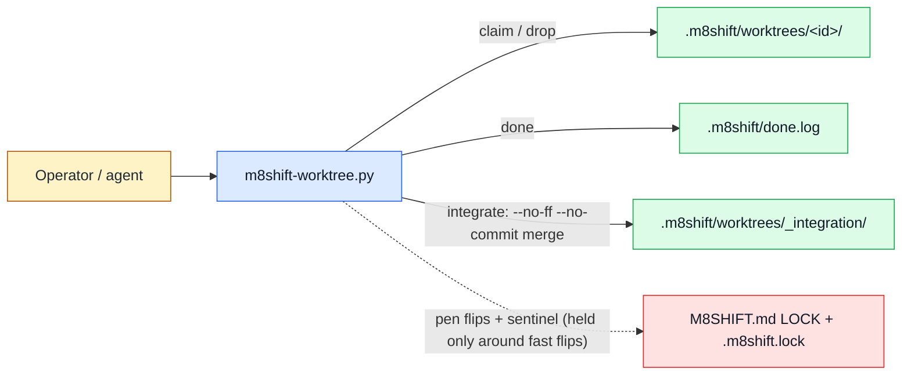

# Worktree toolbox (`m8shift-worktree.py`)

See the [module index](./README.md).

## Purpose

`m8shift-worktree.py` is the opt-in `§8` degree-2 companion to the core relay. It **owns** two things: isolated **feature worktrees** (degree-2 — many agents work in parallel, each on its own branch in its own checkout under `.m8shift/worktrees/<id>/`) and the **serialized, crash-safe integration pen** (degree-1 — only `integrate` ever takes the ONE canonical pen to merge a feature branch into a target branch and hand the pen off). It does **not** own the core protocol itself (`m8shift.py` owns the passive one-pen LOCK, the turn ledger, and the roster — this companion only calls the core's low-level helpers, never its `cmd_*` CLI functions), it does **not** touch the integer task board `M8SHIFT.tasks.md` (worktree ids are a separate id space; `done` writes its own ledger to avoid a format/lock collision), and it never automates destruction (`drop` requires `--yes`; `git worktree remove` refuses a dirty tree).

## Ownership diagram



Legend:

| Color | Meaning |
|-------|---------|
| Blue | executable module |
| Green | generated local state |
| Red | relay LOCK authority |
| Amber | human or agent actor |

## Command surface

| Command | Mutates | Reads | Writes | Notes |
|---------|---------|-------|--------|-------|
| `claim <id> <agent> --base <b> [--branch <b>]` | local-state | `M8SHIFT.md` (roster), git refs | `.m8shift/worktrees/<id>/` + git worktree admin, `.m8shift/worktree-owners/<id>.json` | Adds a feature worktree; checks out an existing `--branch`, else creates it off `--base`. Refuses if the worktree path already exists. Records the claiming agent in the owner sidecar (RFC 049 PR C — best-effort: a failed sidecar write warns, never blocks). |
| `done <id> <agent> [--takeover --reason TEXT]` | local-state | `M8SHIFT.md` (roster) under `.m8shift.lock`, owner sidecar | `.m8shift/done.log` (+ owner sidecar on takeover) | Dumb completion ledger line only; deliberately does NOT touch `M8SHIFT.tasks.md`. The real handoff is `integrate`. Refuses when a DIFFERENT agent owns the worktree unless `--takeover --reason` is explicit. |
| `integrate <id> <agent> --into <branch> --to <next> [--takeover --reason TEXT]` | local-state + repository-code | `M8SHIFT.md` LOCK, git refs, integration tree, owner sidecar | `M8SHIFT.md` (LOCK flips + turn), `.m8shift/worktrees/_integration/`, merge commit on `--into` (+ owner sidecar on takeover) | Serialized `--no-ff --no-commit` merge in the dedicated `_integration` tree; commits only after re-verifying holder+state+sentinel+HEAD under the lock, then hands the pen to `--to`. The ownership guard runs FIRST — a cross-owner refusal happens before any pen flip. |
| `drop <id> <agent> --yes [--takeover --reason TEXT]` | local-state | filesystem, owner sidecar | removes `.m8shift/worktrees/<id>/` and its owner sidecar | Never automatic (`--yes` required); `git worktree remove` refuses a dirty tree (no `--force`). Sidecar removal is best-effort (a leftover orphan is a doctor finding, never a failure). |
| `status [<id>]` | read-only | `M8SHIFT.md` LOCK, `git worktree list`, owner sidecars | none | Prints core version, pen state/holder/turn, an in-flight `integrating:` sentinel if any, and the companion worktrees with their recorded owner (`owner=?` when the sidecar is absent/unusable). |
| `doctor [--json]` | read-only | `M8SHIFT.md` (roster), `git worktree list`, owner sidecars | none | RFC 049 PR C advisory findings: `worktree.owner_missing` (managed worktree without a USABLE sidecar — absent or malformed) and `worktree.owner_mismatch` (recorded agent/path/branch conflicts with reality, or an orphan sidecar). Never repairs, never gates: rc 0 always. |

`Mutates` classifies FILE mutation only. `local-state` = writes under `M8SHIFT.*` or `.m8shift/`. `integrate` is additionally `repository-code` because a successful merge creates a real merge commit that advances the `--into` branch. No command performs `external` (network) mutation.

### Ownership guard (RFC 049 PR C — advisory, never a security boundary)

`claim` records `{schema: m8shift.worktree_owner.v1, id, agent, created_at, path, branch}`
in `.m8shift/worktree-owners/<id>.json` — a **sibling of** the checkout rather than a
file inside it, so NORMAL edits confined to the worktree do not touch it. This is **not**
a security boundary: a process with filesystem access can address the sibling path
directly, and direct `git`, editor, or filesystem writes never pass through the companion
and cannot be refused (RFC 049 "Security and prompt boundaries"). `done`/`integrate`/`drop`
refuse when the recorded owner is a DIFFERENT agent, unless `--takeover --reason TEXT`
is explicit; a takeover re-stamps the sidecar with an audit trail
(`taken_over_from`/`takeover_reason`/`takeover_at`) and preserves the original
`created_at`.

Every actor is **roster-validated before any owner read/write or destruction** (an
unknown agent cannot drop or take over a worktree); a takeover is committed **only after
all preconditions pass**, and a mandatory takeover audit **fails closed** — if it cannot
be persisted the ownership does not change and the command reports failure. Writes go
through the core's unpredictable-temp `+ os.replace` primitive inside a **validated real
parent** (no symlinked `.m8shift`/`worktree-owners` component, contained in ROOT), so a
sidecar write can never escape the project. The reader is bounded, path-safe, and STRICT
(`O_NOFOLLOW` final component + validated real parents + regular-file + 8 KiB cap +
schema/id/agent/timestamp/path/branch shape check): a malformed, symlinked, oversized, or
wrong-shaped sidecar reads as "no recorded owner" — the verb fails open and `doctor`
reports the gap (`owner_missing`). Well-shaped metadata that merely conflicts with reality
(off-roster agent, wrong path/branch) is `owner_mismatch`. No recorded agent, id, path,
reason, or orphan filename is ever echoed raw to the terminal — every untrusted string is
reduced to printable ASCII before display (RFC 052 §9.5).

## Inputs and outputs

**Files read**

- `M8SHIFT.md` — the canonical LOCK block and roster, via the core's `load_or_die` / `get_lock` / `active_agents` helpers.
- Git repository state — refs, `git worktree list --porcelain`, `MERGE_HEAD`, working-tree status.
- `.m8shift/worktree-owners/<id>.json` — the ownership sidecar (bounded fail-open read; `status`, `doctor`, and the mutating verbs' advisory guard).

**Files written**

- `.m8shift/worktrees/<id>/` — one linked git worktree per feature lane (`claim`), removed by `drop`.
- `.m8shift/worktrees/_integration/` — the single dedicated integration checkout, created on demand by `integrate` and kept on the target branch.
- `.m8shift/worktree-owners/<id>.json` — ownership metadata OUTSIDE the checkout (`claim` records, an explicit `--takeover` re-stamps with an audit trail, `drop` removes best-effort). Advisory, never authority.
- `.m8shift/done.log` — the degree-2 completion ledger (`done`), created with a header on first append.
- `M8SHIFT.md` — the LOCK (holder/state/turn/`since`/`expires`/`integrating` sentinel) and an appended immutable turn block, flipped by `integrate` only. All LOCK writes happen under the core `.m8shift.lock` file lock and only around the fast flips — never around `git merge`.

**Environment variables**

- `M8SHIFT_ROOT` — overrides root discovery. Otherwise the root is the parent of `git rev-parse --git-common-dir`, so a linked worktree resolves back to the canonical main checkout rather than its own copy. A bare/ambiguous layout is refused unless `M8SHIFT_ROOT` is set.

**Exit behavior**

- Any precondition failure calls `die()`, which prints `m8shift-worktree: <message>` to stderr and exits non-zero.
- `integrate` returns `1` on merge conflict, merge error, out-of-band HEAD move, or a failed commit (the merge is aborted and the pen is still handed to `--to` with a `blocked_on:` advisory). It returns `0` on a successful (or already-integrated no-op) merge.
- All other commands return `0` on success.

## Safe examples

```bash
# safe — read-only: core version, pen state, and companion worktrees
python3 m8shift-worktree.py status
```

```bash
# mutates-local-state (requires-git) — add an isolated feature lane off main
python3 m8shift-worktree.py claim feat-login alice --base main
```

```bash
# mutates-local-state — note the lane's branch is ready (dumb ledger line)
python3 m8shift-worktree.py done feat-login alice
```

```bash
# illustrative — serialized merge into main + pen handoff to bob (needs a clean
# _integration tree and both alice+bob in the roster; creates a real merge commit)
python3 m8shift-worktree.py integrate feat-login alice --into main --to bob
```

## Failure modes

- **`worktree <id> already exists at <path>`** (claim) — the lane is already checked out. Reuse it, or `drop <id> <agent> --yes` first.
- **`--base <b> does not resolve to a commit`** (claim) — the base ref is unknown; pass a real commit/branch.
- **`unknown agent <a> — roster is …`** — the agent is not registered in `M8SHIFT.md`; add it through the core before claiming/integrating.
- **`integration pen busy: <holder> is integrating <id>@<sha>`** — another integration is in flight (sentinel set). Wait for it, or recover a crashed one by hand / `m8shift.py init --force`.
- **`integration pen not free: state=…, holder=…`** — the LOCK is not `IDLE`, `AWAITING_<you>`, or your own `WORKING`. Wait for the pen to reach you.
- **`--to must hand off to a DIFFERENT agent`** / **`--into <b> is not a local branch`** — integration must advance a real branch and hand off to someone else; do not pass a commit/tag/detached ref or your own name.
- **`target branch <b> is checked out in <path>`** — git forbids a second checkout, so the `_integration` tree cannot own the branch. Free it there (detach it, or keep the canonical root on a coordination branch).
- **`integration tree dirty and not on <b>` / `integration tree … is not clean`** — clean `.m8shift/worktrees/_integration` manually before retrying.
- **`✗ merge failed (conflict:<id> | merge-error:<id>)`** — the `--no-ff` merge was aborted (true rollback); the pen is still handed to `--to` with a `blocked_on` advisory. Resolve upstream, then re-run `integrate`.
- **`pen/sentinel changed externally … recover by hand or m8shift.py init --force`** — a TTL reclaim or stolen pen changed the LOCK mid-merge. This companion aborts its own uncommitted merge and refuses to touch the foreign LOCK (no stolen merge). Recover manually.
- **`integration tree moved out-of-band (<a> != <b>)` / `blocked_on=head-moved`** — the integration HEAD moved after the sentinel was stamped; the merge is aborted and the pen handed off rather than committing a stale result.
- **`lost the .m8shift.lock token during the pen claim`** — the file lock was lost before the merge started (no merge began); simply retry.
- **`not inside a git repository (and $M8SHIFT_ROOT is unset)` / `bare/ambiguous git layout`** — run from inside the repo or set `M8SHIFT_ROOT` to the canonical root.
- **`drop needs --yes`** — a worktree is never removed automatically; confirm with `--yes` (and note `git worktree remove` still refuses a dirty tree).
- **`worktree <id> is owned by <agent> (advisory sidecar)`** — another agent claimed this lane (RFC 049 PR C). Coordinate through the relay, or take it over explicitly with `--takeover --reason TEXT` (audited in the sidecar).
- **`--takeover requires a non-empty --reason`** — the override is deliberate and audited; state why.

## Related RFCs and tests

- Owning design: [RFC 008 — Worktree companion](../rfc/008-rfc-worktree-companion.md) (the converged v1 contract this script implements).
- Ownership sidecar/guard + `doctor` findings: [RFC 049 — Holder liveness and stale-claim hardening](../rfc/049-rfc-holder-liveness-stale-claim-hardening.md) (PR C).
- Module reference: [RFC 045 — Module reference and executable examples](../rfc/045-rfc-module-reference-examples.md).
- Related: [RFC 009 — Runtime companion](../rfc/009-rfc-runtime-companion.md), [RFC 044 — Complete initialization and companion install](../rfc/044-rfc-complete-init-companion-install.md).
- Tests: [`tests/test_worktree.py`](../../../tests/test_worktree.py).
