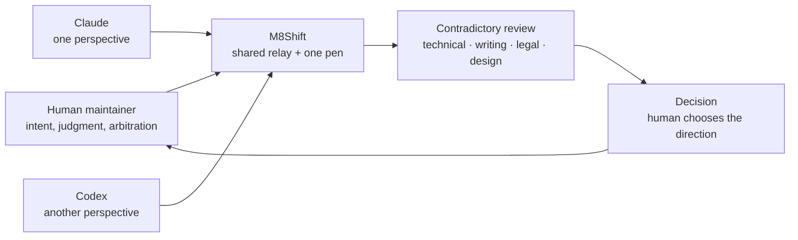

# Philosophy — why M8Shift exists

M8Shift was created from a practical observation: different AI agents do not think,
write, review, or fail in the same way.

Claude and Codex evolved differently over time. Their strengths were not identical:
one could be sharper on architecture, another on code review; one could be more useful
for writing, another for legal or technical contradiction. The value was not only that
each agent could produce work. The value was that their differences created a useful
contradictory space.

The maintainer's goal was not to delegate judgment to an agent team. The goal was to
bring several viewpoints into the same work process, then keep the human decision point
explicit.



Before M8Shift, the workflow was manual: work with one agent, copy context to another,
ask for a second opinion, copy the answer back, arbitrate, repeat. The human became the
message bus between siloed environments. That was useful, but wasteful: the agents could
not hand off, challenge, or brief each other directly.

M8Shift exists to remove that manual copy/paste layer while keeping the human in control.
It gives agents a shared workspace where they can:

- hand off work explicitly;
- review each other's assumptions;
- preserve the reasoning trail;
- make disagreement visible instead of hidden in separate chats;
- let the maintainer intervene, redirect, or arbitrate at any point.

The design is intentionally peer-to-peer. There is no manager agent. No central runtime
chooses the next task. An agent that holds the pen works, writes a bounded turn, then
hands the baton to another roster member. The maintainer can always read the log and
decide.

That is the core philosophy:

```text
not one agent replacing judgment,
not an opaque orchestrator deciding,
but several bounded viewpoints,
coordinated in a readable file,
with the human still responsible for the final direction.
```

M8Shift is therefore less a "productivity hack" than a small infrastructure for
contradiction. It helps the maintainer keep multiple competent, evolving viewpoints in
play without letting them overwrite each other — technically, editorially, or
conceptually.

