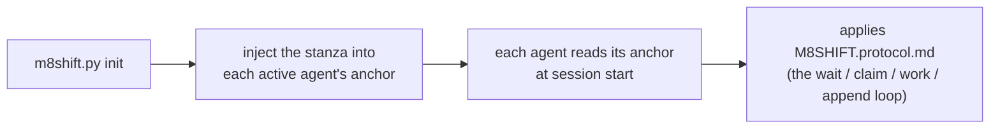

# M8Shift · Single-file relay protocol — reference (v1)

Read on demand. This companion to `M8SHIFT.protocol.md` (the operational core)
holds the mental model, the full `m8shift.py` command reference, project-adoption
details, and finer mutex/timestamp notes. None of it is needed to *operate* an
existing relay; the core alone is self-sufficient.

---

## 1. Mental model

- **A single living file**: `M8SHIFT.md`. The entire work dialogue is there.
- **A single pen, explicitly acquired**: to work, you **take** the pen via
  `claim` → state `WORKING_<you>`. `claim` is **exclusive** (several agents trying
  at the same time: only one succeeds). You modify the repository **only** while
  you hold the pen.
- **`append` closes your turn**: it is accepted only from `WORKING_<you>`,
  writes the turn and hands off (`AWAITING_<other>`). No `claim` ⇒ no `append`.
- **One pen, explicit recipient**: the active agents take turns — the holder hands the
  pen to any *other* roster member via `--to` (e.g. `claude` → `codex` → `claude` …; with
  3+ agents, to whichever you name). Each hand-off is a numbered *turn* (`TURN`).
- **Poll**: when it is not your turn, you wait (`./m8shift.py wait <you>`,
  ~60 s) then you retry `claim`.

Examples use `claude` and `codex` for readability only. The same protocol works with
`gemini`, `vibe`, or any cooperative agent that can read its anchor, run the CLI, and
respect `claim → work → append`.

---

---

## Timestamps and session metadata (detail)

M8Shift stores timestamps in UTC (`Z`) to keep comparisons stable across agents and
machines. Human-facing commands such as `status`, `recap`, `history`, and `task show`
also print the user's local time next to UTC, prefixed by the timezone name/offset
when available (otherwise `local`). Machine-readable JSON keeps canonical UTC values
only.

`status` also derives two read-only session lines from `M8SHIFT.sessions.jsonl` when
possible: `started` (session start timestamp) and `duration` (elapsed time since
that start, or until close/reset for a finished session). These lines are display
metadata only; they never feed claimability or routing. `status --json` exposes the
same metadata and serializes unavailable values as `null`.

> `expires` carries a date **only** during `WORKING_*` (an agent is working,
> TTL 30 min). It returns to `-` as soon as we are waiting (`AWAITING_*`, `IDLE`,
> `PAUSED`, `DONE`): nobody holds the pen, so there is no staleness to watch.

---

## Concurrency model (detail)

> **Concurrency model (two levels)**:
> 1. **Transitions** serialized by an inter-process lock (`.m8shift.lock`,
>    `O_CREAT|O_EXCL`, with an ownership token): each read-modify-write of the
>    LOCK + atomic write (unique temporary + `os.replace`) is exclusive.
> 2. **Work window** protected by the persistent state `WORKING_<agent>`:
>    `claim` is the only acquisition, and it fails if someone else holds or has
>    already taken the pen. Two simultaneous `claim`s from `IDLE` ⇒ **only one
>    succeeds**; the others must wait. Since we work only after a successful
>    `claim`, no two agents ever modify the repository at the same time.
>
> An abandoned `.m8shift.lock` (killed process) is taken over after 60 s, token
> verified. *Limits*: the lock is **advisory** (a manual edit of `M8SHIFT.md`
> bypasses it); on a network FS (NFS) `O_EXCL`/`rename` are less reliable —
> M8Shift targets a repository on local disk. See also §0/§4 (mandatory claim).

---

## Evidence & workspace discipline (detail)

### Compression / raw-proof contract

Compressed or filtered context is **orientation, not proof**. Any lossy or
summarizing layer — a digest, a context pack, RTK/adapter output, a stored
compact record, a model-written summary — helps you *find* and *frame*, but a
claim built on it must retain or reference the raw evidence it came from.

**Proof-bearing content that must be verified raw** (never through a
compressed/filtered view):

- **diffs** you review for correctness (hunk-lossy filters are forbidden for
  code review);
- **checksums / hashes** and any byte-level assertion;
- **legal or verbatim text** (quotes, licenses, contracts, cited wording);
- **logs used as evidence** (incident forensics, audit trails, test output
  backing a pass/fail verdict).

Honest adapter roles (consistent with RFC 023 and the shipped adapters): RTK
is a **lossy semantic filter** — it selects and truncates, it does not
guarantee any fixed ratio and is not reversible; Kompress/Headroom-style
compression reaches roughly 45–55% on prose only and errors on shell output;
a stored compact record is an **excerpt with a reference to the raw
original**, not a substitute for it. When a handoff asserts something a peer
will rely on, cite the raw source (file + location, command output, checksum)
so the peer can re-verify without trusting the digest.

### Shared checkouts and destructive git operations

A checkout that another agent or a human also works in is **shared state**,
not your scratch space. Discipline:

- **Destructive git operations require explicit human authorization** in a
  shared checkout: `git reset --hard`, `git checkout -f`, `git clean -fd`,
  forced branch switches, history rewrites. "The command was refused" is
  never that authorization.
- **A refused checkout is a signal, not an obstacle.** Git refuses to switch
  precisely because uncommitted work (possibly a peer's) would be destroyed.
  Escalating to a forced variant bypasses the safety, not the problem.
- **Inspect non-destructively first**: `git status`, `git stash list`,
  `git log`, `git diff` tell you whose work is in flight without touching it.
- **Prefer isolation over force**: a separate worktree
  (`m8shift-worktree.py claim`) or a copy gives you a clean tree without
  destroying anyone's state; `git stash` is the lighter alternative when the
  work is your own.
- **Never manipulate a peer's checkout outside relay coordination** — ask via
  `append` and let the pen order the work instead.

This discipline is **advisory guidance**: M8Shift does not (and cannot)
sandbox shell commands. The read-only `doctor --source DIR` update preflight
surfaces a `workspace.dirty_worktree` advisory when the project checkout has
uncommitted changes, as a reminder to coordinate before generated writes land.

---

## 7. The `m8shift.py` tool

```
./m8shift.py init [--name PROJECT] [--agents a,b,c…] [--lang <code>] [--force]  # (re)generate the kit; --lang = a language BUNDLED in this file (core = en; build more with m8shift-i18n.py)
./m8shift.py update --target DIR [--source DIR] [--components core,protocol,pack,anchors,companions] [--dry-run] [--json] [--allow-downgrade] [--allow-working] [--force-generated]  # RFC 048: source-driven local update — run the NEW source copy; every write lands in --target
./m8shift.py status [--for <agent>] [--brief]      # lock + last turn + optional next-action hint
./m8shift.py watch [--for <agent>] [--interval N] [--clear] [--changes-only]  # local read-only live monitor
./m8shift.py doctor [--lint] [--json] [--security] [--contracts] # read-only health/lint/security checks (never repairs or steals the pen)
./m8shift.py contract validate [--strict] [--json] # read-only Stage-4 contract validation
./m8shift.py recap [--turns N] [--memory N] [--tasks N] [--brief]  # read-only briefing: LOCK + last turns + memory + tasks
./m8shift.py peek <agent>  # last handoff addressed to <agent> (rc 3 if not your turn)
./m8shift.py log [--limit N] [--all] [--oneline]  # read-only relay timeline
./m8shift.py history [--limit N] [--oneline] [--json]  # session history (read-only)
./m8shift.py session {list,show,decisions,report} …  # read-only session views + optional Markdown report
./m8shift.py decisions {target,scaffold} …  # advisory decision trace target + Markdown/ADR scaffold
./m8shift.py wait <agent> [--once] [--interval N]  # waits for your turn ; --once = 1 check (rc 3 if not your turn)
./m8shift.py next <agent> [--once] [--interval N] [--force] [--resume --reason "..."]  # wait if needed, then claim + peek
./m8shift.py claim <agent> [--force|--refresh]     # ACQUIRE the pen (exclusive) — from your turn /
                                                  #   IDLE / your own lock ; --force = stale lock ONLY ;
                                                  #   --refresh = extend YOUR OWN WORKING lock only (runner heartbeat)
./m8shift.py may-i-write <agent>  # read-only hard guard: rc 0 only while <agent> holds a valid WORKING lock
./m8shift.py guard <agent>        # alias for may-i-write
./m8shift.py append <agent> --to <other> \
     --ask "..." --done "..." [--files a,b] [--body file.md|-] [--allow-large-body] [--wait]  # closes your turn + hands off
./m8shift.py request-turn <agent> --to <holder> --reason "..."  # ask current holder to yield (request ledger only)
./m8shift.py yield-turn <holder> --request N --to <agent>       # accept a cooperative turn request
./m8shift.py decline-turn <holder> --request N --reason "..."   # decline a cooperative turn request
./m8shift.py steer-turn <agent> --from <holder> --request N --force --reason "..."  # redirect idle AWAITING holder
./m8shift.py pause <holder> --reason "..."       # park an open session with no active task (state=PAUSED)
./m8shift.py cooldown --until ISO --reason "..." [--for agent] [--source SOURCE] [--wait-interval N] [--replace]
./m8shift.py resume <agent> --reason "..."       # resume PAUSED for a specific agent before claim
./m8shift.py remember <agent> "<note>"  # append a durable memory note (advisory)
./m8shift.py task {add,done,drop,list,show} …  # advisory task ledger (per-agent to-dos)
./m8shift.py release <agent> --to <other> [--force --reason "why"]  # hand off without a body (does NOT re-increment turn)
./m8shift.py done <agent> [--force --reason "why"]  # close the session (state=DONE)
./m8shift.py archive [--keep N]                     # purge old closed turns (never turn #0)
```

- **`claim` first**: you must hold the pen (`WORKING_<you>`) to `append`.
  `claim` is **exclusive** (a single winner if several agents try together).
- **Hard pre-write guard**: `may-i-write <you>` (alias: `guard <you>`) is read-only
  and exits 0 only when `holder=<you>`, `state=WORKING_<YOU>`, and the lock has not
  expired. Use it in commit hooks, wrapper scripts, and zero-memory agent checklists.
  A ready-to-install commit hook ships at `hooks/pre-commit` (POSIX sh, stdlib-only,
  advisory): with `$M8SHIFT_AGENT` set it blocks a commit unless that agent holds a
  valid pen, and with it unset it skips (humans are never blocked). See the agents
  guide and `CONTRIBUTING.md` for install instructions.
- **SEC-7 / TOCTOU — honest limit**: `may-i-write` is a **point-in-time read** that
  holds **no lock**. It reports the relay state *at the instant it runs*; the state can
  change between that check and the write completing (e.g. the lock expires, or another
  agent forces a stale-lock takeover). The pre-commit hook **narrows** the window — it
  checks immediately before the commit — but does **not** fully close the race. Treat the
  guard as a strong advisory gate, not a mutual-exclusion guarantee; the single-writer
  invariant still rests on the `claim`/`append` mutex, not on the guard.
- `append` is accepted **only from `WORKING_<you>`**; it writes the turn and
  hands off. `--body -` reads the body from stdin; `--body f.md` from a file;
  without `--body`, the turn has only the header. Bodies are capped at 256 KiB
  unless `--allow-large-body` is explicit. Single-line fields (`--ask`, `--done`,
  `--files`, advisory fields, `--reason`, `--note`, etc.) are capped at 64 KiB and
  still reject line breaks and reserved relay markers.
- `--to` must target **a different active agent** (self-hand-off refused; with 3+ agents, name the recipient).
- **Non-blocking** inspection: `status` or `wait <you> --once`. `wait <you>`
  **without** `--once` blocks until your turn — do not use it if you must return
  control to your loop in the meantime.
- **Brief read output**: `status --brief` and `recap --brief` are human-output-only
  compact modes. They are strict subsets of the default human output: no new fields,
  no default-output change. `status --brief` keeps the version line, `holder`,
  `state`, `agents`, `turn`, `since`, `expires`, and the `next` action (plus stale
  or request hints when present); it drops framing, `lang`, `session`, `started`,
  `duration`, `note`, and the last-turn footer. `recap --brief` keeps the version
  line, `holder`, `state`, `agents`, `turn`, `since`, and recent turn summaries; it
  drops framing, `session`, `expires`, `note`, section headings, memory headlines,
  and task headlines.
- **Live operator view**: `watch --for <you> --interval 5` repeats the same
  read-only status view so a terminal can show relay evolution without manually
  re-running `status`. It is a foreground/passive monitor: no `claim`, no handoff,
  no force recovery, no daemon.
- **Doctor lint**: `doctor --lint --json` is CI-safe and read-only. It reports
  core-safe findings for relay/LOCK validity, anchors and stanza placement,
  `AGENTS.override.md` synchronization, protocol/reference drift, stale or
  malformed `.m8shift.lock`, project-root status checks, session/request-ledger shape,
  multiple open relay sessions for the same roster, and livelock indicators.
  It never repairs files, prompts, contacts the network, or changes legal
  `LOCK` transitions. With `--source DIR` it also compares this core against a
  candidate source copy and reports `adoption.update_recommended` when the
  source is newer, plus an advisory `workspace.dirty_worktree` finding when the
  project's git checkout carries uncommitted changes (coordinate/stash before
  an update lands generated writes in a shared checkout — never clear the
  state with destructive git operations without explicit human authorization).
- **Local update (RFC 048)**: `update` is driven by the **new source copy**
  (`python3 /path/to/new/m8shift.py update --target . --source /path/to/new`),
  so projects created before the command existed can still be upgraded
  (baseline: projects initialized with M8Shift 3.41+). Every generated write is
  rebased onto the target and stamped with the **source** version; the source's
  `checksums.sha256` is verified when it ships one; the target's file lock is
  taken; a `WORKING_*` relay, a downgrade, and corrupted generated markers are
  refused by default (`--allow-working`, `--allow-downgrade`,
  `--force-generated` override — the latter never resets relay state). Update
  never claims, appends, forces, or resets: `M8SHIFT.md`, sessions, requests,
  tasks, and memory stay byte-identical, and nothing is ever copied from a
  source dir that happens to be an initialized project. Each real run appends a
  bounded audit row (`m8shift.update.audit.v1`) to `.m8shift/update-audit.jsonl`.

---

---

## 8. Adoption by any project (portability)

`m8shift.py` is **self-sufficient**: it embeds this protocol, the `M8SHIFT.md`
template and the anchors. `init` generates relay files, but it does **not** copy
scripts into the target project. The one-line installer handles that by placing
`m8shift.py`, the optional `m8shift-worktree.py` toolbox, and the optional
`m8shift-runtime.py` companion next to each other,
then running `init`. For manual adoption:

```bash
cp /path/to/m8shift.py .          # core relay
cp /path/to/m8shift-worktree.py . # optional: isolated parallel worktrees
cp /path/to/m8shift-runtime.py .  # optional: local presence/inbox/progress companion
./m8shift.py init                 # project name = folder name (otherwise --name)
```

`m8shift-runtime.py init` is separate from the core `init`: it scaffolds optional,
gitignored runtime sidecars under `.m8shift/runtime/` (`presence.json`,
`runs.jsonl`, `progress.jsonl`, `idempotency.jsonl`, `approvals.jsonl`,
`inbox/*.jsonl`) plus local provider/role/workflow files. Runtime JSONL events use
the `m8shift.runtime.event.v1` envelope with `source`, `relay`, and `payload`
metadata. Invalid or deleted runtime sidecars are diagnostic findings only; they
must never change claimability or reinterpret `M8SHIFT.md`.
`m8shift-runtime.py watch` also owns one advisory lane per agent identity in
`presence.json`: a second managed runtime for the same agent is refused while the
lane is fresh, and takeover requires the explicit `--takeover-stale` flag after the
record is stale. Lane ownership never grants or steals the core pen.
With `--no-progress-warn-after` / `--no-progress-block-after`, `watch` can also
warn or stop its own companion loop when neither `progress.jsonl` nor `runs.jsonl`
advances for the current run. It emits `runtime.no_progress` findings and a recovery
hint; it never runs force recovery automatically.

`init`:
- writes `M8SHIFT.protocol.md` (this document) and `M8SHIFT.md` (a fresh IDLE
  lock); `M8SHIFT.md` is **not** overwritten if it already exists (except with
  `--force`) → the state of the ongoing relay is preserved;
- writes `.m8shift/hooks/commit-msg`, a Git hook template that adds the
  `Coordinated-With: M8Shift vX.Y.Z` trailer by reading the active relay version from
  `$M8SHIFT_ROOT` (or the current directory when it contains a relay). If
  `M8SHIFT_AGENT_MODEL` is set to a safe self-declared model id, the hook also stamps
  `Agent-Model: <id>` even without a readable relay. If neither a safe model id nor
  a relay version is available, it exits 0 without changing the commit message. It is a `commit-msg`
  hook (not `prepare-commit-msg`) so it stamps the *final* saved message and never
  tags an aborted commit; it inserts the trailer into the message body — inside the
  trailer block, above any `git commit -v` `>8` scissors line — so verbose commits
  keep the trailer instead of dropping it below the cut with the diff;
- manages a marker-delimited M8Shift block in the host `.gitignore` by default
  (use `--no-gitignore` to skip). The block keeps relay state local
  (`M8SHIFT.md`, runtime sidecars, temporary files, backups, reports) without adding
  agent anchors such as `CLAUDE.md` or `AGENTS.md`; re-init refreshes only this block
  and preserves all user-managed `.gitignore` entries in place;
- injects at the **top** a "M8Shift relay" block into **each active agent's anchor**
  (by default `CLAUDE.md` and `AGENTS.md`; created if missing), between
  `M8SHIFT:STANZA` markers → **idempotent** re-injection (moves/updates the block
  without duplicating, existing content preserved; the prior file is backed up to
  `<anchor>.m8shift.bak`);
- if `CLAUDE.md` existed but no Codex instruction (`AGENTS.md` or
  `AGENTS.override.md`) existed, automatically creates in `AGENTS.md` a bridge
  asking Codex to read the shared instructions in `CLAUDE.md`. A pre-existing
  Codex anchor is never completed or replaced automatically;
- renames a single `claude.md`/`agents.md` variant to the canonical
  auto-loaded name, including on a case-insensitive FS. Several coexisting
  variants are refused rather than silently merged. If Git is available and the
  variant is tracked, it uses `git mv -f` to also update the index;
- if `AGENTS.override.md` exists, it also synchronizes the stanza there: Codex
  loads this override instead of `AGENTS.md` in the same folder.

### Bootstrap / uptake by the agents

M8Shift is **passive**: it never "calls" any AI. It relies on the convention of each
host tool — **Claude reads `CLAUDE.md`, Codex reads `AGENTS.md`**, and any other active
agent reads its own anchor — at session/execution startup. The bootstrap chain is
therefore:



- **After `init`**: start a new session/execution of the agent. A session
  already open has generally built its instruction chain before the injection.
- **Interactive Codex or `codex exec`**: `AGENTS.md` is loaded if the command
  starts from the project root or one of its subfolders. *Headless* mode is not
  in itself a limit; a cron/CI launched outside the project, however, does not
  discover the anchor.
- **Codex override**: `AGENTS.override.md` masks `AGENTS.md` in the same folder;
  `init` therefore injects the stanza into both when it is present.
- **Codex size**: Codex stacks the instruction files up to a *combined* ceiling
  (`project_doc_max_bytes`, 32 KiB by default) and truncates the file that
  overflows to the remaining byte count. Putting the stanza at the top thus
  keeps it in priority (and a file closer to the cwd takes precedence);
  nevertheless keep the anchors **lightweight**.
- **General limit**: M8Shift cannot force an AI to read anything. Without a
  project root/context, point the agent explicitly to `M8SHIFT.protocol.md`.

Codex reference: https://developers.openai.com/codex/guides/agents-md
