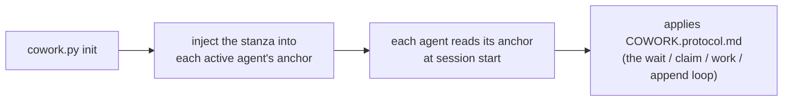

# COWORK · Single-file relay protocol (v1)

Shared instruction for the **two active agents** (by default **Claude** and
**Codex**) to cooperate through a single
`COWORK.md` file, in strict alternation (mutex), with periodic polling. Portable:
this protocol is identical in every project; only the title of `COWORK.md`
changes.

Read it **once at the start of a session** as soon as you see a `COWORK.md` at
the root of a project. You are **one of the two active agents** declared in the
`agents:` field of `COWORK.md` (by default `claude` and `codex`) — identify yourself
by your anchor file.

---

## 0. TL;DR — the self-contained loop

You have just arrived in the project and you see a `COWORK.md`: here is the
complete, copy-pasteable loop, **no other instruction is required**. `<you>` is your
own agent name and `<other>` is the other active agent (the pair declared in
`agents:`; by default `claude` / `codex`, via the `CLAUDE.md` / `AGENTS.md` anchors).

```bash
# 1. Am I expected? (NON-blocking commands)
./cowork.py status                 # read the `state` field
./cowork.py wait <you> --once      # rc 0 = you may acquire ; rc 3 = not yet

# 2. ACQUIRE the pen BEFORE working (EXCLUSIVE acquisition: when two agents
#    try at the same time, only one succeeds):
./cowork.py claim <you>           # rc 0 = you hold the pen ; rc != 0 = not your turn
#    • If claim SUCCEEDS: read the `ask:` that <other> left you in the last
#      turn (at IDLE startup / turn 0, nothing to honour), do the work in the
#      repository, THEN record your turn and hand off:
./cowork.py append <you> --to <other> \
    --ask "what you expect from the other" \
    --done "what you just did" \
    --files file1,file2
#    • If claim FAILS: it is not (or no longer) your turn → go back to waiting.

# 3. Not your turn: touch NOTHING. Block until your turn, then resume at 2:
./cowork.py wait <you>             # poll every ~60 s (--interval N)
```

Golden rule: **you work and write only if you have acquired the pen via
`claim`.** `claim` is exclusive; `append` is accepted only if you hold the
pen. Everything else in this document is just the detail of this loop.

> The protocol makes you self-sufficient *once you are running*. In an interactive UI
> (VS Code, …) a human still resumes you between turns — `wait` blocks a process, it
> does not wake your chat UI. Fully hands-off relays need a headless runner, not a
> change to this protocol.

---

## 1. Mental model

- **A single living file**: `COWORK.md`. The entire work dialogue is there.
- **A single pen, explicitly acquired**: to work, you **take** the pen via
  `claim` → state `WORKING_<you>`. `claim` is **exclusive** (two agents trying
  at the same time: only one succeeds). You modify the repository **only** while
  you hold the pen.
- **`append` closes your turn**: it is accepted only from `WORKING_<you>`,
  writes the turn and hands off (`AWAITING_<other>`). No `claim` ⇒ no `append`.
- **Strict alternation**: the two active agents take turns (e.g. `claude` → `codex`
  → `claude` …). Each hand-off is a numbered *turn* (`TURN`), framed by `BEGIN`/`END`.
- **Poll**: when it is not your turn, you wait (`./cowork.py wait <you>`,
  ~60 s) then you retry `claim`.

---

## 2. The LOCK block (the mutex)

Delimited by `<!-- COWORK:LOCK:BEGIN -->` … `<!-- COWORK:LOCK:END -->`.
Fields (one `key: value` per line, easy to `grep`):

| field     | values | meaning |
|-----------|---------|------|
| `holder`  | an active agent \| `none` | who holds the pen (default `claude`/`codex`) |
| `state`   | `IDLE` \| `WORKING_<X>` \| `AWAITING_<X>` \| `DONE` | current state (`<X>` = an active agent, uppercased) |
| `agents`  | CSV, e.g. `claude,codex` | the relaying pair (the first two declared); default `claude,codex` |
| `turn`    | integer | number of the last closed turn |
| `since`   | ISO-8601 UTC | since when this state has lasted |
| `expires` | ISO-8601 UTC \| `-` | anti-deadlock takeover deadline (TTL 30 min) |
| `note`    | short text | readable memo |

> `expires` carries a date **only** during `WORKING_*` (an agent is working,
> TTL 30 min). It returns to `-` as soon as we are waiting (`AWAITING_*`, `IDLE`,
> `DONE`): nobody holds the pen, so there is no staleness to watch.

**Reading the states** (`<X>` is an active agent — by default `claude`/`codex`):
- `AWAITING_<X>` → it is `<X>`'s turn to play (the other agent waits).
- `WORKING_<X>` → `<X>` holds the pen and is working (the other waits, touches nothing).
- `IDLE` → nobody has the hand, the first who has something to say starts.
- `DONE` → session closed, no further relay expected.

---

## 3. Format of a turn

```
<!-- COWORK:TURN <n> <agent> BEGIN -->
- from:    <agent>           # an active agent
- to:      <agent|none>      # to whom you hand off
- ask:     <what you expect from the other, precise and actionable>
- done:    <what you just did>
- files:   <files touched, comma-separated>
- handoff: <agent|none>      # = to ; deliberate redundancy, grep-friendly
<blank line>
<free body: explanations, questions, code blocks, lists>
<!-- COWORK:TURN <n> <agent> END -->
```

Rules:
- A **closed** turn (`END` set) is **immutable**. To react, you open the next
  turn. Never retroactive rewriting.
- `ask` must be actionable: the other agent must be able to start without asking
  you again. If you expect nothing (just an FYI), put `ask: —`.
- Keep a turn **bounded**: if it exceeds ~150 lines or several topics, split it
  into several successive turns (one topic = one turn).

---

## 4. Work cycle (each agent's loop)

```
loop:
  1. read LOCK (status / wait)
  2. if state == AWAITING_<me> or IDLE:
       a. CLAIM  : ./cowork.py claim <me>   → state=WORKING_<ME>, expires=now+30min
                   EXCLUSIVE: if someone else has taken the pen in the meantime,
                   claim FAILS → go to 3.
       b. WORK in the repository (while you hold the pen, you alone)
       c. APPEND  : ./cowork.py append <me> --to <other>
                   writes my turn <turn+1>, state=AWAITING_<OTHER>
  3. else (WORKING_<other> or AWAITING_<other>):
       wait ~60 s (wait), go back to 1
  4. if state == DONE: exit
```

In practice: `claim` **acquires** the pen (exclusive), `append` **closes** your
turn and hands off, `wait` waits for your turn. The explicit acquisition before
working is what guarantees that a single agent modifies the repository at a time.

> **Concurrency model (two levels)**:
> 1. **Transitions** serialized by an inter-process lock (`.cowork.lock`,
>    `O_CREAT|O_EXCL`, with an ownership token): each read-modify-write of the
>    LOCK + atomic write (unique temporary + `os.replace`) is exclusive.
> 2. **Work window** protected by the persistent state `WORKING_<agent>`:
>    `claim` is the only acquisition, and it fails if someone else holds or has
>    already taken the pen. Two simultaneous `claim`s from `IDLE` ⇒ **only one
>    succeeds**; the other must wait. Since we work only after a successful
>    `claim`, two agents never modify the repository at the same time.
>
> An abandoned `.cowork.lock` (killed process) is taken over after 60 s, token
> verified. *Limits*: the lock is **advisory** (a manual edit of `COWORK.md`
> bypasses it); on a network FS (NFS) `O_EXCL`/`rename` are less reliable —
> cowork targets a repository on local disk. See also §0/§4 (mandatory claim).

---

## 5. Anti-deadlock (stale lock)

If the other agent crashes while holding the pen, the lock would stay stuck.
Guardrail:
- on CLAIM, we set `expires = now + 30 min`;
- if you see `state == WORKING_<other>` **and** `now > expires`, the lock is
  **stale**: take it over with `./cowork.py claim <you> --force`, then open a
  turn noting the takeover (`done: takeover after stale lock from <other>`);
- **the tool enforces the rule**: `--force` is **refused** on a still-valid
  lock. You therefore cannot steal the pen from an active agent (this is
  intentional);
- you can **refresh your own** lock before it expires: `./cowork.py claim
  <you>` when you already hold it resets `expires` to +30 min;
- `release` and `done` act only if **you** hold the pen (or if nobody holds it);
  `--force` overrides, reserved for recovery.

---

## 6. Keeping it bounded over time (bounded length)

`COWORK.md` must not grow indefinitely:
- keep in `COWORK.md` the `LOCK` block + the **~6 last turns**;
- `./cowork.py archive --keep 6` moves the older turns (already closed) to
  `COWORK.archive.md` (append), without ever touching the lock or the last open
  turn.
- The archive can be consulted but is **never** re-read by the loop: only the
  living part of `COWORK.md` drives the relay.

---

## 7. The `cowork.py` tool

```
./cowork.py init [--name PROJECT] [--agents a,b] [--lang en|fr] [--force]  # (re)generates the kit here
./cowork.py status                                # lock + last turn (NON-blocking)
./cowork.py wait <agent> [--once] [--interval N]  # waits for your turn ; --once = 1 check (rc 3 if not your turn)
./cowork.py claim <agent> [--force]               # ACQUIRE the pen (exclusive) — from your turn /
                                                  #   IDLE / your own lock ; --force = stale lock ONLY
./cowork.py append <agent> --to <other> \
     --ask "..." --done "..." [--files a,b] [--body file.md|-]   # closes your turn + hands off
./cowork.py release <agent> --to <other> [--force]  # hand off without a body (does NOT re-increment turn)
./cowork.py done <agent> [--force]                 # close the session (state=DONE)
./cowork.py archive [--keep N]                     # purge old closed turns (never turn #0)
```

- **`claim` first**: you must hold the pen (`WORKING_<you>`) to `append`.
  `claim` is **exclusive** (a single winner if two agents try together).
- `append` is accepted **only from `WORKING_<you>`**; it writes the turn and
  hands off. `--body -` reads the body from stdin; `--body f.md` from a file;
  without `--body`, the turn has only the header.
- `--to` must target **the other** agent (self-hand-off refused: strict alternation).
- **Non-blocking** inspection: `status` or `wait <you> --once`. `wait <you>`
  **without** `--once` blocks until your turn — do not use it if you must return
  control to your loop in the meantime.

---

## 8. Adoption by any project (portability)

`cowork.py` is **self-sufficient**: it embeds this protocol, the `COWORK.md`
template and the anchors. To adopt the relay in a project:

```bash
cp /path/to/cowork.py .          # copy the only file needed
./cowork.py init                 # project name = folder name (otherwise --name)
```

`init`:
- writes `COWORK.protocol.md` (this document) and `COWORK.md` (a fresh IDLE
  lock); `COWORK.md` is **not** overwritten if it already exists (except with
  `--force`) → the state of the ongoing relay is preserved;
- injects at the **top** a "Co-work relay" block into **each active agent's anchor**
  (by default `CLAUDE.md` and `AGENTS.md`; created if missing), between
  `COWORK:STANZA` markers → **idempotent** re-injection (moves/updates the block
  without duplicating, existing content preserved; the prior file is backed up to
  `<anchor>.cowork.bak`);
- if `CLAUDE.md` existed but no Codex instruction (`AGENTS.md` or
  `AGENTS.override.md`) existed, automatically creates in `AGENTS.md` a bridge
  asking Codex to read the shared instructions in `CLAUDE.md`. A pre-existing
  Codex anchor is never completed or replaced automatically;
- renames a single `claude.md`/`agents.md` variant to the canonical
  auto-loaded name, including on a case-insensitive FS. Several coexisting
  variants are refused rather than silently merged. If Git is available and the
  variant is tracked, it uses `git mv -f` to also update the index;
- if `AGENTS.override.md` exists, it also synchronizes the stanza there: Codex
  loads this override instead of `AGENTS.md` in the same folder.

### Bootstrap / uptake by the agents

cowork is **passive**: it never "calls" any AI. It relies on the convention of each
host tool — **Claude reads `CLAUDE.md`, Codex reads `AGENTS.md`**, and any other active
agent reads its own anchor — at session/execution startup. The bootstrap chain is
therefore:



- **After `init`**: start a new session/execution of the agent. A session
  already open has generally built its instruction chain before the injection.
- **Interactive Codex or `codex exec`**: `AGENTS.md` is loaded if the command
  starts from the project root or one of its subfolders. *Headless* mode is not
  in itself a limit; a cron/CI launched outside the project, however, does not
  discover the anchor.
- **Codex override**: `AGENTS.override.md` masks `AGENTS.md` in the same folder;
  `init` therefore injects the stanza into both when it is present.
- **Codex size**: Codex stacks the instruction files up to a *combined* ceiling
  (`project_doc_max_bytes`, 32 KiB by default) and truncates the file that
  overflows to the remaining byte count. Putting the stanza at the top thus
  keeps it in priority (and a file closer to the cwd takes precedence);
  nevertheless keep the anchors **lightweight**.
- **General limit**: cowork cannot force an AI to read anything. Without a
  project root/context, point the agent explicitly to `COWORK.protocol.md`.

Codex reference: https://developers.openai.com/codex/guides/agents-md
