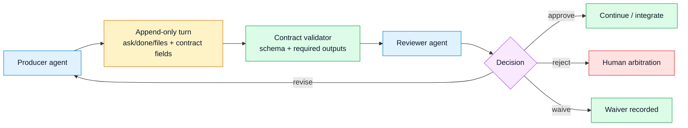

# RFC — Stage 4 contracts and validation

- **Status:** implementation specification, not fully shipped
- **Scope:** typed handoff metadata, explicit review decisions, and validation commands
- **Core invariant:** one shared pen; contracts never grant a second writer

## 1. Goal

Stage 4 turns the existing free-form handoff into a documented contract surface:
an agent can say what it changed, what evidence exists, what it expects from the
next agent, and what review decision came back. The goal is stronger
coordination between agents and humans without turning M8Shift into an
orchestrator.

The target behavior is:

- a producer records expected outputs, evidence, and review intent in the turn;
- a reviewer records an explicit decision: approve, revise, reject, or waive;
- a validator can check the shape and completeness of these contracts;
- the mutex still routes only through the `LOCK` state and the explicit baton.

## 2. Shipped baseline

The current v3.x surface already provides the substrate:

- `append` requires the current agent to be in `WORKING_<agent>`;
- `append --ask`, `--done`, and `--files` are required;
- advisory fields are available through dedicated flags and `--field k=v`;
- single-line fields reject newlines and reserved turn markers;
- `--body` is neutralized so a pasted body cannot forge a turn;
- `peek`, `recap`, `log`, `history`, and `doctor` expose relay context;
- `claim --check` provides a read-only overlap probe;
- `m8shift-worktree.py` provides opt-in parallel worktrees with serialized
  integration.

Stage 4 extends this surface. It does not replace the existing protocol.

## 3. Non-goals

Stage 4 must not add:

- a background daemon, push notifier, or resident queue;
- filesystem-wide write prevention;
- provider credentials or direct calls to Claude, Codex, Gemini, Vibe, or any
  other agent UI;
- automatic merges or automatic test execution;
- routing decisions based on contract fields;
- mandatory host permission enforcement inside the single-file core.

## 4. Contract model

A contract is a typed layer over an append-only turn. It is still plain text and
still belongs to `M8SHIFT.md`.

Required turn fields remain unchanged:

- `ask`
- `done`
- `files`

Stage 4 adds standardized optional fields. Unknown fields remain preserved and
visible, but only standardized fields are validated.

| Field | Meaning |
|-------|---------|
| `role_from` | role used by the sender for this turn, for example `implementer` |
| `role_to` | expected role of the receiver, for example `reviewer` |
| `relation` | relation type: `handoff`, `review_request`, `review_result`, `escalation` |
| `requires` | required checks or outputs expected from the receiver |
| `expected_output` | concrete deliverable expected from the receiver |
| `evidence` | tests, commands, commits, or manual checks supporting the turn |
| `decision` | review decision: `approve`, `revise`, `reject`, `waive` |
| `waiver_reason` | required when `decision=waive` |
| `schema` | contract schema identifier, for example `stage4.v1` |
| `permissions` | declared permission intent, advisory only |

The engine must keep the existing `x_*` namespace for project-specific metadata.

## 5. Review decisions

Stage 4 standardizes decision language without changing ownership rules.

| Decision | Meaning | Expected routing |
|----------|---------|------------------|
| `approve` | The reviewer accepts the result as usable. | pass to the next worker or human |
| `revise` | The result is close but needs changes. | pass back to the producer or another implementer |
| `reject` | The result should not be integrated as-is. | escalate or restart the work |
| `waive` | A missing check is consciously accepted. | continue only with `waiver_reason` recorded |

Expected routing means the conventional next action for agents or humans. M8Shift
does not enforce it; the mutex routes only through the `LOCK` state and explicit
baton handoff.

An approval is evidence. It is not a lock, a merge, or a permission grant.

## 6. CLI surface

The first implementation can use the existing generic field channel:

```bash
python3 m8shift.py append codex --to claude \
  --ask "review the implementation" \
  --done "implemented stage 4 docs" \
  --files "docs/en/rfc-contracts-validation.md" \
  --field schema=stage4.v1 \
  --field role_from=implementer \
  --field role_to=reviewer \
  --field relation=review_request \
  --field requires="read docs, verify tests, return approve/revise/reject/waive" \
  --field expected_output="ranked review findings" \
  --field evidence="python3 -m unittest discover -s tests"
```

Dedicated sugar flags may be added later:

- `--role-from`
- `--role-to`
- `--relation`
- `--requires`
- `--expected-output`
- `--evidence`
- `--decision approve|revise|reject|waive`
- `--waiver-reason`
- `--schema`
- `--permissions`

These flags must serialize to the same plain turn fields as `--field`.

## 7. Validation commands

Validation is explicit and read-only by default.

Proposed commands:

```bash
python3 m8shift.py contract validate
python3 m8shift.py contract validate --strict
python3 m8shift.py contract validate --json
python3 m8shift.py doctor --contracts
```

Default validation should report warnings and exit successfully when legacy turns
are present. Strict validation may return a non-zero code for malformed Stage 4
contracts, but only because the operator asked for strict validation.

Validation must not:

- call `set_lock`;
- acquire the semantic pen;
- change `holder`, `state`, `turn`, `since`, `expires`, or `note`;
- infer the next route;
- run tests, git commands, or external tools.

## 8. Validation rules

Minimum Stage 4 validation rules:

1. `schema=stage4.v1` activates Stage 4 validation for the turn.
2. `relation` must be one of `handoff`, `review_request`, `review_result`,
   `escalation`.
3. A `review_request` should include `role_to`, `requires`, and
   `expected_output`.
4. A `review_result` should include `decision`.
5. `decision` must be one of `approve`, `revise`, `reject`, `waive`.
6. `decision=waive` requires `waiver_reason`.
7. `permissions` is parsed as advisory text and must never be enforced by the
   core.
8. Unknown fields are preserved and ignored unless strict validation explicitly
   opts into a project schema.

## 9. Permission model

M8Shift can record permission intent. It cannot enforce host permissions.

Recommended vocabulary:

- `permissions=read_only`
- `permissions=write_repo`
- `permissions=run_tests`
- `permissions=network_required`
- `permissions=human_approval_required`

The host environment, UI, shell policy, and human operator remain the enforcement
boundary. Stage 4 only makes the intent auditable.

## 10. Architecture impact

Stage 4 adds a validator beside the existing parser and read-only diagnostics. It
does not add a scheduler.



Legend: blue = agents, yellow = persisted turn data, green = validation or
accepted continuation, purple = explicit decision, red = human escalation.

## 11. Backward compatibility

Older sessions remain valid. A turn without `schema=stage4.v1` is a normal v3.x
turn.

The implementation must preserve:

- the current `M8SHIFT.md` turn markers;
- existing required fields;
- existing advisory fields;
- the generic `--field` escape hatch;
- `peek` output for unknown fields.

## 12. Acceptance tests

Implementation is acceptable when tests cover:

- valid Stage 4 review request;
- valid Stage 4 review result;
- invalid `relation`;
- invalid `decision`;
- `decision=waive` without `waiver_reason`;
- legacy turn accepted in default mode;
- strict mode failing malformed Stage 4 data;
- validator leaves `LOCK` unchanged;
- unknown fields preserved by `peek`;
- `permissions` never gates claim, append, or routing.

## 13. Phasing

1. **4A — documentation and schema vocabulary.** This RFC, architecture notes,
   and examples.
2. **4B — read-only validator.** `contract validate` and `doctor --contracts`.
3. **4C — ergonomic append flags.** Dedicated sugar flags mapped to turn fields.
4. **4D — companion integration.** Optional host/UI companion may enforce project
   policy, but the single-file core remains advisory and passive.
