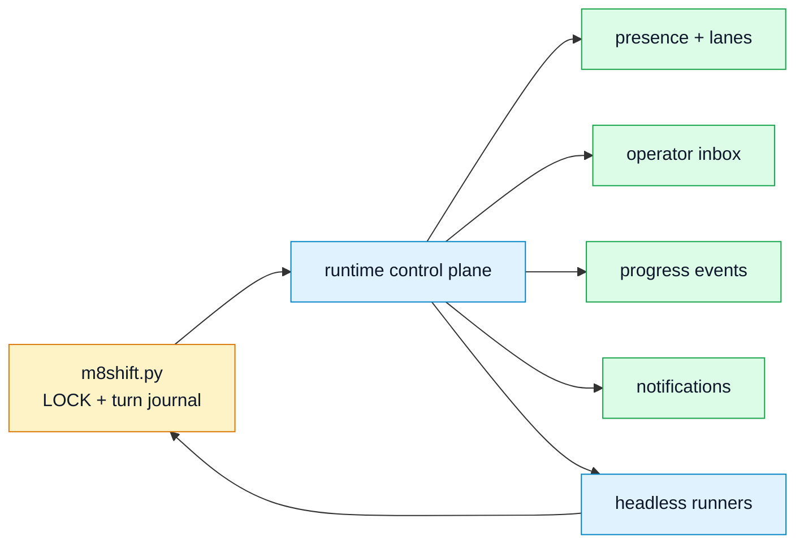

# RFC — Hosted/runtime control plane

- **Status:** future companion RFC, not implemented
- **Scope:** optional host/runtime layer around the passive M8Shift core
- **Core invariant:** the single-file `m8shift.py` remains the authority for the pen

## 1. Problem

M8Shift deliberately stays passive: it records ownership and handoffs, but it does
not wake chat UIs, supervise provider sessions, push notifications, or keep a
resident process alive. That is the correct boundary for a portable single-file
relay, but large workflows need operational visibility:

- Is a Claude, Codex, Gemini, Vibe, or other agent process actually alive?
- Which UI/session owns the `codex` lane when several Codex windows exist?
- Did the current worker make progress, or is it only refreshing the TTL?
- Did a human add a follow-up instruction while an agent was working?
- Who should be notified when a handoff is posted?

These are runtime/session questions. They should be answered by a companion
control plane, not by the core mutex.

## 2. Decision

Create a future **optional control-plane companion** that observes and drives
M8Shift sessions without replacing the core lock.

The companion may be local, LAN-hosted, or hosted. In every form, it must treat
`M8SHIFT.md` and `m8shift.py` as the source of truth for pen ownership.

## 3. Goals

- Track runtime presence for each agent lane.
- Prevent multiple UI/CLI sessions from accidentally using the same roster
  identity at once.
- Provide operator inboxes and structured human interventions.
- Show progress, current holder, next expected agent, stale/blocked state, and
  session history in a dashboard.
- Trigger optional local or hosted notifications when a handoff waits for a
  specific agent.
- Drive headless loops safely: wait, claim, run one turn, heartbeat, append, and
  verify post-run state.
- Preserve the passive core and allow projects to keep using only `m8shift.py`.

## 4. Non-goals

- No change to the meaning of `claim`, `append`, `release`, `done`, or `--force`.
- No second source of truth for lock ownership.
- No provider credentials in `M8SHIFT.md`.
- No automatic filesystem writes without a successful core `claim`.
- No hosted dependency for normal local operation.
- No guarantee that an interactive chat UI can be awakened by the core.

## 5. Architecture



Legend: yellow = core source of truth, blue = optional companion/runtime,
green = companion-owned observability data.

The companion may read:

- `M8SHIFT.md`
- `M8SHIFT.sessions.jsonl`
- `M8SHIFT.memory.md`
- `M8SHIFT.tasks.md`
- companion sidecars under `.m8shift/runtime/`

The companion may write:

- sidecar runtime state;
- operator messages;
- progress events;
- normal M8Shift turns, but only by running the same `m8shift.py claim/append`
  commands as any other agent.

## 6. Suggested sidecar layout

```text
.m8shift/runtime/
  lanes/
    codex.lock.json
    claude.lock.json
    gemini.lock.json
  presence.json
  inbox/
    codex.jsonl
    claude.jsonl
  progress.jsonl
  notifications.jsonl
  runs/
    20260624T120000Z-codex-0001.json
```

All sidecars are advisory. Deleting `.m8shift/runtime/` must not corrupt the core
relay.

## 7. Lane ownership

A lane is the runtime instance currently allowed to operate under a roster name:
for example, one VS Code Codex panel or one `codex exec` process for `codex`.

The lane owner prevents this ambiguity:

- two Codex windows both see `AWAITING_CODEX`;
- both run `claim codex`;
- the second claim becomes a legal TTL refresh if the first already holds the pen.

The control plane should allow only one active runtime owner per roster identity,
unless the user explicitly overrides it.

## 8. Operator messages

Human interaction should be captured as structured events, not pasted into a
random agent UI with no provenance.

Minimum event fields:

| Field | Meaning |
|-------|---------|
| `id` | stable event id |
| `agent` | target roster identity |
| `mode` | `followup`, `collect`, `interrupt`, `status` |
| `body` | human message |
| `created_at` | UTC timestamp |
| `handled_at` | UTC timestamp or `-` |

The companion may inject pending operator messages into the next headless prompt
or display them to the human for manual copy/paste.

## 9. Progress and liveness

The companion may track:

- process PID or UI session id;
- last seen timestamp;
- current run id;
- current relay turn;
- last observed `LOCK` state;
- last progress message;
- heartbeat refreshes;
- repeated refreshes without append.

Repeated TTL refreshes with no files, tests, progress, or append should be shown
as **possibly stalled**, not automatically reclaimed while the lock is still
valid.

## 10. Notifications

Notifications are advisory only. They may say:

- "Codex is awaited."
- "Claude has been working for 25 minutes; heartbeat refreshed."
- "Gemini lane appears stale."
- "Turn posted with `decision=revise`."

Notifications must never imply that the core can wake an interactive UI by itself.

## 11. Security model

The control plane increases the attack surface. Minimum requirements:

- secrets never stored in `M8SHIFT.md`;
- sidecars gitignored by default if they contain runtime or operator data;
- explicit project root allowlist;
- no shell interpolation of agent commands;
- audit log for every hosted action;
- clear boundary between "notify" and "execute";
- user-visible confirmation for destructive or publishing actions.

## 12. Acceptance criteria

A first implementation is acceptable when:

- deleting `.m8shift/runtime/` leaves the core relay usable;
- two runtime sessions cannot silently own the same agent lane;
- headless runs still call `m8shift.py claim` and `append`;
- no runtime event mutates `LOCK` except through normal core commands;
- notifications work without granting write authority;
- operator messages are auditable and idempotent;
- stale presence never grants the pen;
- tests cover crash, duplicate lane, stale lane, and post-run verification.

## 13. Relationship to existing surfaces

This RFC generalizes the local ideas already described by
[rfc-runtime-companion.md](rfc-runtime-companion.md). That document remains the
local/runtime pattern. This RFC is the broader control-plane boundary, including
hosted or multi-session variants.

## 14. Open questions

- Should the first implementation be local-only before any hosted deployment?
- Should the sidecar format be stable JSONL from day one?
- Should the control plane expose MCP, HTTP, or only a CLI?
- Should hosted mode be a separate project/package to keep M8Shift's repository
  focused on the core and companions?
