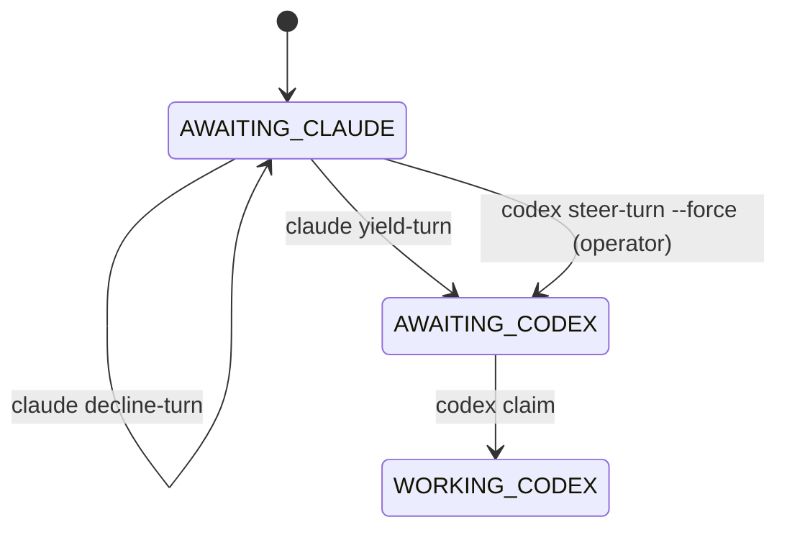

# RFC — Cooperative turn request and operator steering

**Status:** implemented in v3.15.0 · **Target:** M8Shift core, with optional runtime companion support ·
**Scope:** prevent interactive-agent deadlocks when the human resumes an agent that is
not currently the awaited baton owner.

## Problem

M8Shift already serializes work correctly:

- `claim` is required before repository edits;
- `append` hands off to the next awaited agent;
- `claim --force` can recover only a stale `WORKING_*` lock;
- `release --force` can manually redirect the baton when an operator knows recovery is
  safe.

The remaining failure mode is not a filesystem race. It is an interactive routing
deadlock:

1. the relay is `AWAITING_CLAUDE`;
2. Claude is waiting for a human instruction, or its UI is not actively resumed;
3. the human talks to Codex instead;
4. Codex cannot `claim`, because the baton is owned by Claude;
5. Claude does not hand off, because no one has resumed Claude with an instruction.

Today the operator can solve this with a forced `release`, for example:

```bash
python3 m8shift.py release claude --to codex --force
python3 m8shift.py claim codex
```

That works, but it is an emergency/manual action. It does not express the intended
cooperative question:

> "You currently own the baton. Are you actually doing anything? If yes, keep it. If no,
> please yield it to me because the user is now interacting with my UI."

## Goal

Add an explicit, auditable, low-risk protocol for baton negotiation:

- an agent that receives a human interaction while not awaited can ask the current baton
  owner to yield;
- the current baton owner can accept, decline, or explain that it is still active;
- if the owner does not answer and the human explicitly authorizes recovery, the operator
  can steer an idle awaited baton without pretending it was a normal handoff;
- the one-pen mutex remains unchanged.

## Non-goals

- Do not steal a fresh `WORKING_*` lock.
- Do not infer UI liveness from silence.
- Do not require network access, provider APIs, sockets, or a resident service.
- Do not let a pending request make `claim` succeed.
- Do not make M8Shift responsible for waking a closed chat UI.

## Implemented core surface

### 1. `request-turn`

Append a pen-free, audit-only request to a new ledger:

```bash
python3 m8shift.py request-turn codex \
  --to claude \
  --reason "human is active in the Codex UI and asks Codex to continue"
```

Suggested ledger:

```text
M8SHIFT.requests.md
```

The command:

- requires both agents to be in the roster;
- does not change `LOCK`;
- is accepted from `AWAITING_<other>` and `WORKING_<other>`;
- prints the exact response commands for the current baton owner.

Example entry:

```text
BEGIN M8SHIFT REQUEST #7
- id: 7
- at: 2026-06-24T21:15:00Z
- from: codex
- to: claude
- state_seen: AWAITING_CLAUDE
- kind: turn_request
- reason: human is active in the Codex UI and asks Codex to continue
- status: open
END M8SHIFT REQUEST #7
```

### 2. `yield-turn`

Let the current baton owner accept the request:

```bash
python3 m8shift.py yield-turn claude --request 7 --to codex
```

Semantics:

- only the current `holder` can yield without `--force`;
- valid from `AWAITING_<holder>` or `WORKING_<holder>`;
- from `WORKING_<holder>`, it is equivalent to an explicit `release` and must be used
  only when the holder has not made unreported edits;
- changes `LOCK` to `AWAITING_<to>`;
- records the request as accepted.

This is a clearer, audited variant of `release <holder> --to <other>`.

### 3. `decline-turn`

Let the current baton owner say it is still active:

```bash
python3 m8shift.py decline-turn claude --request 7 \
  --reason "still reviewing the previous turn"
```

Semantics:

- does not change `LOCK`;
- records the request as declined;
- makes `status --for codex` show that Codex must keep waiting.

### 4. `steer-turn`

Provide an explicit operator recovery path for the exact interactive-deadlock case:

```bash
python3 m8shift.py steer-turn codex \
  --from claude \
  --request 7 \
  --reason "operator is active in Codex UI; Claude has no pending work instruction" \
  --force
```

Semantics:

- allowed only when `state == AWAITING_<from>`;
- refused on `WORKING_<from>` unless the normal stale-lock rule already permits recovery;
- requires `--force` and a non-empty `--reason`;
- changes `LOCK` to `AWAITING_<codex>`;
- records the event as operator steering, not as consent from Claude.

This should replace ad-hoc `release claude --to codex --force` in operator playbooks.

## Status and next-action output

`status --for <agent>` should surface open requests:

```text
next     codex: wait; open request #7 asks claude to yield
request  #7 open, to=claude, age=2m, reason=...
```

For the current baton owner:

```text
next     claude: answer request #7 with yield-turn or decline-turn
request  #7 from=codex, reason=human is active in Codex UI...
```

`next <agent>` should remain conservative:

- if it is not `<agent>`'s turn, it must not auto-steer;
- it may print the open request and the suggested command;
- only `yield-turn` or explicit `steer-turn --force` changes routing.

## State model impact

No new `LOCK.state` is required. Requests live outside the core state machine.



## Runtime companion extension

A future runtime companion can make this smoother by:

- displaying incoming requests in the baton owner's UI lane;
- writing presence/progress sidecars;
- timing out request prompts visually;
- asking the human to confirm `steer-turn --force`.

The companion must still call the same core commands. It must not bypass `LOCK`.

## Acceptance criteria

- `request-turn` never changes `LOCK`.
- `yield-turn` changes `LOCK` only when called by the current holder.
- `decline-turn` never changes `LOCK`.
- `steer-turn --force` can redirect `AWAITING_<from>` but refuses fresh
  `WORKING_<from>`.
- `status --for` and `next` show open requests without making routing decisions.
- Every request and answer is append-only and auditable.
- `doctor` reports malformed request markers, invalid request events, request
  answer events without a prior `turn_request`, or more than one answer for the same
  request read-only; it never repairs the ledger or makes a request claimable.
- Existing `claim`, `append`, `release`, `done`, `wait`, and stale-lock semantics remain
  unchanged.

## Migration and documentation

Documentation should present three escalation levels:

1. **Normal path:** `append --to <other> --wait`.
2. **Cooperative interruption:** `request-turn` then `yield-turn` or `decline-turn`.
3. **Human recovery:** `steer-turn --force` only from an idle `AWAITING_*` baton, or
   normal stale-lock recovery for expired `WORKING_*`.

This keeps the default model cooperative while giving operators a named, traceable way
to recover from UI routing deadlocks.
