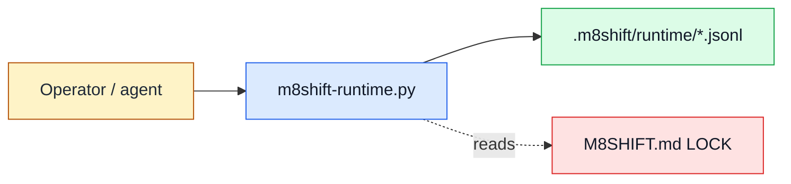

# RFC 045 — Module reference and executable examples

- Status: draft
- Date: 2026-07-03
- Origin: operator request for complete technical documentation after the companion family grew beyond the single core script
- Builds on: [RFC 023 Agent token footprint](023-rfc-agent-token-footprint.md), [RFC 044 Complete initialization and companion install](044-rfc-complete-init-companion-install.md)
- Related: [RFC 008 Worktree companion](008-rfc-worktree-companion.md), [RFC 009 Runtime companion](009-rfc-runtime-companion.md), [RFC 034 Companion adapter interface](034-rfc-companion-adapter-interface.md), [RFC 037 Agent context compression backends](037-rfc-agent-context-compression-backends.md), [RFC 040 AI session usage monitoring](040-rfc-ai-session-usage-monitoring.md), [RFC 042 Compression backend routing](042-rfc-compression-backend-routing.md)

## Summary

M8Shift now ships a small toolkit, not only `m8shift.py`. The README and RFCs explain
the concepts, but there is no single module reference where an operator or agent can
answer:

- what each script owns;
- which commands and flags it exposes;
- what files it reads and writes;
- which examples are safe to run;
- which companion is authoritative for a concern.

This RFC defines an English-only module reference under `docs/en/modules/`, mirrored
on the site under Reference. Each module gets a page with a consistent structure,
color Mermaid diagram, command table, inputs/outputs, examples, safety notes, and
links to owning RFCs and tests. The reference should be generated or checked from
script metadata where possible, so command drift is caught by tests.

## Problem

The current documentation is concept-first. That is correct for adoption, but it is
inefficient for operations:

- `m8shift.py` owns the pen and the lock;
- `m8shift-runtime.py` owns presence, inbox, providers, reports, notifications, and
  runtime sidecars;
- `m8shift-context.py` owns context packs, compression, retrieval, and adapter
  dispatch;
- `m8shift-worktree.py` owns isolated worktree lanes;
- `m8shift-headroom.py` owns the optional Headroom-compatible adapter launcher;
- `m8shift-i18n.py` owns language-pack builds;
- `m8shift-e2e.py` owns local smoke scenarios.

Without per-module pages, agents repeatedly reread broad RFCs to find command-level
facts. That increases token cost and raises the risk of stale operational guesses.

## Goals

1. Provide one authoritative page per shipped script.
2. Keep pages concise enough for agents to load selectively.
3. Show command surfaces, file effects, examples, and failure modes.
4. Use diagrams with colors and legends where they clarify ownership or data flow.
5. Keep examples runnable or explicitly marked as illustrative.
6. Add automated checks so module inventory and docs do not drift.

## Non-goals

- No localized RFC duplication. RFCs remain English-only.
- No generated manpage framework dependency.
- No network-dependent examples.
- No replacement for conceptual RFCs.
- No claim that docs generation can infer every semantic rule automatically.

## Documentation structure

Repository documentation:

```text
docs/en/modules/
  README.md
  core-relay.md
  runtime.md
  context.md
  worktree.md
  headroom.md
  i18n.md
  e2e.md
```

Site mirror:

```text
M8Shift-site/docs/reference/modules/
  index.md
  core-relay.md
  runtime.md
  context.md
  worktree.md
  headroom.md
  i18n.md
  e2e.md
```

The repository remains the source of truth. The site should mirror or import the
same content rather than becoming a second hand-maintained reference.

## Page template

Each module page uses the same skeleton:

```markdown
# <Module name>

## Purpose
One paragraph: what this script owns and what it does not own.

## Ownership diagram
Color Mermaid diagram with a legend.

## Command surface
Generated or checked command table.

## Inputs and outputs
Files read, files written, environment variables, exit behavior.

## Safe examples
Copy/paste commands that do not mutate external systems.

## Failure modes
What warnings/errors mean and how to recover.

## Related RFCs and tests
Links to owning RFCs, implementation tests, and generated docs checks.
```

### Diagram convention

Use Mermaid `classDef` colors and a visible legend:



Legend:

| Color | Meaning |
|-------|---------|
| Blue | executable module |
| Green | generated local state |
| Red | relay lock authority |
| Amber | human or agent actor |

## Module inventory

| Page | Script | Primary authority |
|------|--------|-------------------|
| `core-relay.md` | `m8shift.py` | one-pen relay, lock, turns, session reports, task board, memory, core doctor |
| `runtime.md` | `m8shift-runtime.py` | runtime presence, operator inbox, progress, notifications, provider registry, local reports |
| `context.md` | `m8shift-context.py` | context packs, compression/retrieval records, adapter execution |
| `worktree.md` | `m8shift-worktree.py` | isolated feature lanes and serialized integration |
| `headroom.md` | `m8shift-headroom.py` | optional Headroom-compatible local adapter launcher |
| `i18n.md` | `m8shift-i18n.py` | language-pack build and script generation |
| `e2e.md` | `m8shift-e2e.py` | local smoke scenarios and regression harness |

## Generation and drift checks

Extend `scripts/gen_docs.py` in phases. It currently mirrors embedded protocol
templates into `docs/en/protocol.md` and `docs/en/protocol-reference.md`. It should
also own module-reference generation/checking.

Recommended data model:

```python
MODULES = {
    "core-relay": {
        "script": "m8shift.py",
        "title": "Core relay",
        "summary": "One-pen relay and immutable turn ledger.",
        "rfcs": ["001", "002", "011", "021", "022", "023"],
        "safe_examples": [
            ["python3", "m8shift.py", "status"],
            ["python3", "m8shift.py", "doctor"],
        ],
    },
}
```

The generator may run `python3 <script> --help` and selected
`python3 <script> <subcommand> --help` commands to capture current CLI help into
fenced blocks. It must:

- use argv arrays, never shell strings;
- run from the repository root;
- set a short timeout;
- avoid commands that mutate state;
- fail if a listed script is missing;
- fail if two pages claim the same script;
- produce deterministic output.

## Command table format

Each page should include a concise generated or checked table:

| Command | Mutates | Reads | Writes | Notes |
|---------|---------|-------|--------|-------|
| `python3 m8shift.py status` | no | `M8SHIFT.md`, sessions ledger | none | prints UTC + local time |
| `python3 m8shift-runtime.py watch codex` | yes, local sidecars | lock + runtime config | `.m8shift/runtime/*` | advisory; never writes the core lock |

`Mutates` means file mutation, not external-system mutation. The docs should
distinguish:

- **read-only**: no file writes;
- **local state**: writes under `M8SHIFT.*` or `.m8shift/`;
- **repository code**: writes project files;
- **external**: network or external service. Core M8Shift should normally be `none`.

## Examples policy

Examples are tagged:

| Tag | Meaning |
|-----|---------|
| `safe` | can run in an initialized test project without external side effects |
| `mutates-local-state` | writes M8Shift local state only |
| `requires-git` | needs a git checkout |
| `requires-optional-adapter` | needs an explicitly installed optional adapter |
| `illustrative` | do not run blindly; demonstrates a shape |

Every page must have at least one `safe` or `mutates-local-state` example.

## Site navigation

The site should add a Reference section:

```text
Reference
  Modules
    Overview
    Core relay
    Runtime companion
    Context companion
    Worktree toolbox
    Headroom adapter launcher
    I18n builder
    E2E harness
```

The landing page and quick-start sections should link to:

- the complete init/companion-install page from RFC 044 once implemented;
- `worktree.md` wherever isolated parallel feature work is mentioned;
- `runtime.md` wherever watch/listen/presence is mentioned;
- `context.md` wherever context compression or token economy is mentioned.

## Implementation phases

### Phase A — hand-authored module index

- Add `docs/en/modules/README.md`.
- Add one page per script using the common template.
- Keep command tables manually checked against `--help`.

### Phase B — generator-backed help blocks

- Extend `scripts/gen_docs.py` with module inventory.
- Generate `--help` blocks into stable markers.
- Add tests that fail when generated docs are stale.

### Phase C — runnable example smoke checks

- Add a test helper that executes examples tagged `safe` in a temp project.
- Refuse examples that write outside the temp project.

### Phase D — site mirror

- Mirror repository module pages into the VitePress site.
- Add sidebar navigation and cross-links from the homepage, installation guide, and
  roadmap.

## Tests

Minimum checks:

1. every script in the module inventory exists;
2. every inventory item has exactly one docs page;
3. every page links back to `docs/en/modules/README.md`;
4. every page declares inputs and outputs;
5. generated help blocks are in sync with the current scripts;
6. safe examples execute in a temporary initialized project;
7. site module pages exist for every repository module page once Phase D ships.

## Token-economy impact

The module reference supports RFC 023 and RFC 033. Agents should load the small page
for the module they need instead of rereading broad RFCs or the full protocol
reference. For example:

- runtime issue => load `docs/en/modules/runtime.md`;
- missing copied companion => load `docs/en/modules/core-relay.md` and RFC 044;
- worktree integration issue => load `docs/en/modules/worktree.md`;
- compression issue => load `docs/en/modules/context.md`.

This reduces mandatory context while keeping precise operational facts available.

## Open questions

1. Should generated help blocks be committed, or should docs tests only verify the
   manually written tables?
2. Should site mirroring be done by `scripts/gen_docs.py` or by the site build?
3. Should examples be stored inline in module pages, or extracted into reusable
   snippets under `docs/en/examples/`?

## Definition of done

- A new agent can find the owner, commands, file effects, and safe examples for
  every shipped script without reading the full RFC set.
- Docs generation/checking fails on command drift.
- Site Reference navigation exposes the same module structure.
- The module pages become the canonical targets for future quick-start and FAQ links.
