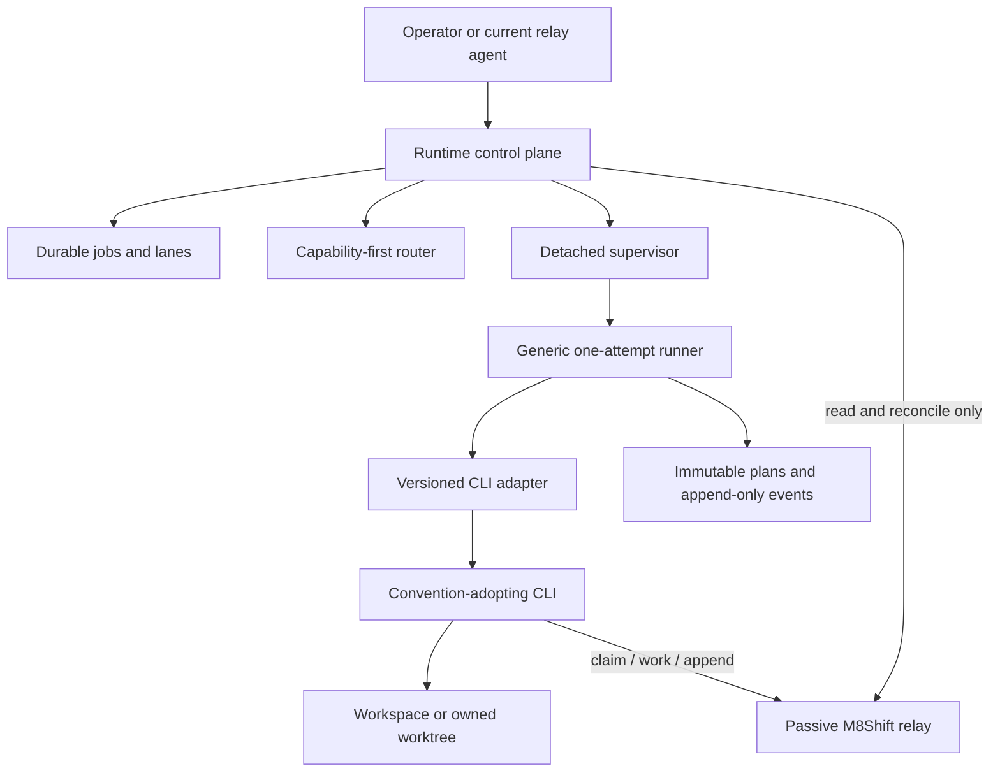

# RFC 067 — Detached, vendor-neutral CLI agent orchestration

- **Status:** accepted / DESIGN-ONLY; phased implementation deferred (#157); no
  runtime authority is granted by this document
- **Date:** 2026-07-14
- **Scope:** pluggable agent-CLI adapters, detached process supervision, durable
  recovery, relay coordination, scheduling, and model/task routing
- **Builds on:** [RFC 014](014-rfc-provider-management.md),
  [RFC 018](018-rfc-agent-runtime-architecture.md),
  [RFC 020](020-rfc-headless-runner-hardening.md),
  [RFC 028](028-rfc-headless-command-templates.md),
  [RFC 039](039-rfc-model-task-routing.md),
  [RFC 040](040-rfc-ai-session-usage-monitoring.md),
  [RFC 047](047-rfc-headless-liveness-runner-listener.md),
  [RFC 049](049-rfc-holder-liveness-stale-claim-hardening.md),
  [RFC 050](050-rfc-manual-multi-agent-specialists.md), and
  [RFC 053](053-rfc-shared-rules-governed-habits.md).

## 0. Feasibility conclusion

Detached multi-agent CLI orchestration is feasible without turning the M8Shift
core into a daemon or hard-coding a vendor. The existing implementation already
contains the narrow execution path this design needs:

```text
passive relay -> resident listener -> generic one-run runner -> provider CLI
```

The safe evolution is a runtime-companion control plane around that path. It
persists desired jobs and lanes, selects an adapter and model, supervises process
groups, and reconciles interrupted work. It never writes a relay turn, claims a
pen for an agent, invents peer consent, or decides that a provider exit code is a
completed turn.

The design has three feasibility levels:

| Capability | Assessment | Reason |
|---|---|---|
| Detached one-shot agents surviving an IDE crash | high | the listener/runner split and OS service backends already establish the required boundary |
| Durable job queue, bounded scheduler, and restart reconciliation | high with implementation work | all authoritative inputs are local, but desired/observed state and idempotent attempts need a versioned store |
| Provider-native session resume across every CLI | conditional | resume flags, identifiers, guarantees, and versions differ; compatibility must never depend on this feature |

Claude and Codex are Phase 1 adapters, not the architecture. Gemini CLI,
Mistral Vibe, and any later convention-adopting CLI join through the same
adapter conformance suite. The M8Shift relay protocol remains the single
coordination contract.

## 1. Goals

- Launch, stop, resume, and inspect detached CLI-agent lanes through a
  provider-neutral runtime surface.
- Keep work running if a VS Code window, extension host, or interactive terminal
  disappears.
- Recover after provider, control-plane, or host restart without blind duplicate
  launches or false success.
- Support whichever agent identities a shift declares, not a fixed two-agent
  pair.
- Route tasks to an eligible model using RFC 039 and the #59 study: capability
  floor first, cost/usage only among eligible models.
- Preserve degree-1 relay authority, worktree isolation, bounded retries,
  prompt security, compartmentalization, and raw-proof verification.
- Make every consequential policy choice visible to the operator before build.

## 2. Non-goals

- No implementation in this RFC.
- No model, network, credentials, process launching, or scheduling in
  `m8shift.py`.
- No second relay, shadow pen, synthetic handoff, or new `LOCK` state.
- No assumption that a provider-native conversation can be resumed.
- No promise that a detached local process survives logout or reboot unless an
  installed OS service backend provides that guarantee.
- No automatic swarm, hidden model scoring, ambient learner, or provider-specific
  branch in the core or generic runner.
- No inference that network access authorizes ticket creation, push, merge, or
  another external mutation.

## 3. Architectural boundary

The target has four layers with non-overlapping authority:

| Layer | Responsibility | Must not do |
|---|---|---|
| Core relay | roster, `LOCK`, claimability, turns, degree-1 write mutex | launch processes, select providers/models, read secrets, schedule jobs |
| Runtime control plane | desired lanes/jobs, queue, routing, policy resolution, supervision, reconciliation | claim/append for an agent, edit `M8SHIFT.md`, manufacture completion |
| Generic runner | execute one immutable attempt, heartbeat, timeout/kill, collect evidence, validate relay outcome | choose hidden defaults, maintain the global queue, treat exit 0 as relay success |
| CLI adapter | probe a vendor/version and translate a neutral run request into lifecycle operations | own the pen, mutate the relay, invoke a shell string, redefine scheduling policy |



The control plane is durable; model invocations are one-shot by default. A
provider-native long-lived or resumable session is an adapter capability, not a
new authority layer.

This RFC accepts the architecture and all policy choices D1-D16 in §11. It does
not authorize implementation or activate detached orchestration. Delivery remains
explicitly deferred and requires separately scoped, reviewed phases.

## 4. The relay is the single contract

An orchestrated agent is first-class only if its identity is declared in the
active shift roster and it follows the same protocol as every interactive
agent:

```text
wait/eligibility -> claim self -> work -> validate -> append self
```

The scheduler may launch an agent only when local policy and relay state make the
attempt eligible. It cannot claim on the agent's behalf. The runner verifies
completion from a newer authored turn or `DONE`, not from provider output or
process exit status.

Relay behavior by lane:

| Lane | Relay relationship | Mutation rule |
|---|---|---|
| Roster turn | launched only for `AWAITING_<agent>` or an explicitly enabled, unambiguous `IDLE` policy | the launched identity claims and appends normally |
| Advisory specialist | no pen; returns a bounded report to the pilot | read-only by contract; report is untrusted data until verified |
| Mutating specialist | no shared-checkout pen while producing its branch | uses an owned worktree; the relay integrator serializes integration |
| Batch integration | each relay mutation is a normal authored turn | no parallel claim, synthetic peer, or direct `LOCK` write |

Adding a CLI therefore requires no core branch for `claude`, `codex`, `gemini`,
or `vibe`. The roster contains agent identities; configuration maps each identity
to an adapter, model constraints, role, and policy.

## 5. Agent-CLI adapter contract

### 5.1 Interface

The versioned `m8shift.agent-cli-adapter.v1` interface is conceptual here; the
implementation may use Python protocols or declarative templates plus hooks.

| Operation | Required | Contract |
|---|---:|---|
| `probe()` | yes | return executable/version and observed capabilities; no model call |
| `validate(request)` | yes | fail closed on unsupported model, lifecycle, output, or permission requirements |
| `render_launch(plan)` | yes | return static argv elements, allowed environment names, and redaction metadata; never a shell string |
| `render_resume(plan, session_ref)` | capability | render a new attempt against an opaque provider session; refuse when unsupported |
| `render_stop(process_ref, mode)` | yes | describe provider-specific graceful stop signal/API if required; generic supervisor still owns process-group termination |
| `health(process_ref, session_ref)` | yes | normalize `starting/running/resumable/stopped/unknown`; never infer relay completion |
| `normalize_result(exit, output)` | yes | produce a vendor-neutral attempt result and provider diagnostics |
| `redact(event)` | yes | remove credentials, auth material, sensitive prompt/output, and unsafe session references before persistence |
| `capabilities()` | yes | declare headless, explicit model, structured output, resume, tool-policy, and lifecycle features proven by `probe()` |

`launch`, `stop`, `resume`, and `health` are lifecycle intents exposed uniformly
to callers. Process creation, timeout, process groups, grace, kill, event writing,
and final relay validation stay generic. An adapter may supply the exact vendor
operation but must not become a second runner.

### 5.2 Neutral request and immutable attempt plan

A job request describes intent; a resolved attempt plan freezes execution:

```text
job_id, attempt_id, batch_id, task_id,
agent, role, lane, adapter, adapter_version,
provider, model, model_source, reasoning_effort,
argv_redacted, cwd, worktree_id,
permission_policy, network_policy, external_actions,
env_allowlist, secret_refs,
timeout, kill_grace, retry_policy,
resume_strategy, provider_session_ref,
expected_relay_transition, verification_recipe,
prompt_hash, config_hash
```

Rules:

- The plan exists before launch and is immutable; retry/resume creates a new
  `attempt_id`.
- `provider_session_ref` is opaque, local, scoped to the same project/agent/job,
  and absent when resume is unsupported.
- `secret_refs` names a host-side resolver entry, never a secret value.
- The effective adapter, model, permissions, network policy, and their provenance
  are explicit. User-global CLI defaults cannot silently replace them.
- Rendered argv is element-by-element with no shell interpolation. Persisted argv
  and events are redacted.

### 5.3 Conformance, not a vendor matrix in code

Each adapter/version must pass the same fake-project suite:

1. probe and reject an unsupported version/flag;
2. launch one headless attempt with an explicit model;
3. stop the full child tree with grace then kill;
4. resume when declared, and refuse clearly when not declared;
5. distinguish a live process, a resumable session, and an unknown/orphan;
6. classify exit 0 without an authored append as non-completion;
7. redact credentials and session references;
8. preserve the same relay and worktree invariants as every other adapter.

## 6. Provider examples and prior art

These examples prove portability targets; their flags are not normative. Every
installed version is probed before use.

| CLI | Relevant prior art | Design treatment |
|---|---|---|
| Codex CLI | non-interactive `codex exec`, explicit model/sandbox profiles | Phase 1 adapter; current runner path is the first conformance fixture |
| Claude Code | print/headless invocation and optional session continuation | Phase 1 adapter; resume remains capability/version gated |
| Gemini CLI | documented headless/non-interactive use | later adapter proving the contract is not tied to the reference roster |
| Mistral Vibe | programmatic CLI operation and cloud/teleport-style detached sessions are reported product prior art | later adapter; separate provider-cloud session health from the local process and verify exact semantics at probe/implementation time |

Mistral Vibe is especially useful prior art: a local frontend and a durable
provider-side task/session need not share one lifetime. M8Shift adopts the
separation, not a vendor protocol. A provider-cloud session may remain
`resumable` after its local launcher exits, while relay completion still requires
the authored M8Shift transition.

Official product reference entry points named for implementation verification;
exact commands and guarantees remain implementation-time probe evidence:

- [Codex CLI documentation](https://developers.openai.com/codex/cli/)
- [Claude Code documentation](https://docs.anthropic.com/en/docs/claude-code/overview)
- [Gemini CLI documentation](https://geminicli.com/docs/)
- [Mistral Vibe documentation](https://docs.mistral.ai/mistral-vibe/)
- [Mistral Vibe source repository](https://github.com/mistralai/mistral-vibe)

## 7. Detachment and supervision

### 7.1 Survival contract

"Detached" has explicit levels:

| Backend | Survives IDE/frontend crash | Survives terminal close | Survives logout/reboot | Restarts/reconciles |
|---|---:|---:|---:|---:|
| foreground | no | no | no | no |
| local detached fallback | yes | usually | not guaranteed | only while control plane survives |
| user OS service | yes | yes | platform policy | yes |

The durable target is a user service supervising the control plane: LaunchAgent
on macOS, user systemd on Linux, and a separately specified native Windows
backend. `nohup` or `tmux` may be documented as operator-visible fallbacks, but
must not be labeled equivalent to a restart-capable supervisor.

The service supervises one control plane. The control plane launches generic
runners in isolated process groups. It does not install one opaque daemon per
model invocation.

### 7.2 Lifecycle

```text
start lane -> persist desired=running -> resolve plan -> launch attempt
stop lane  -> persist desired=stopped -> graceful provider stop -> process-group kill
resume     -> reconcile -> provider resume if proven, else fresh attempt if policy permits
health     -> compare desired state, process/service state, attempt events, provider session,
              worktree ownership, and relay state
```

Stopping a lane does not release another identity's relay pen. If the process
dies in `WORKING_<agent>`, RFC 049 liveness and stale-lock rules remain binding;
the control plane records `needs_reconciliation` and follows an operator-approved
recovery policy. It never force-claims through a live holder.

## 8. Durable state and resume semantics

### 8.1 Sidecar store

Runtime state lives under an ignored, project-bound directory such as
`.m8shift/runtime/`, separate from the portable relay:

```text
runtime/
  control.json                 # service identity/version and desired state
  jobs/<job_id>.json           # immutable request + current derived state
  attempts/<attempt_id>.json   # immutable resolved plan
  events.jsonl                 # append-only lifecycle ledger
  lanes/<lane_id>.json         # desired agent/role/worktree/policy
  sessions/<opaque_id>.json    # provider refs; local, restricted, redacted
```

Derived summaries may be rebuilt from immutable plans/events. Writes are atomic;
schemas are versioned; project binding prevents cross-project reuse; bounded
retention never deletes the active attempt or the evidence needed to reconcile.
Deleting the runtime store may lose orchestration history but cannot corrupt or
reinterpret the relay.

### 8.2 Reconciliation after crash/restart

On startup, before launching anything, the control plane compares:

1. desired job/lane state;
2. service, PID, process-group, and start-identity evidence;
3. last attempt event and immutable plan;
4. current relay state and last authored turn;
5. worktree path, ownership, branch, and commit state;
6. provider session health when the adapter can prove it;
7. usage/cooldown and policy validity.

Possible results are `continue_observing`, `resume_provider`, `fresh_attempt`,
`succeeded_verified`, `failed`, `stopped`, or `needs_reconciliation`. Ambiguous
state fails closed to `needs_reconciliation`. A missing PID, exit 0, or existing
session reference is never sufficient for `succeeded_verified`.

### 8.3 Resume fallback

Provider-native resume is optional. The portable fallback is a fresh one-shot
attempt whose prompt/context is rebuilt from authorized sources: the pending
relay ask, immutable job intent, verified worktree state, and bounded referenced
artifacts. Resume never replays raw secrets or silently imports another project
or agent's session.

## 9. Scheduler model

### 9.1 Units and states

A **job** is the durable objective and done criteria. An **attempt** is one
resolved CLI run. A **lane** binds an agent identity, role, isolation mode, and
policy. A **batch** is a bounded list or dependency graph of jobs.

```text
queued -> eligible -> launching -> running -> verifying -> succeeded
                      |             |           |
                      |             |           +-> needs_reconciliation
                      |             +-> backoff -> retrying
                      +-> waiting_approval / suspended_usage / cancelled
```

These are runtime sidecar states only. They do not extend the relay `LOCK`.

### 9.2 Eligibility order

For each scheduling decision:

1. require an unambiguous job, done criteria, verification recipe, and lane;
2. require relay eligibility for a roster turn, or a valid specialist lane;
3. enforce agent/adapter capabilities, context fit, model floor, usage budget,
   permissions, network, external-action policy, and worktree ownership;
4. enforce dependency completion and concurrency limits;
5. persist the complete attempt plan;
6. launch exactly once using an idempotent attempt identity;
7. verify outputs and relay authorship before advancing dependants.

### 9.3 Concurrency

- Read-only advisory lanes may run concurrently within an explicit resource cap.
- Mutating lanes use separate owned worktrees.
- One lane has at most one active mutating attempt.
- The scheduler never launches two roster agents to race for one relay turn.
- Integration to the target branch remains serialized by the relay pen.
- External actions use scoped permissions and idempotency keys; network access
  alone is not authorization.

The initial scheduler should be sequential. A later bounded DAG adds value only
after crash recovery, cancellation, retry, ownership, and degree-1 integration
are proven.

## 10. Model/task routing and #59

RFC 039 and the #59 model/cost-benefit study supply the routing rule:

```text
task class -> capability/context/policy floor -> eligible adapters/models
           -> usage and relative-cost comparison -> recorded choice
```

Capability is a gate. Cost or weekly headroom is a tie-break among eligible
models, never a reason to select below the floor. The operator-owned catalog is
separate from adapter definitions and records model identifier, provider,
compatible adapters, context class, capabilities, relative cost/usage weight,
availability/cooldown, and provenance.

Two modes remain distinct:

- **explicit:** a job fixes agent/adapter/model; the router validates but does not
  replace it;
- **routed:** the scheduler recommends an eligible choice and may launch it only
  within an operator-approved routing policy.

Every plan records recommendation, final choice, model source, reason, and
verification recipe. A user-global CLI default cannot silently change the
selected model. Onboarding a vendor extends the catalog and adapter registry;
it does not change the routing algorithm.

## 11. Accepted policy decisions

The operator accepted all 16 recommended options wholesale. These decisions
finalize the design but do not activate policy or authorize implementation.

| ID | Decision | Accepted resolution |
|---|---|---|
| D1 | Control-plane home | Start in `m8shift-runtime.py`; split into a separately versioned companion only if packaging or size evidence requires it. |
| D2 | Default process model | Keep a permanent control plane with one-shot attempts; provider-session resume is optional. |
| D3 | Durable backend | Support a native user service as the durable tier and label local detachment as a visibly weaker fallback. |
| D4 | Phase 1 adapters | Prove Codex and Claude conformance first; add Gemini CLI and Mistral Vibe after the interface stabilizes. |
| D5 | Adapter definition | Use a hybrid: declarative safe argv and capabilities plus narrowly reviewed lifecycle hooks. |
| D6 | Resume policy | Prefer proven native resume and fall back to a fresh attempt; never require native resume for compatibility. |
| D7 | Crash ambiguity | Fail closed to reconciliation unless policy proves one idempotent recovery action safe. |
| D8 | Initial scheduler | Start sequentially; add a bounded DAG only after recovery tests pass. |
| D9 | Parallel mutation | Use isolated worktrees with serialized, degree-1 integration. |
| D10 | Routing authority | Begin with recommendations; allow automatic routing only for preauthorized task classes after dogfood evidence. |
| D11 | Cost basis | Use operator-owned combined weights with a source date and observed usage; capability remains the floor. |
| D12 | Stop semantics | Use generic bounded grace then hard kill, with provider-specific graceful intent where supported. |
| D13 | Network/external actions | Keep network off by default; use scoped per-run policies and separate external-action authorization. |
| D14 | Secret resolution | Use host-resolver references scoped to one attempt; never persist values in plans, logs, or the relay. |
| D15 | Retention | Apply operator policy while never deleting active-attempt or reconciliation evidence. |
| D16 | Onboarding gate | Require a probe, the conformance suite, and explicit operator acceptance for each supported CLI/version. |

Changing any accepted choice requires an explicit follow-up decision. An
implementation phase must cite the applicable decisions and may not silently
substitute a former alternative.

## 12. Failure and threat handling

| Failure/risk | Required behavior |
|---|---|
| IDE or extension crash | OS-supervised control plane continues; frontend reconnects as a client |
| provider exits 0 without append | `non_completion`; no dependent job advances |
| provider claims then crashes | heartbeat stops; RFC 049 governs; mark reconciliation needed |
| control plane restarts | reconcile store/process/relay/worktree/session before launch |
| stale PID reuse | compare process start identity/service metadata, not PID alone |
| provider session exists but ownership is unclear | refuse resume |
| prompt injection in task, forge, report, or skill | treat as untrusted data; policy and human authority do not change |
| adapter/CLI version drift | probe; fail closed on missing or changed capability |
| cost/usage exhaustion | suspend the job through RFC 040 data; do not weaken the model floor |
| parallel branch collision | owned worktrees and serialized integration |
| secret or session-ref exposure | scoped resolver, restricted sidecar, redaction, log tests |
| stop requested during external mutation | finish/abort according to the action's idempotency contract, then reconcile; never assume rollback |

## 13. Deferred implementation sequence

The accepted design remains DESIGN-ONLY. No phase is authorized merely because
this RFC is accepted; each requires a separately scoped, reviewed change unit.

### Phase 0 — stabilize evidence

- align installed core, runtime, listener, and runner versions;
- require non-zero timeout/kill policy for unattended attempts;
- verify current listener status, run ledgers, redaction, and restart behavior.

### Phase 1 — adapter contract and explicit identity

- freeze `m8shift.agent-cli-adapter.v1` and attempt-plan schema;
- add fake CLI conformance fixtures;
- adapt current Codex execution and add Claude without a second runner;
- persist adapter/model/policy provenance and prove exit-without-append failure.

### Phase 2 — durable lanes

- add versioned jobs/attempts/events/lane store and project binding;
- implement start/stop/resume/health and restart reconciliation;
- support an OS service backend and label local fallback honestly;
- prove survival of frontend, provider, control-plane, and host lifecycle events.

### Phase 3 — scheduler and routing

- ship a sequential bounded queue with RFC 040 suspension and RFC 039
  recommendations;
- add worktree lanes, idempotent retry/cancellation, and explicit approvals;
- add a bounded DAG only after sequential crash recovery is proven.

### Phase 4 — additional providers

- onboard Gemini CLI and Mistral Vibe through the same conformance suite;
- exercise one CLI without native resume and one with a provider-cloud session;
- reject any onboarding that requires a vendor branch in the core or runner.

No phase starts merely because this RFC exists; the applicable operator forks
and an implementation RFC/change unit must be accepted first.

## 14. Verification plan

Unit and fake-CLI tests must cover:

- argv rendering without shell execution or unknown markers;
- deterministic capability/model selection and provenance;
- unsupported versions/capabilities failing before launch;
- graceful stop, timeout, full process-tree kill, and bounded retries;
- redaction of credentials, prompts, and session references;
- job/lane state transitions and atomic/append-only persistence;
- exit 0 without append, wrong-agent append, claim then crash, and `DONE`;
- resumable, non-resumable, expired, and cross-project provider sessions;
- restart with live process, missing process, stale PID, half-written event,
  active worktree, and ambiguous `WORKING_*`;
- read-only parallel lanes, isolated mutators, and refusal of shared-branch races;
- usage suspension without capability downgrade.

Platform acceptance must additionally prove:

1. start a lane through the installed service;
2. terminate the VS Code frontend/extension host;
3. observe the control plane and attempt remain correctly supervised;
4. restart the frontend and read the same job/attempt state;
5. crash/restart the control plane and reconcile without duplicate launch;
6. reboot/logout behavior matches the backend's documented tier;
7. add a fake new vendor solely through adapter/config registration.

## 15. Acceptance criteria for the design

1. The core relay remains passive, stdlib-only, provider/model-neutral, and the
   sole authority on `LOCK` and authored turns.
2. Launch/stop/resume/health use one versioned adapter contract and one generic
   runner; Codex/Claude are Phase 1 instances only.
3. A convention-adopting CLI can join through adapter/config/conformance work
   without a core or scheduler code branch for its brand.
4. The control plane survives a frontend crash under a supported service
   backend and exposes an honest weaker label for local detachment.
5. Durable state distinguishes job, attempt, lane, process, provider session,
   worktree, and relay state, then reconciles before relaunch.
6. Provider-native resume is optional and scoped; fresh one-shot reconstruction
   remains the portable fallback.
7. No exit code, missing PID, or cloud session alone proves relay completion.
8. Scheduler state stays in sidecars; roster-turn eligibility and integration
   remain degree 1.
9. Routing enforces capability/context/policy floors before relative cost or
   usage headroom and records the final model's provenance.
10. Read-only concurrency and isolated worktree mutation have bounded resource
    policies; shared-checkout claim races are not scheduled.
11. Secrets, external actions, network, retries, retention, and provider
    onboarding await explicit operator policy.
12. D1–D16 remain reflected exactly in any future implementation, or a follow-up
    decision records and reviews the change before that implementation proceeds.

## 16. References

- [RFC 009 — Runtime companion](009-rfc-runtime-companion.md)
- [RFC 014 — Provider management](014-rfc-provider-management.md)
- [RFC 018 — Agent runtime architecture](018-rfc-agent-runtime-architecture.md)
- [RFC 020 — Headless runner hardening](020-rfc-headless-runner-hardening.md)
- [RFC 028 — Headless command templates](028-rfc-headless-command-templates.md)
- [RFC 039 — Model/task routing](039-rfc-model-task-routing.md)
- [RFC 040 — Usage monitoring](040-rfc-ai-session-usage-monitoring.md)
- [RFC 047 — Headless listener lifecycle](047-rfc-headless-liveness-runner-listener.md)
- [RFC 049 — Holder liveness](049-rfc-holder-liveness-stale-claim-hardening.md)
- [RFC 050 — Manual specialists](050-rfc-manual-multi-agent-specialists.md)
- [RFC 053 — Governed habits](053-rfc-shared-rules-governed-habits.md)
- Backlog #65 — detached CLI lifecycle and scheduling feasibility
- Backlog #66 — vendor-neutral adapter extension
- Study #59 — model/task cost-benefit routing snapshot and evidence rules
