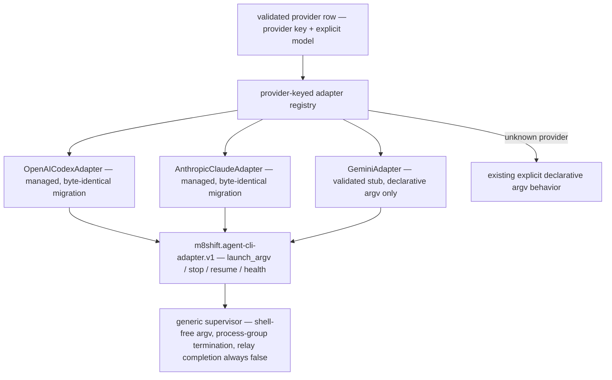
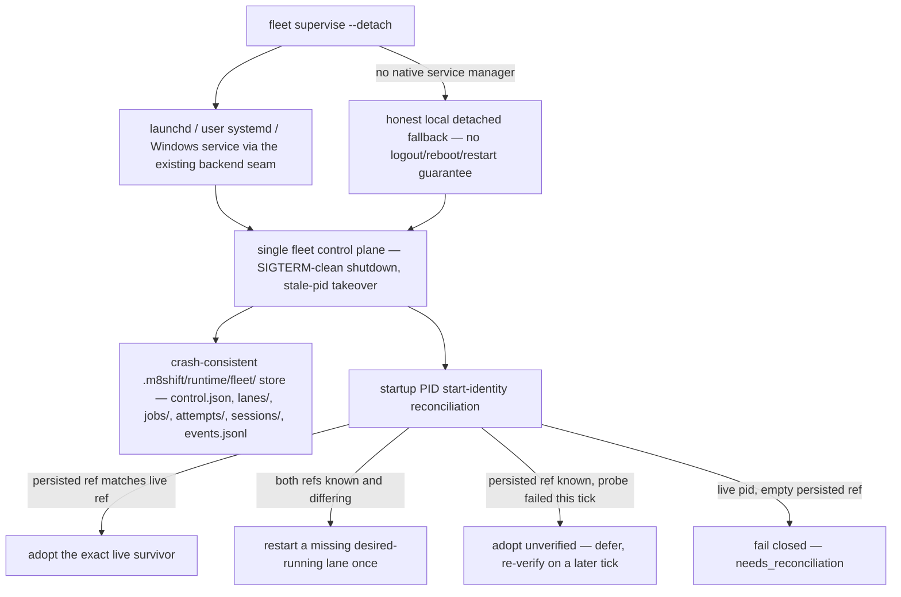

# RFC 073 — Adapter registry and detached orchestration delivery slices

- **Status:** slices 1–2 implemented in v3.61.0 (2026-07-16); slices 3–4
  accepted for implementation in separately reviewed batches
- **Date:** 2026-07-15
- **Scope:** concrete delivery plan for backlog #65/#66 and RFC 067 D1–D16
- **Builds on:** [RFC 067](067-rfc-detached-vendor-neutral-cli-orchestration.md),
  [RFC 070](070-rfc-provider-pinned-model-launch.md), and
  [RFC 072](072-rfc-exact-identity-fleet-bootstrap.md)

## 1. Outcome and boundary

This RFC turns RFC 067's accepted design into four independently reviewable
slices. It covers two coupled axes:

1. a versioned, provider-keyed CLI adapter interface as the execution spine;
2. detached supervision and durable local recovery that survive a frontend
   crash without moving authority out of the relay.

The relay protocol remains the single contract for every declared agent:

```text
wait/eligibility -> claim self -> work -> verify -> append self
```

Roster identities are data. They are not a fixed Claude/Codex pair. Adding a
vendor means adding and registering an adapter plus its conformance fixture; the
generic launcher, scheduler, fleet layer, runner, and passive core do not gain a
brand branch.

All orchestration stays in `m8shift-runtime.py`, its existing generic runner,
and ignored `.m8shift/runtime/` sidecars. `m8shift.py` gains no process,
provider, credential, model, scheduler, or recovery authority.

## 2. Decisions inherited unchanged

RFC 067 D1–D16 remain binding. This implementation uses:

- D1/D2: extend the runtime companion with a permanent control plane supervising
  one-shot attempts;
- D3: make a native user service the durable tier and label local detachment as
  weaker;
- D4/D5: migrate Codex and Claude first behind a hybrid declarative-argv plus
  narrow-hook adapter, then prove pluggability with Gemini;
- D6/D7: resume only when probed and ownership-safe; ambiguity becomes
  `needs_reconciliation`;
- D8–D11: begin sequentially, retain isolated RFC 072 worktrees and serialized
  integration, and defer automatic routing until capability evidence exists;
- D12–D15: keep bounded process-group stop, network-off defaults, reference-only
  secrets, and evidence-preserving retention in the generic control plane;
- D16: require probe, conformance, and explicit acceptance before a stub becomes
  a live provider adapter.

RFC 072 O1–O6 also remain unchanged: exact identities fail closed, models are
explicit, membership changes are holder-attributed core calls, stopping does not
change the roster, jobs are immutable and independently verified, and only the
relay-designated integrator merges or hands off.

## 3. Adapter interface

`m8shift.agent-cli-adapter.v1` is a Python runtime-companion interface registered
by provider key. Its foundational lifecycle surface is:

| Method | Slice-1 contract |
|---|---|
| `launch_argv(row, prompt, run_id, platform)` | return one shell-free argv array; managed model/identity fields come only from the validated row |
| `stop(process_ref, mode)` | return normalized graceful/force intent; the generic supervisor performs process-group termination |
| `resume(row, prompt, session_ref, ...)` | render only when the adapter declares probed resume support; otherwise fail closed |
| `health(process_ref, session_ref)` | normalize lifecycle observation and always keep relay completion false |

The registry owns dispatch. Unknown providers retain the existing explicit,
declarative argv behavior; becoming a managed adapter requires registration and
conformance. The interface never executes a shell string, persists a raw session
reference, signals a process itself, or infers an authored relay transition.

### Slice 1 status

Implemented in this change:

- formal `AdapterInterface` and provider-keyed registry;
- managed `openai-codex` and `anthropic-claude` adapters;
- compatibility wrappers dispatching all existing launch call sites through the
  registry;
- a registered `google-gemini` validated stub using declarative argv only, with
  live flags and resume deliberately unclaimed until probe evidence exists;
- conformance checks for registry dispatch, the four lifecycle methods,
  fail-closed resume, session-ref non-disclosure, and zero-core-change plugin
  registration;
- byte-identical pre/post-refactor launch compilation fixtures for Codex and
  Claude, in addition to the existing exact argv and exact-identity tests.

Slice 1 activates no detached process, durable scheduler, live Gemini launch, or
provider-native resume.



## 4. Detachment backend choice

Extend the RFC 072 fleet supervisor into the durable control plane. Do not add a
second daemon beside it.

| Candidate | Decision | Reason |
|---|---|---|
| extend RFC 072 supervisor | selected | already owns desired fleet lifecycle, jobs, worktrees, integration gates, listener reconciliation, and doctor evidence |
| `setsid`/`nohup` | fallback only | can survive a frontend/terminal loss but has no restart or durable reconciliation contract |
| `tmux` | documented manual fallback only | operator-visible but not a portable machine-owned state/restart interface |
| `launchd` alone | backend, not architecture | correct macOS durable tier but must supervise the same provider-neutral control plane |
| user `systemd` alone | backend, not architecture | correct Linux durable tier under the same control-plane contract |

The existing listener backend selection remains the OS abstraction. Slice 2
makes the fleet supervisor itself service-installable and service-observable
using the established launchd/systemd/native-Windows adapters. A local detached
backend remains available but must report that it does not guarantee logout,
reboot, or automatic restart survival.

## 5. Durable store and recovery

Slice 2 extends, rather than duplicates, RFC 072 state under:

```text
.m8shift/runtime/fleet/
  control.json
  lanes/<lane-id>.json
  jobs/<job-id>.json
  attempts/<attempt-id>.json
  sessions/<opaque-id>.json
  events.jsonl
```

Rules:

- desired lane/job records and resolved attempt plans are versioned;
- an attempt plan is immutable and a retry/resume gets a new attempt id;
- transitions append to `events.jsonl`; derived health is rebuildable;
- writes are atomic, project-bound, non-symlink-following, and restricted where
  supported;
- session references are opaque, redacted from events/output, and scoped to the
  same project, agent, adapter, and job;
- active-attempt and reconciliation evidence cannot be pruned;
- startup reconciles store, process start identity/group, service state, relay,
  worktree, last event, usage hold, and adapter health before any launch;
- ambiguous ownership, missing evidence, or a half-written record fails closed
  to `needs_reconciliation`, never to a duplicate launch or success.

An IDE or extension crash is irrelevant to the service-owned supervisor. After
frontend restart, the client reads the same durable records. The relay remains
portable and authoritative if the ignored runtime store is deleted; only local
orchestration history is lost.

## 6. Concrete delivery slices and gates

### Slice 1 — adapter spine (implemented here)

Deliver the interface, registry, migrated reference adapters, and Gemini stub.

Acceptance gates:

1. Registry dispatch is keyed solely by the provider row.
2. A test-only provider registers and launches without a generic call-site or
   core change.
3. Codex and Claude launch argv remain byte-identical for default, configured,
   platform-selected, and exact-identity cases.
4. Gemini is explicitly a stub: declarative argv works; resume fails closed;
   health cannot imply relay completion.
5. Existing provider, listener, fleet, and full repository tests remain green on
   Python 3.8-compatible syntax.

### Slice 2 — detached durable fleet control plane

Extend the RFC 072 supervisor with the store in §5, service-owned lifecycle,
process start identity, process groups, and startup reconciliation. Reuse its
desired fleet, jobs, assignments, and integrator gates.

Acceptance gates:

1. A supervised fake agent remains running when its launching frontend process
   is terminated, and the reported backend tier is honest.
2. Killing/restarting the control plane reconstructs the same lane/attempt state
   without a duplicate provider launch.
3. Live, missing, reused, and ambiguous PIDs are distinguished with process
   start identity; ambiguity becomes `needs_reconciliation`.
4. Graceful stop escalates to full process-group kill after bounded grace and
   does not mutate roster membership or relay state.
5. A half-written record, stale session ref, active usage hold, or mismatched
   project binding fails before launch.
6. launchd, user-systemd, native-Windows, and local fallback selection use the
   existing backend seam; deterministic tests require no real service manager.

Implemented in this change:

- crash-consistent `control.json`, strict per-identity lane records, and opaque
  project/agent/adapter/model-bound session records;
- PID start-identity reconciliation that adopts exact live survivors, restarts
  a missing desired-running listener once, and refuses reused or ambiguous PIDs;
- adapter-dispatched health, optional resume with fresh-listener fallback, and
  process-group stop intent, with active usage holds checked before launch;
- one `fleet supervise --detach` surface using native launchd, user-systemd, or
  Windows service definitions through the existing probe seam, with an honest
  local detached fallback;
- deterministic conformance tests for survivor adoption, restart without a
  duplicate launch, corrupt-record refusal, and native-service plan rendering.

Slice 2C hardens that implementation with an atomic `O_EXCL` supervisor startup
lock, post-detach child/control confirmation, and the explicit audited
`fleet resolve` repair command. Persistently unreadable desired-running lanes
can be cleared for one fresh start only after an attributed operator confirms
the prior process is gone; ambiguous PIDs are never signalled automatically.



### Slice 3 — live Gemini and resume

Probe a supported Gemini CLI/version, replace the validated stub with a managed
adapter, and implement native resume only for adapters/versions whose session
ownership and flags are proven. Fresh one-shot reconstruction remains mandatory
fallback. Mistral Vibe remains a documented TBD adapter until its product and
CLI contract are confirmed; it is neither hard-coded nor an onboarding blocker.

Acceptance gates:

1. Probe evidence freezes executable version, headless/model flags, structured
   output, and resume capability before launch.
2. Gemini passes the same fake-project suite as the reference adapters and adds
   no brand branch to core, runner, scheduler, or fleet callers.
3. Native resume accepts only a project/agent/job/adapter-bound opaque reference;
   cross-project, expired, unsupported, or ambiguous references fail closed.
4. A provider session or exit zero never advances a job without its verification
   recipe and required authored relay transition.
5. Secret/session references are absent from persisted plans, events, CLI output,
   diagnostics, and relay turns.

### Slice 4 — #59 routing-matrix extension

Extend the operator-owned RFC 039/#59 catalog after live adapter capability
evidence exists. Routing starts as a recorded recommendation over explicit jobs;
automatic launch remains separately preauthorized.

Acceptance gates:

1. Capability, context, permission, and policy floors exclude ineligible models
   before cost or usage comparison.
2. Provider/model choice, source date, evidence source, reason, and override are
   frozen in the attempt plan.
3. An implicit global CLI model cannot replace the pinned selection.
4. Missing/stale matrix evidence escalates rather than silently downgrading.
5. Adding an accepted provider extends adapter registration and catalog data,
   not the routing algorithm.

## 7. Cross-slice proof floor

Every slice must additionally prove:

- `m8shift.py` remains passive and provider-neutral;
- the runtime never claims, appends, releases, or completes for an agent;
- RFC 072 O1–O6 and degree-1 integration remain intact;
- provider/task text is untrusted data and cannot alter authority;
- all process launches use argv arrays with `shell=False`;
- exact claims use raw source/diff/log evidence, not compressed output;
- raw leak scans contain no foreign project identity, path, credential, session
  reference, or copied status/log capture;
- stopping after a batch follows RFC 062: non-`DONE` relays retain an armed
  listener/waiter under the host's actual wake-up capability.

## 8. Completion definition

Backlog #66 is complete when a live third provider passes D16 onboarding without
a generic/core change. Backlog #65 is complete when a native-service-backed
control plane survives frontend loss, reconciles after its own restart without
duplicate work, and exposes the same durable lane/job/attempt state after client
reconnection. Slice 1 alone is foundational progress, not completion of either
backlog item.
