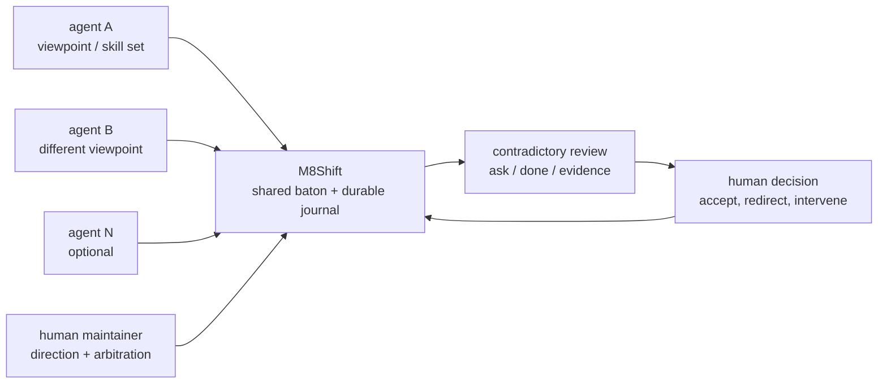
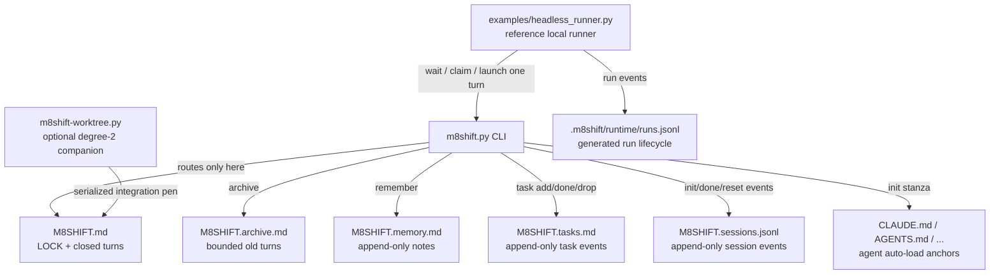
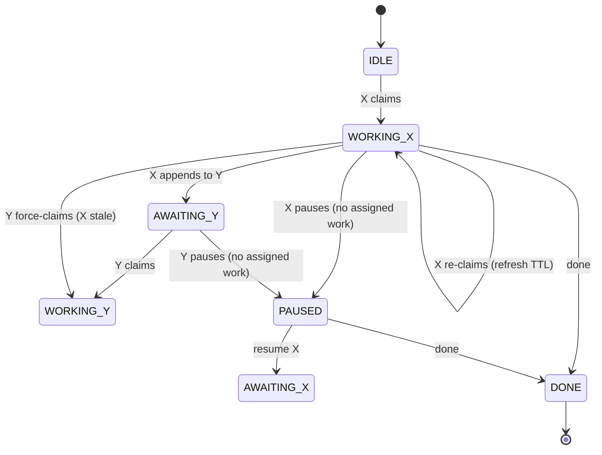

# Specification — M8Shift

> **Status**: `Current` · **Version**: protocol v1 · **Last reviewed**: 2026-06-25

---

## 1. Object

`m8shift.py` lets an **active roster of ≥2 AI agents** (e.g. Claude, Codex, Gemini, Vibe, …) work on the same repository
**without stepping on each other**, coordinating through a **single shared
file** `M8SHIFT.md`, in strict alternation (cooperative mutex). The system must be
**portable to any project** and **usable by the agents without a human having to
explain the protocol** (it is self-contained). *Limit*: in interactive agent UIs a
human still nudges each agent to resume between turns — see §8.

## 2. Scope

| Included | Excluded |
|----------|----------|
| Single-file lock, turn journal, control CLI | Network / multi-machine orchestration |
| Idempotent self-install (`init`) into any project | A second simultaneous writer **in the core** (degree-2 lives in the opt-in [`m8shift-worktree.py`](rfc/008-rfc-worktree-companion.md) companion) |
| Anti-deadlock via TTL, bounded archiving | Resident daemon, persistent queue |
| `CLAUDE.md` / `AGENTS.md` anchors | Authentication / encryption of the state file |
| Local Stage-6 integration layer: installers, checksums, `watch`, reference headless runner | Provider SDKs, hosted control plane, IDE/MCP/orchestrator runtimes inside the core |

## 3. Actors

| Actor | Role |
|-------|------|
| **active agent (N≥2)** | the configured active roster (default `claude` → `CLAUDE.md`, `codex` → `AGENTS.md`); each agent reads its own anchor and operates the relay on its side |
| **maintainer** | Human; deploys the kit, arbitrates, reads the journal |

### 3.1 Product philosophy

M8Shift exists because different AI agents do not converge to the same judgement.
They evolve at different speeds, have different strengths, and can disagree on
technical, editorial, legal, or strategic choices. The useful property is not just
"more agents"; it is a **structured contradictory review** where several competent
views can challenge each other while the human maintainer keeps the final decision.

The project turns that practice from manual copy/paste between siloed agent UIs into
a shared workspace: each agent can hand off context, ask for review, and receive the
other agent's critique without the maintainer becoming a message courier. M8Shift is
therefore a peer-coordination primitive, not a manager agent: it gives teammates a
shared baton, a durable record, and a safe alternation rule. See the longer rationale
in [philosophy.md](philosophy.md).



## 4. Functional requirements

| ID | Requirement | Verified by |
|----|-------------|-------------|
| EF-1 | **`claim` mandatory and exclusive before working**: it acquires `WORKING_<self>` from `IDLE`/`AWAITING_<self>`; simultaneous `claim` calls ⇒ only one succeeds, the others are excluded. | `test_claim_exclusive_sequential`, `test_concurrent_claim_claude_vs_codex_single_winner` |
| EF-1b | `append` is accepted **only from `WORKING_<self>`** (hence after `claim`) → guarantees exclusivity of the **work window** in the repository, not just of the journal. | `test_append_requires_claim_from_idle`, `test_append_requires_claim_from_awaiting` |
| EF-2 | `append` writes the next turn **and** hands off (`AWAITING_<other>`) in one atomic operation; `turn` is incremented. | `test_handoff_increments_and_alternates` |
| EF-3 | A closed turn (`END`) is immutable (by convention: the tool never rewrites it). | (review) |
| EF-4 | `--to` must target a different roster agent (self-handoff forbidden). | `test_self_handoff_refused` |
| EF-5 | `wait <agent>` waits for the agent's turn; `--once` performs a single check (rc 0 = its turn, rc 3 otherwise). | `test_wait_once_return_codes` |
| EF-5b | `next <agent>` is the safe resumption command: it waits if needed, then claims and prints the last handoff; `--once` is non-mutating when not ready, and `--force` only recovers a stale lock. | `test_next_claims_and_prints_handoff_when_ready`, `test_next_once_not_ready_does_not_mutate` |
| EF-6 | `claim --force` reclaims **only a stale lock**; refused on an active lock. | `test_force_refused_on_fresh_lock`, `test_force_accepted_on_stale_lock` |
| EF-7 | The holder can reclaim its own lock (refresh the TTL). Long-running wrappers should heartbeat with `claim <me>` at least 5 minutes before expiry. | `test_reclaim_own_lock_refreshes` |
| EF-8 | `release` / `done` are baton-owner ops: act if the caller is the `holder` (pen holder in WORKING / awaited agent in AWAITING) or nobody does; `--force --reason TEXT` overrides and is recorded in the session ledger. `release` additionally refuses to bounce the latest incoming turn addressed to the caller unless `--force --reason` is used, so a real handoff must be read/answered with `peek` + `append` instead of silently released. `append` (the work-write) needs `WORKING_<self>`. | `test_release_done_require_holder`, `test_release_done_force_overrides`, `test_release_refuses_to_bounce_pending_incoming_turn`, `test_release_force_can_bounce_pending_turn_with_audit_reason`, `test_doctor_security_highlights_force_event` |
| EF-9 | `archive --keep N` purges old closed turns without ever moving the bootstrap turn `#0` or touching the lock. | `test_archive_preserves_system_turn0` |
| EF-10 | `init` generates `M8SHIFT.md`, `M8SHIFT.protocol.md` and injects the anchors; idempotent (stanza not duplicated, existing content preserved, `M8SHIFT.md` not overwritten except with `--force`). | `test_reinit_idempotent_preserves_content`, `test_init_force_resets_lock` |
| EF-11 | Auto-loadable anchors on a case-sensitive or case-insensitive FS: a unique variant is renamed to `CLAUDE.md`/`AGENTS.md`, including in the index if Git is available and tracks it; ambiguous variants are refused. | `test_anchor_case_insensitive_no_duplicate`, `test_codex_anchor_is_canonical_on_case_sensitive_fs`, `test_tracked_anchor_case_rename_updates_git_index`, `test_ambiguous_anchor_variants_refused` |
| EF-12 | The stanza is idempotent and placed at the head of the anchors; if `AGENTS.override.md` exists, it is synchronized in the override and in `AGENTS.md`. | `test_stanza_is_moved_to_anchor_start`, `test_codex_override_also_receives_stanza` |
| EF-13 | If the project had `CLAUDE.md` but no Codex instructions, `init` creates in the new `AGENTS.md` a bridge to the common instructions in `CLAUDE.md`; a pre-existing Codex anchor stays autonomous. | `test_missing_agents_bridges_existing_claude_instructions`, `test_existing_agents_does_not_receive_claude_bridge` |
| EF-14 | `history` shows one folded entry per relay session: session id, start/end, state, agents, turn count, agents used and version; `--json` exposes the same data. | `test_init_records_session_and_history`, `test_history_counts_turns_and_done`, `test_force_init_marks_previous_session_reset` |
| EF-15 | Human-facing timestamp output keeps canonical UTC (`...Z`) and adds the user's local time prefixed by the timezone name/offset when available (otherwise `local`); `status` also derives read-only session `started`/`duration` metadata from `M8SHIFT.sessions.jsonl`; machine-readable JSON remains canonical UTC only. | `test_display_time_keeps_utc_and_adds_timezone_prefixed_local_time`, `test_display_duration`, `test_status_and_recap_show_timezone_prefixed_local_time`, `test_status_json`, `test_status_shows_timezone_prefixed_local_time` |
| EF-16 | Operator-loop guardrails keep agents from stopping mid-relay: `status --for <agent>` prints/serializes the next safe action, `next <agent>` claims + peeks when ready, `append --wait` blocks after handoff until the caller's next turn or `DONE`, and plain `release` cannot silently skip a pending turn addressed to the caller. | `test_status_for_prints_and_serializes_next_action`, `test_append_wait_blocks_until_agent_turn_returns`, `test_release_refuses_to_bounce_pending_incoming_turn` |
| EF-17 | `watch [--for agent]` is a foreground, read-only live view over `status`: it can refresh a terminal automatically, but never claims, hands off, repairs, or force-recovers. | `test_watch_once_is_read_only_and_shows_next_action`, `test_watch_interval_invalid_clean_exit` |
| EF-18 | Stage-4 contract metadata is accepted on `append` via dedicated flags and/or `--field`; `contract validate` and `doctor --contracts` validate it read-only, with strict mode failing malformed `schema=stage4.v1` turns only when explicitly requested. | `test_contract_sugar_fields_written_and_validate_clean`, `test_contract_validate_warns_by_default_but_strict_fails`, `test_doctor_contracts_includes_contract_findings` |
| EF-19 | The local install layer ships copy/download recipes, `checksums.sha256`, Bash and PowerShell installers, and version surfaces for distributed scripts. Verification is enabled by default and `--no-verify` is an explicit opt-out. | `test_default_verifies_and_rejects_tampered`, `test_no_verify_skips`, `test_verify_flag_still_verifies`, `test_manifest_matches_files` |
| EF-20 | `examples/headless_runner.py` is a reference local runner for one headless agent lane: it waits/claims through the core, launches one static command, refreshes the TTL heartbeat before expiry, passes `M8SHIFT_RUN_ID`, and appends lifecycle events to `.m8shift/runtime/runs.jsonl`. | `test_headless_runner_once_writes_run_ledger_and_env_run_id`, `test_headless_runner_reads_m8shift_lock` |
| EF-21 | `pause <holder> --reason` parks an open session with no active task as `PAUSED`/`holder=none`; `resume <agent> --reason` or `next <agent> --resume --reason` explicitly assigns new user scope before any claim can proceed. `doctor` warns on parked `WORKING_*` notes and ack-bounce livelocks. | `test_pause_parks_session_and_resume_is_explicit`, `test_pause_requires_current_holder_and_release_refuses_paused`, `test_doctor_warns_when_working_note_parks_the_pen` |
| EF-22 | `session list/show/decisions/report` derives session views and Markdown reports from existing turns and session events. Report writes are explicit, path-confined, atomic, reject reserved M8Shift coordination/distributed-script files even with `--force` and case variants, and never mutate the `LOCK`; structured decisions are extracted only from `schema=stage4.v1 relation=review_result decision=approve|revise|reject|waive`. | `TestSessionReports` |

## 5. Non-functional requirements

| ID | Requirement |
|----|-------------|
| ENF-1 **Portability** | Works on an empty folder or a git repository, paths with spaces/accents, case-sensitive or case-insensitive FS. Python 3.8+, **stdlib only**, no third-party package. Runs on **Linux, macOS and Windows** (WSL, Git Bash, native PowerShell installer, or native `python m8shift.py`; see the Windows how-to). |
| ENF-2 **Atomicity** | Every write (including the archive) goes through a **unique** temporary file + `os.replace`, **preserving the mode** of the target file; serialized by an inter-process lock (`.m8shift.lock`, `O_EXCL`, ownership token). |
| ENF-3 **Agent autonomy** | The whole procedure is embedded: `M8SHIFT.protocol.md` (§0 quickstart) + the anchors' stanza. No human explanation required. |
| ENF-4 **Robustness** | Invalid inputs (unknown agent, missing `--body`, oversized `--body` without `--allow-large-body`, oversized single-line fields, malicious `init --name`, malformed session JSON, missing `M8SHIFT.md`, **LOCK with invalid schema**: `state`/`turn`/`holder`) → clean `sys.exit` exit, never a traceback, never a corrupted state. |
| ENF-5 **Endurance over time** | `M8SHIFT.md` stays bounded via `archive`; the archive is never re-read by the loop. Session starts/closes live in append-only `M8SHIFT.sessions.jsonl`, folded only by `history`, never by the mutex/routing loop. |
| ENF-6 **Readability** | State and turns readable by eye and with `grep`; markers in HTML comments invisible in the Markdown rendering; versionable in plain text. |
| ENF-7 **Bootstrap** | Anchor names follow the auto-loaded conventions; the stanza takes priority in the file and the Codex discovery limits (override, root, size cap, per-session reload) are documented. |
| ENF-8 **Internationalization (i18n)** | The shipped `m8shift.py` is **English-only**; localized single-file variants are built from `i18n/<lang>/` packs with `m8shift-i18n.py`. `init --lang <code>` selects a bundled language (recorded in the LOCK `lang` field); `$M8SHIFT_LANG` overrides the runtime message language. `m8shift-i18n.py --name` must remain a basename inside `--into`. |
| ENF-9 **Zero credentials / any surface** | `m8shift.py` makes **no network call** and needs **no API key, token or account**; it relies entirely on the host agents' own auth. It runs on every Claude Code / Codex surface (terminal/CLI, desktop app, IDE/VS Code, web) — interactive UIs need a human nudge between turns, a headless CLI loop automates fully. |
| ENF-10 **Free and open source** | M8Shift is free and open source under the Apache License 2.0; the coordination state stays in ordinary project files and the source can be audited, copied, modified and redistributed under that license. |
| ENF-11 **Integration boundary** | Stage-6 integrations are local convenience layers around the passive core. Installers may download/copy scripts and verify checksums; the reference runner may launch a user-supplied command; future provider/IDE/MCP/control-plane layers stay optional companions and must not become core routing authority. |

> **i18n authoring (note).** The shipped `m8shift.py` is **English-only** (the canonical
> source of every message key and template). Other languages live as packs under
> `i18n/<lang>/` (messages.json + four template bodies); `m8shift-i18n.py --langs fr,es
> --into DIR` splices chosen languages into a single self-contained variant (KNOWN_LANGS-
> validated, raw-string-safe, round-trip-checked, byte-reproducible). Packs: fr
> (human-authored) + es,it,de,pt,ja,ru,zh-cn (machine-translated, review-pending). Runtime
> = one file; authoring = the injector. See CONTRIBUTING.md and `docs/en/rfc/`.

## 6. Data model — files and `LOCK`

M8Shift keeps routing state in `M8SHIFT.md` and keeps every advisory surface in a
separate append-only or read-only sidecar. Sidecars improve observability and resumption
without becoming a second routing source.



### 6.1 The `LOCK` block

At the head of `M8SHIFT.md`, between `<!-- M8SHIFT:LOCK:BEGIN -->` and `:END`:

| field | type | values |
|-------|------|--------|
| `holder` | enum | pen holder (WORKING) \| awaited baton-owner (AWAITING) \| `none` (`IDLE`, `PAUSED`, `DONE`) |
| `state` | enum | `IDLE` \| `WORKING_<X>` \| `AWAITING_<X>` \| `PAUSED` \| `DONE` (one per active agent where applicable) |
| `agents` | CSV \| absent | the active roster (all declared agents, ≥2; default `claude,codex`) |
| `session` | id \| absent | current session id (`YYYYMMDDTHHMMSSZ-xxxxxxxx`); absent in legacy files |
| `turn` | integer | number of the last closed turn |
| `since` | ISO-8601 UTC | how long the state has lasted |
| `expires` | ISO-8601 UTC \| `-` | anti-deadlock TTL; date **only** during `WORKING_*` |
| `note` | text | readable memo |
| `lang` | enum \| absent | a KNOWN_LANGS tag (`en`, `fr`, `es`, …) — language of generated files / runtime messages; the EN-only core bundles `en` |
| `integrating` | optional sentinel | in-flight worktree merge (`<id>@<sha>`), only while `WORKING_<holder>` |

Timestamps are stored as ISO-8601 UTC with `Z` to keep TTL comparisons stable across
agents and machines. Human-facing commands (`status`, `recap`, `history`, `task show`,
and the worktree companion's `status`) also append the user's local time prefixed by
the timezone name/offset when available (otherwise `local`); JSON output keeps UTC
values only.

`status` additionally derives two display-only session lines from
`M8SHIFT.sessions.jsonl` when possible: `started` (session start timestamp) and
`duration` (elapsed session duration, or duration until close/reset for a finished
session). The same metadata is exposed by `status --json` as
`session_started_at`, `session_duration_seconds`, and `session_duration`; unavailable
values are serialized as `null` in JSON. This metadata never feeds claimability, TTL
expiry, or routing.

The optional local runtime sidecar `.m8shift/runtime/` is generated by integrations
such as `examples/headless_runner.py`. Its `runs.jsonl` records run lifecycle events
(`run.started`, `run.heartbeat`, `run.ended`, …) and may be inspected by `doctor`, but
deleting `.m8shift/runtime/` never corrupts `M8SHIFT.md`, the turn log, or claimability.

### 6.2 State machine

Legitimate transitions:



## 7. Command-line interface

`init [--agents a,b,c…] [--lang …]` · `status [--for agent] [--json]` · `watch [--for agent] [--interval N] [--clear] [--changes-only]` · `doctor [--lint] [--json] [--security] [--contracts] [--severity-min …]` ·
`contract validate [--strict] [--json] [--all] [--severity-min …]` ·
`recap [--turns N] [--memory N] [--tasks N]` ·
`wait <agent> [--once] [--interval N]` · `next <agent> [--once] [--interval N] [--force] [--resume --reason TEXT]` · `claim <agent> [--force]` · `claim <agent> --check [--files CSV] [--turns N]` ·
`peek <agent>` · `log [--limit N] [--all] [--oneline]` · `history [--limit N] [--oneline] [--json]` ·
`session list|show|decisions|report …` ·
`append <agent> --to <other> --ask … --done … [--files …] [--body f|-] [--allow-large-body] [--wait] [--branch/--commit/--tests/--next/--blocked-on …] [--schema/--relation/--role-from/--role-to/--requires/--expected-output/--evidence/--decision/--waiver-reason/--permissions …] [--field k=v]` ·
`release <agent> --to <other> [--force --reason TEXT]` (no-body handoff; refuses a pending incoming
turn unless forced with an audited reason) · `done <agent> [--force --reason TEXT]` · `archive [--keep N]` ·
`pause <holder> --reason TEXT` · `resume <agent> --reason TEXT` ·
`remember <agent> "<note>"` · `task add|done|drop <agent> … | task list|show …`

> The single shipped file is **English-only**; `--lang` selects among languages bundled into
> a localized variant built with `m8shift-i18n.py` (see the i18n note).

Return codes: `0` success · `1` refusal/error (state, guardrail, invalid input) ·
`2` argparse usage · `3` `wait --once` when it is not the agent's turn.

## 8. Constraints & known limits

- **Waking an interactive agent UI**: `wait` blocks a *process* until your turn, but it
  does **not** relaunch or wake an agent running in an interactive UI (VS Code, …).
  Between turns a human nudges each agent (e.g. *"resume M8Shift"*). Fully hands-off
  operation needs a **headless** loop (`claude -p`, `codex exec`, cron) wrapping
  `wait → relaunch the agent → claim` — a host integration, not a change to the mutex. A
  notification/webhook can *signal* a turn but cannot *wake* the AI by itself. The
  shipped local host-side answer is `m8shift-runtime.py` for presence, operator inbox,
  progress, and runtime diagnostics; see [009-rfc-runtime-companion.md](rfc/009-rfc-runtime-companion.md).
- **Installer vs `init` boundary**: `init` initializes M8Shift state and anchors in the
  current project. It does **not** copy `m8shift.py`, `m8shift-worktree.py`,
  `m8shift-runtime.py`, language variants, or installers into a target directory.
  Script deployment is handled by
  explicit copy/download recipes or the Bash/PowerShell installers, which can also
  verify `checksums.sha256`.
- **Work-window exclusivity**: guaranteed by `claim` (exclusive acquisition of
  `WORKING_<self>`) + `append` restricted to `WORKING_<self>`. It relies on the
  **discipline** claim→work→append; M8Shift cannot lock the file system, so an
  agent that edits the repository **without** having claimed is not prevented by
  the tool (but will not be able to `append`).
- **Exclusivity by identity, not by instance**: `claim` excludes the **other**
  agent (claude vs codex), but several processes of the **same** agent all succeed
  in their `claim` (treated as a TTL refresh). M8Shift does not distinguish two
  instances of `claude`; the model assumes one instance per identity.
- **Cooperative, not enforced, mutex**: a malicious agent can, with `--force --reason`,
  override `release`/`done`. The reason is audited but not an authorization boundary.
  The model assumes cooperative roster members (one running instance per identity).
- **Concurrency serialized by an advisory lock**: `.m8shift.lock`
  (`O_CREAT|O_EXCL`, ownership token) serializes the read-modify-write + atomic
  write. *Advisory* lock: a manual edit of `M8SHIFT.md` bypasses it; on a network
  FS (NFS) `O_EXCL`/`rename` are less reliable (M8Shift targets a local disk).
- **Immutability by convention**: the tool never rewrites a closed turn, but
  nothing at the file-system level prevents it (manual edit).
- **N-agent roster, one pen (current)**: an active roster of ≥2 agents relays through a
  single **degree-1 mutex** — any holder hands the pen to any other member via `--to`, one
  writer at a time (`init --agents a,b,c…`; see [RFC — roster](rfc/001-rfc-roster.md), now superseded
  by this generalized model). **Shipped (off-core)**: **N concurrent writers** via the opt-in
  [`m8shift-worktree.py`](rfc/008-rfc-worktree-companion.md) companion — isolated git worktrees in parallel
  plus a single serialized integration pen, layered on this same degree-1 core.
- **Anchor loading**: it depends on the host tool. Codex builds its instruction
  chain once per execution, gives priority to `AGENTS.override.md` in a folder
  and applies a size cap (32 KiB by default), truncating the last file to the
  remaining budget. `init` covers the local override and places the stanza at the
  head, but can neither reload an open session nor compensate for a global
  configuration that already consumes the entire cap.

## 9. Acceptance / validation

- `tests/test_m8shift.py` suite (unit + non-regression: claim model, one-pen mutex,
  N-agent relay, canonical/override anchors, configurable roster, advisory turn fields,
  shared memory, `claim --check`, tasks board, archive, robustness, anti-injection,
  Stage-4 contract validation, `watch`, installer checksum verification, reference
  headless runner lifecycle, runtime sidecar health),
  `python3 -m unittest discover -s tests`, with no external Python dependency (the
  Git integration test is skipped if Git is absent).
- Multi-agent adversarial verification + 3 successive Codex reviews, each finding
  reproduced then fixed then re-tested.
- Documentary non-regression test: `docs/en/protocol.md` and `docs/fr/protocole.md`
  must stay byte-identical to `m8shift.PROTOCOL["en"]` and the `i18n/<lang>/protocol.md` pack body (`test_protocol_docs_in_sync`).

## 10. Versioning

Protocol **v1**. Any **breaking** change to the `LOCK`/`TURN` format or to the
markers increments the protocol version and must preserve the reading of existing
`M8SHIFT.md` files or provide a migration.

The roster `agents:` field is a **backward-compatible optional
addition** within v1, not a breaking change: a roster-unaware reader ignores it and
keeps working **for the default `claude,codex` pair**. A *custom* roster, however,
requires a roster-aware script — an old script would treat it as `claude,codex` and
could corrupt it. The markers and the one-`key: value`-per-line format are unchanged.

## 11. Developing M8Shift with M8Shift (dogfooding)

M8Shift can coordinate **its own development** — two agents editing `m8shift.py` and the
repo through the relay. One precaution is decisive: here the **tool is also the
artifact**. Every `m8shift.py <cmd>` reloads the file from disk, so a transient syntax
error in the source under edit would break the relay itself.

**Pattern — decouple the engine from the source under edit.** Run the relay from a
**frozen copy** of `m8shift.py` in a **separate working directory** outside the repo.
Because the lock, journal and anchors are created next to the engine
(`HERE = __file__`), all relay state lives there and the repo's working tree stays
clean:

```text
Code/
├── m8shift/                ← the repo (edited here — the real work)
│   └── m8shift.py           ← source under modification
└── m8shift-relay/          ← relay working directory (outside the repo)
    ├── m8shift.py           ← FROZEN copy = the engine
    ├── M8SHIFT.md           ← coordination journal + LOCK
    ├── M8SHIFT.protocol.md · CLAUDE.md · AGENTS.md
    └── .m8shift.lock
```

- The engine updates **only** on an explicit `cp` — a momentarily broken `m8shift.py`
  in the repo never affects coordination.
- The anchors live in the relay directory, not the repo root, so **auto-bootstrap does
  not fire**: each agent is pointed manually at the relay's `M8SHIFT.protocol.md` (the
  documented "no project root" case). Discipline is unchanged — an agent edits the repo
  **only** while holding the pen, and keeps the repo copy of `m8shift.py` importable (`ast.parse`)
  before each `append`.
- When the relay directory and the work repository differ, **all relay commands**
  (`status`, `claim`, `peek`, `append`, `release`, `wait`, `done`) must run from the
  relay directory or through an absolute relay path. Running `m8shift.py` from the
  repository under edit may hit a different local relay file and create a false sense
  of ownership.

This is exactly how the roster work was reviewed: Claude implemented,
then handed off to Codex for an adversarial review through a frozen relay in
`m8shift-relay/`. A **git worktree** of the repo would *not* decouple the engine (it
tracks the same branch, so its `m8shift.py` changes on edit) — use a frozen copy.

### 11.1 Detecting skew & promoting the engine

The frozen relay copy drifts from the repo as the tool evolves — the **coordinator** (the relay's
engine) and the **subject** (the repo's `m8shift.py` under edit) are two roles of the same file
and must be kept distinct. The **version stamp** makes the drift visible: `m8shift.py --version`
reports the script version, `status`/`recap` print `m8shift.py v<VERSION>`, and the generated
`M8SHIFT.md` banner records the version that wrote it. Compare `--version` across the two locations
to spot a stale coordinator (and bump `VERSION` on every release so the comparison is meaningful).
All tracked Python scripts expose their own `--version` too (`m8shift-i18n.py`,
`m8shift-runtime.py`, `m8shift-worktree.py`, `examples/headless_runner.py`, `scripts/gen_docs.py`, and the
test runners) and are kept in lockstep with the core version by tests.

**Stable-version policy.** The dogfooding relay is refreshed at **every stable version**. A stable
version is a commit or tag where the repo copy has passed the release checks and is safe to use as
the coordinator. Leaving the frozen relay on an older version is an exception, not the default, and
the maintainer should record why before continuing work.

**Promotion (refreshing the engine) is deliberate, but mandatory at each stable point:**

1. Edit + **test the repo copy in isolation** (`python3 -m unittest discover -s tests`) — the relay
   keeps running on the frozen, stable version, so a broken WIP edit never wedges coordination.
2. Commit / tag the repo when it reaches a stable point.
3. **Promote** the stable engine into the relay: `cp m8shift/m8shift.py <relay>/`, then confirm
   `m8shift.py --version` matches in both locations and `python3 <relay>/m8shift.py status` still
   reads the current session.
   - **Backward-compatible change** (docs, messages, new commands, a new *optional* LOCK field):
     promote any time — the in-flight `M8SHIFT.md` keeps working.
   - **Format / protocol-breaking change**: promote **and** reset the relay (`init --force`) so the
     `M8SHIFT.md` is rewritten by the new engine; the prior in-flight file may be incompatible.

So "the tool that coordinates" stays stable and tested while "the tool being developed" is freely
broken and fixed; the version stamp plus the stable-version promotion rule prevents the two from
silently diverging for long.

## 12. Implemented RFC surfaces & non-goals

The latest RFC line is now implemented in the current v3.x surface. Each accepted
feature stays within M8Shift's qualities (single-file, passive, zero-credential,
file-based and versioned): it is **append-only or read-only over data M8Shift already
stores**, or it lives in an opt-in companion that preserves the core's single pen.
Rejected ideas are kept explicit so future changes do not reopen settled trade-offs
without a new RFC.

RFCs are authored and maintained in English only, under `docs/en/rfc/`. Localized
documentation links to those canonical RFCs instead of keeping translated copies.

### 12.1 Shipped surfaces (v3.x)

All the staged read/handoff features have shipped (each via RFC → design panel →
implementation → adversarial review). They keep the qualities by being append-only or
read-only over data M8Shift already stores, and **never feed the mutex / routing**.

| RFC / source | Feature | Surface | Charter |
|--------------|---------|---------|---------|
| [004-rfc-memory.md](rfc/004-rfc-memory.md) | **Shared memory** | `remember <agent> "<note>"` appends to a gitignored, append-only `M8SHIFT.memory.md` (pen-free, `file_lock` only); `recap` shows the last N as headlines. | Dumb, file-ordered ledger; `remember` never calls `set_lock`, so memory can never feed mutex/routing. |
| [001-rfc-roster.md](rfc/001-rfc-roster.md) / [002-rfc-n-agents.md](rfc/002-rfc-n-agents.md) | **N-agent directed roster** | `init --agents a,b,c…`; `--to <agent>` directed handoffs to any other active roster member; generated anchors for known agents and `AGENTS.md` fallback for unknown cooperative agents. | Generalizes the original pair without changing the one-pen mutex; every turn still has one holder and one target. |
| [005-rfc-claim-check.md](rfc/005-rfc-claim-check.md) | **Advisory pre-claim check** | `claim <agent> --check [--files CSV] [--turns N]` reports readiness and exact file overlap with recent turns. | Takes no pen, mutates nothing; overlap never changes rc or feeds routing. |
| [006-rfc-tasks.md](rfc/006-rfc-tasks.md) | **Tasks board** | `task add/done/drop <agent> …` · `task list` · `task show` over append-only `M8SHIFT.tasks.md`; status is folded at read time. | Pen-free event log; `--for`/`blocked_on` are advisory text, never enforced by the mutex. |
| [011-rfc-session-history.md](rfc/011-rfc-session-history.md) | **Session history** | `history [--limit N] [--oneline] [--json]` folds append-only `M8SHIFT.sessions.jsonl` into one entry per session. | Observability only; start/done/reset events never feed claimability or routing. |
| [022-rfc-session-reports.md](rfc/022-rfc-session-reports.md) | **Session reports** | `session list/show/decisions/report`, `M8SHIFT.session-reports/<session-id>.md`. | Derived project memory; optional writes are path-confined, reject M8Shift coordination/distributed-script targets including case variants, and never mutate the `LOCK`. |
| [010-rfc-runtime-patterns.md](rfc/010-rfc-runtime-patterns.md) | **Read and diagnostic surfaces** | `recap`, `peek`, `log`, `status --json`, `doctor [--lint] [--json]`, timezone-prefixed local time in human output. | Read-only formatters/diagnostics over existing state; no repair, no routing decisions. |
| [003-rfc-i18n-packs.md](rfc/003-rfc-i18n-packs.md) | **Localized single-file variants** | `m8shift-i18n.py --langs … --into DIR` builds self-contained language variants from `i18n/<lang>/` packs; `init --lang` records the generated language in `LOCK`. | Runtime stays single-file and self-contained; packs are build inputs, not runtime dependencies. |
| Operator live view | **Passive monitoring** | `watch [--for <agent>] [--interval N] [--clear] [--changes-only]` repeats the status view in a terminal. | Foreground/read-only loop only; no daemon, no notification, no `claim`, no force recovery. |
| Operator-loop guardrail | **Safe resumption** | `next <agent>`, `status --for <agent>`, and `append --wait` keep an agent in the relay loop until its next turn or `DONE`. | `next` mutates only by performing the normal `claim`; hints are advisory; `append --wait` waits after the handoff and never changes routing. |
| [008-rfc-worktree-companion.md](rfc/008-rfc-worktree-companion.md) | **Opt-in degree-2 companion** | `m8shift-worktree.py claim/done/drop/status/integrate` uses isolated git worktrees and a serialized integration pen. | Parallel work stays off-core; the core remains degree-1 and only integration is serialized through the shared lock. |
| Protocol surface | **Advisory turn fields** | `append … --branch/--commit/--tests/--next/--blocked-on …` + open `--field k=v` (`x_*`) namespace, surfaced verbatim by `peek`. | Written verbatim, never interpreted; the engine routes on the `LOCK`, not turn fields. |
| [012-rfc-contracts-validation.md](rfc/012-rfc-contracts-validation.md) | **Stage 4 contracts and validation** | `append … --schema stage4.v1 --relation … --role-from/--role-to … --requires … --expected-output … --evidence … --decision … --waiver-reason … --permissions …`; `contract validate [--strict] [--json] [--all]`; `doctor --contracts`. | Typed metadata is validated only on explicit read-only commands; it never grants permissions, routes work, runs tools, or mutates the `LOCK`. |
| [017-rfc-stage6-integrations.md](rfc/017-rfc-stage6-integrations.md) | **Stage 6 local integration layer** | Bash/PowerShell installers, `checksums.sha256`, versioned distributed scripts, `watch`, site/docs sync, and `examples/headless_runner.py` with `M8SHIFT_RUN_ID`, heartbeat, and `.m8shift/runtime/runs.jsonl`. | Shipped local convenience layer around the passive core; provider/IDE/MCP/control-plane integrations remain optional companions. |
| [009-rfc-runtime-companion.md](rfc/009-rfc-runtime-companion.md) | **Runtime companion v1** | `m8shift-runtime.py watch/operator/progress/status-runtime/doctor`; `.m8shift/runtime/{presence.json,progress.jsonl,idempotency.jsonl,inbox/*.jsonl}`. | Local advisory sidecars only; no direct `M8SHIFT.md` edits and no second pen authority. |
| [018-rfc-agent-runtime-architecture.md](rfc/018-rfc-agent-runtime-architecture.md) | **Agent runtime architecture companion v1** | `m8shift-runtime.py init`, `roles`, `workflows`, `approve`, `report`; `.m8shift/{roles,workflows,policies,runs}`. | Local scaffold and reports only; removable without breaking the core relay. |
| [014-rfc-provider-management.md](rfc/014-rfc-provider-management.md) | **Provider management v1** | `m8shift-runtime.py providers init/list/show/check/render`; `.m8shift/providers.json`. | Host-side mapping from roster names to safe argv arrays; no provider SDK, secrets, or core routing authority. |
| [020-rfc-headless-runner-hardening.md](rfc/020-rfc-headless-runner-hardening.md) | **Headless runner hardening** | `examples/headless_runner.py --dry-run --turn-timeout --kill-grace`, argument validation, and `run.timeout` events. | Bounds stuck provider processes while preserving post-run validation and no force-steal rule. |
| [016-rfc-cooperative-turn-request.md](rfc/016-rfc-cooperative-turn-request.md) | **Cooperative turn request** | `request-turn`, `yield-turn`, `decline-turn`, `steer-turn --force`, and append-only `M8SHIFT.requests.md`. | Requests never make `claim` succeed; only explicit yield/force-steer changes routing, and `steer-turn` refuses fresh `WORKING_*`. |
| [021-rfc-pause-resume.md](rfc/021-rfc-pause-resume.md) | **Pause / resume** | `PAUSED`, `pause <holder> --reason`, `resume <agent> --reason`, `next --resume --reason`, and livelock doctor warnings. | Open session with no active task has no holder; no automatic claim until explicit user-scope resume. |

### 12.2 Stage 4 contract surface

[RFC — Stage 4 contracts and validation](rfc/012-rfc-contracts-validation.md) is now implemented as a
read-only validation surface: typed handoff contracts, explicit review decisions
(`approve`, `revise`, `reject`, `waive`), ergonomic append flags, `contract validate`, and
`doctor --contracts`. Its boundary is the same as the rest of the core: validation may report
warnings or strict errors when explicitly requested, but it does not route work, grant permissions,
run tools, or mutate the `LOCK`.

### 12.3 Future companion / research RFCs

The remaining future topics are now explicit RFCs:

- [RFC input — Neutral runtime patterns inventory](rfc/019-rfc-input-neutral-patterns.md):
  curated source material for future companion RFCs, with shipped core surfaces
  separated from deferred runtime patterns.
- [RFC — Hosted/runtime control plane](rfc/013-rfc-hosted-runtime-control-plane.md):
  optional hosted/runtime supervision and notifications around the passive core;
  local presence, inbox, progress, and diagnostics are already covered by
  `m8shift-runtime.py`.
- [RFC — Provider management](rfc/014-rfc-provider-management.md): optional mapping from
  roster identities (`claude`, `codex`, `gemini`, `vibe`, …) to host provider
  commands, capabilities, and policies.
- [RFC — True degree > 1 writes in one shared working tree](rfc/015-rfc-shared-tree-degree-gt1.md):
  research topic, rejected for the core; use the
  [worktree companion](rfc/008-rfc-worktree-companion.md) for real parallelism.

`subturn` was **rejected** (see [007-rfc-subturn.md](rfc/007-rfc-subturn.md)): §5 advisory fields cover
at-append provenance and `remember` covers mid-turn streaming, so a fourth ledger would be
redundant surface.

**Degree-2 has shipped off-core** as the opt-in [`m8shift-worktree.py`](rfc/008-rfc-worktree-companion.md)
companion — parallel isolated git worktrees plus a single serialized integration pen — so the core
itself stays a pure degree-1 mutex while true concurrency is available when wanted.

### 12.4 Non-goals (rejected — they would break a quality)

| Rejected | Quality broken | Why |
|----------|----------------|-----|
| **Path-scoped *leases* in the core** (concurrent disjoint writes through the mutex) | degree-1 mutex / minimal | Two writers in the core at once would break the single pen. Degree-2 ships instead **off-core** as the [`m8shift-worktree.py`](rfc/008-rfc-worktree-companion.md) companion (worktree isolation + a serialized integration pen); `claim --check` covers the in-core advisory 80%. |
| **Background daemon / autonomous watcher / push-notifier** | passive | M8Shift has no resident process. The shipped `watch` command is only a foreground read-only terminal view; notifications can *signal* a turn, never *wake* the AI. |
| **Runtime supervision in the core** | passive / single-file | Queues, presence, progress drafts, and operator inboxes are useful host integration concerns, but they belong in an opt-in companion ([009-rfc-runtime-companion.md](rfc/009-rfc-runtime-companion.md)), not in the mutex. |
| **Running git / builds / APIs / executing `--next`** | passive + zero-credential | Acting on a tool needs auth + network and turns M8Shift into an orchestrator; handoff fields stay write-only advisory the receiving agent interprets with its own auth. |
| **Third-party deps / multi-file package** | single file | Every item is scoped to stdlib (`json`, `fnmatch`, `re`); a DB / queue / server would split the tool — no more `cp m8shift.py`. |
| **"Smart" *derived* memory** (dedup / summarize / search / prune) | minimal / file-based | The ledger is a dumb append-only record; any digest is verbatim agent passthrough. The instant M8Shift curates content it owns a knowledge base with policy — a second source of truth. |
