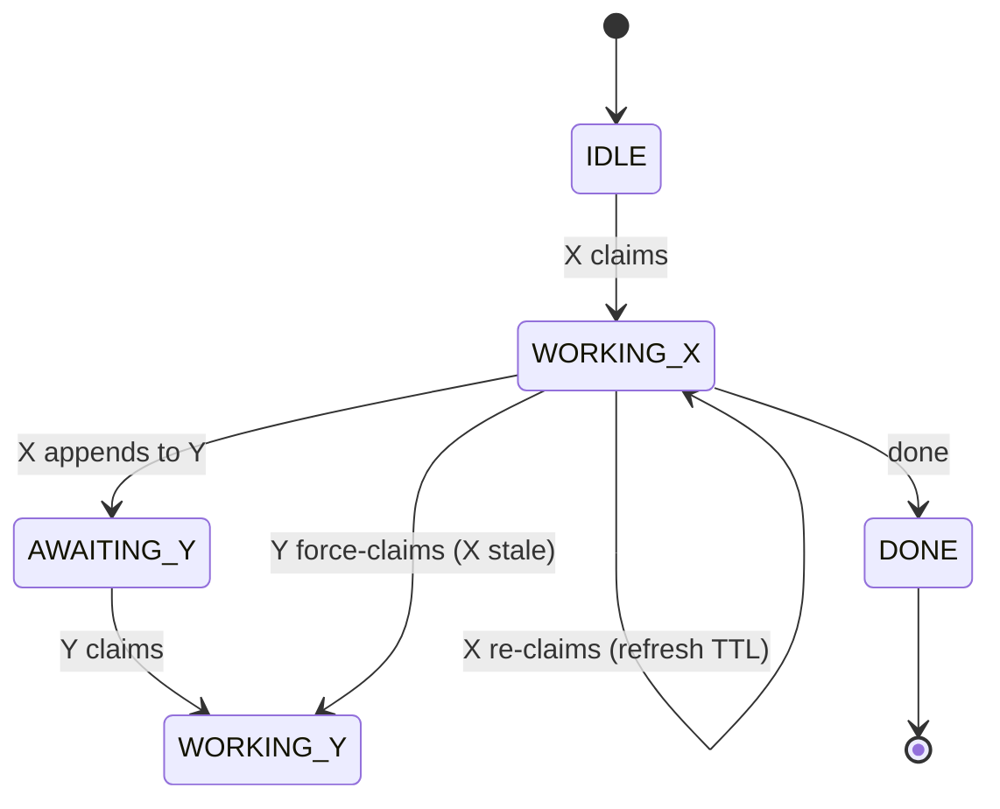

# Specification — M8Shift

> **Status**: `Validated` · **Version**: protocol v1 · **Last reviewed**: 2026-06-21

---

## 1. Object

`m8shift.py` lets an **active roster of ≥2 AI agents** (e.g. Claude, Codex, …) work on the same repository
**without stepping on each other**, coordinating through a **single shared
file** `M8SHIFT.md`, in strict alternation (cooperative mutex). The system must be
**portable to any project** and **usable by the agents without a human having to
explain the protocol** (it is self-contained). *Limit*: in interactive agent UIs a
human still nudges each agent to resume between turns — see §8.

## 2. Scope

| Included | Excluded |
|----------|----------|
| Single-file lock, turn journal, control CLI | Network / multi-machine orchestration |
| Idempotent self-install (`init`) into any project | More than one simultaneous writer (degree-2) |
| Anti-deadlock via TTL, bounded archiving | Resident daemon, persistent queue |
| `CLAUDE.md` / `AGENTS.md` anchors | Authentication / encryption of the state file |

## 3. Actors

| Actor | Role |
|-------|------|
| **active agent (N≥2)** | the configured active roster (default `claude` → `CLAUDE.md`, `codex` → `AGENTS.md`); each agent reads its own anchor and operates the relay on its side |
| **maintainer** | Human; deploys the kit, arbitrates, reads the journal |

## 4. Functional requirements

| ID | Requirement | Verified by |
|----|-------------|-------------|
| EF-1 | **`claim` mandatory and exclusive before working**: it acquires `WORKING_<self>` from `IDLE`/`AWAITING_<self>`; simultaneous `claim` calls ⇒ only one succeeds, the others are excluded. | `test_claim_exclusive_sequential`, `test_concurrent_claim_claude_vs_codex_single_winner` |
| EF-1b | `append` is accepted **only from `WORKING_<self>`** (hence after `claim`) → guarantees exclusivity of the **work window** in the repository, not just of the journal. | `test_append_requires_claim_from_idle`, `test_append_requires_claim_from_awaiting` |
| EF-2 | `append` writes the next turn **and** hands off (`AWAITING_<other>`) in one atomic operation; `turn` is incremented. | `test_handoff_increments_and_alternates` |
| EF-3 | A closed turn (`END`) is immutable (by convention: the tool never rewrites it). | (review) |
| EF-4 | `--to` must target a different roster agent (self-handoff forbidden). | `test_self_handoff_refused` |
| EF-5 | `wait <agent>` waits for the agent's turn; `--once` performs a single check (rc 0 = its turn, rc 3 otherwise). | `test_wait_once_return_codes` |
| EF-6 | `claim --force` reclaims **only a stale lock**; refused on an active lock. | `test_force_refused_on_fresh_lock`, `test_force_accepted_on_stale_lock` |
| EF-7 | The holder can reclaim its own lock (refresh the TTL). | `test_reclaim_own_lock_refreshes` |
| EF-8 | `release` / `done` are baton-owner ops: act if the caller is the `holder` (pen holder in WORKING / awaited agent in AWAITING) or nobody does; `--force` overrides. `append` (the work-write) needs `WORKING_<self>`. | `test_release_done_require_holder`, `test_release_done_force_overrides` |
| EF-9 | `archive --keep N` purges old closed turns without ever moving the bootstrap turn `#0` or touching the lock. | `test_archive_preserves_system_turn0` |
| EF-10 | `init` generates `M8SHIFT.md`, `M8SHIFT.protocol.md` and injects the anchors; idempotent (stanza not duplicated, existing content preserved, `M8SHIFT.md` not overwritten except with `--force`). | `test_reinit_idempotent_preserves_content`, `test_init_force_resets_lock` |
| EF-11 | Auto-loadable anchors on a case-sensitive or case-insensitive FS: a unique variant is renamed to `CLAUDE.md`/`AGENTS.md`, including in the index if Git is available and tracks it; ambiguous variants are refused. | `test_anchor_case_insensitive_no_duplicate`, `test_codex_anchor_is_canonical_on_case_sensitive_fs`, `test_tracked_anchor_case_rename_updates_git_index`, `test_ambiguous_anchor_variants_refused` |
| EF-12 | The stanza is idempotent and placed at the head of the anchors; if `AGENTS.override.md` exists, it is synchronized in the override and in `AGENTS.md`. | `test_stanza_is_moved_to_anchor_start`, `test_codex_override_also_receives_stanza` |
| EF-13 | If the project had `CLAUDE.md` but no Codex instructions, `init` creates in the new `AGENTS.md` a bridge to the common instructions in `CLAUDE.md`; a pre-existing Codex anchor stays autonomous. | `test_missing_agents_bridges_existing_claude_instructions`, `test_existing_agents_does_not_receive_claude_bridge` |

## 5. Non-functional requirements

| ID | Requirement |
|----|-------------|
| ENF-1 **Portability** | Works on an empty folder or a git repository, paths with spaces/accents, case-sensitive or case-insensitive FS. Python 3.8+, **stdlib only**, no third-party package. Runs on **Linux, macOS and Windows** (WSL, Git Bash, or native `python m8shift.py`; see the Windows how-to). |
| ENF-2 **Atomicity** | Every write (including the archive) goes through a **unique** temporary file + `os.replace`, **preserving the mode** of the target file; serialized by an inter-process lock (`.m8shift.lock`, `O_EXCL`, ownership token). |
| ENF-3 **Agent autonomy** | The whole procedure is embedded: `M8SHIFT.protocol.md` (§0 quickstart) + the anchors' stanza. No human explanation required. |
| ENF-4 **Robustness** | Invalid inputs (unknown agent, missing `--body`, missing `M8SHIFT.md`, **LOCK with invalid schema**: `state`/`turn`/`holder`) → clean `sys.exit` exit, never a traceback, never a corrupted state. |
| ENF-5 **Endurance over time** | `M8SHIFT.md` stays bounded via `archive`; the archive is never re-read by the loop. |
| ENF-6 **Readability** | State and turns readable by eye and with `grep`; markers in HTML comments invisible in the Markdown rendering; versionable in plain text. |
| ENF-7 **Bootstrap** | Anchor names follow the auto-loaded conventions; the stanza takes priority in the file and the Codex discovery limits (override, root, size cap, per-session reload) are documented. |
| ENF-8 **Internationalization (i18n)** | The shipped `m8shift.py` is **English-only**; localized single-file variants are built from `i18n/<lang>/` packs with `m8shift-i18n.py`. `init --lang <code>` selects a bundled language (recorded in the LOCK `lang` field); `$M8SHIFT_LANG` overrides the runtime message language. |
| ENF-9 **Zero credentials / any surface** | `m8shift.py` makes **no network call** and needs **no API key, token or account**; it relies entirely on the host agents' own auth. It runs on every Claude Code / Codex surface (terminal/CLI, desktop app, IDE/VS Code, web) — interactive UIs need a human nudge between turns, a headless CLI loop automates fully. |

> **i18n authoring (note).** The shipped `m8shift.py` is **English-only** (the canonical
> source of every message key and template). Other languages live as packs under
> `i18n/<lang>/` (messages.json + four template bodies); `m8shift-i18n.py --langs fr,es
> --into DIR` splices chosen languages into a single self-contained variant (KNOWN_LANGS-
> validated, raw-string-safe, round-trip-checked, byte-reproducible). Packs: fr
> (human-authored) + es,it,de,pt,ja,ru,zh-cn (machine-translated, review-pending). Runtime
> = one file; authoring = the injector. See CONTRIBUTING.md and `docs/en/rfc-*`.

## 6. Data model — the `LOCK` block

At the head of `M8SHIFT.md`, between `<!-- M8SHIFT:LOCK:BEGIN -->` and `:END`:

| field | type | values |
|-------|------|--------|
| `holder` | enum | pen holder (WORKING) \| awaited baton-owner (AWAITING) \| `none` |
| `state` | enum | `IDLE` \| `WORKING_<X>` \| `AWAITING_<X>` \| `DONE` (one per active agent) |
| `agents` | CSV \| absent | the active roster (all declared agents, ≥2; default `claude,codex`) |
| `turn` | integer | number of the last closed turn |
| `since` | ISO-8601 UTC | how long the state has lasted |
| `expires` | ISO-8601 UTC \| `-` | anti-deadlock TTL; date **only** during `WORKING_*` |
| `note` | text | readable memo |
| `lang` | enum \| absent | a KNOWN_LANGS tag (`en`, `fr`, `es`, …) — language of generated files / runtime messages; the EN-only core bundles `en` |

**State machine** (legitimate transitions):



## 7. Command-line interface

`init [--agents a,b,c…] [--lang …]` · `status [--json]` · `recap [--turns N] [--memory N] [--tasks N]` ·
`wait <agent> [--once] [--interval N]` · `claim <agent> [--force]` · `claim <agent> --check [--files CSV] [--turns N]` ·
`peek <agent>` · `log [--limit N] [--all] [--oneline]` ·
`append <agent> --to <other> --ask … --done … [--files …] [--body f|-] [--branch/--commit/--tests/--next/--blocked-on …] [--field k=v]` ·
`release <agent> --to <other> [--force]` · `done <agent> [--force]` · `archive [--keep N]` ·
`remember <agent> "<note>"` · `task add|done|drop <agent> … | task list|show …`

> The single shipped file is **English-only**; `--lang` selects among languages bundled into
> a localized variant built with `m8shift-i18n.py` (see the i18n note).

Return codes: `0` success · `1` refusal/error (state, guardrail, invalid input) ·
`2` argparse usage · `3` `wait --once` when it is not the agent's turn.

## 8. Constraints & known limits

- **Waking an interactive agent UI**: `wait` blocks a *process* until your turn, but it
  does **not** relaunch or wake an agent running in an interactive UI (VS Code, …).
  Between turns a human nudges each agent (e.g. *"resume M8Shift"*). Fully hands-off
  operation needs a **headless** loop (`claude -p`, `codex exec`, cron) wrapping
  `wait → relaunch the agent → claim` — a host integration, not a change to the mutex. A
  notification/webhook can *signal* a turn but cannot *wake* the AI by itself.
- **Work-window exclusivity**: guaranteed by `claim` (exclusive acquisition of
  `WORKING_<self>`) + `append` restricted to `WORKING_<self>`. It relies on the
  **discipline** claim→work→append; M8Shift cannot lock the file system, so an
  agent that edits the repository **without** having claimed is not prevented by
  the tool (but will not be able to `append`).
- **Exclusivity by identity, not by instance**: `claim` excludes the **other**
  agent (claude vs codex), but several processes of the **same** agent all succeed
  in their `claim` (treated as a TTL refresh). M8Shift does not distinguish two
  instances of `claude`; the model assumes one instance per identity.
- **Cooperative, not enforced, mutex**: a malicious agent can, with `--force`,
  override `release`/`done`. The model assumes cooperative roster members (one running instance per identity).
- **Concurrency serialized by an advisory lock**: `.m8shift.lock`
  (`O_CREAT|O_EXCL`, ownership token) serializes the read-modify-write + atomic
  write. *Advisory* lock: a manual edit of `M8SHIFT.md` bypasses it; on a network
  FS (NFS) `O_EXCL`/`rename` are less reliable (M8Shift targets a local disk).
- **Immutability by convention**: the tool never rewrites a closed turn, but
  nothing at the file-system level prevents it (manual edit).
- **N-agent roster, one pen (current)**: an active roster of ≥2 agents relays through a
  single **degree-1 mutex** — any holder hands the pen to any other member via `--to`, one
  writer at a time (`init --agents a,b,c…`; see [RFC — roster](rfc-roster.md), now superseded
  by this generalized model). **Future**: **N concurrent writers** (degree > 1, isolated
  worktrees) — a separate step (see [rfc-n-agents.md](rfc-n-agents.md) §8).
- **Anchor loading**: it depends on the host tool. Codex builds its instruction
  chain once per execution, gives priority to `AGENTS.override.md` in a folder
  and applies a size cap (32 KiB by default), truncating the last file to the
  remaining budget. `init` covers the local override and places the stanza at the
  head, but can neither reload an open session nor compensate for a global
  configuration that already consumes the entire cap.

## 9. Acceptance / validation

- `tests/test_cowork.py` suite (unit + non-regression: claim model, one-pen mutex,
  N-agent relay, canonical/override anchors, configurable roster, advisory turn fields,
  shared memory, `claim --check`, tasks board, archive, robustness, anti-injection),
  `python3 -m unittest discover -s tests`, with no external Python dependency (the
  Git integration test is skipped if Git is absent).
- Multi-agent adversarial verification + 3 successive Codex reviews, each finding
  reproduced then fixed then re-tested.
- Documentary non-regression test: `docs/en/protocol.md` and `docs/fr/protocole.md`
  must stay byte-identical to `m8shift.PROTOCOL["en"]` and the `i18n/<lang>/protocol.md` pack body (`test_protocol_docs_in_sync`).

## 10. Versioning

Protocol **v1**. Any **breaking** change to the `LOCK`/`TURN` format or to the
markers increments the protocol version and must preserve the reading of existing
`M8SHIFT.md` files or provide a migration.

The roster `agents:` field is a **backward-compatible optional
addition** within v1, not a breaking change: a roster-unaware reader ignores it and
keeps working **for the default `claude,codex` pair**. A *custom* roster, however,
requires a roster-aware script — an old script would treat it as `claude,codex` and
could corrupt it. The markers and the one-`key: value`-per-line format are unchanged.

## 11. Developing M8Shift with M8Shift (dogfooding)

M8Shift can coordinate **its own development** — two agents editing `m8shift.py` and the
repo through the relay. One precaution is decisive: here the **tool is also the
artifact**. Every `m8shift.py <cmd>` reloads the file from disk, so a transient syntax
error in the source under edit would break the relay itself.

**Pattern — decouple the engine from the source under edit.** Run the relay from a
**frozen copy** of `m8shift.py` in a **separate working directory** outside the repo.
Because the lock, journal and anchors are created next to the engine
(`HERE = __file__`), all relay state lives there and the repo's working tree stays
clean:

```text
Code/
├── cowork/                 ← the repo (edited here — the real work)
│   └── m8shift.py           ← source under modification
└── cowork-relay/           ← relay working directory (outside the repo)
    ├── m8shift.py           ← FROZEN copy = the engine
    ├── M8SHIFT.md           ← coordination journal + LOCK
    ├── M8SHIFT.protocol.md · CLAUDE.md · AGENTS.md
    └── .m8shift.lock
```

- The engine updates **only** on an explicit `cp` — a momentarily broken `m8shift.py`
  in the repo never affects coordination.
- The anchors live in the relay directory, not the repo root, so **auto-bootstrap does
  not fire**: each agent is pointed manually at the relay's `M8SHIFT.protocol.md` (the
  documented "no project root" case). Discipline is unchanged — an agent edits the repo
  **only** while holding the pen, and keeps `cowork/m8shift.py` importable (`ast.parse`)
  before each `append`.

This is exactly how the roster work was reviewed: Claude implemented,
then handed off to Codex for an adversarial review through a frozen relay in
`cowork-relay/`. A **git worktree** of the repo would *not* decouple the engine (it
tracks the same branch, so its `m8shift.py` changes on edit) — use a frozen copy.

## 12. Planned features & non-goals

Every planned feature stays within M8Shift's qualities (single-file, passive,
zero-credential, file-based & versioned): it is **append-only or read-only over data
M8Shift already stores** — never a daemon, an integration, or a second source of truth.
(Vetted by an adversarial design review that rejected anything breaking a quality.)

### 12.1 Shipped surfaces (v3.x)

All the staged read/handoff features have shipped (each via RFC → design panel →
implementation → adversarial review). They keep the qualities by being append-only or
read-only over data M8Shift already stores, and **never feed the mutex / routing**.

| Feature | Surface | Charter |
|---------|---------|---------|
| **Shared memory** | `remember <agent> "<note>"` appends to a gitignored, append-only `M8SHIFT.memory.md` (pen-free, `file_lock` only); `recap` shows the last N as headlines. | A dumb, file-ordered ledger; `remember` never calls `set_lock` → memory can never feed the mutex/routing. |
| **Advisory turn fields** | `append … --branch/--commit/--tests/--next/--blocked-on …` + the open `--field k=v` (`x_*`) namespace, surfaced verbatim by `peek`. | Written verbatim, never interpreted; the engine routes on the LOCK, not turn fields. |
| **Read commands** | `recap`, `peek`, `log [--all] [--oneline]`, `status --json`. | Pure read-only formatters over existing turn data; only stdlib `json`. |
| **`claim --check`** | `claim <agent> --check [--files CSV] [--turns N]` — read-only pre-claim probe: readiness (rc 0/3, except DONE = not claimable) + exact file-overlap with recent turns' `files:`. | Takes no pen, mutates nothing (`--force` is a no-op); overlap never changes rc or feeds routing; exact matching (no glob) avoids false positives. |
| **Tasks board** | `task add/done/drop <agent> …` · `task list` · `task show` over an append-only `M8SHIFT.tasks.md`; status = read-time last-event-wins fold; `recap` shows open tasks. | Pen-free, dumb event log; `--for`/`blocked_on` are advisory text, never resolved; task state never feeds the mutex/routing. |

`subturn` was **rejected** (see [rfc-subturn.md](rfc-subturn.md)): §5 advisory fields cover
at-append provenance and `remember` covers mid-turn streaming, so a fourth ledger would be
redundant surface.

### 12.2 Non-goals (rejected — they would break a quality)

| Rejected | Quality broken | Why |
|----------|----------------|-----|
| **Path-scoped *leases*** (concurrent disjoint writes) | degree-1 mutex / minimal | Puts two agents in a working state at once — that is the **stage-2 degree-2** lock, not today's single pen. `claim --check` delivers the safe, advisory 80%. |
| **Background daemon / watcher / push-notifier** | passive | M8Shift has no resident process; the recipient polls on its own next turn. A notification can *signal* a turn, never *wake* the AI. |
| **Running git / builds / APIs / executing `--next`** | passive + zero-credential | Acting on a tool needs auth + network and turns M8Shift into an orchestrator; handoff fields stay write-only advisory the receiving agent interprets with its own auth. |
| **Third-party deps / multi-file package** | single file | Every item is scoped to stdlib (`json`, `fnmatch`, `re`); a DB / queue / server would split the tool — no more `cp m8shift.py`. |
| **"Smart" *derived* memory** (dedup / summarize / search / prune) | minimal / file-based | The ledger is a dumb append-only record; any digest is verbatim agent passthrough. The instant M8Shift curates content it owns a knowledge base with policy — a second source of truth. |
