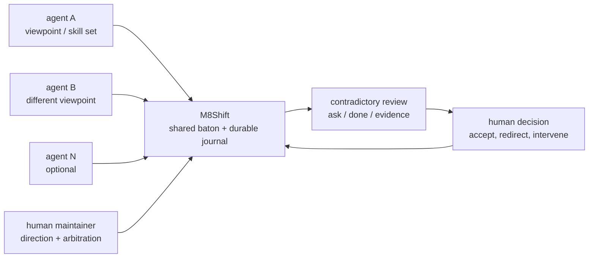
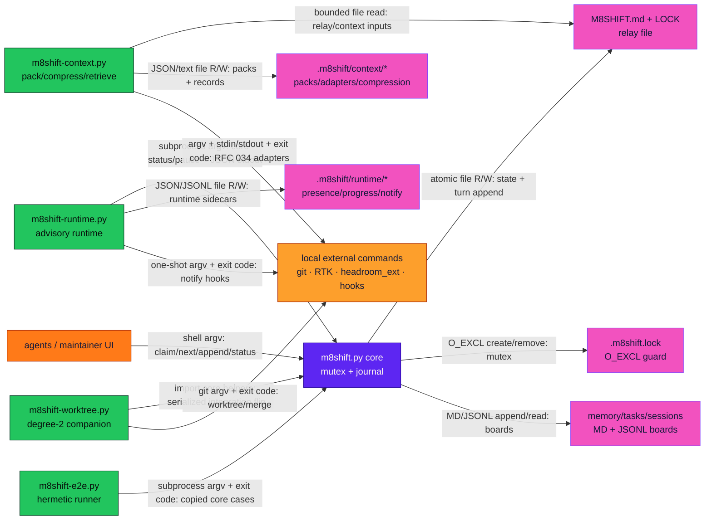
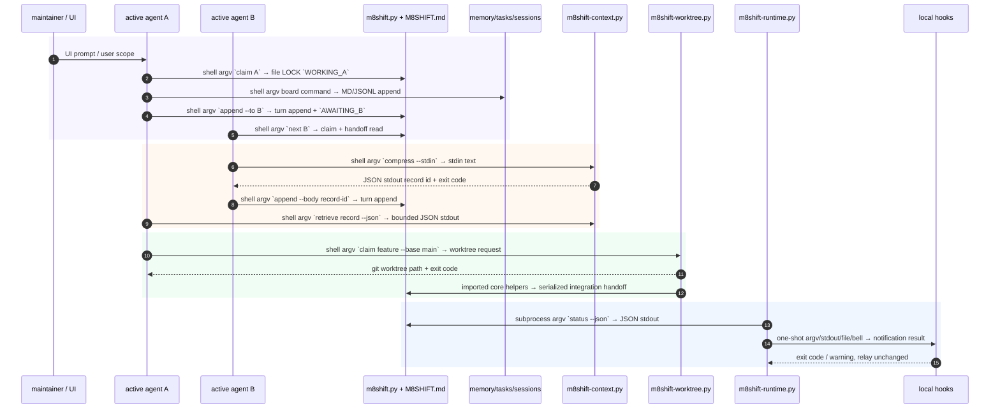
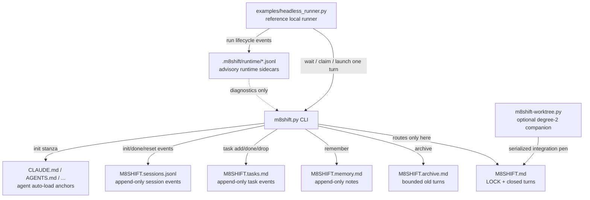
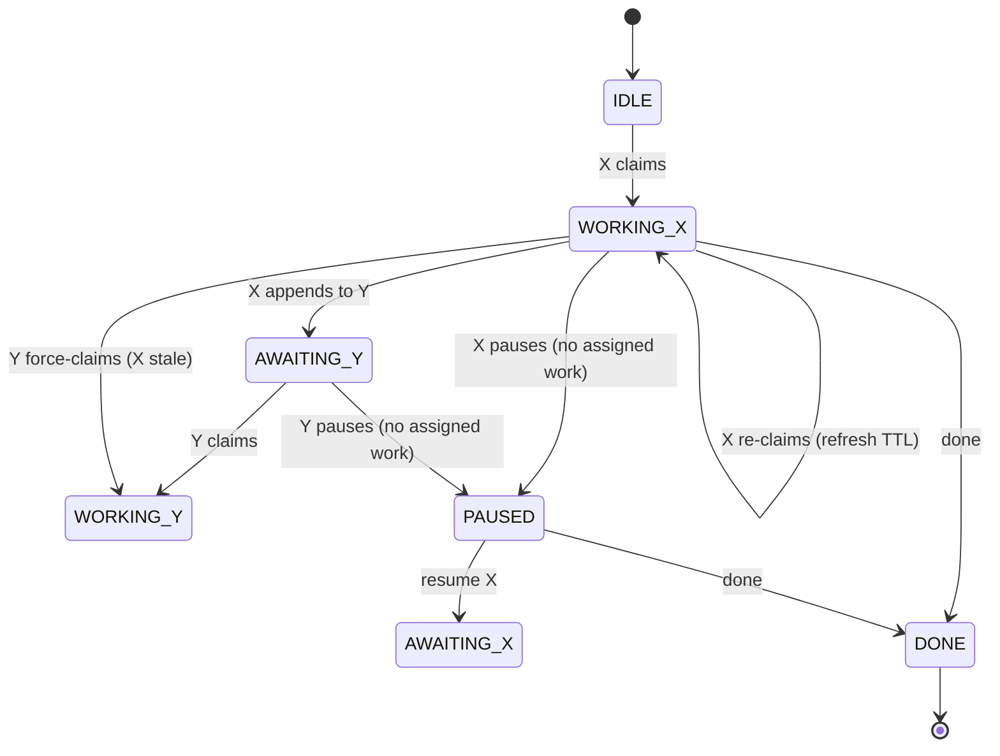

# Specification — M8Shift

> [!NOTE]
> **Status**: `Current` · **Version**: protocol v1 · **Last reviewed**: 2026-07-03 (v3.43.0)

---

## 1. Object

`m8shift.py` lets an **active roster of ≥2 AI agents** (e.g. Claude, Codex, Gemini, Vibe, …) work on the same repository
**without stepping on each other**, coordinating through a **single shared
file** `M8SHIFT.md`, in strict alternation (cooperative mutex). The system must be
**portable to any project** and **usable by the agents without a human having to
explain the protocol** (it is self-contained).

> [!WARNING]
> In interactive agent UIs a human still nudges each agent to resume between turns —
> see §8.

## 2. Scope

| Included | Excluded |
|----------|----------|
| Single-file lock, turn journal, control CLI | Network / multi-machine orchestration |
| Idempotent self-install (`init`) into any project | A second simultaneous writer **in the core** (degree-2 lives in the opt-in [`m8shift-worktree.py`](rfc/008-rfc-worktree-companion.md) companion) |
| Anti-deadlock via TTL, bounded archiving | Resident daemon, persistent queue |
| `CLAUDE.md` / `AGENTS.md` anchors | Authentication / encryption of the state file |
| Local Stage-6 integration layer: installers, checksums, `watch`, reference headless runner | Provider SDKs, hosted control plane, IDE/MCP/orchestrator runtimes inside the core |

## 3. Actors

| Actor | Role |
|-------|------|
| **active agent (N≥2)** | the configured active roster (default `claude` → `CLAUDE.md`, `codex` → `AGENTS.md`); each agent reads its own anchor and operates the relay on its side |
| **maintainer** | Human; deploys the kit, arbitrates, reads the journal |

### 3.1 Product philosophy

M8Shift exists because different AI agents do not converge to the same judgement.
They evolve at different speeds, have different strengths, and can disagree on
technical, editorial, legal, or strategic choices. The useful property is not just
"more agents"; it is a **structured contradictory review** where several competent
views can challenge each other while the human maintainer keeps the final decision.

The project turns that practice from manual copy/paste between siloed agent UIs into
a shared workspace: each agent can hand off context, ask for review, and receive the
other agent's critique without the maintainer becoming a message courier.

> [!IMPORTANT]
> M8Shift is a peer-coordination primitive, not a manager agent: it gives teammates a
> shared baton, a durable record, and a safe alternation rule. See the longer
> rationale in [philosophy.md](philosophy.md).



### 3.2 Operational communication views

The diagrams below are normative enough to validate implementation boundaries: the core remains a
passive local-file mutex, while companions stay advisory and communicate through files, argv,
JSON/stdin-stdout, and exit codes only. Colours follow the M8Shift brand palette.

#### Module-communication schema



#### Inter-application agent flow



## 4. Functional requirements

| ID | Requirement | Verified by |
|----|-------------|-------------|
| EF-1 | **`claim` mandatory and exclusive before working**: it acquires `WORKING_<self>` from `IDLE`/`AWAITING_<self>`; simultaneous `claim` calls ⇒ only one succeeds, the others are excluded. | `test_claim_exclusive_sequential`, `test_concurrent_claim_claude_vs_codex_single_winner` |
| EF-1b | `append` is accepted **only from `WORKING_<self>`** (hence after `claim`) → guarantees exclusivity of the **work window** in the repository, not just of the journal. | `test_append_requires_claim_from_idle`, `test_append_requires_claim_from_awaiting` |
| EF-2 | `append` writes the next turn **and** hands off (`AWAITING_<other>`) in one atomic operation; `turn` is incremented. | `test_handoff_increments_and_alternates` |
| EF-3 | A closed turn (`END`) is immutable (by convention: the tool never rewrites it). | (review) |
| EF-4 | `--to` must target a different roster agent (self-handoff forbidden). | `test_self_handoff_refused` |
| EF-5 | `wait <agent>` waits for the agent's turn; `--once` performs a single check (rc 0 = its turn, rc 3 otherwise). | `test_wait_once_return_codes` |
| EF-5b | `next <agent>` is the safe resumption command: it waits if needed, then claims and prints the last handoff; `--once` is non-mutating when not ready, and `--force` only recovers a stale lock. | `test_next_claims_and_prints_handoff_when_ready`, `test_next_once_not_ready_does_not_mutate` |
| EF-6 | `claim --force` reclaims **only a stale lock**; refused on an active lock. | `test_force_refused_on_fresh_lock`, `test_force_accepted_on_stale_lock` |
| EF-7 | The holder can refresh its own lock TTL. Automated wrappers/runners MUST refresh the TTL with `claim <me> --refresh` (an audit-only beat; PROTECTIVE liveness is the `heartbeat` verb — RFC 049) (refused unless already holding the own `WORKING` lock — a plain claim can ghost-claim a fresh turn after a race, RFC 047); plain `claim <me>` remains only the legacy/manual self-claim path while already holding the pen. Refresh the TTL at least 5 minutes before expiry. | `test_reclaim_own_lock_refreshes`, `TestRFC047PhaseA.test_t8_claim_refresh_guard` |
| EF-8 | `release` / `done` are baton-owner ops: act if the caller is the `holder` (pen holder in WORKING / awaited agent in AWAITING) or nobody does; `--force --reason TEXT` overrides and is recorded in the session ledger. `release` additionally refuses to bounce the latest incoming turn addressed to the caller unless `--force --reason` is used, so a real handoff must be read/answered with `peek` + `append` instead of silently released. `append` (the work-write) needs `WORKING_<self>`. | `test_release_done_require_holder`, `test_release_done_force_overrides`, `test_release_refuses_to_bounce_pending_incoming_turn`, `test_release_force_can_bounce_pending_turn_with_audit_reason`, `test_doctor_security_highlights_force_event` |
| EF-9 | `archive --keep N` purges old closed turns without ever moving the bootstrap turn `#0` or touching the lock. | `test_archive_preserves_system_turn0` |
| EF-10 | `init` generates `M8SHIFT.md`, `M8SHIFT.protocol.md` and injects the anchors; idempotent (stanza not duplicated, existing content preserved, `M8SHIFT.md` not overwritten except with `--force`). | `test_reinit_idempotent_preserves_content`, `test_init_force_resets_lock` |
| EF-10b | `init` manages a marker-delimited M8Shift block in the host `.gitignore` by default: it creates the file if absent, preserves user entries in place, refreshes only the generated block on re-run, supports `--gitignore` / `--no-gitignore`, deliberately does not add agent anchors (`CLAUDE.md`, `AGENTS.md`), and refuses malformed marker blocks without clobbering user content. | `test_init_creates_gitignore_block_when_absent`, `test_init_gitignore_preserves_user_entries_and_excludes_anchors`, `test_init_gitignore_is_idempotent`, `test_init_gitignore_rerun_refreshes_stale_block`, `test_init_no_gitignore_skips_file`, `test_init_gitignore_incomplete_block_refused_without_clobber` |
| EF-10c | `init` generates `M8SHIFT.agent-pack.md`, a marker-delimited agent discipline pack. Re-init refreshes it idempotently while preserving user text outside the generated block; malformed generated blocks refuse refresh unless `--force-generated`, which backs up and rebuilds only the pack and never resets the relay. `doctor` reports pack missing/stale/invalid plus stale anchor-floor stanzas, downgrading adoption gaps to `info` on pre-3.49 projects so `doctor --lint` stays green until adoption. | `TestRFC048PRA` |
| EF-10d | `update --target DIR [--source DIR]` updates an initialized target project from the running source copy. It writes protocol/pack/anchors/default installed runners/installed companions before replacing the core, never copies relay/session state from the source, refuses unsupported baselines, downgrades, checksum failures, source/driver version splits, symlink/path escapes, and active `WORKING_*` targets by default, and records bounded update audit rows when it writes. The default `runner` component refreshes only already-installed `scripts/watch-status.sh` / `examples/headless_runner.py` artifacts whose current checksum is proven by `.m8shift/kit.json` `runners[]`; absent runners are never created, and present-but-untracked regular runners are skipped in the default update path so full checkouts/dogfood trees do not fail. Explicit `--components runner` treats untracked runners as `manual_review_required`; edited tracked runners are also `manual_review_required`; non-regular, symlinked, or escaping runner targets are `refused`. A mixed companion or runner outcome (at least one refreshed/current AND at least one refused/manual-review) reports that component as `partial` with per-file outcomes carried in `--json` and the audit row; `partial` is not an OK result, so the run still reports incomplete and exits non-zero (#43/#60). `doctor --source` is read-only and emits `runner.stale` / `runner.manual_review_required` only for tracked or dangerous runner preflight findings; it does not warn for regular untracked runners skipped by default update. | `TestRFC048PRB` |
| EF-10e | `doctor --install` (#24) adds a read-only post-install verification: a snapshot report (Python/script versions, local checksum-manifest presence/validity/drift for installed files, kit companion/runner state, generated files, optional helper states) carried as `install` in `--json`, plus `install.*` findings covering only NEW conditions (`install.python_floor`, `install.core_missing`, `install.manifest_invalid`, `install.manifest_drift` = warning; `install.git_absent`, `install.helper_absent` = info). No network, no repair, no write; "core install unhealthy" (warnings) stays clearly distinct from "optional accelerator absent" (info), so `doctor --install --lint` is green on a healthy-but-minimal install. Paths anchor on the relay project root, so a `$M8SHIFT_ROOT` rebase verifies the coordinated project. | `TestDoctorInstall` |
| EF-11 | Auto-loadable anchors on a case-sensitive or case-insensitive FS: a unique variant is renamed to `CLAUDE.md`/`AGENTS.md`, including in the index if Git is available and tracks it; ambiguous variants are refused. | `test_anchor_case_insensitive_no_duplicate`, `test_codex_anchor_is_canonical_on_case_sensitive_fs`, `test_tracked_anchor_case_rename_updates_git_index`, `test_ambiguous_anchor_variants_refused` |
| EF-12 | The stanza is idempotent and placed at the head of the anchors; if `AGENTS.override.md` exists, it is synchronized in the override and in `AGENTS.md`. | `test_stanza_is_moved_to_anchor_start`, `test_codex_override_also_receives_stanza` |
| EF-13 | If the project had `CLAUDE.md` but no Codex instructions, `init` creates in the new `AGENTS.md` a bridge to the common instructions in `CLAUDE.md`; a pre-existing Codex anchor stays autonomous. | `test_missing_agents_bridges_existing_claude_instructions`, `test_existing_agents_does_not_receive_claude_bridge` |
| EF-14 | `history` shows one folded entry per relay session: session id, start/end, state, agents, turn count, agents used and version; `--json` exposes the same data. | `test_init_records_session_and_history`, `test_history_counts_turns_and_done`, `test_force_init_marks_previous_session_reset` |
| EF-15 | Human-facing timestamp output keeps canonical UTC (`...Z`) and adds the user's local time prefixed by the timezone name/offset when available (otherwise `local`); `status` also derives read-only session `started`/`duration` metadata from `M8SHIFT.sessions.jsonl`; machine-readable JSON remains canonical UTC only. | `test_display_time_keeps_utc_and_adds_timezone_prefixed_local_time`, `test_display_duration`, `test_status_and_recap_show_timezone_prefixed_local_time`, `test_status_json`, `test_status_shows_timezone_prefixed_local_time` |
| EF-16 | Operator-loop guardrails keep agents from stopping mid-relay: `status --for <agent>` prints/serializes the next safe action, `next <agent>` claims + peeks when ready, `append --wait` blocks after handoff until the caller's next turn or `DONE`, and plain `release` cannot silently skip a pending turn addressed to the caller. | `test_status_for_prints_and_serializes_next_action`, `test_append_wait_blocks_until_agent_turn_returns`, `test_release_refuses_to_bounce_pending_incoming_turn` |
| EF-17 | `watch [--for agent]` is a foreground, read-only live view over `status`: it can refresh a terminal automatically, but never claims, hands off, repairs, or force-recovers. | `test_watch_once_is_read_only_and_shows_next_action`, `test_watch_interval_invalid_clean_exit` |
| EF-18 | Stage-4 contract metadata is accepted on `append` via dedicated flags and/or `--field`; `contract validate` and `doctor --contracts` validate it read-only, with strict mode failing malformed `schema=stage4.v1` turns only when explicitly requested. | `test_contract_sugar_fields_written_and_validate_clean`, `test_contract_validate_warns_by_default_but_strict_fails`, `test_doctor_contracts_includes_contract_findings` |
| EF-19 | The local install layer ships copy/download recipes, `checksums.sha256`, Bash and PowerShell installers, and version surfaces for distributed scripts. Verification is enabled by default and `--no-verify` is an explicit opt-out. The Bash installer supports `--dry-run`, documents prerequisites in its output, and can optionally install RTK from macOS/Linux/Git Bash Windows release assets verified against `checksums.txt` from the same GitHub release tag, record installer provenance, disable telemetry, place the binary under `.m8shift/bin`, and identity-pin the RFC 034 adapter manifest through the explicit project-local adapter opt-in. A pre-existing `.m8shift/bin/rtk` is not executed in `--no-rtk` / default flows. Cargo/Rust source-build fallback requires separate `--allow-source-build` consent and is pinned to `--rtk-version`. `--with-headroom` is experimental, installs pinned `headroom-ai==0.28.0` + `onnxruntime==1.27.0` + `transformers==5.12.1` into a local venv and identity-pins the `m8shift-headroom` launcher when possible, warns about Rust/Cargo source-build prerequisites, and never blocks the base install. | `test_default_verifies_and_rejects_tampered`, `test_no_verify_skips`, `test_verify_flag_still_verifies`, `test_bash_syntax_ok`, `test_dry_run_lists_multios_prereqs_and_does_not_write`, `test_with_rtk_identity_pins_existing_rtk`, `test_no_rtk_does_not_execute_project_local_rtk`, `test_rtk_cargo_fallback_requires_explicit_flag`, `test_rtk_cargo_fallback_is_tag_pinned_when_explicitly_allowed`, `test_manifest_matches_files` |
| EF-19b | The generated `commit-msg` hook stamps dogfooding provenance fail-open: `Coordinated-With: M8Shift vX.Y.Z` when a relay/local version is readable, and `Agent-Model: <id>` independently when `M8SHIFT_AGENT_MODEL` is present and matches the safe single-line model-id charset. Existing trailers are never duplicated, malformed model ids and non-UTF-8 commit messages are ignored without blocking the commit, and verbose commit messages keep trailers above the scissors line. | `test_commit_msg_hook_injects_coordinated_with_from_m8shift_root`, `test_commit_msg_hook_stamps_agent_model_when_declared`, `test_commit_msg_hook_stamps_agent_model_without_configured_relay`, `test_commit_msg_hook_skips_absent_agent_model`, `test_commit_msg_hook_rejects_malformed_agent_model_fail_open`, `test_commit_msg_hook_non_utf8_message_fail_open`, `test_commit_msg_hook_keeps_existing_agent_model_idempotent`, `test_commit_msg_hook_keeps_trailer_in_body_for_verbose_commit` |
| EF-20 | `examples/headless_runner.py` is a reference local runner for one headless agent lane: it waits/claims through the core, writes an immutable `.m8shift/runtime/run-plans/<run-id>.json` plan for one static argv command, validates the mandatory RFC 028 run-plan fields (`agent`, `argv`, `cwd`, `run_id`, `prompt_hash`, `env_allowlist`, `timeout`, `kill_grace`, `expected_transition`), refreshes the TTL before expiry **via `claim <agent> --refresh` only** (audit-only beat; the supervising listener owns protective liveness via the `heartbeat` verb — RFC 049) (a plain claim could ghost-claim a fresh turn — RFC 047), passes only an explicit env allowlist plus `M8SHIFT_*`, and appends lifecycle/finding events to `.m8shift/runtime/runs.jsonl`. Post-run classification is **authorship-primary and total** (RFC 047 Phase 1): a run succeeds iff the relay is `DONE` or this agent authored a transcript turn numbered above the pre-run turn; otherwise the bounded LOCK re-read and the state/turn table yield `non_completion`, `stuck_working`, or `invalid_relay` (failures, retried to the cap) or the neutral `external_transition` / `suspended` (never counted as provider failures). Exit codes: `0` success, `1` failure, `2` infrastructure/timeout, `3` external transition, `4` suspended. Full success additionally requires provider exit `0` and recorded ledger events; no automatic force-claim exists on any path. | `TestRFC047PhaseA`, `test_headless_runner_once_writes_run_ledger_and_env_run_id`, `test_headless_runner_reads_m8shift_lock`, `test_headless_runner_run_plan_is_immutable`, `test_headless_runner_validates_run_plan_fields_and_argv`, `test_headless_runner_post_run_verification_detects_mismatch`, `test_headless_runner_post_run_validation_rejects_stolen_lock_and_nonzero_exit` |
| EF-21 | `pause <holder> --reason` parks an open session with no active task as `PAUSED`/`holder=none`; `resume <agent> --reason` or `next <agent> --resume --reason` explicitly assigns new user scope before any claim can proceed. `doctor` warns on parked `WORKING_*` notes and ack-bounce livelocks. | `test_pause_parks_session_and_resume_is_explicit`, `test_pause_requires_current_holder_and_release_refuses_paused`, `test_doctor_warns_when_working_note_parks_the_pen` |
| EF-22 | `session list/show/decisions/report` derives session views and Markdown reports from existing turns and session events. Report writes are explicit, path-confined, atomic, reject reserved M8Shift coordination/distributed-script files even with `--force` and case variants, and never mutate the `LOCK`; structured decisions are extracted only from `schema=stage4.v1 relation=review_result decision=approve|revise|reject|waive`. | `TestSessionReports` |
| EF-22b | `decisions target` shows or persists the advisory traceability target (`forge`, `github`, `both`, `git`, `md`), inferred from git remotes with markdown as the no-tracker fallback. `decisions scaffold` writes a durable ADR-style `docs/decisions/NNNN-*.md` record, or appends to `DECISIONS.md` with `--single`, derived from existing turns and explicit `append --stance …` fields; scaffolding never mutates the turn journal or `LOCK`, and never infers FOR/AGAINST positions from prose. | `TestDecisionTraceability` |
| EF-23 | `status --brief` and `recap --brief` provide compact human output as a strict subset of the default human output, with no new information and no default-output change. `status --brief` keeps version, holder/state/agents/turn/since/expires and next-action lines; `recap --brief` keeps version, holder/state/agents/turn/since and recent turn summaries. | `test_status_brief_is_strict_subset_and_default_stays_full`, `test_recap_brief_is_strict_subset_and_default_stays_full` |
| EF-24 | `m8shift-runtime.py status-runtime` composes core `status --json` with advisory runtime sidecars (presence, inbox, progress, and run lifecycle) and never mutates the relay. `watch` records the lane's self-declared RTK state from `M8SHIFT_RTK=on|off` (`off` when absent/invalid), and `status-runtime` surfaces both per-agent RTK declarations and the local context-adapter state (`RTK: ON (pinned, compressing packs)` / `RTK: OFF (native)`) plus the last context-pack compression ratio when metrics exist. `--json` exposes the full composed payload; `--brief` is human-only and prints a strict line subset of the default human status. | `test_watch_operator_progress_and_status_runtime`, `test_status_runtime_discovers_agents_without_presence`, `test_runtime_surfaces_self_declared_and_context_rtk_state`, `test_runtime_rtk_invalid_env_is_warning_and_off` |
| EF-24b | `m8shift-runtime.py notify <agent> --event turn-ready|stale|blocked|done --message …` emits local, advisory, one-shot notifications from the runtime companion only. `notify config` manages stdout/file/bell/os/hook tiers, `watch` uses the same path for human output, prompt/event/log sidecars stay under `.m8shift/runtime/notify/`, duplicate `(agent,event)` notifications are suppressed by the configured window, OS/hook failures degrade to stdout/file warnings, and tier-4 hooks run as argv arrays with literal placeholder items only. | `test_notify_stdout_only_prints_and_keeps_relay_unchanged`, `test_notify_writes_prompt_event_log_and_deduplicates`, `test_notify_ci_suppresses_bell_os_and_hook`, `test_notify_missing_os_binary_warns_and_falls_back`, `test_notify_hook_nonzero_is_logged_and_nonblocking`, `test_notify_hook_placeholders_are_literal_argv_items`, `test_deleting_notify_sidecars_loses_only_notifications` |
| EF-25 | `m8shift-runtime.py headroom [agent]` computes stdlib-only Tier-0 context headroom proxies (turns since checkpoint, relay bytes, runtime ledger bytes, handoff body bytes), accepts an optional harness-provided `--window-status`, writes explicit session-report checkpoints, surfaces `ok`/`warning`/`high` in `status-runtime` and `doctor`, and may call core `pause` only when `--pause-on` + `--reason` are explicit and the named agent is the current holder. | `test_runtime_headroom_detects_checkpoint_and_surfaces_in_status_doctor`, `test_runtime_headroom_pause_is_explicit_and_holder_gated` |
| EF-26 | `m8shift-context.py adapters init/list/show/check/run` implements the Phase-2 companion adapter boundary: manifests are JSON, commands are argv arrays, `command[0]` is a bare allowlisted program resolved through `PATH` plus an explicitly allowed project-local `.m8shift/bin` install location, the resolved executable must match the manifest's trusted absolute path + SHA-256 identity, stdout/stderr/runtime are bounded, environment is allowlisted, failures follow the manifest policy, and adapter output is advisory only. Project-local `.m8shift/bin` resolution is confined under the project, rejects symlinked bins, uses `.exe` fallback only on native Windows, and can establish a local trusted identity only when `--allow-project-local-adapters` is explicit and installer provenance matches. Setup executes `rtk telemetry disable` only via a verified manifest `trusted_executable`; absent/unpinned/drifted tools skip telemetry instead of executing, and public status/doctor output does not log RTK telemetry stdout/stderr. The shipped RTK shell-output manifest recommends `err`/`test`/`log`/`ls` and forbids `git-diff` for code review because measured output is lossy for hunks. Since v3.34.0, `pack` defaults to RTK only when `rtk` is present and identity-pinned; absent/unpinned RTK degrades to native packing, `--adapter native` / `--no-rtk` opts out, setup attempts `rtk telemetry disable`, and `doctor --json` surfaces RTK presence and pin status while reporting telemetry as `not-reported`. Since v3.34.1, corrupt, unreadable, or non-object RTK manifests also degrade to native in automatic mode, while explicit `--adapter rtk-shell-output` remains fail-closed. Since v3.36.0, `m8shift-context.py status` and `doctor` show a prominent RTK ON/OFF line and the last context-pack compression ratio when available. | `TestContextAdapters`, `test_pack_defaults_to_pinned_rtk_when_present_else_native_and_opt_out`, `test_pack_auto_degrades_corrupt_rtk_manifest_to_native`, `test_init_disables_rtk_telemetry_and_doctor_surfaces_state`, `test_status_and_doctor_show_rtk_state_and_last_pack_ratio`, `test_planted_project_local_rtk_is_not_executed_or_pinned_without_provenance`, `test_project_local_rtk_with_installer_provenance_still_needs_explicit_opt_in`, `test_project_local_rtk_with_installer_provenance_and_opt_in_can_be_pinned_with_warning`, `test_project_local_exe_fallback_is_off_on_non_windows`, `test_symlinked_project_local_bin_is_rejected` |
| EF-27 | `cooldown --until ISO --reason TEXT [--for agent] [--source SOURCE] [--wait-interval N] [--replace]` parks an `IDLE` or matching `AWAITING_<agent>` relay as `PAUSED`/`holder=none` for an external usage-window reset, records a `pause` session event with `kind=usage_cooldown`, refuses `WORKING_*` and `DONE`, validates canonical UTC timestamps and roster agents, allows explicit PAUSED cooldown updates with `--replace`, and resumes through the existing explicit `resume <agent> --reason` path. | `test_cooldown_from_idle_records_usage_event_and_status_json`, `test_cooldown_from_awaiting_infers_resume_agent_and_rejects_mismatch`, `test_cooldown_replace_updates_paused_cooldown`, `test_cooldown_refuses_working_and_done_states`, `test_cooldown_validates_required_fields_iso_agent_and_wait_interval` |
| EF-28 | `m8shift-runtime.py route recommend --task-type T [--skill S] [--input-tokens N] [--self MODEL] [--json]` is a read-only advisory routing layer over `.m8shift/routing/{models.json,skills.json}`. It ships empty provider-neutral manifests, validates them in runtime `doctor`, applies capability-first selection (`tier >= floor`, required capabilities, context class), picks the cheapest eligible model with latency tie-break, pins high-stakes task types as non-downgradable, and fails safe to the pen-holder/self/manual path without launching or touching the core. | `test_route_recommend_missing_manifest_is_clean_fail_safe`, `test_route_recommend_picks_cheapest_eligible_model`, `test_route_recommend_never_violates_floor`, `test_route_recommend_unknown_task_fails_safe_to_self`, `test_route_recommend_adversarial_verify_is_pinned`, `test_route_doctor_reports_unresolved_model_ref` |
| EF-29 | `m8shift-context.py compress` creates local RFC 037 context-compression records without touching the core relay: each `compressed_context_record` wraps `m8shift.adapter.result.v1`, includes `context_digest`, `handoff_digest`, `raw_output_reference`, and the advisory RFC 042 routing signals `access_mode` (`retrieve` by default) plus `whole_content` (`false` by default), stores redacted raw evidence before any compact digest, and uses backend dispatch with builtin stdlib compression by default. Since v3.38.0, `--backend auto` selects the existing identity-pinned RFC 034 `rtk-shell-output` adapter for shell/tool content types when available, falling back to builtin on automatic RTK errors. Since v3.40.0, broad context types (`conversation`, `history`, `file`, `report`, `diff`, `large-context`, `large_context`) stay on builtin in `auto` unless `.m8shift/context-compression.json` explicitly sets `backends.headroom_ext.auto_enabled: true`; explicit `--backend headroom_ext` remains honored for pinned operator experiments. Since RFC 042 Phase B, `--access-mode inline` and `--whole-content` are recorded but do not drive Headroom routing until the measured Phase D gate opens. Headroom is never required, never run through proxy/MCP/daemon mode, and any absent/unpinned/error/drifted backend degrades to builtin in opted-in `auto` or reference-only in explicit mode. Missing/malformed compression config fails closed to redacted reference-only. `retrieve` resolves compression record ids only through a compression-local safe id regex + confined paths, always returns bounded output, and uses native stdlib `re` grep with pattern-size, counted-repetition, and line-length guards. | `TestContextCompression` |
| EF-30 | `m8shift-runtime.py listener start/stop/status/logs` is the RFC 047 lifecycle companion that supervises one headless runner lane per agent. The loop polls the `LOCK` read-only with **zero model spend** while it is not the agent's turn and wakes **exactly one bounded runner turn** on `AWAITING_<agent>` (or `IDLE` for the single permitted `start_on_idle` starter — a second starter is refused at `start` and flagged by doctor); `PAUSED`, peer states, and a missing/invalid relay are neutral (sleep, never repair, never launch). Since RFC 049 PR B the listener emits liveness while its child is alive: the protective `heartbeat` verb at `min(poll, 60)s` plus `claim --refresh` near TTL/2, both bounded core argv calls — never a plain claim, append or force. A stuck own `WORKING_<agent>` lock is retried **only** through the runner's explicit `--resume-working` mode (the child gets `M8SHIFT_RESUME_WORKING=1`; the pen is already held, so no claim and never a force-claim), gated on the previous run's `stuck_working` classification and the remaining retry budget. The listener owns the retry counter over the runner's exit vocabulary: `0` resets it, `3` (`external_transition`) and `4` (`suspended`) leave it unchanged, and every other exit (`1` run failure, `2` infrastructure, runner crash/launch failure) increments it; failures back off 20→40→80→160→300 s (capped), and at `--max-retries` the loop persists `phase=halted` in `.m8shift/runtime/listeners/<agent>.json`, stays resident without launching, and the halt **survives process restarts and OS service managers** (generated launchd `KeepAlive=false` / systemd `Restart=no`) until an explicit `listener start --restart`. All process control is explicit argv — no shell interpolation, and Windows aliveness/stop uses `tasklist`/`taskkill /T /F`, never `os.kill(pid, 0)`; `stop` terminates the whole process group (TERM, grace, KILL) and removes the pid file only after confirmed death. OS backends (`--backend auto\|local\|launchd\|systemd\|windows`) are lifecycle adapters around the *same* `listener start --foreground` payload: they never change relay semantics, degrade to `local` with a printed reason when the host cannot host them, and `auto` avoids launchd for macOS protected-folder projects. `status [--json] [--repair]` renders alive/stale/dead/`HALTED` plus the read-only queried service state; per-agent listener logs rotate writer-side at 5 MiB keeping 3 generations with `runs.jsonl` exempt; runtime `doctor` emits the nine advisory `listener.*` findings (`not_installed`, `dead`, `backend_failed`, `protected_folder`, `version_skew`, `repeated_non_completion`, `halted`, `multiple_starters`, `log_too_large`). | `TestRFC047ListenerPR1`, `TestRFC047ListenerPR2`, `TestRFC049PRBListenerProducer` |
| EF-31 | **Compression / raw-proof contract (#22)**: the generated guidance states that compressed or filtered context is *orientation, not proof*. The protocol core carries the compact invariant (compressed/filtered views — digests, packs, RTK/adapter output, summaries — are **orientation, not proof**; verify claims against raw originals); `M8SHIFT.agent-pack.md` carries the matching "Compression is not proof" discipline; the protocol reference details the proof-bearing content that must be verified raw (diffs, checksums, legal/verbatim text, logs-as-evidence) and the honest adapter roles consistent with RFC 023 (RTK = lossy semantic filter with no fixed ratio; Kompress/Headroom ≈45–55% on prose only, errors on shell; a stored compact record is an excerpt referencing the raw original). | `test_protocol_core_keeps_safety_invariants`, `test_protocol_core_within_budget`, `test_pack_carries_raw_proof_and_shared_checkout_disciplines`, `test_reference_details_raw_proof_and_shared_checkout` |
| EF-32 | **Shared-checkout / destructive-git guardrails (#23)**: the generated guidance states that in a shared checkout, destructive git operations (`reset --hard`, `checkout -f`, `clean -fd`, forced switches) require explicit human authorization; a refused checkout is a signal, not an obstacle; agents prefer non-destructive inspection, `stash`, or isolated worktrees (`m8shift-worktree.py`), and never manipulate a peer's checkout outside relay coordination. Enforcement stays **advisory** — no shell-command interception, no sandbox pretense: the read-only `doctor --source DIR` update preflight adds an info-level `workspace.dirty_worktree` finding when the project's git checkout has uncommitted changes, keeping `doctor --lint` green and repairing nothing. | `test_protocol_core_keeps_safety_invariants`, `test_pack_carries_raw_proof_and_shared_checkout_disciplines`, `test_doctor_source_dirty_worktree_advisory_is_info_and_read_only`, `test_doctor_source_clean_or_non_git_has_no_dirty_worktree_finding` |

## 5. Non-functional requirements

| ID | Requirement |
|----|-------------|
| ENF-1 **Portability** | Works on an empty folder or a git repository, paths with spaces/accents, case-sensitive or case-insensitive FS. Python 3.8+, **stdlib only**, no third-party package. Runs on **Linux, macOS and Windows** (WSL, Git Bash, native PowerShell installer, or native `python m8shift.py`; see the Windows how-to). |
| ENF-2 **Atomicity** | Every write (including the archive) goes through a **unique** temporary file + `os.replace`, **preserving the mode** of the target file; serialized by an inter-process lock (`.m8shift.lock`, `O_EXCL`, ownership token). |
| ENF-3 **Agent autonomy** | The whole procedure is embedded: `M8SHIFT.protocol.md` (§0 quickstart) + the anchors' stanza. No human explanation required. |
| ENF-4 **Robustness** | Invalid inputs (unknown agent, missing `--body`, oversized `--body` without `--allow-large-body`, oversized single-line fields, malicious `init --name`, malformed session JSON, missing `M8SHIFT.md`, **LOCK with invalid schema**: `state`/`turn`/`holder`) → clean `sys.exit` exit, never a traceback, never a corrupted state. |
| ENF-5 **Endurance over time** | `M8SHIFT.md` stays bounded via `archive`; the archive is never re-read by the loop. Session starts/closes live in append-only `M8SHIFT.sessions.jsonl`, folded only by `history`, never by the mutex/routing loop. |
| ENF-6 **Readability** | State and turns readable by eye and with `grep`; markers in HTML comments invisible in the Markdown rendering; versionable in plain text. |
| ENF-7 **Bootstrap** | Anchor names follow the auto-loaded conventions; the stanza takes priority in the file and the Codex discovery limits (override, root, size cap, per-session reload) are documented. |
| ENF-8 **Internationalization (i18n)** | The shipped `m8shift.py` is **English-only**; localized single-file variants are built from `i18n/<lang>/` packs with `m8shift-i18n.py`. `init --lang <code>` selects a bundled language (recorded in the LOCK `lang` field); `$M8SHIFT_LANG` overrides the runtime message language. `m8shift-i18n.py --name` must remain a basename inside `--into`. |
| ENF-9 **Zero credentials / any surface** | `m8shift.py` makes **no network call** and needs **no API key, token or account**; it relies entirely on the host agents' own auth. It runs on every Claude Code / Codex surface (terminal/CLI, desktop app, IDE/VS Code, web) — interactive UIs need a human nudge between turns, a headless CLI loop automates fully. |
| ENF-10 **Free and open source** | M8Shift is free and open source under the Apache License 2.0; the coordination state stays in ordinary project files and the source can be audited, copied, modified and redistributed under that license. |
| ENF-11 **Integration boundary** | Stage-6 integrations are local convenience layers around the passive core. Installers may download/copy scripts and verify checksums; the reference runner may launch a user-supplied command; future provider/IDE/MCP/control-plane layers stay optional companions and must not become core routing authority. |

> **i18n authoring (note).** The shipped `m8shift.py` is **English-only** (the canonical
> source of every message key and template). Other languages live as packs under
> `i18n/<lang>/` (messages.json + four template bodies); `m8shift-i18n.py --langs fr,es
> --into DIR` splices chosen languages into a single self-contained variant (KNOWN_LANGS-
> validated, raw-string-safe, round-trip-checked, byte-reproducible). Packs: fr
> (human-authored) + es,it,de,pt,ja,ru,zh-cn (machine-translated, review-pending). Runtime
> = one file; authoring = the injector. See CONTRIBUTING.md and `docs/en/rfc/`.

## 6. Data model — files and `LOCK`

M8Shift keeps routing state in `M8SHIFT.md` and keeps every advisory surface in a
separate append-only or read-only sidecar. Sidecars improve observability and resumption
without becoming a second routing source.



### 6.1 The `LOCK` block

At the head of `M8SHIFT.md`, between `<!-- M8SHIFT:LOCK:BEGIN -->` and `:END`:

| field | type | values |
|-------|------|--------|
| `holder` | enum | pen holder (WORKING) \| awaited baton-owner (AWAITING) \| `none` (`IDLE`, `PAUSED`, `DONE`) |
| `state` | enum | `IDLE` \| `WORKING_<X>` \| `AWAITING_<X>` \| `PAUSED` \| `DONE` (one per active agent where applicable) |
| `agents` | CSV \| absent | the active roster (all declared agents, ≥2; default `claude,codex`) |
| `session` | id \| absent | current session id (`YYYYMMDDTHHMMSSZ-xxxxxxxx`); absent in legacy files |
| `turn` | integer | number of the last closed turn |
| `since` | ISO-8601 UTC | how long the state has lasted |
| `expires` | ISO-8601 UTC \| `-` | anti-deadlock TTL; date **only** during `WORKING_*` |
| `note` | text | readable memo |
| `lang` | enum \| absent | a KNOWN_LANGS tag (`en`, `fr`, `es`, …) — language of generated files / runtime messages; the EN-only core bundles `en` |
| `integrating` | optional sentinel | in-flight worktree merge (`<id>@<sha>`), only while `WORKING_<holder>` |

Timestamps are stored as ISO-8601 UTC with `Z` to keep TTL comparisons stable across
agents and machines. Human-facing commands (`status`, `recap`, `history`, `task show`,
and the worktree companion's `status`) also append the user's local time prefixed by
the timezone name/offset when available (otherwise `local`); JSON output keeps UTC
values only.

`status` additionally derives two display-only session lines from
`M8SHIFT.sessions.jsonl` when possible: `started` (session start timestamp) and
`duration` (elapsed session duration, or duration until close/reset for a finished
session). The same metadata is exposed by `status --json` as
`session_started_at`, `session_duration_seconds`, and `session_duration`; unavailable
values are serialized as `null` in JSON. This metadata never feeds claimability, TTL
expiry, or routing.

The optional local runtime sidecar `.m8shift/runtime/` is generated by integrations
such as `m8shift-runtime.py` and `examples/headless_runner.py`. `runtime init`
scaffolds `presence.json`, `runs.jsonl`, `progress.jsonl`, `idempotency.jsonl`,
`approvals.jsonl`, and `inbox/*.jsonl`; runtime JSONL rows use the
`m8shift.runtime.event.v1` envelope with `source`, `relay`, and `payload` fields.
`presence.json` is also the advisory per-agent lane ledger: a fresh lane refuses a
second managed runtime for the same agent identity, and stale takeover requires the
explicit `--takeover-stale` flag. `watch --no-progress-warn-after N
--no-progress-block-after M` emits `runtime.no_progress` findings when the current
run has no newer `progress.jsonl` or `runs.jsonl` event; blocked no-progress stops
only that companion loop. `headroom [agent]` estimates context-window exhaustion
with tokenizer-less proxies (turns since checkpoint, relay bytes, runtime ledger
bytes, handoff body bytes), records explicit checkpoint events in `runs.jsonl`, can
write a derived `session report` under `.m8shift/runs/`, and may pause the relay
only when `--pause-on warning|high` and `--reason` are explicit and the named agent
is the current holder. `examples/headless_runner.py` stores immutable headless
plans in `run-plans/<run-id>.json` and verifies post-run core state from the `LOCK`
rather than trusting process exit status. `m8shift-runtime.py retention prune
--keep N` provides basic fixed-count pruning for runtime JSONL ledgers, archiving
older rows under `.m8shift/runtime/archive/` by default; richer retention policy is
tracked in [026-rfc-sidecar-retention.md](rfc/026-rfc-sidecar-retention.md).
Invalid sidecar JSON/JSONL is reported as a runtime diagnostic finding instead of a
core parse failure and is not mutated by retention. Retention policy ledger
patterns reject parent segments after normalizing backslashes to slashes, and
runtime JSONL append paths refuse symlink redirection before archive/index writes.
Deleting
`.m8shift/runtime/` never corrupts `M8SHIFT.md`, the turn log, or claimability.

### 6.2 State machine

Legitimate transitions:



## 7. Command-line interface

`init [--agents a,b,c…] [--lang …]` · `status [--for agent] [--json] [--brief]` · `watch [--for agent] [--interval N] [--clear] [--changes-only]` · `doctor [--lint] [--json] [--security] [--contracts] [--severity-min …]` ·
`contract validate [--strict] [--json] [--all] [--severity-min …]` ·
`recap [--turns N] [--memory N] [--tasks N] [--brief]` ·
`wait <agent> [--once] [--interval N]` · `next <agent> [--once] [--interval N] [--force] [--resume --reason TEXT]` · `claim <agent> [--force|--refresh]` (`--refresh` = extend your own `WORKING` lock only + an audit-only beat; protective liveness = `heartbeat <agent> --source ... --cadence-seconds N`, RFC 049) · `claim <agent> --check [--files CSV] [--turns N]` ·
`peek <agent>` · `log [--limit N] [--all] [--oneline]` · `history [--limit N] [--oneline] [--json]` ·
`session list|show|decisions|report …` ·
`decisions target [--set forge|github|both|git|md] [--json]` · `decisions scaffold [--session ID|current] [--target forge|github|both|git|md] [--single] [--title TEXT] [--status proposed|accepted|superseded] [--json]` ·
`append <agent> --to <other> --ask … --done … [--files …] [--body f|-] [--allow-large-body] [--wait] [--branch/--commit/--tests/--next/--blocked-on …] [--schema/--relation/--role-from/--role-to/--requires/--expected-output/--evidence/--decision/--waiver-reason/--permissions …] [--stance FOR|AGAINST:option] [--field k=v]` ·
`release <agent> --to <other> [--force --reason TEXT]` (no-body handoff; refuses a pending incoming
turn unless forced with an audited reason) · `done <agent> [--force --reason TEXT]` · `archive [--keep N]` ·
`pause <holder> --reason TEXT` · `cooldown --until ISO --reason TEXT [--for agent] [--source SOURCE] [--wait-interval N] [--replace]` · `resume <agent> --reason TEXT` ·
`remember <agent> "<note>"` · `task add|done|drop <agent> … | task list|show …`

> The single shipped file is **English-only**; `--lang` selects among languages bundled into
> a localized variant built with `m8shift-i18n.py` (see the i18n note).

Return codes: `0` success · `1` refusal/error (state, guardrail, invalid input) ·
`2` argparse usage · `3` `wait --once` when it is not the agent's turn.

## 8. Constraints & known limits

- **Waking an interactive agent UI**: `wait` blocks a *process* until your turn, but it
  does **not** relaunch or wake an agent running in an interactive UI (VS Code, …).
  Between turns a human nudges each agent (e.g. *"resume M8Shift"*). Fully hands-off
  operation needs a **headless** loop (`claude -p`, `codex exec`, cron) wrapping
  `wait → relaunch the agent → claim` — a host integration, not a change to the mutex. A
  notification/webhook can *signal* a turn but cannot *wake* the AI by itself. The
  shipped local host-side answer is `m8shift-runtime.py` for presence, operator inbox,
  progress, and runtime diagnostics; see [009-rfc-runtime-companion.md](rfc/009-rfc-runtime-companion.md).
- **Installer vs `init` boundary**: `init` initializes M8Shift state and anchors in the
  current project. It does **not** copy `m8shift.py`, `m8shift-worktree.py`,
  `m8shift-runtime.py`, language variants, or installers into a target directory.
  Script deployment is handled by
  explicit copy/download recipes or the Bash/PowerShell installers, which can also
  verify `checksums.sha256`.
- **Work-window exclusivity**: guaranteed by `claim` (exclusive acquisition of
  `WORKING_<self>`) + `append` restricted to `WORKING_<self>`. It relies on the
  **discipline** claim→work→append; M8Shift cannot lock the file system, so an
  agent that edits the repository **without** having claimed is not prevented by
  the tool (but will not be able to `append`).
- **Exclusivity by identity, not by instance**: `claim` excludes the **other**
  agent (claude vs codex), but several processes of the **same** agent all succeed
  in their `claim` (treated as a TTL refresh). M8Shift does not distinguish two
  instances of `claude`; the model assumes one instance per identity.
- **Cooperative, not enforced, mutex**: a malicious agent can, with `--force --reason`,
  override `release`/`done`. The reason is audited but not an authorization boundary.
  The model assumes cooperative roster members (one running instance per identity).
- **Concurrency serialized by an advisory lock**: `.m8shift.lock`
  (`O_CREAT|O_EXCL`, ownership token) serializes the read-modify-write + atomic
  write. *Advisory* lock: a manual edit of `M8SHIFT.md` bypasses it; on a network
  FS (NFS) `O_EXCL`/`rename` are less reliable (M8Shift targets a local disk).
- **Immutability by convention**: the tool never rewrites a closed turn, but
  nothing at the file-system level prevents it (manual edit).
- **N-agent roster, one pen (current)**: an active roster of ≥2 agents relays through a
  single **degree-1 mutex** — any holder hands the pen to any other member via `--to`, one
  writer at a time (`init --agents a,b,c…`; see [RFC — roster](rfc/001-rfc-roster.md), now superseded
  by this generalized model). **Shipped (off-core)**: **N concurrent writers** via the opt-in
  [`m8shift-worktree.py`](rfc/008-rfc-worktree-companion.md) companion — isolated git worktrees in parallel
  plus a single serialized integration pen, layered on this same degree-1 core.
- **Anchor loading**: it depends on the host tool. Codex builds its instruction
  chain once per execution, gives priority to `AGENTS.override.md` in a folder
  and applies a size cap (32 KiB by default), truncating the last file to the
  remaining budget. `init` covers the local override and places the stanza at the
  head, but can neither reload an open session nor compensate for a global
  configuration that already consumes the entire cap.

## 9. Acceptance / validation

- `tests/test_m8shift.py` suite (unit + non-regression: claim model, one-pen mutex,
  N-agent relay, canonical/override anchors, configurable roster, advisory turn fields,
  shared memory, `claim --check`, tasks board, archive, robustness, anti-injection,
  Stage-4 contract validation, `watch`, installer checksum verification, reference
  headless runner lifecycle, runtime sidecar health),
  `python3 -m unittest discover -s tests`, with no external Python dependency (the
  Git integration test is skipped if Git is absent).
- Multi-agent adversarial verification + 3 successive Codex reviews, each finding
  reproduced then fixed then re-tested.
- Documentary non-regression test: `docs/en/protocol.md` must stay byte-identical to
  `m8shift.PROTOCOL["en"]` (`test_protocol_docs_in_sync`); the `i18n/<lang>/` packs drive the localized single-file build.

## 10. Versioning

Protocol **v1**. Any **breaking** change to the `LOCK`/`TURN` format or to the
markers increments the protocol version and must preserve the reading of existing
`M8SHIFT.md` files or provide a migration.

The roster `agents:` field is a **backward-compatible optional
addition** within v1, not a breaking change: a roster-unaware reader ignores it and
keeps working **for the default `claude,codex` pair**. A *custom* roster, however,
requires a roster-aware script — an old script would treat it as `claude,codex` and
could corrupt it. The markers and the one-`key: value`-per-line format are unchanged.

## 11. Developing M8Shift with M8Shift (dogfooding)

M8Shift can coordinate **its own development** — two agents editing `m8shift.py` and the
repo through the relay. One precaution is decisive: here the **tool is also the
artifact**. Every `m8shift.py <cmd>` reloads the file from disk, so a transient syntax
error in the source under edit would break the relay itself.

**Pattern — decouple the engine from the source under edit.** Run the relay from a
**frozen copy** of `m8shift.py` in a **separate working directory** outside the repo.
Because the lock, journal and anchors are created next to the engine
(`HERE = __file__`), all relay state lives there and the repo's working tree stays
clean:

```text
Code/
├── m8shift/                ← the repo (edited here — the real work)
│   └── m8shift.py           ← source under modification
└── m8shift-relay/          ← relay working directory (outside the repo)
    ├── m8shift.py           ← FROZEN copy = the engine
    ├── M8SHIFT.md           ← coordination journal + LOCK
    ├── M8SHIFT.protocol.md · CLAUDE.md · AGENTS.md
    └── .m8shift.lock
```

- The engine updates **only** on an explicit `cp` — a momentarily broken `m8shift.py`
  in the repo never affects coordination.
- The anchors live in the relay directory, not the repo root, so **auto-bootstrap does
  not fire**: each agent is pointed manually at the relay's `M8SHIFT.protocol.md` (the
  documented "no project root" case). Discipline is unchanged — an agent edits the repo
  **only** while holding the pen, and keeps the repo copy of `m8shift.py` importable (`ast.parse`)
  before each `append`.
- When the relay directory and the work repository differ, **all relay commands**
  (`status`, `claim`, `peek`, `append`, `release`, `wait`, `done`) must run from the
  relay directory or through an absolute relay path. Running `m8shift.py` from the
  repository under edit may hit a different local relay file and create a false sense
  of ownership.

This is exactly how the roster work was reviewed: Claude implemented,
then handed off to Codex for an adversarial review through a frozen relay in
`m8shift-relay/`. A **git worktree** of the repo would *not* decouple the engine (it
tracks the same branch, so its `m8shift.py` changes on edit) — use a frozen copy.

### 11.1 Detecting skew & promoting the engine

The frozen relay copy drifts from the repo as the tool evolves — the **coordinator** (the relay's
engine) and the **subject** (the repo's `m8shift.py` under edit) are two roles of the same file
and must be kept distinct. The **version stamp** makes the drift visible: `m8shift.py --version`
reports the script version, `status`/`recap` print `m8shift.py v<VERSION>`, and the generated
`M8SHIFT.md` banner records the version that wrote it. Compare `--version` across the two locations
to spot a stale coordinator (and bump `VERSION` on every release so the comparison is meaningful).
All tracked Python scripts expose their own `--version` too (`m8shift-i18n.py`,
`m8shift-runtime.py`, `m8shift-worktree.py`, `examples/headless_runner.py`, `scripts/gen_docs.py`, and the
test runners) and are kept in lockstep with the core version by tests.

**Stable-version policy.** The dogfooding relay is refreshed at **every stable version**. A stable
version is a commit or tag where the repo copy has passed the release checks and is safe to use as
the coordinator. Leaving the frozen relay on an older version is an exception, not the default, and
the maintainer should record why before continuing work.

**Promotion (refreshing the engine) is deliberate, but mandatory at each stable point:**

1. Edit + **test the repo copy in isolation** (`python3 -m unittest discover -s tests`) — the relay
   keeps running on the frozen, stable version, so a broken WIP edit never wedges coordination.
2. Commit / tag the repo when it reaches a stable point.
3. **Promote** the stable engine into the relay: `cp m8shift/m8shift.py <relay>/`, then confirm
   `m8shift.py --version` matches in both locations and `python3 <relay>/m8shift.py status` still
   reads the current session.
   - **Backward-compatible change** (docs, messages, new commands, a new *optional* LOCK field):
     promote any time — the in-flight `M8SHIFT.md` keeps working.
   - **Format / protocol-breaking change**: promote **and** reset the relay (`init --force`) so the
     `M8SHIFT.md` is rewritten by the new engine; the prior in-flight file may be incompatible.

So "the tool that coordinates" stays stable and tested while "the tool being developed" is freely
broken and fixed; the version stamp plus the stable-version promotion rule prevents the two from
silently diverging for long.

## 12. Implemented RFC surfaces & non-goals

The latest RFC line is now implemented in the current v3.x surface. Each accepted
feature stays within M8Shift's qualities (single-file, passive, zero-credential,
file-based and versioned): it is **append-only or read-only over data M8Shift already
stores**, or it lives in an opt-in companion that preserves the core's single pen.
Rejected ideas are kept explicit so future changes do not reopen settled trade-offs
without a new RFC.

RFCs are authored and maintained in English only, under `docs/en/rfc/`. Localized
documentation links to those canonical RFCs instead of keeping translated copies.

### 12.1 Shipped surfaces (v3.x)

All the staged read/handoff features have shipped (each via RFC → design panel →
implementation → adversarial review). They keep the qualities by being append-only or
read-only over data M8Shift already stores, and **never feed the mutex / routing**.

| RFC / source | Feature | Surface | Charter |
|--------------|---------|---------|---------|
| [004-rfc-memory.md](rfc/004-rfc-memory.md) | **Shared memory** | `remember <agent> "<note>"` appends to a gitignored, append-only `M8SHIFT.memory.md` (pen-free, `file_lock` only); `recap` shows the last N as headlines. | Dumb, file-ordered ledger; `remember` never calls `set_lock`, so memory can never feed mutex/routing. |
| [001-rfc-roster.md](rfc/001-rfc-roster.md) / [002-rfc-n-agents.md](rfc/002-rfc-n-agents.md) | **N-agent directed roster** | `init --agents a,b,c…`; `--to <agent>` directed handoffs to any other active roster member; generated anchors for known agents and `AGENTS.md` fallback for unknown cooperative agents. | Generalizes the original pair without changing the one-pen mutex; every turn still has one holder and one target. |
| [005-rfc-claim-check.md](rfc/005-rfc-claim-check.md) | **Advisory pre-claim check** | `claim <agent> --check [--files CSV] [--turns N]` reports readiness and exact file overlap with recent turns. | Takes no pen, mutates nothing; overlap never changes rc or feeds routing. |
| [006-rfc-tasks.md](rfc/006-rfc-tasks.md) | **Tasks board** | `task add/done/drop <agent> …` · `task list` · `task show` over append-only `M8SHIFT.tasks.md`; status is folded at read time. | Pen-free event log; `--for`/`blocked_on` are advisory text, never enforced by the mutex. |
| [011-rfc-session-history.md](rfc/011-rfc-session-history.md) | **Session history** | `history [--limit N] [--oneline] [--json]` folds append-only `M8SHIFT.sessions.jsonl` into one entry per session. | Observability only; start/done/reset events never feed claimability or routing. |
| [022-rfc-session-reports.md](rfc/022-rfc-session-reports.md) | **Session reports** | `session list/show/decisions/report`, `M8SHIFT.session-reports/<session-id>.md`. | Derived project memory; optional writes are path-confined, reject M8Shift coordination/distributed-script targets including case variants, and never mutate the `LOCK`. |
| [031-rfc-decision-traceability.md](rfc/031-rfc-decision-traceability.md) | **Decision traceability** | `decisions target`, `decisions scaffold`, `append --stance`, `docs/decisions/NNNN-*.md`, `DECISIONS.md`, `.gitea/.github` decision issue templates. | Advisory durable exports from the turn journal; markdown fallback by default, explicit stances only, no project-management engine and no `LOCK` mutation. |
| [010-rfc-runtime-patterns.md](rfc/010-rfc-runtime-patterns.md) | **Read and diagnostic surfaces** | `recap`, `recap --brief`, `peek`, `log`, `status --json`, `status --brief`, `doctor [--lint] [--json]`, timezone-prefixed local time in human output. `doctor --lint --json` includes core-safe checks for relay/LOCK validity, anchors/stanza, override synchronization, protocol drift, stale/malformed `.m8shift.lock`, project-root status usage, session/request-ledger shape, duplicate open relay sessions for the same roster, and livelock indicators. | Read-only formatters/diagnostics over existing state; brief output is a strict subset of the default human output; doctor lint is CI-safe and never repairs, prompts, contacts the network, or changes routing decisions. |
| [003-rfc-i18n-packs.md](rfc/003-rfc-i18n-packs.md) | **Localized single-file variants** | `m8shift-i18n.py --langs … --into DIR` builds self-contained language variants from `i18n/<lang>/` packs; `init --lang` records the generated language in `LOCK`. | Runtime stays single-file and self-contained; packs are build inputs, not runtime dependencies. |
| Operator live view | **Passive monitoring** | `watch [--for <agent>] [--interval N] [--clear] [--changes-only]` repeats the status view in a terminal. | Foreground/read-only loop only; no daemon, no notification, no `claim`, no force recovery. |
| Operator-loop guardrail | **Safe resumption** | `next <agent>`, `status --for <agent>`, and `append --wait` keep an agent in the relay loop until its next turn or `DONE`. | `next` mutates only by performing the normal `claim`; hints are advisory; `append --wait` waits after the handoff and never changes routing. |
| [008-rfc-worktree-companion.md](rfc/008-rfc-worktree-companion.md) | **Opt-in degree-2 companion** | `m8shift-worktree.py claim/done/drop/status/integrate/doctor` uses isolated git worktrees and a serialized integration pen, protected by canonical-root pinning, `integrating: <id>@<sha>` force guards, local-branch `--into` validation, and non-stranding `--to` finalization. Since RFC 049 PR C, `claim` records ownership in `.m8shift/worktree-owners/<id>.json` (outside the checkout); `done`/`integrate`/`drop` refuse a cross-owner mutation unless `--takeover --reason` (audited in the sidecar, original `created_at` preserved); `drop` cleans the sidecar best-effort; `status` shows the recorded owner; `doctor [--json]` emits the advisory `worktree.owner_missing`/`worktree.owner_mismatch` findings (rc 0 always). | Parallel work stays off-core; the core remains degree-1 and only integration is serialized through the shared lock. The v1 contract is implemented and tested for lock-order/no-double-merge, integrate target/merge failures, no-stuck-`WORKING`, and path-safety hygiene. The ownership guard is ADVISORY companion enforcement only — a bounded fail-open sidecar read (`O_NOFOLLOW`, regular-file, 8 KiB cap): malformed/symlinked sidecars never brick a verb, and direct git/editor writes are out of scope by design (RFC 049 security boundary). |
| Protocol surface | **Advisory turn fields** | `append … --branch/--commit/--tests/--next/--blocked-on …` + open `--field k=v` (`x_*`) namespace, surfaced verbatim by `peek`. | Written verbatim, never interpreted; the engine routes on the `LOCK`, not turn fields. |
| [012-rfc-contracts-validation.md](rfc/012-rfc-contracts-validation.md) | **Stage 4 contracts and validation** | `append … --schema stage4.v1 --relation … --role-from/--role-to … --requires … --expected-output … --evidence … --decision … --waiver-reason … --permissions …`; `contract validate [--strict] [--json] [--all]`; `doctor --contracts`. | Typed metadata is validated only on explicit read-only commands; it never grants permissions, routes work, runs tools, or mutates the `LOCK`. |
| [017-rfc-stage6-integrations.md](rfc/017-rfc-stage6-integrations.md) | **Stage 6 local integration layer** | Bash/PowerShell installers, `checksums.sha256`, versioned distributed scripts, `watch`, site/docs sync, and `examples/headless_runner.py` with `M8SHIFT_RUN_ID`, immutable run plans, post-run core verification, heartbeat, and enveloped `.m8shift/runtime/runs.jsonl` lifecycle events. | Shipped local convenience layer around the passive core; provider/IDE/MCP/control-plane integrations remain optional companions. |
| [048-rfc-adoption-discipline-pack-update-health.md](rfc/048-rfc-adoption-discipline-pack-update-health.md) | **Adoption discipline pack, health diagnostics, and local update** — PR A v3.49.0, PR B v3.50.0 | `init` generates `M8SHIFT.agent-pack.md`; anchor stanzas keep a compact inline safety floor and point to the pack/protocol; `init --force-generated` repairs only corrupted generated pack blocks; `doctor` exposes adoption pack/stanza health and source-update recommendations; `update --target --source` refreshes adopted projects from a newer local source copy. | Adoption/update aid only: these surfaces teach, verify, and refresh generated kit files but never grant write authority, never change claimability, never copy live relay state, and never repair unless the operator explicitly runs `init`, `init --force-generated`, or `update`. |
| [009-rfc-runtime-companion.md](rfc/009-rfc-runtime-companion.md) / [026-rfc-sidecar-retention.md](rfc/026-rfc-sidecar-retention.md) / [027-rfc-notifications.md](rfc/027-rfc-notifications.md) / [039-rfc-model-task-routing.md](rfc/039-rfc-model-task-routing.md) | **Runtime companion v1** | `m8shift-runtime.py watch/operator/progress/status-runtime/doctor/notify/retention prune/retention apply/retention policy show/route recommend`; `.m8shift/runtime/{presence.json,runs.jsonl,progress.jsonl,idempotency.jsonl,approvals.jsonl,inbox/*.jsonl,notify.config.json,notify/*,archive/*.jsonl,retention.json}` and `.m8shift/routing/{models.json,skills.json}` with `m8shift.runtime.event.v1` rows, per-agent lane ownership, self-declared per-agent `M8SHIFT_RTK=on|off`, no-progress findings, stale-presence diagnostics, local notification tiers, composed `status-runtime --brief`, local context-adapter RTK ON/OFF visibility, last run events, basic fixed-count JSONL pruning, opt-in manifest retention strategies (`fixed-count`, `age`, `combined`), and advisory model/task recommendations. | Local advisory sidecars only; invalid/deleted sidecars are diagnostic-only; stale lane takeover is explicit and never grants the core pen; RTK usage by an agent is self-declared and never auto-probed; notifications never mutate `M8SHIFT.md`, never daemonize, never use the network, and hooks/OS commands are argv-only best-effort side effects; no-progress blocks only the companion loop; retention never edits `M8SHIFT.md`, leaves malformed JSONL untouched, keeps undatable rows for age-based policies, rejects slash/backslash parent traversal in policy patterns, refuses symlinked JSONL append targets, and writes archive audit rows only for opted-in runtime ledgers; routing is read-only/advisory, has no bundled vendors/prices, launches nothing in Phase 1, and never changes core routing. |
| [018-rfc-agent-runtime-architecture.md](rfc/018-rfc-agent-runtime-architecture.md) | **Agent runtime architecture companion v1** | `m8shift-runtime.py init`, `roles`, `workflows`, `approve`, `report`; `.m8shift/{roles,workflows,policies,runs}`. | Local scaffold and reports only; removable without breaking the core relay. |
| [014-rfc-provider-management.md](rfc/014-rfc-provider-management.md) / [028-rfc-headless-command-templates.md](rfc/028-rfc-headless-command-templates.md) | **Provider management + headless templates** | `m8shift-runtime.py providers init/list/show/check/render`; `.m8shift/providers.json` with active `agents`, opt-in `examples`, `argv_by_platform`, and marker substitution (`$M8SHIFT_PROMPT`, `$M8SHIFT_AGENT`, `$M8SHIFT_RUN_ID`). | Host-side mapping from roster names to safe argv arrays; curated examples only, no provider SDK, secrets, model routing, shell strings, or core routing authority. |
| [020-rfc-headless-runner-hardening.md](rfc/020-rfc-headless-runner-hardening.md) / [028-rfc-headless-command-templates.md](rfc/028-rfc-headless-command-templates.md) | **Headless runner hardening** | `examples/headless_runner.py --dry-run --turn-timeout --kill-grace --cwd --env-allowlist --expected-transition`, argument validation, immutable run plans, and `run.timeout` / `run.ended` events. | Bounds stuck provider processes while preserving post-run validation, no force-steal rule, explicit env allowlist; since RFC 047 Phase 1 the post-run verdict is authorship-primary and total (`completed`/`advanced`/`non_completion`/`stuck_working`/`suspended`/`external_transition`/`invalid_relay`), the TTL refresh uses `claim --refresh` only (audit beat; protective liveness = the listener's `heartbeat` verb, RFC 049), and full success = exit `0` + authored progress (or `DONE`) + ledger events. |
| [047-rfc-headless-liveness-runner-listener.md](rfc/047-rfc-headless-liveness-runner-listener.md) | **Headless liveness: runner final-state + listener lifecycle** — implemented v3.47.0 | Core `claim <agent> --refresh` refresh-only TTL-extension guard (audit beat since RFC 049); authorship-primary post-run classification and the `0/1/2/3/4` exit vocabulary in `examples/headless_runner.py` (incl. the explicit `--resume-working --once` recovery of an own held `WORKING` lock, signalled to the child via `M8SHIFT_RESUME_WORKING=1`); `m8shift-runtime.py listener start/stop/status/logs` with `local`/`launchd`/`systemd`/`windows` lifecycle backends, visible fallback reasons, persisted `halted` state, writer-side 5 MiB / keep-3 log rotation (`runs.jsonl` exempt), and nine advisory `doctor` `listener.*` findings. | The listener is a supervisor, never a routing authority: it reads the `LOCK` passively and launches at most one bounded runner turn per wake with zero model spend while waiting (the RFC 047 baseline); since RFC 049 PR B an explicitly launched listener additionally delegates `claim --refresh` + the protective `heartbeat` verb to core argv while its child is alive — never a direct `M8SHIFT.md` write, plain claim, force, append, release or done — and is never resurrected out of a halted lane by a service manager (generated definitions use `KeepAlive=false` / `Restart=no`; only an explicit `listener start --restart` clears a halt). |
| [049-rfc-holder-liveness-stale-claim-hardening.md](rfc/049-rfc-holder-liveness-stale-claim-hardening.md) | **Holder liveness + stale-claim hardening** | `heartbeat <agent> --source runtime-listener\|wrapper --cadence-seconds N` (protective beats; window max(120, min(2·cadence, TTL))), two-phase `claim --force` recovery (identity tuple + grace outside the lock, three pinned refusal branches), `--live-override --reason`, liveness sub-state in status/wait/doctor, listener liveness producer. | PR A (core) + PR B (listener producer) implemented; PR C (worktree ownership) remaining. `claim --refresh` records audit-only beats — protection comes exclusively from the `heartbeat` verb. |
| [016-rfc-cooperative-turn-request.md](rfc/016-rfc-cooperative-turn-request.md) | **Cooperative turn request** | `request-turn`, `yield-turn`, `decline-turn`, `steer-turn --force`, append-only `M8SHIFT.requests.md`, and read-only doctor findings for malformed or out-of-sequence request ledgers. | Requests never make `claim` succeed; only explicit yield/force-steer changes routing, and `steer-turn` refuses fresh `WORKING_*`. |
| [021-rfc-pause-resume.md](rfc/021-rfc-pause-resume.md) | **Pause / resume** | `PAUSED`, `pause <holder> --reason`, `resume <agent> --reason`, `next --resume --reason`, and livelock doctor warnings. | Open session with no active task has no holder; no automatic claim until explicit user-scope resume. |
| [034-rfc-companion-adapter-interface.md](rfc/034-rfc-companion-adapter-interface.md) / [037-rfc-agent-context-compression-backends.md](rfc/037-rfc-agent-context-compression-backends.md) / [042-rfc-compression-backend-routing.md](rfc/042-rfc-compression-backend-routing.md) | **Context pack & compression companion** | `m8shift-context.py adapters/pack/compress/retrieve`; builtin digest + identity-pinned RTK (`rtk-shell-output`, a lossy semantic *filter*) + optional Headroom/Kompress (`--backend headroom_ext`, installed pinned via `install.sh --with-headroom`, gated by `--allow-project-local-adapters`, ~45–55% on prose, errors on shell); `--backend auto` stays on the builtin digest until the Phase D evidence gate. | Advisory, redaction-before-adapter, degrades to builtin/reference-only, never feeds the mutex/routing. |
| [040-rfc-ai-session-usage-monitoring.md](rfc/040-rfc-ai-session-usage-monitoring.md) | **Usage cooldown core** | `cooldown --until ISO --reason TEXT [--for agent] [--source SOURCE] [--wait-interval N] [--replace]`, `PAUSED`, and `M8SHIFT.sessions.jsonl` `pause` events with `kind=usage_cooldown`. | Core-only Phase B: no provider adapter, network, subprocess, or automatic resume in `m8shift.py`; runtime/provider phases remain companion work. |

### 12.2 Stage 4 contract surface

[RFC — Stage 4 contracts and validation](rfc/012-rfc-contracts-validation.md) is now implemented as a
read-only validation surface: typed handoff contracts, explicit review decisions
(`approve`, `revise`, `reject`, `waive`), ergonomic append flags, `contract validate`, and
`doctor --contracts`. Its boundary is the same as the rest of the core: validation may report
warnings or strict errors when explicitly requested, but it does not route work, grant permissions,
run tools, or mutate the `LOCK`.

### 12.3 Future companion / research RFCs

The remaining future topics are now explicit RFCs:

- [RFC input — Neutral runtime patterns inventory](rfc/019-rfc-input-neutral-patterns.md):
  curated source material for future companion RFCs, with shipped core surfaces
  separated from deferred runtime patterns.
- [RFC — Hosted/runtime control plane](rfc/013-rfc-hosted-runtime-control-plane.md):
  optional hosted/runtime supervision and notifications around the passive core;
  local presence, inbox, progress, and diagnostics are already covered by
  `m8shift-runtime.py`.
- [RFC — Provider management](rfc/014-rfc-provider-management.md): optional mapping from
  roster identities (`claude`, `codex`, `gemini`, `vibe`, …) to host provider
  commands, capabilities, and policies.
- [RFC — True degree > 1 writes in one shared working tree](rfc/015-rfc-shared-tree-degree-gt1.md):
  research topic, rejected for the core; use the
  [worktree companion](rfc/008-rfc-worktree-companion.md) for real parallelism.

`subturn` was **rejected** (see [007-rfc-subturn.md](rfc/007-rfc-subturn.md)): §5 advisory fields cover
at-append provenance and `remember` covers mid-turn streaming, so a fourth ledger would be
redundant surface.

**Degree-2 has shipped off-core** as the opt-in [`m8shift-worktree.py`](rfc/008-rfc-worktree-companion.md)
companion — parallel isolated git worktrees plus a single serialized integration pen — so the core
itself stays a pure degree-1 mutex while true concurrency is available when wanted.

### 12.4 Non-goals (rejected — they would break a quality)

| Rejected | Quality broken | Why |
|----------|----------------|-----|
| **Path-scoped *leases* in the core** (concurrent disjoint writes through the mutex) | degree-1 mutex / minimal | Two writers in the core at once would break the single pen. Degree-2 ships instead **off-core** as the [`m8shift-worktree.py`](rfc/008-rfc-worktree-companion.md) companion (worktree isolation + a serialized integration pen); `claim --check` covers the in-core advisory 80%. |
| **Background daemon / autonomous watcher / push-notifier** | passive | M8Shift has no resident process. The shipped `watch` command is only a foreground read-only terminal view; notifications can *signal* a turn, never *wake* the AI. |
| **Runtime supervision in the core** | passive / single-file | Queues, presence, progress drafts, and operator inboxes are useful host integration concerns, but they belong in an opt-in companion ([009-rfc-runtime-companion.md](rfc/009-rfc-runtime-companion.md)), not in the mutex. |
| **Running git / builds / APIs / executing `--next`** | passive + zero-credential | Acting on a tool needs auth + network and turns M8Shift into an orchestrator; handoff fields stay write-only advisory the receiving agent interprets with its own auth. |
| **Third-party deps / multi-file package** | single file | Every item is scoped to stdlib (`json`, `fnmatch`, `re`); a DB / queue / server would split the tool — no more `cp m8shift.py`. |
| **"Smart" *derived* memory** (dedup / summarize / search / prune) | minimal / file-based | The ledger is a dumb append-only record; any digest is verbatim agent passthrough. The instant M8Shift curates content it owns a knowledge base with policy — a second source of truth. |
