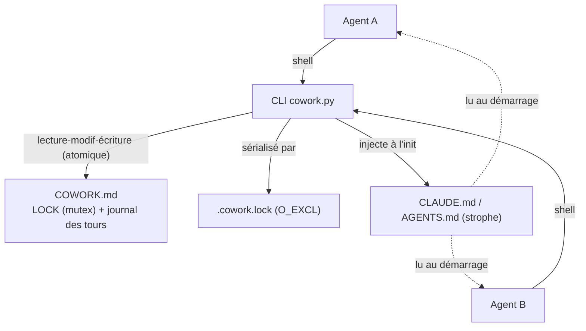
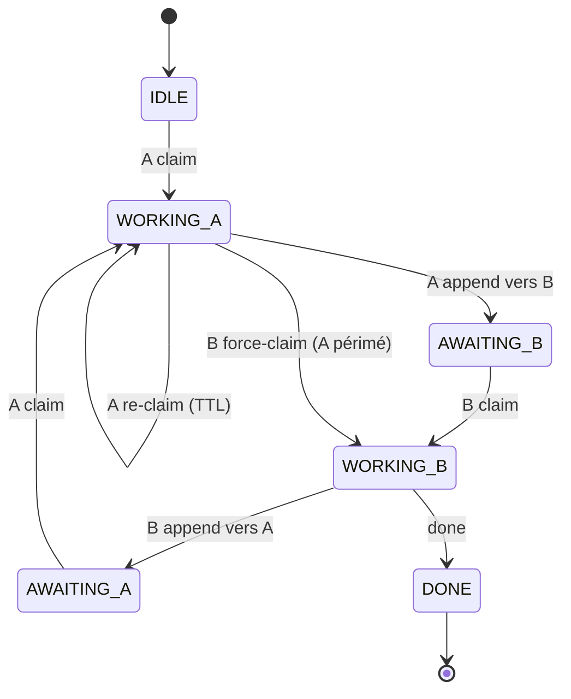
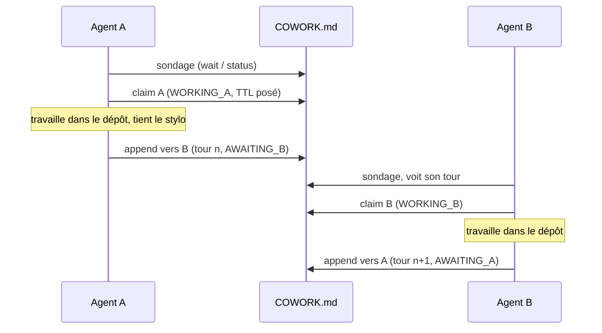

# 🏛️ Document d'architecture — M8Shift

> **Statut** : `Validé` · **Version** : protocole v1 · **Revue** : 2026-06-21

Ce document suit le modèle multi-vues *Document d'architecture*
(`architecture-document-template`, B. Florat, CC BY-SA 4.0), adapté à un
outil mono-fichier. Chaque vue suit le motif **Contraintes → Exigences →
Solution**. Marqué *S.O.* (sans objet) partout où le modèle suppose une
infrastructure d'entreprise non pertinente ici.

## Structure du document

| Vue | Préoccupations | Public |
|-----|----------------|--------|
| [1. Application](#1--vue-application) | Contexte, acteurs, données, interfaces, architecture applicative | PO, architectes, mainteneur |
| [2. Développement](#2--vue-développement) | Stack, patterns, tests, configuration, versionnement | Développeurs, QA |
| [3. Infrastructure & **Exploitation**](#3--vue-infrastructure--exploitation) | Hébergement, opérations, sauvegarde, PRA, supervision, support | Exploitation, mainteneur |
| [4. Sécurité](#4--vue-sécurité) | Intégrité, confidentialité, authz, traçabilité | Sécurité |
| [5. Sizing](#5--vue-sizing) | Stockage, calcul, mémoire, temps de réponse | Capacity planning |

---

## 1. 📋 Vue Application

### 1.1 Contexte général

`cowork` est un **outil de coordination de deux agents IA** (un couple configurable ; par défaut Claude, Codex)
travaillant sur un même dépôt. Il matérialise un **stylo unique** : un seul agent
écrit à la fois, l'autre attend son tour. Tout l'état de coordination vit dans un
seul fichier versionnable `COWORK.md`. L'outil est un **script Python autonome**
(`cowork.py`) qui s'auto-installe dans n'importe quel projet via `init`.

**Positionnement dans le SI** : couche de coordination *au-dessus* du dépôt
hôte ; ne dépend d'aucun service, n'expose aucun port, ne stocke rien hors du
dépôt. Transverse à tous les projets (livres, code, sites…).

### 1.2 Acteurs

| Acteur | Type | Rôle |
|--------|------|------|
| agent actif ×2 | agents IA | le couple configuré du relais (par défaut `claude`/`codex`) ; chacun lit son propre ancrage (`CLAUDE.md`, `AGENTS.md`, …) et opère le relais de son côté |
| mainteneur | humain | déploie, arbitre, lit le journal (`COWORK.md`, git) |

### 1.3 Nature et sensibilité des données

| Processus | Donnée traitée | Classification | C | I | A | T |
|-----------|----------------|----------------|---|---|---|---|
| Coordination | État du verrou + journal des tours (`COWORK.md`) | = sensibilité du dépôt hôte | Faible | **Élevée** | Moyenne | **Élevée** |

> C=Confidentialité, I=Intégrité, A=Disponibilité, T=Traçabilité. L'intégrité et
> la traçabilité priment (le journal fait foi de qui a fait quoi).

### 1.4 Contraintes

- **Un seul fichier d'état** lisible à l'œil et au `grep`, versionnable en clair.
- **Zéro dépendance** : Python 3.8+ stdlib uniquement ; aucune installation.
- **Portable** : tout projet, tout FS, chemins à espaces/accents.
- **Deux agents** par conception (couple configurable ; relais degré 1, défaut claude ⇄ codex).

### 1.5 Exigences

Voir [cahier des charges](cahier-des-charges.md) §4–5 (EF-1→11, ENF-1→6). En
synthèse : exclusion mutuelle, atomicité, autonomie des agents, robustesse,
tenue dans le temps.

### 1.6 Architecture applicative cible

**Composants** : (a) le bloc `LOCK` = automate d'état ; (b) le journal de tours
append-only ; (c) les ancrages porteurs de la *strophe* d'auto-instruction ;
(d) la CLI `cowork.py` (commandes init/status/wait/claim/append/release/done/archive).

**Automate d'état** (`A`, `B` = les deux agents actifs — par défaut `claude`, `codex`) :

**Boucle de relais** (un tour) :

### 1.7 Matrice des flux applicatifs

| Source | Destination | Canal | Mode |
|--------|-------------|-------|------|
| agent | `COWORK.md` | système de fichiers local | R/W |
| `cowork.py init` | l'ancrage de chaque agent actif (défaut `CLAUDE.md`, `AGENTS.md`), `AGENTS.override.md` (si présent), `COWORK.protocol.md` | système de fichiers local | W |
| agent | `COWORK.archive.md` | système de fichiers local | W (append) |

### 1.8 Modèle de concurrence — un mutex, pas un sémaphore

M8Shift est, à la base, un **mutex** (exclusion mutuelle) : à tout instant, **un
seul** agent détient le « stylo ». Ce **n'est pas un sémaphore** — un sémaphore
autoriserait *k* détenteurs simultanés (compteur) ; le degré de concurrence de
M8Shift est strictement **1**. C'est l'invariant central : *un seul agent modifie le
dépôt à la fois.*

Ce n'est pas pour autant un unique mutex de manuel : il **compose quatre primitives
classiques** sur **deux niveaux**.

| Concept classique | Dans M8Shift |
|-------------------|-------------|
| **Mutex OS** (bas niveau) | `.cowork.lock` ouvert en `O_CREAT\|O_EXCL` : un vrai verrou OS qui sérialise la **section critique** = le read-modify-write de `COWORK.md`. Le mutex technique *appliqué*. |
| **Lock applicatif possédé** (haut niveau) | l'état `WORKING_<agent>` du bloc LOCK : un verrou **nommé, avec propriétaire**, tenu pendant toute la **fenêtre de travail** (pas seulement le temps d'une commande). Le mutex *sémantique* qui protège la ressource partagée (le dépôt). |
| **Bail / TTL** (anti-blocage) | `expires` (TTL 30 min) + jeton de propriété : le pattern des **verrous distribués à bail** (nœuds éphémères ZooKeeper, Redlock). Si le détenteur meurt, le bail expire → `claim --force`. |
| **Moniteur / variable de condition + témoin** | `wait <agent>` poll jusqu'à `AWAITING_<soi>` (une **attente de condition**) ; la passation explicite `--to <autre>` est du **token-passing** (témoin / anneau à jeton). |

Deux propriétés le distinguent d'un mutex in-process strict :

- **Coopératif / consultatif, pas appliqué.** L'OS ne peut pas empêcher un process tiers
  d'éditer le dépôt — la vraie section critique (un agent qui modifie des fichiers)
  n'est pas verrouillable matériellement. M8Shift *garantit* qu'on ne peut pas
  **enregistrer** un tour sans tenir le stylo (`append` ⇐ `WORKING_<soi>`), mais
  l'exclusivité du *travail* repose sur la discipline `claim → travail → append`
  (voir [cahier des charges](cahier-des-charges.md) §8).
- **Ré-entrant pour le détenteur.** Le titulaire peut re-`claim` pour rafraîchir son
  bail — un verrou récursif côté propriétaire.

**Pourquoi ça compte pour la roadmap.** Généraliser à un **couple configurable**
d'agents (claude, codex, lechat, …) garde le degré à **1** : le témoin circule entre
les participants choisis au lieu d'un claude/codex câblé en dur. Cela reste un **mutex
à jeton** — ça ne devient *pas* un sémaphore compteur (ce qui supposerait *k > 1*
agents écrivant en parallèle ; c'est l'objet de la version *d'après*, multi-agent).

---

## 2. 🛠️ Vue Développement

### 2.1 Stack logicielle

| Élément | Choix |
|---------|-------|
| Langage | Python **3.8+** |
| Dépendances | **Aucune dépendance Python** (stdlib : `argparse`, `contextlib`, `datetime`, `os`, `re`, `subprocess`, `sys`, `tempfile`, `time`) ; Git optionnel, pour préserver un renommage de casse dans l'index |
| Distribution | **un seul fichier** `cowork.py` (gabarits embarqués) |
| Tests | `unittest` stdlib — `tests/test_cowork.py` |

### 2.2 Patterns notables

- **Écriture atomique** : `write()` → fichier temporaire **unique** (`mkstemp`)
  puis `os.replace` (atomique POSIX). **Toutes** les écritures passent par là, y
  compris l'archive.
- **Verrou inter-process** : les commandes qui mutent l'état prennent
  `.cowork.lock` (`O_CREAT|O_EXCL`) et font le read-modify-write *dedans* → deux
  `cowork.py` concurrents sont sérialisés (pas de double-démarrage IDLE) ; un
  verrou abandonné est repris après 60 s.
- **Validation d'entrée** : champs mono-ligne (refus saut de ligne + marqueurs
  réservés) ; corps neutralisé (anti-injection de faux tours).
- **Source de vérité unique** : protocole, gabarit `COWORK.md` et strophe sont des
  constantes de `cowork.py` ; `docs/en/protocol.md` et `docs/fr/protocole.md` en sont
  une *génération* de `cowork.PROTOCOL[lang]` (test de non-régression octet-à-octet
  `test_protocol_docs_in_sync`).
- **Injection idempotente et prioritaire** : strophe encadrée par marqueurs
  `COWORK:STANZA`, déplacée/actualisée en tête sans duplication. Les variantes de
  casse sont normalisées vers le nom canonique sur tout FS (`git mv -f` si Git
  est disponible et le fichier suivi, afin d'actualiser l'index) ;
  `AGENTS.override.md`, prioritaire pour Codex dans le même dossier, est
  synchronisé s'il existe. Si seul un ancrage Claude préexistait, le nouveau
  `AGENTS.md` reçoit un pont vers ses instructions communes ; aucun pont n'est
  ajouté lorsqu'une instruction Codex existait déjà.
- **Marqueurs en commentaires HTML** : invisibles au rendu Markdown, `grep`-ables.

### 2.3 Stratégie de test

46 tests, sans dépendance Python externe : unitaires (fonctions pures : `other`,
`parse_iso`/`iso`, `get_lock`/`set_lock`, `stanza_for`, `clean_body`) +
non-régression CLI en sous-processus isolé (modèle claim→append, mutex, **concurrence
claude/codex** avec un seul gagnant, ancrages canoniques/override, archive,
robustesse, anti-injection, schéma LOCK). Commande :
`python3 -m unittest discover -s tests`.

### 2.4 Gestion de configuration, encodage, fuseaux

- **Config** : aucune ; tout est embarqué. `init` prend `--name` / `--agents a,b`
  (le couple du relais) / `--lang en|fr` / `--force`.
- **Encodage** : UTF-8 partout (lecture/écriture explicites).
- **Fuseaux** : tous les horodatages en **UTC** ISO-8601 (`...Z`).
- **Journalisation** : sortie standard (messages `✓`/`refus`/`…`), pas de fichier de log.

### 2.5 Politique de branches & versionnement

Branche `dev/vX.Y.x` par sprint, merge + tag sur `main`. Le **protocole** est
versionné (v1) : tout changement **cassant** du format `LOCK`/`TURN`/marqueurs
incrémente la version et préserve la lecture des `COWORK.md` existants. Le champ roster (liste d'agents)
`agents:` est un ajout **optionnel rétrocompatible** dans la v1 (les anciens lecteurs
l'ignorent ; sûr pour le couple par défaut `claude,codex` — un roster personnalisé
exige un script conscient du roster).

---

## 3. 🏗️ Vue Infrastructure & Exploitation

> C'est la vue **exploitation** : comment cela tourne, se sauvegarde, se
> supervise et se remet en marche.

### 3.1 Contraintes d'hébergement

- **Aucun serveur, aucun service réseau, aucun port.** L'« infrastructure » est
  le **système de fichiers du dépôt hôte**. *Disponibilité datacenter, catégorie
  PRA, pare-feu, certificats : S.O.*
- Exécution **à la demande** : chaque commande est un process court (pas de daemon).

### 3.2 Exigences d'exploitation

| ID | Exigence |
|----|----------|
| EX-1 | Anti-blocage : un verrou abandonné est récupérable sans intervention (TTL 30 min + `claim --force`). |
| EX-2 | Tenue dans le temps : `COWORK.md` reste borné (archivage). |
| EX-3 | Observabilité sans outil : l'état est lisible par `status` ou `grep`. |

### 3.3 Solution d'exploitation

#### Démarrage / arrêt
Pas d'ordre de démarrage : `cowork.py init` déploie, le relais « tourne » par
invocations successives des agents. « Arrêt » = `done <agent>` (état `DONE`).

#### Opérations planifiées & supervision
- **Poll** : chaque agent inactif appelle `wait <soi>` (boucle ~60 s, `--interval N`)
  ou `wait <soi> --once` (un contrôle, non bloquant, pour une boucle externe).
- **Supervision** : `cowork.py status` (verrou + dernier tour) ; en black-box,
  `grep -E '^state:|^holder:' COWORK.md`.
- **Détection de blocage** : `status` signale un verrou **périmé** (`WORKING_*`
  + `now > expires`) → reprise par `claim <soi> --force`.

#### Mode maintenance
Édition manuelle possible du bloc `LOCK` (format `clé: valeur` trivial) ; en cas
de doute, `init --force` réinitialise le verrou à `IDLE` sans perdre l'historique
archivé.

#### Sauvegarde & restauration
- **Sauvegarde** : `COWORK.md` et `COWORK.archive.md` sont **versionnés par git**
  (le dépôt hôte est la sauvegarde ; RPO = dernier commit).
- **Restauration** : `git checkout` du fichier ; l'archive conserve l'historique
  des tours purgés.
- **Atomicité** : `os.replace` garantit qu'on ne lit jamais un fichier d'état à
  demi écrit (pas de corruption sur interruption).

#### Journalisation
Le **journal des tours** EST le log fonctionnel (qui, quoi, quand, ask/done).
Les sorties CLI vont sur stdout. Pas de PII au-delà du contenu de tâche saisi.

### 3.4 Plan de reprise (PRA)

| Sinistre | Reprise |
|----------|---------|
| Verrou abandonné (agent crashé) | TTL 30 min puis `claim --force` (EX-1) |
| `COWORK.md` corrompu/perdu | `git checkout` ou `init --force` (repart `IDLE`, archive préservée) |
| `cowork.py` perdu | recopier le fichier unique depuis ce repo ; `init` régénère le reste |

**RTO** : quelques secondes (commande). **RPO** : dernier commit git.

### 3.5 Décommissionnement

Supprimer `COWORK.md`, `COWORK.protocol.md`, `COWORK.archive.md` et la strophe de
`CLAUDE.md`, `AGENTS.md` et, le cas échéant, `AGENTS.override.md` (entre marqueurs
`COWORK:STANZA`). Aucune ressource externe à libérer.

### 3.6 Contacts support

| Niveau | Contact |
|--------|---------|
| Mainteneur | le propriétaire du dépôt (voir l'hôte où vous l'avez cloné) |
| Source | votre propre hôte Git / GitLab — fork & clone (ex. `git clone https://gitlab.example.com/you/M8Shift.git`) |

---

## 4. 🔒 Vue Sécurité

### 4.1 Modèle de menace

Mutex **coopératif**, pas applicatif : conçu pour deux agents **de confiance**.
Aucune frontière de sécurité forte entre eux ; la protection est procédurale.

### 4.2 Intégrité
- Tours **immuables par convention** : l'outil ne réécrit jamais un tour clôturé
  (rien au niveau du FS ne l'empêche en édition manuelle).
- Écriture **atomique** (`mkstemp` + `os.replace`) et read-modify-write
  **sérialisé** par `.cowork.lock` (`O_EXCL`).
- Garde-fous : écriture refusée hors-tour ; `--to` ≠ soi ; `release`/`done`
  exigent de tenir le stylo ; **anti-injection** (champs mono-ligne, corps neutralisé).

### 4.3 Confidentialité
`COWORK.md` peut contenir du contenu de tâche → **même classification que le
dépôt hôte**. Pas de secret à y stocker. Aucun chiffrement (hors périmètre).

### 4.4 Authentification / Autorisation
- **Authn** : aucune ; repose sur les permissions du système de fichiers local.
- **Authz** : l'« identité » est déclarative (`claude`/`codex`) ; les garde-fous
  d'état empêchent les actions hors-tour. `--force` est un *override* explicite
  réservé à la récupération (un acteur malveillant pourrait l'employer — accepté
  par le modèle coopératif).

### 4.5 Traçabilité & auditabilité
Le journal des tours + l'historique git fournissent une piste d'audit complète
(qui a pris le stylo, quand, pour faire quoi). `note`/`since` horodatent chaque
transition.

---

## 5. 📊 Vue Sizing

### 5.1 Contraintes
Empreinte négligeable ; pas de SAN, pas de base de données.

### 5.2 Estimation des ressources

| Ressource | Ordre de grandeur |
|-----------|-------------------|
| Stockage `COWORK.md` | quelques Ko ; **borné** par `archive` (≈ LOCK + N derniers tours) |
| Archive | croît linéairement ; purgeable / compressible hors-ligne |
| CPU / mémoire | une invocation Python courte ; négligeable |
| Temps de réponse | commande < ~100 ms (hors `wait` bloquant, volontairement ~60 s/poll) |

### 5.3 Sizing dynamique
Le seul paramètre de charge est l'intervalle de poll (`wait --interval N`) ;
`--once` permet une supervision sans coût d'attente.

---

## Glossaire

| Terme | Définition |
|-------|------------|
| **Stylo / verrou** | Droit exclusif d'écrire, matérialisé par le bloc `LOCK`. |
| **Tour (`TURN`)** | Une prise de parole d'un agent, encadrée `BEGIN`/`END`, immuable une fois close. |
| **Stanza** | Bloc d'auto-instruction injecté dans `CLAUDE.md`/`AGENTS.md` entre marqueurs `COWORK:STANZA`. |
| **Verrou périmé** | `WORKING_*` dont `expires` est dépassé → reprenable avec `--force`. |
| **TTL** | Durée de validité d'un verrou en travail (30 min). |
