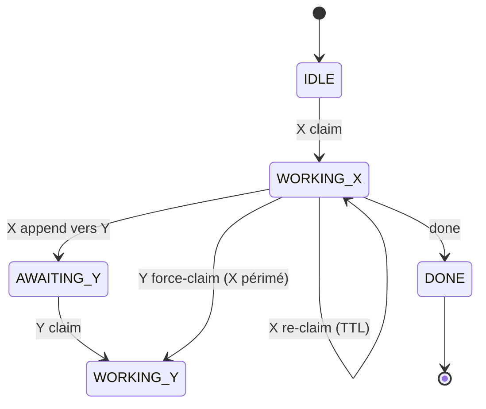

# Cahier des charges — M8Shift

> **Statut** : `Validé` · **Version** : protocole v1 · **Dernière revue** : 2026-06-21

---

## 1. Objet

`cowork` permet à **deux agents IA** (Claude et Codex) de travailler sur un même
dépôt **sans se marcher dessus**, en se coordonnant via un **unique fichier
partagé** `M8SHIFT.md`, en alternance stricte (mutex coopératif). Le système doit
être **portable sur tout projet** et **utilisable par les agents sans qu'un humain ait
à expliquer le protocole** (il est auto-suffisant). *Limite* : dans les UI interactives
d'agent, un humain relance quand même chaque agent pour qu'il reprenne entre les tours —
voir §8.

## 2. Périmètre

| Inclus | Exclu |
|--------|-------|
| Verrou mono-fichier, journal de tours, CLI de pilotage | Orchestration réseau / multi-machines |
| Auto-installation idempotente (`init`) dans tout projet | Plus de deux agents simultanés |
| Anti-blocage par TTL, archivage borné | Daemon résident, file d'attente persistante |
| Ancrages `CLAUDE.md` / `AGENTS.md` | Authentification / chiffrement du fichier d'état |

## 3. Acteurs

| Acteur | Rôle |
|--------|------|
| **agent actif ×2** | le couple configuré du relais (par défaut `claude` → `CLAUDE.md`, `codex` → `AGENTS.md`) ; chaque agent IA lit son propre ancrage et opère le relais de son côté |
| **mainteneur** | Humain ; déploie le kit, arbitre, lit le journal |

## 4. Exigences fonctionnelles

| ID | Exigence | Vérifié par |
|----|----------|-------------|
| EF-1 | **`claim` obligatoire et exclusif avant de travailler** : il acquiert `WORKING_<soi>` depuis `IDLE`/`AWAITING_<soi>` ; deux `claim` simultanés (claude/codex) ⇒ un seul réussit, l'autre est exclu. | `test_claim_exclusive_sequential`, `test_concurrent_claim_claude_vs_codex_single_winner` |
| EF-1b | `append` n'est accepté **que depuis `WORKING_<soi>`** (donc après `claim`) → garantit l'exclusivité de la **fenêtre de travail** dans le dépôt, pas seulement du journal. | `test_append_requires_claim_from_idle`, `test_append_requires_claim_from_awaiting` |
| EF-2 | `append` écrit le tour suivant **et** passe la main (`AWAITING_<autre>`) en une opération atomique ; `turn` est incrémenté. | `test_handoff_increments_and_alternates` |
| EF-3 | Un tour clôturé (`END`) est immuable (par convention : l'outil ne le réécrit jamais). | (revue) |
| EF-4 | `--to` doit viser l'autre agent (auto-passation interdite). | `test_self_handoff_refused` |
| EF-5 | `wait <agent>` attend le tour de l'agent ; `--once` ne fait qu'un contrôle (rc 0 = son tour, rc 3 sinon). | `test_wait_once_return_codes` |
| EF-6 | `claim --force` ne reprend **qu'un verrou périmé** ; refusé sur un verrou actif. | `test_force_refused_on_fresh_lock`, `test_force_accepted_on_stale_lock` |
| EF-7 | Le détenteur peut reprendre son propre verrou (rafraîchir le TTL). | `test_reclaim_own_lock_refreshes` |
| EF-8 | `release` / `done` n'agissent que si l'appelant tient le stylo (ou personne) ; `--force` outrepasse. | `test_release_done_require_holder`, `test_release_done_force_overrides` |
| EF-9 | `archive --keep N` purge les anciens tours clôturés sans jamais déplacer le tour d'amorçage `#0` ni toucher au verrou. | `test_archive_preserves_system_turn0` |
| EF-10 | `init` génère `M8SHIFT.md`, `M8SHIFT.protocol.md` et injecte les ancrages ; idempotent (strophe non dupliquée, contenu existant préservé, `M8SHIFT.md` non écrasé sauf `--force`). | `test_reinit_idempotent_preserves_content`, `test_init_force_resets_lock` |
| EF-11 | Ancrages auto-chargeables sur FS sensible ou non à la casse : une variante unique est renommée vers `CLAUDE.md`/`AGENTS.md`, y compris dans l'index si Git est disponible et la suit ; les variantes ambiguës sont refusées. | `test_anchor_case_insensitive_no_duplicate`, `test_codex_anchor_is_canonical_on_case_sensitive_fs`, `test_tracked_anchor_case_rename_updates_git_index`, `test_ambiguous_anchor_variants_refused` |
| EF-12 | La strophe est idempotente et placée en tête des ancrages ; si `AGENTS.override.md` existe, elle est synchronisée dans l'override et dans `AGENTS.md`. | `test_stanza_is_moved_to_anchor_start`, `test_codex_override_also_receives_stanza` |
| EF-13 | Si le projet possédait `CLAUDE.md` mais aucune instruction Codex, `init` crée dans le nouveau `AGENTS.md` un pont vers les instructions communes de `CLAUDE.md` ; un ancrage Codex préexistant reste autonome. | `test_missing_agents_bridges_existing_claude_instructions`, `test_existing_agents_does_not_receive_claude_bridge` |

## 5. Exigences non fonctionnelles

| ID | Exigence |
|----|----------|
| ENF-1 **Portabilité** | Fonctionne sur dossier vide ou dépôt git, chemins à espaces/accents, FS sensible ou non à la casse. Python 3.8+, **stdlib uniquement**, aucun paquet tiers. Tourne sous **Linux, macOS et Windows** (WSL, Git Bash ou `python m8shift.py` natif ; voir le guide Windows). |
| ENF-2 **Atomicité** | Toute écriture (y compris l'archive) passe par fichier temporaire **unique** + `os.replace`, en **préservant le mode** du fichier cible ; sérialisée par un verrou inter-process (`.m8shift.lock`, `O_EXCL`, jeton de propriété). |
| ENF-3 **Autonomie agents** | Toute la marche à suivre est embarquée : `M8SHIFT.protocol.md` (§0 quickstart) + strophe des ancrages. Aucune explication humaine requise. |
| ENF-4 **Robustesse** | Entrées invalides (agent inconnu, `--body` absent, `M8SHIFT.md` manquant, **LOCK au schéma invalide** : `state`/`turn`/`holder`) → sortie propre `sys.exit`, jamais de traceback, jamais d'état corrompu. |
| ENF-5 **Tenue dans le temps** | `M8SHIFT.md` reste borné via `archive` ; l'archive n'est jamais relue par la boucle. |
| ENF-6 **Lisibilité** | État et tours lisibles à l'œil et au `grep` ; marqueurs en commentaires HTML invisibles au rendu Markdown ; versionnable en clair. |
| ENF-7 **Amorçage** | Les noms d'ancrage suivent les conventions auto-chargées ; la strophe est prioritaire dans le fichier et les limites de découverte Codex (override, racine, plafond de taille, rechargement par session) sont documentées. |
| ENF-8 **Internationalisation (i18n)** | Les fichiers générés et les messages de la CLI sont bilingues (en/fr), **anglais par défaut**. `init --lang en\|fr` sélectionne la langue des artefacts générés (consignée dans le champ `lang` du LOCK) ; `$M8SHIFT_LANG` surcharge la langue des messages à l'exécution. |
| ENF-9 **Zéro identifiant / toute surface** | `m8shift.py` ne fait **aucun appel réseau** et ne requiert **aucune clé API, jeton ou compte** ; il s'appuie entièrement sur l'auth propre des agents hôtes. Il tourne sur toutes les surfaces Claude Code / Codex (terminal/CLI, application desktop, IDE/VS Code, web) — les UI interactives demandent un coup de pouce humain entre les tours, une boucle CLI headless automatise entièrement. |

> **Rédaction i18n (note).** À l'exécution, M8Shift reste un **fichier unique** : les
> catalogues `en`/`fr` vivent dans `m8shift.py` (`MESSAGES` + les dictionnaires de
> gabarits), donc ajouter une langue = une entrée de dictionnaire de plus. Pour un flux
> **adapté aux traducteurs** (éditer des fichiers de langue sans toucher au Python),
> utilise une **étape de build** : rédiger des fichiers par langue (`i18n/fr.json`, …)
> et les *assembler* dans le `m8shift.py` unique livré (un échafaudage `build/` —
> `assemble.py`, `i18n_logic.py` — existe pour ça). Exécution = un fichier ; rédaction =
> pipeline de build optionnel. Recommandation : rester en ligne sauf si plusieurs
> langues sont prévues.

## 6. Modèle de données — le bloc `LOCK`

En tête de `M8SHIFT.md`, entre `<!-- M8SHIFT:LOCK:BEGIN -->` et `:END` :

| champ | type | valeurs |
|-------|------|---------|
| `holder` | enum | un agent actif \| `none` (défaut `claude`/`codex`) |
| `state` | enum | `IDLE` \| `WORKING_<X>` \| `AWAITING_<X>` \| `DONE` (un par agent actif) |
| `agents` | CSV \| absent | roster (liste d'agents) déclaré ; les **deux premiers** forment le couple actif (les noms supplémentaires sont réservés au futur mode N agents) |
| `turn` | entier | numéro du dernier tour clôturé |
| `since` | ISO-8601 UTC | depuis quand l'état dure |
| `expires` | ISO-8601 UTC \| `-` | TTL anti-blocage ; date **seulement** pendant `WORKING_*` |
| `note` | texte | mémo lisible |
| `lang` | enum \| absent | `en` \| `fr` — langue des fichiers générés / des messages à l'exécution |

**Machine à états** (transitions légitimes) :



## 7. Interface en ligne de commande

`init [--agents a,b] [--lang en|fr]` · `status` · `wait <agent> [--once] [--interval N]` · `claim <agent> [--force]` ·
`append <agent> --to <autre> --ask … --done … [--files …] [--body f|-]` ·
`release <agent> --to <autre> [--force]` · `done <agent> [--force]` · `archive [--keep N]`

Codes retour : `0` succès · `1` refus/erreur (état, garde-fou, entrée invalide) ·
`2` usage argparse · `3` `wait --once` quand ce n'est pas le tour de l'agent.

## 8. Contraintes & limites connues

- **Réveiller l'UI d'un agent interactif** : `wait` bloque un *processus* jusqu'à ton
  tour, mais il ne **relance ni ne réveille** un agent tournant dans une UI interactive
  (VS Code, …). Entre les tours, un humain relance chaque agent (p. ex. *« reprends
  M8Shift »*). Une opération entièrement autonome exige une boucle **headless (sans interface)**
  (`claude -p`, `codex exec`, cron) enveloppant `wait → relancer l'agent → claim` — une
  intégration à l'hôte, pas une modification du mutex. Une notification/webhook peut
  *signaler* un tour mais ne peut pas *réveiller* l'IA à elle seule.
- **Exclusivité de la fenêtre de travail** : garantie par `claim` (acquisition
  exclusive de `WORKING_<soi>`) + `append` restreint à `WORKING_<soi>`. Repose sur
  la **discipline** claim→travail→append ; cowork ne peut pas verrouiller le
  système de fichiers, donc un agent qui édite le dépôt **sans** avoir claim n'est
  pas empêché par l'outil (mais ne pourra pas `append`).
- **Exclusivité par identité, pas par instance** : `claim` exclut l'**autre**
  agent (claude vs codex), mais plusieurs processus du **même** agent réussissent
  tous leur `claim` (traité comme un rafraîchissement du TTL). cowork ne distingue
  pas deux instances de `claude` ; le modèle suppose une instance par identité.
- **Mutex coopératif, non applicatif** : un agent malveillant peut, avec `--force`,
  outrepasser `release`/`done`. Le modèle suppose deux agents coopératifs.
- **Concurrence sérialisée par verrou conseillé** : `.m8shift.lock` (`O_CREAT|O_EXCL`,
  jeton de propriété) sérialise le read-modify-write + écriture atomique. Verrou
  *conseillé* : une édition manuelle de `M8SHIFT.md` le contourne ; sur FS réseau
  (NFS) `O_EXCL`/`rename` sont moins fiables (cowork vise un disque local).
- **Immutabilité par convention** : l'outil ne réécrit jamais un tour clôturé,
  mais rien au niveau du système de fichiers ne l'empêche (édition manuelle).
- **Deux agents simultanés (actuel)** : le protocole est binaire par conception —
  un **mutex de degré 1**. **Roadmap (deux étapes)** : (1) le **couple** du relais
  est **configurable** depuis un roster extensible via `init --agents a,b` — les deux
  premiers noms forment le couple actif, les noms supplémentaires sont stockés pour
  plus tard (**implémenté, étape 1** ; voir
  [RFC — couple d'agents configurable](rfc-roster.md)) ; (2) **N agents simultanés**
  (degré > 1), étape distincte et future. La version actuelle reste limitée à deux
  agents simultanés.
- **Chargement des ancrages** : il dépend de l'outil hôte. Codex construit sa
  chaîne d'instructions une fois par exécution, donne priorité à
  `AGENTS.override.md` dans un dossier et applique un plafond de taille (32 Kio
  par défaut), en tronquant le dernier fichier au budget restant. `init` couvre
  l'override local et place la strophe en tête, mais ne peut ni recharger une
  session ouverte ni compenser une configuration globale qui consomme déjà tout
  le plafond.

## 9. Recette / validation

- Suite `tests/test_m8shift.py` : **74 tests** (unitaires + non-régression : modèle
  claim, mutex, concurrence claude/codex, ancrages canoniques/override, roster
  configurable, archive, robustesse, anti-injection),
  `python3 -m unittest discover -s tests`, sans dépendance Python externe (le test
  d'intégration Git est ignoré si Git est absent).
- Vérification adversariale multi-agents + 3 revues Codex successives, chaque
  constat reproduit puis corrigé puis re-testé.
- Test de non-régression documentaire : `docs/en/protocol.md` et `docs/fr/protocole.md`
  doivent rester octet-identiques à `cowork.PROTOCOL[lang]` (`test_protocol_docs_in_sync`).

## 10. Versionnement

Protocole **v1**. Tout changement **cassant** du format `LOCK`/`TURN` ou des
marqueurs incrémente la version du protocole et doit préserver la lecture des
`M8SHIFT.md` existants ou fournir une migration.

Le champ roster `agents:` (RFC étape 1) est un **ajout optionnel rétrocompatible**
dans la v1, pas un changement cassant : un lecteur non conscient du roster l'ignore
et continue de fonctionner **pour le couple par défaut `claude,codex`**. Un roster
*personnalisé* exige en revanche un script conscient du roster — un ancien script le
traiterait comme `claude,codex` et pourrait le corrompre. Les marqueurs et le format
un `clé : valeur` par ligne sont inchangés.

## 11. Développer M8Shift avec M8Shift (dogfooding)

M8Shift peut coordonner **son propre développement** — deux agents éditant `m8shift.py`
et le dépôt via le relais. Une précaution est décisive : ici, **l'outil est aussi
l'artefact**. Chaque `m8shift.py <cmd>` recharge le fichier depuis le disque ; une
erreur de syntaxe transitoire dans la source en cours d'édition casserait le relais
lui-même.

**Pattern — découpler le moteur de la source éditée.** Lancer le relais depuis une
**copie figée** de `m8shift.py` placée dans un **répertoire de travail séparé**, hors du
dépôt. Comme le verrou, le journal et les ancrages naissent à côté du moteur
(`HERE = __file__`), tout l'état du relais y vit et l'arbre de travail du dépôt reste
intact :

```text
Code/
├── cowork/                 ← le dépôt (édité ici — le travail réel)
│   └── m8shift.py           ← source en cours de modification
└── cowork-relay/           ← répertoire de travail du relais (hors dépôt)
    ├── m8shift.py           ← copie FIGÉE = le moteur
    ├── M8SHIFT.md           ← journal de coordination + LOCK
    ├── M8SHIFT.protocol.md · CLAUDE.md · AGENTS.md
    └── .m8shift.lock
```

- Le moteur ne se met à jour **que** sur un `cp` explicite — un `m8shift.py`
  momentanément cassé dans le dépôt n'affecte jamais la coordination.
- Les ancrages vivant dans le répertoire du relais (pas à la racine du dépôt),
  **l'auto-amorçage ne se déclenche pas** : chaque agent est pointé manuellement vers
  le `M8SHIFT.protocol.md` du relais (le cas documenté « sans racine projet »). La
  discipline est inchangée — un agent n'édite le dépôt **que** pendant qu'il tient le
  stylo, et garde `cowork/m8shift.py` importable (`ast.parse`) avant chaque `append`.

C'est exactement ainsi que l'étape roster (RFC étape 1) a été relue : Claude a
implémenté, puis a passé la main à Codex pour une revue adversariale via un relais figé
dans `cowork-relay/`. Un **git worktree** du dépôt ne découplerait *pas* le moteur (il
suit la même branche, donc son `m8shift.py` change à l'édition) — utiliser une copie figée.

## 12. Évolutions prévues & non-goals

Chaque évolution prévue reste dans les qualités de M8Shift (mono-fichier, passif,
zéro-identifiant, fondé sur fichiers & versionné) : elle est **append-only ou en lecture
seule sur des données que M8Shift stocke déjà** — jamais un daemon, une intégration, ni une
seconde source de vérité. (Vettée par une revue de conception adversariale qui a rejeté
tout ce qui briserait une qualité.)

### 12.1 Retenues (roadmap)

| Évolution | Priorité | Quoi | Pourquoi ça préserve les qualités |
|-----------|----------|------|-----------------------------------|
| **Mémoire partagée + recap** | prochain | `m8shift.py remember <agent> --key <slug> --note "…"` ajoute un bloc `M8SHIFT:MEM` dans un `M8SHIFT.memory.md` voisin (écriture atomique sous `file_lock()`, gardée par `WORKING_<agent>`) ; `m8shift.py recap` est un briefing en lecture seule (LOCK courant + N derniers tours + entêtes mémoire). | Un bloc append-only gardé par le **même** stylo / garde `WORKING_<agent>` que `append` ; recap ne fait que ré-afficher des marqueurs déjà écrits. M8Shift ne relit **jamais** le registre dans sa logique — il décide toujours seulement *qui écrit, quand*. |
| **Handoff structuré + peek** | prochain | Champs de tour optionnels en écriture seule (`branch` / `commit` / `tests` / `next`, défaut `-`) + `m8shift.py peek <agent>` pour lire les champs de la dernière passation (rc 0 ton tour, rc 3 sinon). | Les lignes d'en-tête ne sont jamais relues par le moteur (seuls le bloc LOCK + les marqueurs le sont) ; peek est en lecture seule sur des données que `append` a déjà écrites. |
| **Timeline + status JSON** | prochain | `m8shift.py log [--limit N] [--agent X] [--all] [--oneline]` (chronologie depuis les marqueurs de tour existants ; `--all` parcourt l'archive) + `status --json`. | Purs renderers en lecture seule sur des données existantes ; seul le `json` de la stdlib est ajouté. |
| **`claim --check <globs>`** | plus tard | Sonde consultative, en lecture seule, du chevauchement de fichiers avec le dernier champ `files:` de l'autre agent (`fnmatch` stdlib). | Consultatif seulement — n'accorde aucun bail de chemin, n'ouvre aucune fenêtre de travail concurrente : reste degré 1. |
| **`subturn`** | plus tard | Consigner le fan-out de sous-agents d'un agent comme annotation `M8SHIFT:SUBTURN <n>.<k>` sous son tour ouvert (accepté seulement depuis `WORKING_<agent>`). | Append-only ; ne touche jamais au LOCK / compteur de tours / bâton ; les sous-agents ne tiennent jamais le stylo. |
| **Tableau de tâches / block-on** | peut-être | Partition `M8SHIFT.tasks.md` append-only (`tasks claim/done`) ; `block`/`unblock` nomment une dépendance externe comme raison d'attente `blocked_on` explicite. | Sérialisé par le même verrou `O_EXCL` ; n'exécute jamais une tâche, ne sonde pas, ne route pas le bâton. |

### 12.2 Non-goals (rejetés — briseraient une qualité)

| Rejeté | Qualité brisée | Pourquoi |
|--------|----------------|----------|
| **Baux par chemin** (écritures disjointes concurrentes) | mutex degré 1 / minimal | Met deux agents en état de travail en même temps — c'est le verrou **degré 2 de l'étape 2**, pas le stylo unique d'aujourd'hui. `claim --check` livre les 80 % sûrs, consultatifs. |
| **Daemon / watcher / push de notifs en arrière-plan** | passif | M8Shift n'a aucun process résident ; le destinataire sonde à son propre tour. Une notification *signale* un tour, ne *réveille* jamais l'IA. |
| **Lancer git / builds / API / exécuter `--next`** | passif + zéro-identifiant | Agir sur un outil demande auth + réseau et transforme M8Shift en orchestrateur ; les champs de handoff restent consultatifs en écriture seule, interprétés par l'agent **destinataire** avec sa propre auth. |
| **Deps tierces / paquet multi-fichiers** | mono-fichier | Chaque item est cantonné à la stdlib (`json`, `fnmatch`, `re`) ; une BD / file / serveur découperait l'outil — fini le `cp m8shift.py`. |
| **Mémoire *dérivée* « intelligente »** (dédup / résumé / recherche / purge) | minimal / fondé sur fichiers | Le registre est une trace bête append-only ; tout digest est un passthrough verbatim de l'agent. Dès que M8Shift cure le contenu, il possède une base de connaissances avec politique — une seconde source de vérité. |
