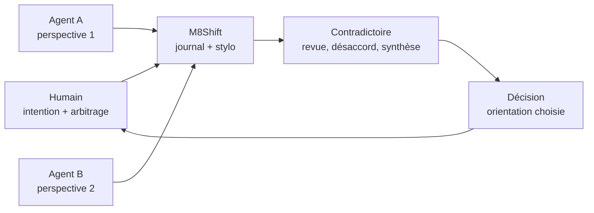
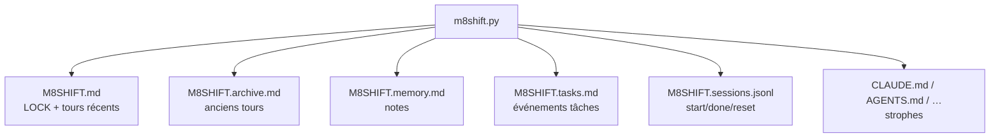
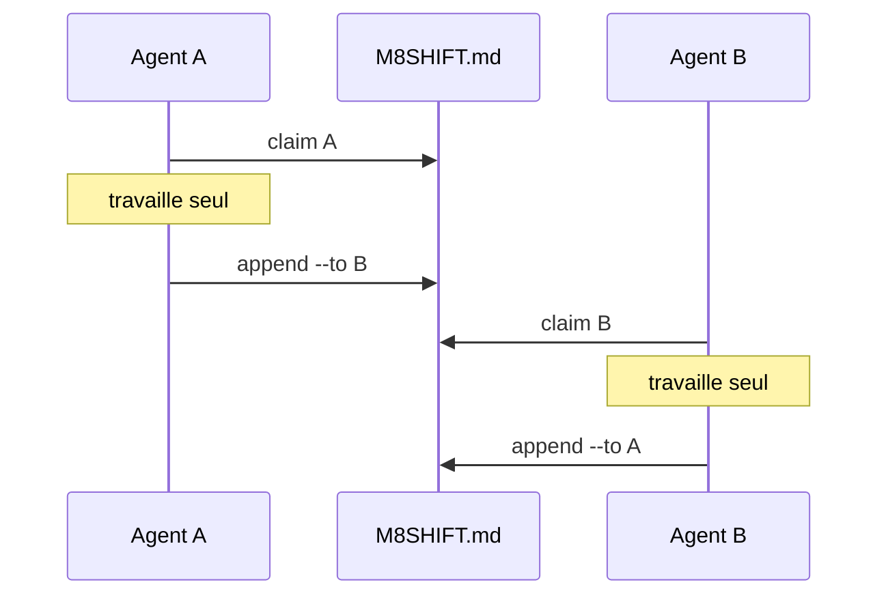
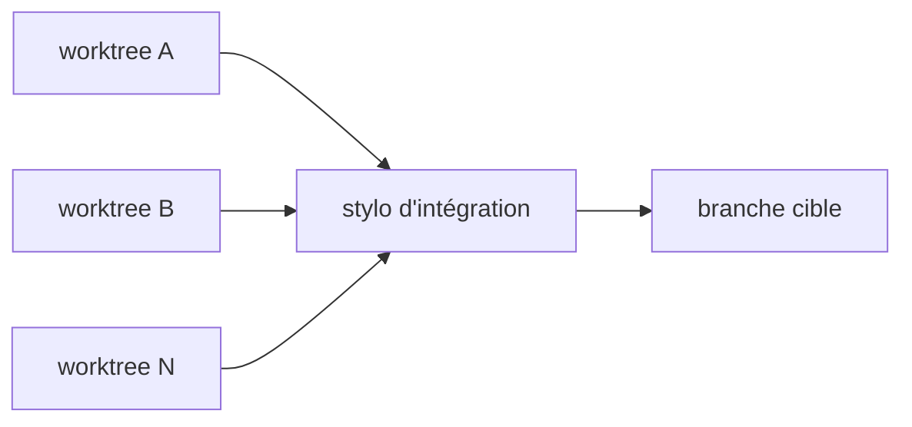

# Cahier des charges — M8Shift

> **Statut** : `Courant` · **Version** : protocole v1 · **Dernière revue** : 2026-06-24
>
> Traduction synthétique de la spécification anglaise. La référence exhaustive reste
> [docs/en/specification.md](../en/specification.md).

---

## 1. Objet

M8Shift permet à un **roster actif de deux agents IA ou plus** (Claude, Codex,
Gemini, Le Chat, …) de travailler sur un même dépôt **sans s'écraser**. Le cœur
coordonne les agents via un fichier partagé `M8SHIFT.md` et un **stylo unique** :
un seul agent écrit dans l'arbre partagé à la fois.

L'outil doit rester :

- mono-fichier (`m8shift.py`) ;
- stdlib uniquement ;
- lisible à l'œil et au `grep` ;
- portable sur n'importe quel projet ;
- utilisable par les agents sans explication humaine additionnelle.

Limite assumée : dans une UI interactive, `wait` bloque un processus mais ne réveille
pas automatiquement l'agent. Une boucle headless ou un compagnon runtime peut relancer
un agent ; le cœur reste passif.

## 2. Périmètre

| Inclus | Exclu |
|--------|-------|
| Verrou mono-fichier, journal de tours, CLI de coordination | Orchestration réseau / multi-machines |
| Roster actif N-agent, un seul stylo dans le cœur | Deux écrivains simultanés dans le même arbre partagé |
| Auto-installation idempotente (`init`) | Daemon résident obligatoire |
| Mémoire partagée, tâches, historique de sessions | Mémoire intelligente / dédup / résumé automatique |
| Diagnostic `doctor`, `status --json`, `history --json` | Réparation automatique ou vol du stylo |
| Compagnon optionnel `m8shift-worktree.py` | Auto-merge opaque / suppression automatique de worktrees |
| i18n par variantes mono-fichier générées | Paquet multi-fichiers obligatoire |

## 3. Acteurs

| Acteur | Rôle |
|--------|------|
| **agent actif ×N** | membre du roster (`claude`, `codex`, …) ; lit son ancrage et opère le relais |
| **mainteneur humain** | déploie le kit, arbitre, intervient, lit le journal, tranche les orientations |
| **compagnon worktree** | optionnel ; isole du travail parallèle et sérialise l'intégration |

## 4. Philosophie produit

M8Shift existe pour rendre exploitable le **contradictoire entre agents**. Les agents
évoluent différemment et ne donnent pas toujours les mêmes réponses en technique,
écriture, droit, design ou architecture. Le projet permet de faire circuler ces
visions dans un espace commun, sans que l'humain devienne le bus de copier-coller.



La décision reste humaine. M8Shift coordonne les points de vue ; il ne remplace pas
le jugement du mainteneur.

## 5. Exigences fonctionnelles

| ID | Exigence |
|----|----------|
| EF-1 | `claim` est obligatoire avant tout travail : il acquiert `WORKING_<agent>` depuis `IDLE` ou `AWAITING_<agent>`. |
| EF-2 | L'acquisition est exclusive : plusieurs `claim` concurrents depuis `IDLE` donnent un seul gagnant. |
| EF-3 | `append` n'est accepté que depuis `WORKING_<agent>` ; il clôt le tour, incrémente `turn` et passe la main. |
| EF-4 | `--to` doit cibler un autre membre actif du roster. |
| EF-5 | `wait <agent>` attend le tour ; `wait --once` retourne `3` si ce n'est pas le tour. |
| EF-5b | `next <agent>` reprend la boucle sans ambiguïté : attend si besoin, puis claim et affiche le dernier handoff ; `--once` ne mute rien si ce n'est pas le tour. |
| EF-6 | `claim --force` ne reprend qu'un verrou `WORKING_*` périmé ; le détenteur peut rafraîchir son propre TTL avec `claim <soi>`, et un wrapper long doit le faire au moins 5 minutes avant expiration. |
| EF-7 | `release` et `done` sont des opérations de détenteur du bâton (`holder`) ; `append` seul exige un stylo actif. `--force --reason TEXTE` outrepasse et journalise la raison. |
| EF-8 | `archive --keep N` déplace les anciens tours clos vers `M8SHIFT.archive.md` sans toucher au LOCK ni au tour #0. |
| EF-9 | `init` génère `M8SHIFT.md`, `M8SHIFT.protocol.md` et injecte les ancrages sans dupliquer les strophes. |
| EF-10 | Les variantes d'ancrage (`agents.md`, `CLAUDE.md`, etc.) sont normalisées ou refusées si ambiguës. |
| EF-11 | Le roster actif est configurable via `init --agents a,b,c…`; tous les membres peuvent recevoir le bâton. |
| EF-12 | `peek`, `recap`, `log`, `status --json` et `history` sont des surfaces de lecture. |
| EF-13 | `remember` ajoute une note durable dans `M8SHIFT.memory.md` sans prendre le stylo. |
| EF-14 | `task add/done/drop/list/show` maintient un registre append-only `M8SHIFT.tasks.md`. |
| EF-15 | `claim --check` sonde les chevauchements de fichiers sans prendre le stylo. |
| EF-16 | `doctor` signale les dérives de santé sans réparer ni forcer le verrou ; `doctor --security` ajoute les contrôles de racine effective, taille de registres, événements forcés et fichier lock. |
| EF-17 | `history` affiche une entrée par session : id, début/fin, état, agents, tours, version. |
| EF-18 | Les sorties humaines affichent UTC + heure locale préfixée par le nom/offset de fuseau quand disponible (sinon `local`) ; `status` dérive aussi `started`/`duration` depuis `M8SHIFT.sessions.jsonl` en lecture seule ; les sorties JSON restent en UTC canonique. |
| EF-19 | `m8shift-worktree.py` permet le degré 2 optionnel : travail parallèle en worktrees isolés, intégration sérialisée. |
| EF-20 | Les garde-fous de boucle empêchent les sorties prématurées : `status --for <agent>` indique l'action suivante et `append --wait` reste bloqué après passation jusqu'au prochain tour du même agent ou `DONE`. |
| EF-21 | `watch [--for agent]` fournit une vue live locale, en lecture seule, de `status` ; elle ne claim pas, ne passe pas la main et ne force aucune récupération. |

## 6. Exigences non fonctionnelles

| ID | Exigence |
|----|----------|
| ENF-1 **Portabilité** | Python 3.8+, stdlib uniquement, Linux/macOS/Windows (WSL, Git Bash, installateur PowerShell natif ou `python m8shift.py` natif), chemins avec espaces ou accents. |
| ENF-2 **Atomicité** | Toute écriture passe par fichier temporaire unique + `os.replace`, sous verrou inter-process `.m8shift.lock`. |
| ENF-3 **Lisibilité** | LOCK et tours restent du texte simple, versionnable et grep-able. |
| ENF-4 **Robustesse** | Entrées invalides et LOCK corrompu sortent proprement, sans traceback ni état partiellement écrit. |
| ENF-5 **Tenue dans le temps** | `M8SHIFT.md` reste borné via `archive`; sessions, mémoire et tâches vivent dans des registres append-only. |
| ENF-6 **Zéro identifiant** | Aucun appel réseau, aucune clé API, aucun compte pour M8Shift lui-même. |
| ENF-7 **i18n** | Le cœur distribué est anglais ; les variantes localisées sont générées par `m8shift-i18n.py` depuis `i18n/<lang>/`. |
| ENF-8 **Libre et open source** | M8Shift est libre et open source sous licence Apache 2.0 ; l'état de coordination reste dans des fichiers projet ordinaires et le source peut être audité, copié, modifié et redistribué selon cette licence. |
| ENF-9 **Version visible** | Tous les scripts Python suivis exposent `--version` et restent en lockstep. |

## 7. Modèle de données



Champs principaux du `LOCK` :

| Champ | Type | Sens |
|-------|------|------|
| `holder` | agent actif \| `none` | détenteur du stylo ou agent attendu |
| `state` | `IDLE`, `WORKING_<X>`, `AWAITING_<X>`, `DONE` | état courant |
| `agents` | CSV | roster actif |
| `lang` | tag | langue des artefacts générés / messages si disponible |
| `session` | id optionnel | session courante |
| `turn` | entier | dernier tour clos |
| `since` | ISO UTC | début de l'état |
| `expires` | ISO UTC \| `-` | TTL anti-blocage en `WORKING_*` |
| `note` | texte court | mémo lisible |
| `integrating` | sentinelle optionnelle | merge worktree en cours |

Les timestamps sont stockés en UTC (`...Z`). Les commandes humaines affichent aussi
l'heure locale préfixée par le nom/offset de fuseau quand disponible (sinon `local`) ;
les sorties JSON restent en UTC.

`status` dérive aussi deux lignes de session en lecture seule depuis
`M8SHIFT.sessions.jsonl` quand c'est possible : `started` (début de session) et
`duration` (durée écoulée, ou durée jusqu'à clôture/reset pour une session terminée).
`status --json` expose les mêmes informations via `session_started_at`,
`session_duration_seconds` et `session_duration` ; les valeurs indisponibles y sont
sérialisées en `null`. Ces métadonnées ne pilotent jamais la claimabilité, le TTL ni
le routage.

## 8. Interface CLI

```text
m8shift.py init [--name X] [--agents a,b,c…] [--lang code] [--force]
m8shift.py status [--for agent] [--json]
m8shift.py watch [--for agent] [--interval N] [--clear] [--changes-only]
m8shift.py doctor [--lint] [--json] [--security] [--severity-min info|warning|error]
m8shift.py recap [--turns N] [--memory N] [--tasks N]
m8shift.py wait <agent> [--once] [--interval N]
m8shift.py next <agent> [--once] [--interval N] [--force]
m8shift.py claim <agent> [--force]
m8shift.py claim <agent> --check [--files CSV] [--turns N]
m8shift.py peek <agent>
m8shift.py log [--limit N] [--all] [--oneline]
m8shift.py history [--limit N] [--oneline] [--json]
m8shift.py append <agent> --to <autre> --ask … --done … [--files …] [--body f|-] [--allow-large-body] [--wait]
m8shift.py remember <agent> "<note>"
m8shift.py task add|done|drop|list|show …
m8shift.py release <agent> --to <autre> [--force --reason TEXTE]
m8shift.py done <agent> [--force --reason TEXTE]
m8shift.py archive [--keep N]
```

Codes retour : `0` succès · `1` refus/erreur · `2` usage argparse · `3` contrôle
non prêt (`wait --once`, `peek`, etc.).

## 9. Concurrence

Le cœur est un **mutex coopératif de degré 1**.



Le degré 2 existe seulement avec [`m8shift-worktree.py`](../en/rfc/rfc-worktree-companion.md) :



## 10. Limites

- M8Shift ne verrouille pas physiquement le système de fichiers du dépôt ; la sécurité
  repose sur la discipline `claim → travail → append`.
- Un agent malveillant ou une édition manuelle peut contourner le modèle ; une raison
  `--force` est une trace d'audit, pas une autorisation cryptographique.
- Les UI interactives doivent être relancées par un humain ou par un compagnon externe.
- Les verrous `O_EXCL`/`rename` sont ciblés pour un disque local, pas un FS réseau incertain.
- Les sidecars mémoire/tâches/sessions sont observables ; ils ne pilotent jamais le routage.

## 11. RFC livrées et surfaces correspondantes

Les RFC sont rédigées et maintenues uniquement en anglais sous `docs/en/rfc/`.
La documentation française les référence sans maintenir de copie traduite.

| Source | Surface livrée | Règle de périmètre |
|--------|----------------|--------------------|
| [rfc-memory.md](../en/rfc/rfc-memory.md) | `remember` + `M8SHIFT.memory.md` | registre append-only, jamais utilisé pour router |
| [rfc-claim-check.md](../en/rfc/rfc-claim-check.md) | `claim --check` | lecture seule, aucune acquisition de stylo |
| [rfc-tasks.md](../en/rfc/rfc-tasks.md) | `task add/done/drop/list/show` + `M8SHIFT.tasks.md` | état replié à la lecture, jamais imposé au mutex |
| [rfc-session-history.md](../en/rfc/rfc-session-history.md) | `history` + `M8SHIFT.sessions.jsonl` | observabilité de session, pas de claimabilité |
| [rfc-runtime-patterns.md](../en/rfc/rfc-runtime-patterns.md) | `recap`, `peek`, `log`, `status --json`, `doctor`, heure locale humaine préfixée par le fuseau | diagnostics et formatteurs read-only |
| garde-fou opérateur | `next <agent>`, `status --for <agent>`, `append --wait` | aide à rester dans la boucle ; `next` ne mute qu'en faisant le `claim` normal |
| [rfc-worktree-companion.md](../en/rfc/rfc-worktree-companion.md) | `m8shift-worktree.py` | vrai parallèle seulement hors cœur, puis intégration sérialisée |
| [protocole courant](protocole.md) | champs consultatifs `append` (`branch`, `commit`, `tests`, `next`, `blocked-on`, `x_*`) | transmis au destinataire, jamais interprétés par le moteur |
| [rfc-contracts-validation.md](../en/rfc/rfc-contracts-validation.md) | `contract validate`, `doctor --contracts`, flags contrat `append` | validation read-only ; ne route pas le travail et ne donne pas de permissions |

Surface livrée : [RFC — Contrats et validation Stage 4](../en/rfc/rfc-contracts-validation.md)
décrit les contrats de passation typés, décisions de revue explicites (`approve`, `revise`,
`reject`, `waive`) et commandes de validation read-only. La validation peut signaler des
avertissements ou erreurs strictes lorsque l'opérateur le demande, mais elle ne route pas le
travail, ne donne pas de permissions, ne lance pas d'outils et ne mute pas le `LOCK`.

Surfaces futures documentées :
[RFC — Plan de contrôle runtime / hébergé](../en/rfc/rfc-hosted-runtime-control-plane.md)
pour présence, voies, inbox opérateur, progression et notifications hors cœur ;
[RFC — Gestion des fournisseurs](../en/rfc/rfc-provider-management.md) pour associer les
identités du roster (`claude`, `codex`, `gemini`, `vibe`, …) aux commandes et
capacités hôte ; [RFC — Écritures de degré > 1 dans un même working tree](../en/rfc/rfc-shared-tree-degree-gt1.md)
comme sujet de recherche rejeté pour le cœur, remplacé en pratique par les worktrees isolés.

Les idées rejetées restent documentées comme non-goals : daemon, notifications push
dans le cœur, leases par chemin dans l'arbre partagé, mémoire intelligente, auto-merge,
suppression automatique de worktrees, dépendances tierces.

## 12. Validation

- Suite stdlib :
  ```bash
  python3 -m unittest discover -s tests
  ```
- Couverture actuelle : cœur, roster N-agent, ancrages, archive, mémoire, tâches,
  historique de sessions, affichage des dates locales préfixé par le fuseau, doctor, i18n, version lockstep,
  et compagnon worktree.
- `docs/en/protocol.md` et `docs/fr/protocole.md` sont générés depuis les sources de
  protocole et testés en synchronisation.

## 13. Versionnement et dogfooding

Le protocole est v1. Les ajouts compatibles (`agents`, `session`, sidecars, commandes
read-only) restent dans v1 ; un changement cassant du format `LOCK`/`TURN` demanderait
une migration ou un incrément de protocole.

M8Shift est développé avec M8Shift. Pour éviter de casser le relais pendant l'édition de
`m8shift.py`, le relais de dogfooding tourne depuis une **copie figée** hors dépôt ; le
dépôt réel est édité seulement après `claim`, puis testé avant `append`.

À chaque **version stable** (commit ou tag ayant passé les tests/release checks), la copie
figée du relais de dogfooding doit être promue vers cette version stable : copier le
`m8shift.py` testé dans le répertoire du relais, vérifier que `--version` correspond entre
la source et le relais, puis vérifier que `status` relit correctement la session en cours.
Conserver un relais plus ancien est une exception à documenter, pas le fonctionnement nominal.
