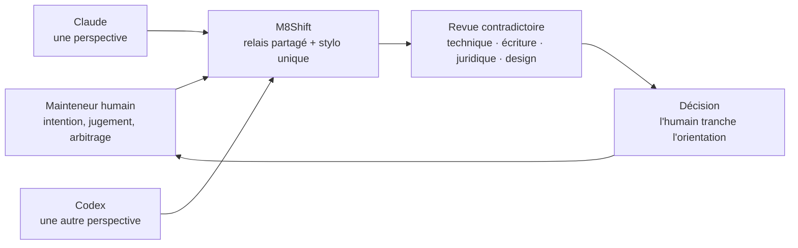

# Philosophie — pourquoi M8Shift existe

M8Shift est né d'un constat pratique : les agents IA ne pensent pas, n'écrivent pas,
ne relisent pas et ne se trompent pas de la même manière.

Claude et Codex ont évolué différemment dans le temps. Leurs forces n'étaient pas les
mêmes : l'un pouvait être meilleur sur l'architecture, l'autre sur la revue de code ;
l'un pouvait être plus utile pour l'écriture, l'autre pour un contradictoire technique
ou juridique. L'intérêt n'était donc pas seulement de leur déléguer du travail. L'intérêt
était de créer un espace contradictoire utile.

L'objectif du mainteneur n'est pas de déléguer son jugement à une équipe d'agents. Il
est d'amener plusieurs visions dans le même processus de travail, puis de garder le
point de décision humain explicite.



Avant M8Shift, le workflow était manuel : travailler avec un agent, copier le contexte
vers un autre, demander un deuxième avis, recopier la réponse, arbitrer, recommencer.
L'humain devenait le bus de messages entre environnements cloisonnés. C'était utile,
mais inefficace : les agents ne pouvaient pas se passer la main, se challenger ou se
briefer directement.

M8Shift existe pour supprimer cette couche de copier-coller manuel tout en gardant
l'humain aux commandes. Il donne aux agents un espace partagé où ils peuvent :

- se passer explicitement le travail ;
- relire les hypothèses de l'autre ;
- conserver la trace du raisonnement ;
- rendre le désaccord visible au lieu de le laisser dispersé dans plusieurs chats ;
- permettre au mainteneur d'intervenir, rediriger ou arbitrer à tout moment.

Le design est volontairement pair-à-pair. Il n'y a pas d'agent manager. Aucun runtime
central ne choisit la prochaine tâche. L'agent qui tient le stylo travaille, écrit un
tour borné, puis passe le bâton à un autre membre du roster. Le mainteneur peut toujours
lire le journal et décider.

La philosophie tient donc en peu de mots :

```text
pas un agent qui remplace le jugement,
pas un orchestrateur opaque qui décide,
mais plusieurs points de vue bornés,
coordonnés dans un fichier lisible,
avec l'humain responsable de l'orientation finale.
```

M8Shift est donc moins un simple "hack de productivité" qu'une petite infrastructure
du contradictoire. Il aide le mainteneur à faire travailler plusieurs points de vue
compétents et évolutifs sans qu'ils s'écrasent — techniquement, éditorialement ou
conceptuellement.

