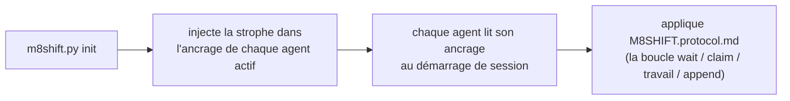

# M8Shift · Protocole de relais mono-fichier (v1)

Instruction commune aux **deux agents actifs** (par défaut **Claude** et **Codex**)
pour coopérer via un seul fichier
`M8SHIFT.md`, en alternance stricte (mutex), avec poll périodique. Portable : ce
protocole est identique dans tout projet ; seul le titre de `M8SHIFT.md` change.

À lire **une fois en début de session** dès que tu vois un `M8SHIFT.md` à la
racine d'un projet. Tu es **l'un des deux agents actifs** déclarés dans le champ
`agents:` de `M8SHIFT.md` (par défaut `claude` et `codex`) — identifie-toi par ton
fichier d'ancrage.

---

## 0. TL;DR — la boucle auto-suffisante

Tu viens d'arriver dans le projet et tu vois un `M8SHIFT.md` : voici la boucle
complète, copiable, **aucune autre instruction n'est nécessaire**. `<toi>` est ton
propre nom d'agent et `<autre>` l'autre agent actif (le couple déclaré dans
`agents:` ; par défaut `claude` / `codex`, via les ancrages `CLAUDE.md` / `AGENTS.md`).

```bash
# 1. Suis-je attendu ? (commandes NON bloquantes)
./m8shift.py status                 # lis le champ `state`
./m8shift.py wait <toi> --once      # rc 0 = tu peux acquérir ; rc 3 = pas encore

# 2. ACQUIERS le stylo AVANT de travailler (acquisition EXCLUSIVE : sur deux agents
#    qui tentent en même temps, un seul réussit) :
./m8shift.py claim <toi>            # rc 0 = tu tiens le stylo ; rc != 0 = pas ton tour
#    • Si claim RÉUSSIT : lis le `ask:` que <autre> t'a laissé dans le dernier
#      tour (en démarrage IDLE/tour 0, rien à honorer), fais le travail dans le
#      dépôt, PUIS enregistre ton tour et passe la main :
./m8shift.py append <toi> --to <autre> \
    --ask "ce que tu attends de l'autre" \
    --done "ce que tu viens de faire" \
    --files fichier1,fichier2
#    • Si claim ÉCHOUE : ce n'est pas (ou plus) ton tour → reviens à l'attente.

# 3. Pas ton tour : ne touche à RIEN. Bloque jusqu'à ton tour, puis reprends en 2 :
./m8shift.py wait <toi>             # poll toutes les ~60 s (--interval N)
```

Règle d'or : **tu ne travailles et n'écris que si tu as acquis le stylo via
`claim`.** `claim` est exclusif ; `append` n'est accepté que si tu tiens le
stylo. Tout le reste de ce document n'est que le détail de cette boucle.

> Le protocole te rend auto-suffisant *une fois que tu tournes*. Dans une UI interactive
> (VS Code, …) un humain te relance quand même entre les tours — `wait` bloque un
> processus, il ne réveille pas ton UI de chat. Un relais entièrement autonome nécessite
> un lanceur headless (sans interface), pas une modification de ce protocole.

---

## 1. Modèle mental

- **Un seul fichier vivant** : `M8SHIFT.md`. Tout le dialogue de travail y est.
- **Un seul stylo, acquis explicitement** : pour travailler, tu **prends** le
  stylo via `claim` → état `WORKING_<toi>`. `claim` est **exclusif** (deux agents
  qui tentent en même temps : un seul réussit). Tu ne modifies le dépôt **que**
  pendant que tu tiens le stylo.
- **`append` clôt ton tour** : il n'est accepté que depuis `WORKING_<toi>`, écrit
  le tour et passe la main (`AWAITING_<autre>`). Pas de `claim` ⇒ pas d'`append`.
- **Alternance stricte** : les deux agents actifs alternent (p. ex. `claude` →
  `codex` → `claude` …). Chaque passage de main est un *tour* (`TURN`) numéroté,
  encadré `BEGIN`/`END`.
- **Poll** : quand ce n'est pas ton tour, tu attends (`./m8shift.py wait <toi>`,
  ~60 s) puis tu retentes `claim`.

---

## 2. Le bloc LOCK (le mutex)

Délimité par `<!-- M8SHIFT:LOCK:BEGIN -->` … `<!-- M8SHIFT:LOCK:END -->`.
Champs (un `clé: valeur` par ligne, faciles à `grep`) :

| champ     | valeurs | sens |
|-----------|---------|------|
| `holder`  | un agent actif \| `none` | qui tient le stylo (défaut `claude`/`codex`) |
| `state`   | `IDLE` \| `WORKING_<X>` \| `AWAITING_<X>` \| `DONE` | état courant (`<X>` = un agent actif, en majuscules) |
| `agents`  | CSV, ex. `claude,codex` | le couple du relais (les 2 premiers déclarés) ; défaut `claude,codex` |
| `turn`    | entier | numéro du dernier tour clôturé |
| `since`   | ISO-8601 UTC | depuis quand cet état dure |
| `expires` | ISO-8601 UTC \| `-` | échéance de reprise anti-blocage (TTL 30 min) |
| `note`    | texte court | mémo lisible |

> `expires` ne porte une date **que** pendant `WORKING_*` (un agent travaille,
> TTL 30 min). Il repasse à `-` dès qu'on attend (`AWAITING_*`, `IDLE`, `DONE`) :
> personne ne tient le stylo, donc pas de péremption à surveiller.

**Lecture des états** (`<X>` = un agent actif — par défaut `claude`/`codex`) :
- `AWAITING_<X>` → c'est à `<X>` de jouer (l'autre agent attend).
- `WORKING_<X>` → `<X>` tient le stylo et travaille (l'autre attend, ne touche à rien).
- `IDLE` → personne n'a la main, le premier qui a quelque chose à dire démarre.
- `DONE` → session close, plus de relais attendu.

---

## 3. Format d'un tour

```
<!-- M8SHIFT:TURN <n> <agent> BEGIN -->
- from:    <agent>           # un agent actif
- to:      <agent|none>      # à qui tu repasses la main
- ask:     <ce que tu attends de l'autre, précis et actionnable>
- done:    <ce que tu viens de faire>
- files:   <fichiers touchés, séparés par des virgules>
- handoff: <agent|none>      # = to ; redondance volontaire, grep-friendly
<ligne vide>
<corps libre : explications, questions, blocs de code, listes>
<!-- M8SHIFT:TURN <n> <agent> END -->
```

Règles :
- Un tour **clôturé** (`END` posé) est **immuable**. Pour réagir, tu ouvres le
  tour suivant. Jamais de réécriture rétroactive.
- `ask` doit être actionnable : l'autre agent doit pouvoir démarrer sans te
  reposer de question. Si tu n'attends rien (juste un FYI), mets `ask: —`.
- Garde un tour **borné** : si ça dépasse ~150 lignes ou plusieurs sujets,
  découpe en plusieurs tours successifs (un sujet = un tour).

---

## 4. Cycle de travail (la boucle de chaque agent)

```
boucle:
  1. lire LOCK (status / wait)
  2. si state == AWAITING_<moi> ou IDLE :
       a. CLAIM  : ./m8shift.py claim <moi>   → state=WORKING_<MOI>, expires=now+30min
                   EXCLUSIF : si un autre a déjà pris le stylo entre-temps,
                   claim ÉCHOUE → va en 3.
       b. TRAVAILLER dans le dépôt (tant que tu tiens le stylo, toi seul)
       c. APPEND  : ./m8shift.py append <moi> --to <autre>
                   écrit mon tour <turn+1>, state=AWAITING_<AUTRE>
  3. sinon (WORKING_<autre> ou AWAITING_<autre>) :
       attendre ~60 s (wait), retourner en 1
  4. si state == DONE : sortir
```

En pratique : `claim` **acquiert** le stylo (exclusif), `append` **clôt** ton tour
et passe la main, `wait` attend ton tour. L'acquisition explicite avant de
travailler est ce qui garantit qu'un seul agent modifie le dépôt à la fois.

> **Modèle de concurrence (deux niveaux)** :
> 1. **Transitions** sérialisées par un verrou inter-process (`.m8shift.lock`,
>    `O_CREAT|O_EXCL`, à jeton de propriété) : chaque read-modify-write du LOCK +
>    écriture atomique (temporaire unique + `os.replace`) est exclusif.
> 2. **Fenêtre de travail** protégée par l'état persistant `WORKING_<agent>` :
>    `claim` est la seule acquisition, et il échoue si quelqu'un d'autre tient ou
>    a déjà pris le stylo. Deux `claim` simultanés depuis `IDLE` ⇒ **un seul
>    réussit** ; l'autre doit attendre. Comme on ne travaille qu'après un `claim`
>    réussi, deux agents ne modifient jamais le dépôt en même temps.
>
> Un `.m8shift.lock` abandonné (process tué) est repris après 60 s, jeton vérifié.
> *Limites* : verrou **conseillé** (une édition manuelle de `M8SHIFT.md` le
> contourne) ; sur FS réseau (NFS) `O_EXCL`/`rename` sont moins fiables — M8Shift
> vise un dépôt sur disque local. Voir aussi §0/§4 (claim obligatoire).

---

## 5. Anti-blocage (lock périmé)

Si l'autre agent crashe en tenant le stylo, le verrou resterait coincé. Garde-fou :
- au CLAIM, on pose `expires = now + 30 min` ;
- si tu vois `state == WORKING_<autre>` **et** `now > expires`, le verrou est
  **périmé** : reprends-le avec `./m8shift.py claim <toi> --force`, puis ouvre un
  tour notant la reprise (`done: reprise après lock périmé de <autre>`) ;
- **l'outil applique la règle** : `--force` est **refusé** sur un verrou encore
  valide. Tu ne peux donc pas voler le stylo d'un agent actif (c'est voulu) ;
- tu peux **rafraîchir ton propre** verrou avant péremption : `./m8shift.py claim
  <toi>` quand tu le détiens déjà repose `expires` à +30 min ;
- `release` et `done` n'agissent que si **tu** tiens le stylo (ou si personne ne
  le tient) ; `--force` outrepasse, réservé à la récupération.

---

## 6. Tenue dans le temps (longueur bornée)

`M8SHIFT.md` ne doit pas gonfler indéfiniment :
- garde dans `M8SHIFT.md` le bloc `LOCK` + les **~6 derniers tours** ;
- `./m8shift.py archive --keep 6` déplace les tours plus anciens (déjà clôturés)
  vers `M8SHIFT.archive.md` (append), sans jamais toucher au verrou ni au dernier
  tour ouvert.
- L'archive est consultable mais n'est **jamais** relue par la boucle : seule la
  partie vivante de `M8SHIFT.md` pilote le relais.

---

## 7. Outil `m8shift.py`

```
./m8shift.py init [--name PROJET] [--agents a,b,c…] [--lang <code>] [--force]  # (re)génère le kit ici
./m8shift.py status                                # verrou + dernier tour (NON bloquant)
./m8shift.py wait <agent> [--once] [--interval N]  # attend ton tour ; --once = 1 check (rc 3 si pas ton tour)
./m8shift.py claim <agent> [--force]               # ACQUIERS le stylo (exclusif) — depuis ton tour /
                                                  #   IDLE / ton propre verrou ; --force = verrou périmé SEULEMENT
./m8shift.py append <agent> --to <autre> \
     --ask "..." --done "..." [--files a,b] [--body fichier.md|-]   # clôt ton tour + passe la main
./m8shift.py release <agent> --to <autre> [--force]  # repasser la main sans corps (ne ré-incrémente PAS turn)
./m8shift.py done <agent> [--force]                 # clore la session (state=DONE)
./m8shift.py archive [--keep N]                     # purge les vieux tours clôturés (jamais le tour #0)
```

- **`claim` d'abord** : tu dois tenir le stylo (`WORKING_<toi>`) pour `append`.
  `claim` est **exclusif** (un seul gagnant si deux agents tentent ensemble).
- `append` n'est accepté **que depuis `WORKING_<toi>`** ; il écrit le tour et
  passe la main. `--body -` lit le corps depuis stdin ; `--body f.md` depuis un
  fichier ; sans `--body`, le tour n'a que l'en-tête.
- `--to` doit viser **l'autre** agent (auto-passation refusée : alternance stricte).
- Inspection **non bloquante** : `status` ou `wait <toi> --once`. `wait <toi>`
  **sans** `--once` bloque jusqu'à ton tour — ne l'utilise pas si tu dois rendre
  la main à ta boucle entre-temps.

---

## 8. Adoption par tout projet (portabilité)

`m8shift.py` est **auto-suffisant** : il embarque ce protocole, le gabarit de
`M8SHIFT.md` et les ancrages. Pour adopter le relais dans un projet :

```bash
cp /chemin/vers/m8shift.py .      # copier le seul fichier nécessaire
./m8shift.py init                 # nom du projet = nom du dossier (sinon --name)
```

`init` :
- écrit `M8SHIFT.protocol.md` (ce document) et `M8SHIFT.md` (verrou IDLE neuf) ;
  `M8SHIFT.md` n'est **pas** écrasé s'il existe déjà (sauf `--force`) → l'état du
  relais en cours est préservé ;
- injecte en **tête** un bloc « Co-work relais » dans **l'ancrage de chaque agent
  actif** (par défaut `CLAUDE.md` et `AGENTS.md` ; créés s'ils manquent), entre
  marqueurs `M8SHIFT:STANZA` → ré-injection **idempotente** (déplace/actualise le bloc
  sans dupliquer, contenu existant préservé ; le fichier précédent est sauvegardé dans
  `<ancrage>.m8shift.bak`) ;
- si `CLAUDE.md` existait mais qu'aucune instruction Codex (`AGENTS.md` ou
  `AGENTS.override.md`) n'existait, crée automatiquement dans `AGENTS.md` un pont
  demandant à Codex de lire les instructions communes de `CLAUDE.md`. Un ancrage
  Codex préexistant n'est jamais complété ou remplacé automatiquement ;
- renomme une variante unique `claude.md`/`agents.md` vers le nom canonique
  auto-chargé, y compris sur un FS insensible à la casse. Plusieurs variantes
  coexistantes sont refusées plutôt que fusionnées silencieusement. Si Git est
  disponible et que la variante est suivie, emploie `git mv -f` pour actualiser
  aussi l'index ;
- si `AGENTS.override.md` existe, y synchronise aussi la strophe : Codex charge
  cet override à la place de `AGENTS.md` dans le même dossier.

### Amorçage / prise en compte par les agents

M8Shift est **passif** : il n'« appelle » aucune IA. Il s'appuie sur la convention de
chaque outil hôte — **Claude lit `CLAUDE.md`, Codex lit `AGENTS.md`**, et tout autre
agent actif lit son propre ancrage — au démarrage de session/exécution. La chaîne
d'amorçage est donc :



- **Après `init`** : démarre une nouvelle session/exécution de l'agent. Une session
  déjà ouverte a généralement construit sa chaîne d'instructions avant l'injection.
- **Codex interactif ou `codex exec`** : `AGENTS.md` est chargé si la commande part
  de la racine du projet ou d'un de ses sous-dossiers. Le mode *headless* n'est pas
  en soi une limite ; un cron/CI lancé hors du projet, en revanche, ne découvre pas
  l'ancrage.
- **Override Codex** : `AGENTS.override.md` masque `AGENTS.md` dans un même dossier ;
  `init` injecte donc la strophe dans les deux lorsqu'il est présent.
- **Taille Codex** : Codex empile les fichiers d'instructions jusqu'à un plafond
  *combiné* (`project_doc_max_bytes`, 32 Kio par défaut) et tronque le fichier qui
  dépasse au nombre d'octets restant. Mettre la strophe en tête la conserve donc en
  priorité (et un fichier plus proche du cwd prime) ; garde néanmoins les ancrages
  **légers**.
- **Limite générale** : M8Shift ne peut pas forcer une IA à lire quoi que ce soit.
  Sans racine/contexte projet, pointe explicitement l'agent vers
  `M8SHIFT.protocol.md`.

Référence Codex : https://developers.openai.com/codex/guides/agents-md
