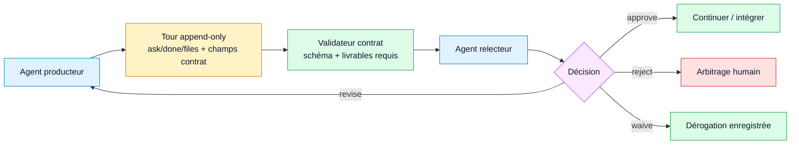

# RFC — Contrats et validation Stage 4

- **Statut :** spécification d'implémentation, pas entièrement livrée
- **Périmètre :** métadonnées typées de passation, décisions de revue explicites,
  commandes de validation
- **Invariant du cœur :** un seul stylo partagé ; un contrat ne donne jamais un
  deuxième droit d'écriture

## 1. Objectif

Le Stage 4 transforme la passation libre actuelle en surface de contrat
documentée : un agent peut dire ce qu'il a changé, quelles preuves existent, ce
qu'il attend de l'agent suivant, et quelle décision de revue revient. L'objectif
est de renforcer la coordination entre agents et humains sans transformer
M8Shift en orchestrateur.

Le comportement visé :

- le producteur enregistre livrables attendus, preuves et intention de revue ;
- le relecteur enregistre une décision explicite : approuver, réviser, rejeter
  ou déroger ;
- un validateur peut vérifier la forme et la complétude de ces contrats ;
- le mutex continue de router uniquement via l'état `LOCK` et le témoin explicite.

## 2. Base déjà livrée

La surface v3.x fournit déjà le substrat :

- `append` exige que l'agent courant soit en `WORKING_<agent>` ;
- `append --ask`, `--done` et `--files` sont obligatoires ;
- des champs consultatifs existent via des flags dédiés et `--field k=v` ;
- les champs mono-ligne refusent sauts de ligne et marqueurs réservés ;
- `--body` est neutralisé pour empêcher de forger un tour ;
- `peek`, `recap`, `log`, `history` et `doctor` exposent le contexte ;
- `claim --check` fournit une sonde read-only de chevauchement ;
- `m8shift-worktree.py` fournit des worktrees parallèles opt-in avec intégration
  sérialisée.

Le Stage 4 étend cette surface. Il ne remplace pas le protocole existant.

## 3. Non-objectifs

Le Stage 4 ne doit pas ajouter :

- daemon, notification push ou file résidente ;
- verrouillage physique de tout le dépôt ;
- identifiants fournisseur ni appels directs à Claude, Codex, Gemini, Vibe ou
  une autre UI d'agent ;
- merge automatique ni exécution automatique des tests ;
- routage basé sur les champs de contrat ;
- enforcement obligatoire des permissions hôte dans le cœur mono-fichier.

## 4. Modèle de contrat

Un contrat est une couche typée au-dessus d'un tour append-only. Il reste en texte
simple et reste dans `M8SHIFT.md`.

Les champs obligatoires ne changent pas :

- `ask`
- `done`
- `files`

Le Stage 4 ajoute des champs optionnels standardisés. Les champs inconnus restent
préservés et visibles, mais seuls les champs standardisés sont validés.

| Champ | Sens |
|-------|------|
| `role_from` | rôle utilisé par l'émetteur, par exemple `implementer` |
| `role_to` | rôle attendu du destinataire, par exemple `reviewer` |
| `relation` | type de relation : `handoff`, `review_request`, `review_result`, `escalation` |
| `requires` | vérifications ou sorties attendues du destinataire |
| `expected_output` | livrable concret attendu du destinataire |
| `evidence` | tests, commandes, commits ou vérifications manuelles |
| `decision` | décision de revue : `approve`, `revise`, `reject`, `waive` |
| `waiver_reason` | obligatoire si `decision=waive` |
| `schema` | identifiant de schéma, par exemple `stage4.v1` |
| `permissions` | intention de permission, consultative uniquement |

Le moteur doit conserver l'espace `x_*` pour les métadonnées projet.

## 5. Décisions de revue

Le Stage 4 standardise le vocabulaire sans changer les règles de possession.

| Décision | Sens | Routage attendu |
|----------|------|-----------------|
| `approve` | Le résultat est accepté comme utilisable. | passer au prochain acteur ou à l'humain |
| `revise` | Le résultat est proche mais doit être corrigé. | repasser au producteur ou à un implémenteur |
| `reject` | Le résultat ne doit pas être intégré tel quel. | escalader ou redémarrer le travail |
| `waive` | Une vérification manquante est acceptée consciemment. | continuer seulement avec `waiver_reason` |

Une approbation est une preuve. Ce n'est ni un verrou, ni un merge, ni une
permission.

## 6. Surface CLI

La première implémentation peut utiliser le canal générique existant :

```bash
python3 m8shift.py append codex --to claude \
  --ask "review the implementation" \
  --done "implemented stage 4 docs" \
  --files "docs/en/rfc-contracts-validation.md" \
  --field schema=stage4.v1 \
  --field role_from=implementer \
  --field role_to=reviewer \
  --field relation=review_request \
  --field requires="read docs, verify tests, return approve/revise/reject/waive" \
  --field expected_output="ranked review findings" \
  --field evidence="python3 -m unittest discover -s tests"
```

Des flags dédiés pourront être ajoutés ensuite :

- `--role-from`
- `--role-to`
- `--relation`
- `--requires`
- `--expected-output`
- `--evidence`
- `--decision approve|revise|reject|waive`
- `--waiver-reason`
- `--schema`
- `--permissions`

Ces flags doivent sérialiser les mêmes champs texte que `--field`.

## 7. Commandes de validation

La validation est explicite et read-only par défaut.

Commandes proposées :

```bash
python3 m8shift.py contract validate
python3 m8shift.py contract validate --strict
python3 m8shift.py contract validate --json
python3 m8shift.py doctor --contracts
```

La validation par défaut signale des avertissements et réussit en présence de
tours historiques. Le mode strict peut retourner un code non nul pour des
contrats Stage 4 mal formés, mais seulement parce que l'opérateur l'a demandé.

La validation ne doit pas :

- appeler `set_lock` ;
- acquérir le stylo sémantique ;
- changer `holder`, `state`, `turn`, `since`, `expires` ou `note` ;
- inférer la prochaine route ;
- lancer des tests, Git ou des outils externes.

## 8. Règles de validation

Règles minimales :

1. `schema=stage4.v1` active la validation Stage 4 du tour.
2. `relation` vaut `handoff`, `review_request`, `review_result` ou `escalation`.
3. Un `review_request` devrait inclure `role_to`, `requires` et
   `expected_output`.
4. Un `review_result` devrait inclure `decision`.
5. `decision` vaut `approve`, `revise`, `reject` ou `waive`.
6. `decision=waive` exige `waiver_reason`.
7. `permissions` reste du texte consultatif et ne doit jamais être appliqué par
   le cœur.
8. Les champs inconnus sont préservés et ignorés, sauf si un mode strict opte
   explicitement pour un schéma projet.

## 9. Modèle de permissions

M8Shift peut enregistrer une intention de permission. Il ne peut pas appliquer les
permissions hôte.

Vocabulaire recommandé :

- `permissions=read_only`
- `permissions=write_repo`
- `permissions=run_tests`
- `permissions=network_required`
- `permissions=human_approval_required`

L'environnement hôte, l'UI, la politique shell et l'opérateur humain restent la
frontière d'application. Le Stage 4 rend seulement l'intention auditable.

## 10. Impact architecture

Le Stage 4 ajoute un validateur à côté du parseur et des diagnostics read-only. Il
n'ajoute pas d'ordonnanceur.



Légende : bleu = agents, jaune = données persistées, vert = validation ou
continuation acceptée, violet = décision explicite, rouge = arbitrage humain.

## 11. Compatibilité

Les anciennes sessions restent valides. Un tour sans `schema=stage4.v1` est un
tour v3.x normal.

L'implémentation doit préserver :

- les marqueurs actuels de `M8SHIFT.md` ;
- les champs obligatoires actuels ;
- les champs consultatifs actuels ;
- le canal générique `--field` ;
- l'affichage `peek` des champs inconnus.

## 12. Tests d'acceptation

L'implémentation est acceptable lorsque les tests couvrent :

- demande de revue Stage 4 valide ;
- résultat de revue Stage 4 valide ;
- `relation` invalide ;
- `decision` invalide ;
- `decision=waive` sans `waiver_reason` ;
- tour historique accepté en mode par défaut ;
- mode strict en échec sur contrat Stage 4 mal formé ;
- validateur qui laisse le `LOCK` inchangé ;
- champs inconnus préservés par `peek` ;
- `permissions` qui ne bloque jamais `claim`, `append` ou le routage.

## 13. Phasage

1. **4A — documentation et vocabulaire de schéma.** Cette RFC, les notes
   d'architecture et les exemples.
2. **4B — validateur read-only.** `contract validate` et `doctor --contracts`.
3. **4C — flags ergonomiques.** Flags dédiés qui sérialisent en champs de tour.
4. **4D — intégration compagnon.** Un compagnon hôte/UI peut appliquer une
   politique projet, mais le cœur mono-fichier reste consultatif et passif.
