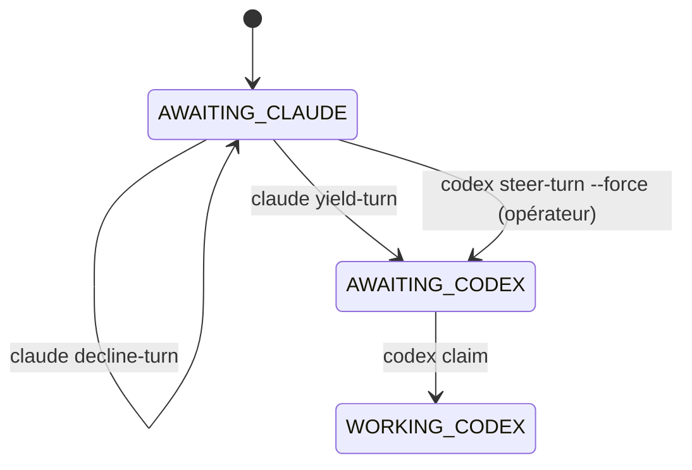

# RFC — Demande coopérative de reprise du tour et pilotage opérateur

**Statut :** proposé · **Cible :** cœur M8Shift, avec support possible par un
compagnon runtime · **Périmètre :** éviter les blocages entre UI d'agents interactifs
quand l'utilisateur reprend un agent qui n'est pas le détenteur attendu du bâton.

## Problème

M8Shift sérialise déjà correctement le travail :

- `claim` est obligatoire avant les éditions du dépôt ;
- `append` repasse le tour à l'agent suivant ;
- `claim --force` ne récupère qu'un verrou `WORKING_*` périmé ;
- `release --force` permet à un opérateur de rediriger manuellement le bâton quand il
  sait que la récupération est sûre.

Le mode d'échec restant n'est pas une concurrence d'écriture. C'est un blocage de
routage interactif :

1. le relais est `AWAITING_CLAUDE` ;
2. Claude attend une instruction humaine, ou son UI n'est pas relancée ;
3. l'utilisateur parle à Codex ;
4. Codex ne peut pas `claim`, puisque le bâton appartient à Claude ;
5. Claude ne repasse rien, puisqu'il n'a pas été relancé avec une consigne.

Aujourd'hui l'opérateur peut s'en sortir ainsi :

```bash
python3 m8shift.py release claude --to codex --force
python3 m8shift.py claim codex
```

Cela fonctionne, mais c'est une action manuelle de récupération. Elle n'exprime pas la
question coopérative attendue :

> « Tu as la main. Est-ce que tu fais réellement quelque chose ? Si oui, garde-la. Si
> non, rends-moi le bâton parce que l'utilisateur travaille maintenant dans mon UI. »

## Objectif

Ajouter un protocole explicite, auditable et peu risqué de négociation du bâton :

- un agent qui reçoit une interaction humaine alors qu'il n'est pas attendu peut demander
  au détenteur courant de céder la main ;
- le détenteur courant peut accepter, refuser, ou expliquer qu'il est encore actif ;
- si le détenteur ne répond pas et que l'humain autorise explicitement la récupération,
  l'opérateur peut rediriger un bâton idle sans faire passer cela pour une passation
  normale ;
- le mutex « un seul stylo » reste inchangé.

## Hors périmètre

- Ne pas voler un verrou `WORKING_*` encore valide.
- Ne pas déduire l'inactivité d'une UI à partir du silence.
- Ne pas exiger de réseau, d'API fournisseur, de socket ou de service résident.
- Ne pas rendre `claim` possible parce qu'une demande est ouverte.
- Ne pas rendre M8Shift responsable du réveil d'une UI de chat fermée.

## Surface cœur proposée

### 1. `request-turn`

Ajouter une demande sans stylo, uniquement auditée, dans un nouveau journal :

```bash
python3 m8shift.py request-turn codex \
  --to claude \
  --reason "l'utilisateur est actif dans l'UI Codex et demande à Codex de continuer"
```

Journal proposé :

```text
M8SHIFT.requests.md
```

La commande :

- exige que les deux agents soient dans le roster ;
- ne modifie pas `LOCK` ;
- est acceptée depuis `AWAITING_<autre>` et `WORKING_<autre>` ;
- affiche les commandes de réponse exactes pour le détenteur courant.

Exemple d'entrée :

```text
BEGIN M8SHIFT REQUEST #7
- id: 7
- at: 2026-06-24T21:15:00Z
- from: codex
- to: claude
- state_seen: AWAITING_CLAUDE
- kind: turn_request
- reason: l'utilisateur est actif dans l'UI Codex et demande à Codex de continuer
- status: open
END M8SHIFT REQUEST #7
```

### 2. `yield-turn`

Permettre au détenteur courant d'accepter la demande :

```bash
python3 m8shift.py yield-turn claude --request 7 --to codex
```

Sémantique :

- seul le `holder` courant peut céder sans `--force` ;
- valide depuis `AWAITING_<holder>` ou `WORKING_<holder>` ;
- depuis `WORKING_<holder>`, équivaut à un `release` explicite et ne doit être utilisé
  que si le détenteur n'a pas d'éditions non rapportées ;
- passe `LOCK` à `AWAITING_<to>` ;
- marque la demande comme acceptée.

C'est une variante plus claire et auditée de `release <holder> --to <autre>`.

### 3. `decline-turn`

Permettre au détenteur courant d'indiquer qu'il est encore actif :

```bash
python3 m8shift.py decline-turn claude --request 7 \
  --reason "revue du tour précédent encore en cours"
```

Sémantique :

- ne modifie pas `LOCK` ;
- marque la demande comme refusée ;
- fait apparaître dans `status --for codex` que Codex doit continuer à attendre.

### 4. `steer-turn`

Fournir une récupération opérateur explicite pour le cas exact du blocage interactif :

```bash
python3 m8shift.py steer-turn codex \
  --from claude \
  --request 7 \
  --reason "opérateur actif dans l'UI Codex ; Claude n'a pas de consigne de travail en attente" \
  --force
```

Sémantique :

- autorisé uniquement quand `state == AWAITING_<from>` ;
- refusé sur `WORKING_<from>` sauf si la règle normale de verrou périmé permet déjà la
  récupération ;
- exige `--force` et une raison non vide ;
- passe `LOCK` à `AWAITING_<codex>` ;
- journalise l'événement comme pilotage opérateur, pas comme consentement de Claude.

Cette commande devrait remplacer les `release claude --to codex --force` ad hoc dans les
procédures opérateur.

## Sortie `status` et action suivante

`status --for <agent>` doit afficher les demandes ouvertes :

```text
next     codex: wait; open request #7 asks claude to yield
request  #7 open, to=claude, age=2m, reason=...
```

Pour le détenteur courant :

```text
next     claude: answer request #7 with yield-turn or decline-turn
request  #7 from=codex, reason=l'utilisateur est actif dans l'UI Codex...
```

`next <agent>` doit rester conservateur :

- si ce n'est pas le tour de `<agent>`, il ne redirige pas automatiquement ;
- il peut afficher la demande ouverte et la commande conseillée ;
- seuls `yield-turn` ou `steer-turn --force` changent le routage.

## Impact sur le modèle d'état

Aucun nouvel état `LOCK.state` n'est nécessaire. Les demandes vivent hors de la machine
d'état principale.



## Extension compagnon runtime

Un futur compagnon runtime peut rendre cela plus fluide :

- afficher les demandes entrantes dans la lane UI du détenteur ;
- écrire des sidecars de présence/progrès ;
- temporiser visuellement les demandes sans réponse ;
- demander confirmation humaine avant `steer-turn --force`.

Le compagnon doit toujours appeler les commandes cœur. Il ne doit pas contourner `LOCK`.

## Critères d'acceptation

- `request-turn` ne modifie jamais `LOCK`.
- `yield-turn` modifie `LOCK` seulement quand il est appelé par le détenteur courant.
- `decline-turn` ne modifie jamais `LOCK`.
- `steer-turn --force` peut rediriger `AWAITING_<from>`, mais refuse un
  `WORKING_<from>` frais.
- `status --for` et `next` affichent les demandes ouvertes sans prendre de décision de
  routage.
- Toute demande et toute réponse sont append-only et auditables.
- Les sémantiques existantes de `claim`, `append`, `release`, `done`, `wait` et du
  verrou périmé restent inchangées.

## Migration et documentation

La documentation doit présenter trois niveaux d'escalade :

1. **Chemin normal :** `append --to <autre> --wait`.
2. **Interruption coopérative :** `request-turn`, puis `yield-turn` ou `decline-turn`.
3. **Récupération humaine :** `steer-turn --force` uniquement depuis un bâton idle
   `AWAITING_*`, ou récupération normale d'un `WORKING_*` expiré.

Le modèle reste coopératif par défaut, tout en donnant aux opérateurs une procédure
nommée et traçable pour sortir des blocages de routage entre UI.
