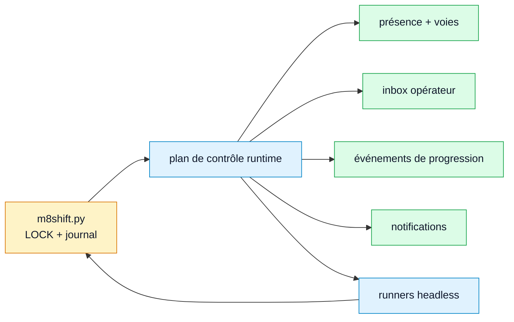

# RFC — Plan de contrôle runtime / hébergé

- **Statut :** RFC de compagnon futur, non implémentée
- **Périmètre :** couche hôte/runtime optionnelle autour du cœur passif M8Shift
- **Invariant du cœur :** le fichier unique `m8shift.py` reste l'autorité du stylo

## 1. Problème

M8Shift reste volontairement passif : il enregistre la propriété du stylo et les
passations, mais il ne réveille pas les UI de chat, ne supervise pas les sessions
fournisseurs, ne pousse pas de notifications et ne maintient aucun processus résident.
C'est la bonne frontière pour un relais mono-fichier portable, mais les workflows
larges ont besoin de visibilité opérationnelle :

- un processus Claude, Codex, Gemini, Vibe ou autre est-il réellement vivant ?
- quelle fenêtre/session possède la voie `codex` si plusieurs fenêtres Codex existent ?
- le worker courant progresse-t-il, ou rafraîchit-il seulement le TTL ?
- un humain a-t-il ajouté une consigne pendant qu'un agent travaillait ?
- qui doit être notifié lorsqu'une passation attend un agent précis ?

Ce sont des questions de runtime/session. Elles doivent être traitées par un plan
de contrôle compagnon, pas par le mutex cœur.

## 2. Décision

Créer un **compagnon de plan de contrôle optionnel** qui observe et pilote des
sessions M8Shift sans remplacer le verrou cœur.

Le compagnon peut être local, LAN ou hébergé. Dans tous les cas, il doit considérer
`M8SHIFT.md` et `m8shift.py` comme la source de vérité pour la propriété du stylo.

## 3. Objectifs

- Suivre la présence runtime de chaque voie d'agent.
- Empêcher plusieurs sessions UI/CLI d'utiliser silencieusement la même identité
  de roster.
- Fournir des inbox opérateur et des interventions humaines structurées.
- Afficher progression, détenteur courant, prochain agent attendu, état périmé ou
  bloqué, et historique de session.
- Déclencher des notifications optionnelles quand une passation attend un agent.
- Piloter des boucles headless sûres : wait, claim, exécution d'un tour, heartbeat,
  append et vérification post-run.
- Préserver le cœur passif et permettre aux projets de continuer à utiliser
  uniquement `m8shift.py`.

## 4. Non-objectifs

- Aucun changement de sens pour `claim`, `append`, `release`, `done` ou `--force`.
- Aucune seconde source de vérité pour la propriété du verrou.
- Aucun identifiant fournisseur dans `M8SHIFT.md`.
- Aucune écriture filesystem automatique sans `claim` cœur réussi.
- Aucune dépendance hébergée pour l'usage local normal.
- Aucune promesse que le cœur peut réveiller seul une UI interactive.

## 5. Architecture



Légende : jaune = source de vérité cœur, bleu = compagnon/runtime optionnel,
vert = données d'observabilité du compagnon.

Le compagnon peut lire :

- `M8SHIFT.md`
- `M8SHIFT.sessions.jsonl`
- `M8SHIFT.memory.md`
- `M8SHIFT.tasks.md`
- sidecars compagnon sous `.m8shift/runtime/`

Le compagnon peut écrire :

- état runtime sidecar ;
- messages opérateur ;
- événements de progression ;
- tours M8Shift normaux, mais uniquement en exécutant les mêmes commandes
  `m8shift.py claim/append` que les agents.

## 6. Layout sidecar suggéré

```text
.m8shift/runtime/
  lanes/
    codex.lock.json
    claude.lock.json
    gemini.lock.json
  presence.json
  inbox/
    codex.jsonl
    claude.jsonl
  progress.jsonl
  notifications.jsonl
  runs/
    20260624T120000Z-codex-0001.json
```

Tous les sidecars sont indicatifs. Supprimer `.m8shift/runtime/` ne doit pas
corrompre le relais cœur.

## 7. Propriété de voie

Une voie est l'instance runtime actuellement autorisée à agir sous un nom de roster :
par exemple un panneau Codex VS Code ou un processus `codex exec` pour `codex`.

Le propriétaire de voie évite cette ambiguïté :

- deux fenêtres Codex voient `AWAITING_CODEX` ;
- les deux lancent `claim codex` ;
- le second claim devient un rafraîchissement TTL légal si le premier détient déjà le stylo.

Le plan de contrôle devrait n'autoriser qu'un propriétaire runtime actif par identité
de roster, sauf override explicite de l'utilisateur.

## 8. Messages opérateur

L'interaction humaine doit être capturée en événements structurés, pas collée dans une
UI d'agent au hasard sans provenance.

Champs minimaux :

| Champ | Sens |
|-------|------|
| `id` | identifiant stable |
| `agent` | identité de roster ciblée |
| `mode` | `followup`, `collect`, `interrupt`, `status` |
| `body` | message humain |
| `created_at` | timestamp UTC |
| `handled_at` | timestamp UTC ou `-` |

Le compagnon peut injecter les messages en attente dans le prochain prompt headless
ou les afficher à l'humain pour copie manuelle.

## 9. Progression et liveness

Le compagnon peut suivre :

- PID ou identifiant de session UI ;
- dernier timestamp vu ;
- run id courant ;
- tour de relais courant ;
- dernier état `LOCK` observé ;
- dernier message de progression ;
- rafraîchissements heartbeat ;
- rafraîchissements répétés sans append.

Des refresh TTL répétés sans fichiers, tests, progression ou append doivent être
affichés comme **possiblement bloqués**, pas repris automatiquement tant que le
verrou reste valide.

## 10. Notifications

Les notifications sont indicatives uniquement. Elles peuvent dire :

- « Codex est attendu. »
- « Claude travaille depuis 25 minutes ; heartbeat rafraîchi. »
- « La voie Gemini paraît périmée. »
- « Tour posté avec `decision=revise`. »

Elles ne doivent jamais laisser croire que le cœur peut réveiller seul une UI interactive.

## 11. Sécurité

Le plan de contrôle augmente la surface d'attaque. Exigences minimales :

- secrets jamais stockés dans `M8SHIFT.md` ;
- sidecars gitignorés par défaut s'ils contiennent des données runtime ou opérateur ;
- allowlist explicite des racines projet ;
- pas d'interpolation shell des commandes agent ;
- journal d'audit pour chaque action hébergée ;
- frontière claire entre « notifier » et « exécuter » ;
- confirmation visible pour actions destructrices, publication, déploiement,
  paiement ou messages externes.

## 12. Critères d'acceptation

Une première implémentation est acceptable si :

- supprimer `.m8shift/runtime/` laisse le relais cœur utilisable ;
- deux sessions runtime ne peuvent pas posséder silencieusement la même voie ;
- les runs headless appellent toujours `m8shift.py claim` et `append` ;
- aucun événement runtime ne mute le `LOCK` sauf via commandes cœur normales ;
- les notifications fonctionnent sans donner d'autorité d'écriture ;
- les messages opérateur sont auditables et idempotents ;
- une présence périmée ne donne jamais le stylo ;
- les tests couvrent crash, voie dupliquée, voie périmée et vérification post-run.

## 13. Relation aux surfaces existantes

Cette RFC généralise les idées locales déjà décrites dans
[rfc-runtime-companion.md](../en/rfc-runtime-companion.md). Ce document reste le
pattern local/runtime. Cette RFC définit la frontière plus large du plan de contrôle,
y compris les variantes hébergées ou multi-sessions.

## 14. Questions ouvertes

- Faut-il commencer par une implémentation locale uniquement avant tout hébergement ?
- Le format sidecar doit-il être du JSONL stable dès le départ ?
- Le plan de contrôle doit-il exposer MCP, HTTP ou seulement une CLI ?
- Le mode hébergé doit-il vivre dans un projet/package séparé pour garder ce dépôt
  centré sur le cœur et les compagnons ?
