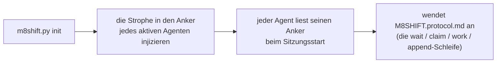

# M8Shift · Single-File-Relais-Protokoll (v1)

Gemeinsame Anweisung für die **zwei aktiven Agenten** (standardmäßig **Claude** und
**Codex**), um über eine einzige
`M8SHIFT.md`-Datei zusammenzuarbeiten, in strikter Abwechslung (Mutex), mit periodischer Abfrage. Portabel:
dieses Protokoll ist in jedem Projekt identisch; nur der Titel von `M8SHIFT.md`
ändert sich.

Lies es **einmal zu Beginn einer Sitzung**, sobald du eine `M8SHIFT.md` im
Wurzelverzeichnis eines Projekts siehst. Du bist **einer der beiden aktiven Agenten**, die im
`agents:`-Feld von `M8SHIFT.md` deklariert sind (standardmäßig `claude` und `codex`) — identifiziere dich
über deine Ankerdatei.

---

## 0. TL;DR — die eigenständige Schleife

Du bist gerade im Projekt angekommen und siehst eine `M8SHIFT.md`: hier ist die
vollständige, kopierfertige Schleife, **keine weitere Anweisung ist nötig**. `<you>` ist dein
eigener Agent-Name und `<other>` ist der andere aktive Agent (das in
`agents:` deklarierte Paar; standardmäßig `claude` / `codex`, über die `CLAUDE.md` / `AGENTS.md`-Anker).

```bash
# 1. Werde ich erwartet? (NICHT-blockierende Befehle)
./m8shift.py status                 # das `state`-Feld lesen
./m8shift.py wait <you> --once      # rc 0 = du darfst übernehmen ; rc 3 = noch nicht

# 2. Den Stift ÜBERNEHMEN, BEVOR du arbeitest (EXKLUSIVE Übernahme: wenn zwei Agenten
#    es gleichzeitig versuchen, gelingt es nur einem):
./m8shift.py claim <you>           # rc 0 = du hältst den Stift ; rc != 0 = du bist nicht dran
#    • Wenn claim GELINGT: lies das `ask:`, das <other> dir im letzten
#      Zug hinterlassen hat (beim IDLE-Start / Zug 0 gibt es nichts zu berücksichtigen), erledige die Arbeit im
#      Repository, DANN trage deinen Zug ein und übergib:
./m8shift.py append <you> --to <other> \
    --ask "was du vom anderen erwartest" \
    --done "was du gerade getan hast" \
    --files file1,file2
#    • Wenn claim FEHLSCHLÄGT: du bist (nicht mehr) dran → zurück ins Warten.

# 3. Du bist nicht dran: rühre NICHTS an. Blockiere bis zu deinem Zug, dann mach bei 2 weiter:
./m8shift.py wait <you>             # Abfrage alle ~60 s (--interval N)
```

Goldene Regel: **du arbeitest und schreibst nur, wenn du den Stift via
`claim` übernommen hast.** `claim` ist exklusiv; `append` wird nur akzeptiert, wenn du den Stift
hältst. Alles andere in diesem Dokument ist nur das Detail dieser Schleife.

> Das Protokoll macht dich eigenständig, *sobald du läufst*. In einer interaktiven Oberfläche
> (VS Code, …) setzt ein Mensch dich dennoch zwischen Zügen fort — `wait` blockiert einen Prozess, es
> weckt deine Chat-Oberfläche nicht. Vollständig autonome Relais brauchen einen Headless-Runner, keine
> Änderung an diesem Protokoll.

---

## 1. Mentales Modell

- **Eine einzige lebende Datei**: `M8SHIFT.md`. Der gesamte Arbeitsdialog steht dort.
- **Ein einziger Stift, explizit übernommen**: um zu arbeiten, **nimmst** du den Stift via
  `claim` → state `WORKING_<you>`. `claim` ist **exklusiv** (wenn zwei Agenten es
  gleichzeitig versuchen: nur einer gelingt). Du veränderst das Repository **nur**, während
  du den Stift hältst.
- **`append` schließt deinen Zug ab**: es wird nur aus `WORKING_<you>` akzeptiert,
  schreibt den Zug und übergibt (`AWAITING_<other>`). Kein `claim` ⇒ kein `append`.
- **Strikte Abwechslung**: die zwei aktiven Agenten wechseln sich ab (z. B. `claude` → `codex`
  → `claude` …). Jede Übergabe ist ein nummerierter *Zug* (`TURN`), umrahmt von `BEGIN`/`END`.
- **Abfrage**: wenn du nicht dran bist, wartest du (`./m8shift.py wait <you>`,
  ~60 s) und versuchst dann `claim` erneut.

---

## 2. Der LOCK-Block (der Mutex)

Begrenzt durch `<!-- M8SHIFT:LOCK:BEGIN -->` … `<!-- M8SHIFT:LOCK:END -->`.
Felder (ein `key: value` pro Zeile, leicht zu `grep`en):

| field     | values | meaning |
|-----------|---------|------|
| `holder`  | ein aktiver Agent \| `none` | wer den Stift hält (standardmäßig `claude`/`codex`) |
| `state`   | `IDLE` \| `WORKING_<X>` \| `AWAITING_<X>` \| `DONE` | aktueller Zustand (`<X>` = ein aktiver Agent, großgeschrieben) |
| `agents`  | CSV, z. B. `claude,codex` | das Relais-Paar (die ersten beiden deklarierten); standardmäßig `claude,codex` |
| `turn`    | Ganzzahl | Nummer des letzten abgeschlossenen Zugs |
| `since`   | ISO-8601 UTC | seit wann dieser Zustand andauert |
| `expires` | ISO-8601 UTC \| `-` | Anti-Deadlock-Übernahmefrist (TTL 30 Min) |
| `note`    | kurzer Text | lesbares Memo |

> `expires` trägt **nur** während `WORKING_*` ein Datum (ein Agent arbeitet,
> TTL 30 Min). Es kehrt zu `-` zurück, sobald gewartet wird (`AWAITING_*`, `IDLE`,
> `DONE`): niemand hält den Stift, also gibt es keine Veraltung zu überwachen.

**Die Zustände lesen** (`<X>` ist ein aktiver Agent — standardmäßig `claude`/`codex`):
- `AWAITING_<X>` → `<X>` ist dran zu spielen (der andere Agent wartet).
- `WORKING_<X>` → `<X>` hält den Stift und arbeitet (der andere wartet, rührt nichts an).
- `IDLE` → niemand hat die Hand, der erste, der etwas zu sagen hat, beginnt.
- `DONE` → Sitzung geschlossen, kein weiteres Relais erwartet.

---

## 3. Format eines Zugs

```
<!-- M8SHIFT:TURN <n> <agent> BEGIN -->
- from:    <agent>           # ein aktiver Agent
- to:      <agent|none>      # an wen du übergibst
- ask:     <was du vom anderen erwartest, präzise und umsetzbar>
- done:    <was du gerade getan hast>
- files:   <berührte Dateien, kommagetrennt>
- handoff: <agent|none>      # = to ; bewusste Redundanz, grep-freundlich
<Leerzeile>
<freier Text: Erklärungen, Fragen, Codeblöcke, Listen>
<!-- M8SHIFT:TURN <n> <agent> END -->
```

Regeln:
- Ein **abgeschlossener** Zug (`END` gesetzt) ist **unveränderlich**. Um zu reagieren, eröffnest du den nächsten
  Zug. Niemals rückwirkendes Umschreiben.
- `ask` muss umsetzbar sein: der andere Agent muss starten können, ohne dich
  erneut zu fragen. Wenn du nichts erwartest (nur eine Info), setze `ask: —`.
- Halte einen Zug **begrenzt**: wenn er ~150 Zeilen oder mehrere Themen überschreitet, teile ihn
  in mehrere aufeinanderfolgende Züge auf (ein Thema = ein Zug).

---

## 4. Arbeitszyklus (die Schleife jedes Agenten)

```
loop:
  1. LOCK lesen (status / wait)
  2. if state == AWAITING_<me> or IDLE:
       a. CLAIM  : ./m8shift.py claim <me>   → state=WORKING_<ME>, expires=now+30min
                   EXKLUSIV: wenn inzwischen jemand anderes den Stift genommen hat,
                   schlägt claim FEHL → weiter zu 3.
       b. WORK im Repository (während du den Stift hältst, du allein)
       c. APPEND  : ./m8shift.py append <me> --to <other>
                   schreibt meinen Zug <turn+1>, state=AWAITING_<OTHER>
  3. else (WORKING_<other> or AWAITING_<other>):
       ~60 s warten (wait), zurück zu 1
  4. if state == DONE: beenden
```

In der Praxis: `claim` **übernimmt** den Stift (exklusiv), `append` **schließt** deinen
Zug ab und übergibt, `wait` wartet auf deinen Zug. Die explizite Übernahme vor dem
Arbeiten ist das, was garantiert, dass nur ein einziger Agent das Repository gleichzeitig verändert.

> **Nebenläufigkeitsmodell (zwei Ebenen)**:
> 1. **Übergänge** serialisiert durch eine prozessübergreifende Sperre (`.m8shift.lock`,
>    `O_CREAT|O_EXCL`, mit einem Besitz-Token): jedes read-modify-write des
>    LOCK + atomares Schreiben (eindeutiges Temporär + `os.replace`) ist exklusiv.
> 2. **Arbeitsfenster** geschützt durch den persistenten Zustand `WORKING_<agent>`:
>    `claim` ist die einzige Übernahme und schlägt fehl, wenn jemand anderes den Stift hält oder
>    bereits genommen hat. Zwei gleichzeitige `claim`s aus `IDLE` ⇒ **nur einer
>    gelingt**; der andere muss warten. Da wir nur nach einem erfolgreichen
>    `claim` arbeiten, verändern niemals zwei Agenten das Repository gleichzeitig.
>
> Eine verwaiste `.m8shift.lock` (getöteter Prozess) wird nach 60 s übernommen, Token
> verifiziert. *Grenzen*: die Sperre ist **beratend** (eine manuelle Bearbeitung von `M8SHIFT.md`
> umgeht sie); auf einem Netzwerk-FS (NFS) sind `O_EXCL`/`rename` weniger zuverlässig —
> M8Shift zielt auf ein Repository auf lokaler Festplatte. Siehe auch §0/§4 (verpflichtendes claim).

---

## 5. Anti-Deadlock (veraltete Sperre)

Wenn der andere Agent abstürzt, während er den Stift hält, würde die Sperre stecken bleiben.
Schutzvorrichtung:
- bei CLAIM setzen wir `expires = now + 30 min`;
- wenn du `state == WORKING_<other>` **und** `now > expires` siehst, ist die Sperre
  **veraltet**: übernimm sie mit `./m8shift.py claim <you> --force`, dann eröffne einen
  Zug, der die Übernahme vermerkt (`done: takeover after stale lock from <other>`);
- **das Werkzeug erzwingt die Regel**: `--force` wird bei einer noch gültigen
  Sperre **abgelehnt**. Du kannst also einem aktiven Agenten den Stift nicht stehlen (das ist
  beabsichtigt);
- du kannst **deine eigene** Sperre vor ihrem Ablauf auffrischen: `./m8shift.py claim
  <you>`, wenn du sie bereits hältst, setzt `expires` auf +30 Min zurück;
- `release` und `done` wirken nur, wenn **du** den Stift hältst (oder wenn niemand ihn hält);
  `--force` übersteuert, reserviert für die Wiederherstellung.

---

## 6. Zeitliche Begrenzung wahren (begrenzte Länge)

`M8SHIFT.md` darf nicht unbegrenzt wachsen:
- behalte in `M8SHIFT.md` den `LOCK`-Block + die **~6 letzten Züge**;
- `./m8shift.py archive --keep 6` verschiebt die älteren Züge (bereits abgeschlossen) nach
  `M8SHIFT.archive.md` (anhängen), ohne jemals die Sperre oder den letzten offenen
  Zug zu berühren.
- Das Archiv kann konsultiert werden, wird aber von der Schleife **niemals** erneut gelesen: nur der
  lebende Teil von `M8SHIFT.md` steuert das Relais.

---

## 7. Das Werkzeug `m8shift.py`

```
./m8shift.py init [--name PROJECT] [--agents a,b,c…] [--lang <code>] [--force]  # (re)generiert das Kit hier
./m8shift.py status                                # Sperre + letzter Zug (NICHT-blockierend)
./m8shift.py watch [--for <agent>] [--interval N] [--clear] [--changes-only]  # lokaler Live-Monitor, schreibgeschützt
./m8shift.py doctor [--lint] [--json] [--security] [--contracts] # schreibgeschützte Gesundheits-/Sicherheits-/Vertragsprüfungen
./m8shift.py contract validate [--strict] [--json] # schreibgeschützte Validierung der Stage-4-Verträge
./m8shift.py recap [--turns N] [--memory N] [--tasks N]  # schreibgeschütztes Briefing: LOCK + letzte Züge + Speicher + Aufgaben
./m8shift.py peek <agent>  # letzte an <agent> gerichtete Übergabe (rc 3 wenn nicht dran)
./m8shift.py log [--limit N] [--all] [--oneline]  # schreibgeschützte Relais-Timeline
./m8shift.py history [--limit N] [--oneline] [--json]  # Sitzungsverlauf (schreibgeschützt)
./m8shift.py wait <agent> [--once] [--interval N]  # wartet auf deinen Zug ; --once = 1 Prüfung (rc 3 wenn nicht dran)
./m8shift.py next <agent> [--once] [--interval N] [--force]  # wartet bei Bedarf, dann claim + peek
./m8shift.py claim <agent> [--force]               # den Stift ÜBERNEHMEN (exklusiv) — aus deinem Zug /
                                                  #   IDLE / deiner eigenen Sperre ; --force = NUR veraltete Sperre
./m8shift.py append <agent> --to <other> \
     --ask "..." --done "..." [--files a,b] [--body file.md|-]   # schließt deinen Zug ab + übergibt
./m8shift.py remember <agent> "<note>"  # eine dauerhafte Speichernotiz anhängen (advisory)
./m8shift.py task {add,done,drop,list,show} …  # advisory Aufgabenliste (To-dos pro Agent)
./m8shift.py release <agent> --to <other> [--force]  # übergibt ohne Text (erhöht turn NICHT erneut)
./m8shift.py done <agent> [--force]                 # schließt die Sitzung (state=DONE)
./m8shift.py archive [--keep N]                     # alte abgeschlossene Züge bereinigen (niemals Zug #0)
```

- **Zuerst `claim`**: du musst den Stift halten (`WORKING_<you>`), um `append`en zu können.
  `claim` ist **exklusiv** (ein einziger Gewinner, wenn zwei Agenten es zusammen versuchen).
- `append` wird **nur aus `WORKING_<you>`** akzeptiert; es schreibt den Zug und
  übergibt. `--body -` liest den Text aus stdin; `--body f.md` aus einer Datei;
  ohne `--body` hat der Zug nur den Header.
- `--to` muss **den anderen** Agenten adressieren (Selbstübergabe abgelehnt: strikte Abwechslung).
- **Nicht-blockierende** Inspektion: `status` oder `wait <you> --once`. `wait <you>`
  **ohne** `--once` blockiert bis zu deinem Zug — verwende es nicht, wenn du in der Zwischenzeit
  die Kontrolle an deine Schleife zurückgeben musst.

---

## 8. Übernahme durch ein beliebiges Projekt (Portabilität)

`m8shift.py` ist **eigenständig**: es bettet dieses Protokoll, die `M8SHIFT.md`-Vorlage
und die Anker ein. Um das Relais in einem Projekt zu übernehmen:

```bash
cp /path/to/m8shift.py .          # die einzige benötigte Datei kopieren
./m8shift.py init                 # Projektname = Ordnername (sonst --name)
```

`init`:
- schreibt `M8SHIFT.protocol.md` (dieses Dokument) und `M8SHIFT.md` (eine frische IDLE-
  Sperre); `M8SHIFT.md` wird **nicht** überschrieben, wenn es bereits existiert (außer mit
  `--force`) → der Zustand des laufenden Relais bleibt erhalten;
- injiziert **oben** einen "Co-Work-Relais"-Block in **den Anker jedes aktiven Agenten**
  (standardmäßig `CLAUDE.md` und `AGENTS.md`; erstellt, falls fehlend), zwischen
  `M8SHIFT:STANZA`-Markern → **idempotente** Re-Injektion (verschiebt/aktualisiert den Block
  ohne Duplizierung, bestehender Inhalt bleibt erhalten; die vorherige Datei wird gesichert nach
  `<anchor>.m8shift.bak`);
- wenn `CLAUDE.md` existierte, aber keine Codex-Anweisung (`AGENTS.md` oder
  `AGENTS.override.md`) existierte, erstellt es automatisch in `AGENTS.md` eine Brücke,
  die Codex bittet, die gemeinsamen Anweisungen in `CLAUDE.md` zu lesen. Ein vorbestehender
  Codex-Anker wird niemals automatisch ergänzt oder ersetzt;
- benennt eine einzelne `claude.md`/`agents.md`-Variante in den kanonischen,
  automatisch geladenen Namen um, auch auf einem schreibungsunabhängigen FS. Mehrere koexistierende
  Varianten werden abgelehnt, statt stillschweigend zusammengeführt. Wenn Git verfügbar ist und die
  Variante getrackt wird, verwendet es `git mv -f`, um auch den Index zu aktualisieren;
- wenn `AGENTS.override.md` existiert, synchronisiert es die Strophe auch dort: Codex
  lädt diesen Override anstelle von `AGENTS.md` im selben Ordner.

### Bootstrap / Aufnahme durch die Agenten

M8Shift ist **passiv**: es "ruft" niemals eine KI auf. Es verlässt sich auf die Konvention jedes
Host-Werkzeugs — **Claude liest `CLAUDE.md`, Codex liest `AGENTS.md`**, und jeder andere aktive
Agent liest seinen eigenen Anker — beim Start der Sitzung/Ausführung. Die Bootstrap-Kette ist
daher:



- **Nach `init`**: eine neue Sitzung/Ausführung des Agenten starten. Eine bereits
  offene Sitzung hat ihre Anweisungskette in der Regel vor der Injektion aufgebaut.
- **Interaktives Codex oder `codex exec`**: `AGENTS.md` wird geladen, wenn der Befehl
  vom Projektwurzelverzeichnis oder einem seiner Unterordner aus startet. Der *Headless*-Modus ist an sich keine
  Grenze; ein Cron/CI, das außerhalb des Projekts gestartet wird, entdeckt den Anker jedoch nicht.
- **Codex-Override**: `AGENTS.override.md` maskiert `AGENTS.md` im selben Ordner;
  `init` injiziert die Strophe daher in beide, wenn er vorhanden ist.
- **Codex-Größe**: Codex stapelt die Anweisungsdateien bis zu einer *kombinierten* Obergrenze
  (`project_doc_max_bytes`, standardmäßig 32 KiB) und kürzt die überlaufende Datei
  auf die verbleibende Byte-Anzahl. Die Strophe oben zu platzieren, hält sie somit
  vorrangig (und eine Datei näher am cwd hat Vorrang);
  halte die Anker dennoch **leichtgewichtig**.
- **Allgemeine Grenze**: M8Shift kann eine KI nicht zwingen, irgendetwas zu lesen. Ohne ein
  Projektwurzelverzeichnis/Kontext verweise den Agenten explizit auf `M8SHIFT.protocol.md`.

Codex-Referenz: https://developers.openai.com/codex/guides/agents-md