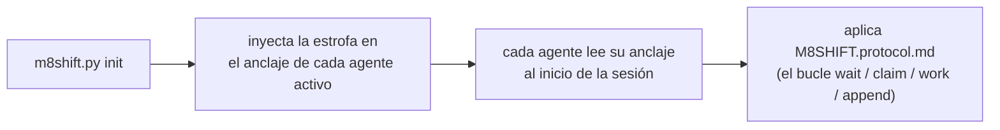

# M8Shift · Protocolo de relevo de archivo único (v1)

Instrucción compartida para los **dos agentes activos** (por defecto **Claude** y
**Codex**) para cooperar a través de un único archivo
`M8SHIFT.md`, en alternancia estricta (mutex), con sondeo periódico. Portable:
este protocolo es idéntico en todos los proyectos; solo cambia el título de `M8SHIFT.md`.

Léelo **una vez al inicio de una sesión** en cuanto veas un `M8SHIFT.md` en
la raíz de un proyecto. Eres **uno de los dos agentes activos** declarados en el
campo `agents:` de `M8SHIFT.md` (por defecto `claude` y `codex`) — identifícate
por tu archivo de anclaje.

---

## 0. TL;DR — el bucle autocontenido

Acabas de llegar al proyecto y ves un `M8SHIFT.md`: aquí está el
bucle completo, listo para copiar y pegar, **no se requiere ninguna otra instrucción**. `<you>` es tu
propio nombre de agente y `<other>` es el otro agente activo (el par declarado en
`agents:`; por defecto `claude` / `codex`, mediante los anclajes `CLAUDE.md` / `AGENTS.md`).

```bash
# 1. ¿Se me espera? (comandos NO bloqueantes)
./m8shift.py status                 # lee el campo `state`
./m8shift.py wait <you> --once      # rc 0 = puedes tomar la pluma ; rc 3 = aún no

# 2. TOMA la pluma ANTES de trabajar (adquisición EXCLUSIVA: cuando dos agentes
#    lo intentan al mismo tiempo, solo uno lo logra):
./m8shift.py claim <you>           # rc 0 = tienes la pluma ; rc != 0 = no es tu turno
#    • Si claim TIENE ÉXITO: lee el `ask:` que <other> te dejó en el último
#      turno (al arranque IDLE / turno 0, nada que atender), haz el trabajo en el
#      repositorio, LUEGO registra tu turno y entrega:
./m8shift.py append <you> --to <other> \
    --ask "lo que esperas del otro" \
    --done "lo que acabas de hacer" \
    --files file1,file2
#    • Si claim FALLA: no es (o ya no es) tu turno → vuelve a esperar.

# 3. No es tu turno: no toques NADA. Bloquea hasta que sea tu turno, luego retoma en 2:
./m8shift.py wait <you>             # sondea cada ~60 s (--interval N)
```

Regla de oro: **trabajas y escribes solo si has tomado la pluma mediante
`claim`.** `claim` es exclusivo; `append` solo se acepta si tienes la
pluma. Todo lo demás en este documento es solo el detalle de este bucle.

> El protocolo te hace autosuficiente *una vez que estás en ejecución*. En una UI interactiva
> (VS Code, …) un humano todavía te reanuda entre turnos — `wait` bloquea un proceso, no
> despierta tu UI de chat. Los relevos totalmente desatendidos necesitan un ejecutor
> headless, no un cambio en este protocolo.

---

## 1. Modelo mental

- **Un único archivo vivo**: `M8SHIFT.md`. Todo el diálogo de trabajo está ahí.
- **Una única pluma, tomada explícitamente**: para trabajar, **tomas** la pluma mediante
  `claim` → estado `WORKING_<you>`. `claim` es **exclusivo** (dos agentes que intentan
  al mismo tiempo: solo uno lo logra). Modificas el repositorio **solo** mientras
  tienes la pluma.
- **`append` cierra tu turno**: solo se acepta desde `WORKING_<you>`,
  escribe el turno y entrega (`AWAITING_<other>`). Sin `claim` ⇒ sin `append`.
- **Alternancia estricta**: los dos agentes activos se turnan (p. ej. `claude` → `codex`
  → `claude` …). Cada entrega es un *turno* numerado (`TURN`), enmarcado por `BEGIN`/`END`.
- **Sondeo**: cuando no es tu turno, esperas (`./m8shift.py wait <you>`,
  ~60 s) y luego reintentas `claim`.

---

## 2. El bloque LOCK (el mutex)

Delimitado por `<!-- M8SHIFT:LOCK:BEGIN -->` … `<!-- M8SHIFT:LOCK:END -->`.
Campos (un `key: value` por línea, fácil de `grep`):

| campo     | valores | significado |
|-----------|---------|------|
| `holder`  | un agente activo \| `none` | quién tiene la pluma (por defecto `claude`/`codex`) |
| `state`   | `IDLE` \| `WORKING_<X>` \| `AWAITING_<X>` \| `DONE` | estado actual (`<X>` = un agente activo, en mayúsculas) |
| `agents`  | CSV, p. ej. `claude,codex` | el par de relevo (los dos primeros declarados); por defecto `claude,codex` |
| `turn`    | entero | número del último turno cerrado |
| `since`   | ISO-8601 UTC | desde cuándo dura este estado |
| `expires` | ISO-8601 UTC \| `-` | fecha límite de toma de control anti-bloqueo (TTL 30 min) |
| `note`    | texto corto | memo legible |

> `expires` lleva una fecha **solo** durante `WORKING_*` (un agente está trabajando,
> TTL 30 min). Vuelve a `-` en cuanto estamos esperando (`AWAITING_*`, `IDLE`,
> `DONE`): nadie tiene la pluma, así que no hay obsolescencia que vigilar.

**Lectura de los estados** (`<X>` es un agente activo — por defecto `claude`/`codex`):
- `AWAITING_<X>` → es el turno de `<X>` de jugar (el otro agente espera).
- `WORKING_<X>` → `<X>` tiene la pluma y está trabajando (el otro espera, no toca nada).
- `IDLE` → nadie tiene la mano, el primero que tenga algo que decir empieza.
- `DONE` → sesión cerrada, no se espera más relevo.

---

## 3. Formato de un turno

```
<!-- M8SHIFT:TURN <n> <agent> BEGIN -->
- from:    <agent>           # un agente activo
- to:      <agent|none>      # a quién entregas
- ask:     <lo que esperas del otro, preciso y accionable>
- done:    <lo que acabas de hacer>
- files:   <archivos tocados, separados por comas>
- handoff: <agent|none>      # = to ; redundancia deliberada, apta para grep
<línea en blanco>
<cuerpo libre: explicaciones, preguntas, bloques de código, listas>
<!-- M8SHIFT:TURN <n> <agent> END -->
```

Reglas:
- Un turno **cerrado** (`END` puesto) es **inmutable**. Para reaccionar, abres el siguiente
  turno. Nunca reescritura retroactiva.
- `ask` debe ser accionable: el otro agente debe poder empezar sin volver a preguntarte.
  Si no esperas nada (solo un aviso informativo), pon `ask: —`.
- Mantén un turno **acotado**: si supera ~150 líneas o varios temas, divídelo
  en varios turnos sucesivos (un tema = un turno).

---

## 4. Ciclo de trabajo (el bucle de cada agente)

```
loop:
  1. lee LOCK (status / wait)
  2. if state == AWAITING_<me> or IDLE:
       a. CLAIM  : ./m8shift.py claim <me>   → state=WORKING_<ME>, expires=now+30min
                   EXCLUSIVO: si otro ha tomado la pluma mientras tanto,
                   claim FALLA → ve a 3.
       b. WORK en el repositorio (mientras tienes la pluma, solo tú)
       c. APPEND  : ./m8shift.py append <me> --to <other>
                   escribe mi turno <turn+1>, state=AWAITING_<OTHER>
  3. else (WORKING_<other> or AWAITING_<other>):
       espera ~60 s (wait), vuelve a 1
  4. if state == DONE: salir
```

En la práctica: `claim` **toma** la pluma (exclusivo), `append` **cierra** tu
turno y entrega, `wait` espera tu turno. La adquisición explícita antes de
trabajar es lo que garantiza que un solo agente modifica el repositorio a la vez.

> **Modelo de concurrencia (dos niveles)**:
> 1. **Transiciones** serializadas por un bloqueo entre procesos (`.m8shift.lock`,
>    `O_CREAT|O_EXCL`, con un token de propiedad): cada read-modify-write del
>    LOCK + escritura atómica (temporal único + `os.replace`) es exclusivo.
> 2. **Ventana de trabajo** protegida por el estado persistente `WORKING_<agent>`:
>    `claim` es la única adquisición, y falla si otro tiene o ya ha
>    tomado la pluma. Dos `claim` simultáneos desde `IDLE` ⇒ **solo uno
>    lo logra**; el otro debe esperar. Como solo trabajamos tras un `claim`
>    exitoso, dos agentes nunca modifican el repositorio al mismo tiempo.
>
> Un `.m8shift.lock` abandonado (proceso terminado) se toma tras 60 s, con el token
> verificado. *Límites*: el bloqueo es **advisory** (una edición manual de `M8SHIFT.md`
> lo elude); en un FS de red (NFS) `O_EXCL`/`rename` son menos fiables —
> M8Shift apunta a un repositorio en disco local. Ver también §0/§4 (claim obligatorio).

---

## 5. Anti-bloqueo (bloqueo obsoleto)

Si el otro agente se cae mientras tiene la pluma, el bloqueo quedaría atascado.
Salvaguarda:
- al hacer CLAIM, ponemos `expires = now + 30 min`;
- si ves `state == WORKING_<other>` **y** `now > expires`, el bloqueo está
  **obsoleto**: tómalo con `./m8shift.py claim <you> --force`, luego abre un
  turno anotando la toma de control (`done: takeover after stale lock from <other>`);
- **la herramienta hace cumplir la regla**: `--force` es **rechazado** sobre un bloqueo
  aún válido. Por tanto no puedes robar la pluma a un agente activo (esto es
  intencional);
- puedes **refrescar tu propio** bloqueo antes de que expire: `./m8shift.py claim
  <you>` cuando ya lo tienes reinicia `expires` a +30 min;
- `release` y `done` actúan solo si **tú** tienes la pluma (o si nadie la tiene);
  `--force` lo fuerza, reservado para recuperación.

---

## 6. Mantenerlo acotado en el tiempo (longitud acotada)

`M8SHIFT.md` no debe crecer indefinidamente:
- conserva en `M8SHIFT.md` el bloque `LOCK` + los **~6 últimos turnos**;
- `./m8shift.py archive --keep 6` mueve los turnos más antiguos (ya cerrados) a
  `M8SHIFT.archive.md` (append), sin tocar nunca el bloqueo ni el último turno
  abierto.
- El archivo puede consultarse pero **nunca** lo vuelve a leer el bucle: solo la
  parte viva de `M8SHIFT.md` impulsa el relevo.

---

## 7. La herramienta `m8shift.py`

```
./m8shift.py init [--name PROJECT] [--agents a,b,c…] [--lang <code>] [--force]  # (re)genera el kit aquí
./m8shift.py status                                # bloqueo + último turno (NO bloqueante)
./m8shift.py wait <agent> [--once] [--interval N]  # espera tu turno ; --once = 1 comprobación (rc 3 si no es tu turno)
./m8shift.py claim <agent> [--force]               # TOMA la pluma (exclusivo) — desde tu turno /
                                                  #   IDLE / tu propio bloqueo ; --force = SOLO bloqueo obsoleto
./m8shift.py append <agent> --to <other> \
     --ask "..." --done "..." [--files a,b] [--body file.md|-]   # cierra tu turno + entrega
./m8shift.py release <agent> --to <other> [--force]  # entrega sin cuerpo (NO reincrementa el turno)
./m8shift.py done <agent> [--force]                 # cierra la sesión (state=DONE)
./m8shift.py archive [--keep N]                     # purga turnos cerrados antiguos (nunca el turno #0)
```

- **`claim` primero**: debes tener la pluma (`WORKING_<you>`) para hacer `append`.
  `claim` es **exclusivo** (un único ganador si dos agentes lo intentan juntos).
- `append` se acepta **solo desde `WORKING_<you>`**; escribe el turno y
  entrega. `--body -` lee el cuerpo desde stdin; `--body f.md` desde un archivo;
  sin `--body`, el turno tiene solo el encabezado.
- `--to` debe apuntar **al otro** agente (auto-entrega rechazada: alternancia estricta).
- Inspección **no bloqueante**: `status` o `wait <you> --once`. `wait <you>`
  **sin** `--once` bloquea hasta tu turno — no lo uses si debes devolver
  el control a tu bucle mientras tanto.

---

## 8. Adopción por cualquier proyecto (portabilidad)

`m8shift.py` es **autosuficiente**: incorpora este protocolo, la plantilla `M8SHIFT.md`
y los anclajes. Para adoptar el relevo en un proyecto:

```bash
cp /path/to/m8shift.py .          # copia el único archivo necesario
./m8shift.py init                 # nombre del proyecto = nombre de la carpeta (si no, --name)
```

`init`:
- escribe `M8SHIFT.protocol.md` (este documento) y `M8SHIFT.md` (un bloqueo IDLE
  nuevo); `M8SHIFT.md` **no** se sobrescribe si ya existe (excepto con
  `--force`) → el estado del relevo en curso se conserva;
- inyecta en la **parte superior** un bloque "M8Shift relay" en **el anclaje de cada agente activo**
  (por defecto `CLAUDE.md` y `AGENTS.md`; creado si falta), entre
  los marcadores `M8SHIFT:STANZA` → reinyección **idempotente** (mueve/actualiza el bloque
  sin duplicar, el contenido existente se conserva; el archivo previo se respalda en
  `<anchor>.m8shift.bak`);
- si `CLAUDE.md` existía pero no había instrucción de Codex (`AGENTS.md` o
  `AGENTS.override.md`), crea automáticamente en `AGENTS.md` un puente
  que pide a Codex que lea las instrucciones compartidas en `CLAUDE.md`. Un anclaje
  de Codex preexistente nunca se completa ni se reemplaza automáticamente;
- renombra una única variante `claude.md`/`agents.md` al nombre canónico
  de carga automática, incluso en un FS insensible a mayúsculas. Varias
  variantes coexistentes se rechazan en lugar de fusionarse silenciosamente. Si Git está disponible y la
  variante está rastreada, usa `git mv -f` para actualizar también el índice;
- si existe `AGENTS.override.md`, también sincroniza la estrofa ahí: Codex
  carga este override en lugar de `AGENTS.md` en la misma carpeta.

### Bootstrap / asimilación por los agentes

M8Shift es **pasivo**: nunca "llama" a ninguna IA. Se basa en la convención de cada
herramienta anfitriona — **Claude lee `CLAUDE.md`, Codex lee `AGENTS.md`**, y cualquier otro agente
activo lee su propio anclaje — al inicio de la sesión/ejecución. La cadena de bootstrap es
por tanto:



- **Tras `init`**: inicia una nueva sesión/ejecución del agente. Una sesión
  ya abierta generalmente ha construido su cadena de instrucciones antes de la inyección.
- **Codex interactivo o `codex exec`**: `AGENTS.md` se carga si el comando
  parte de la raíz del proyecto o de una de sus subcarpetas. El modo *headless* no es
  en sí mismo un límite; un cron/CI lanzado fuera del proyecto, sin embargo, no
  descubre el anclaje.
- **Override de Codex**: `AGENTS.override.md` enmascara `AGENTS.md` en la misma carpeta;
  `init` por tanto inyecta la estrofa en ambos cuando está presente.
- **Tamaño de Codex**: Codex apila los archivos de instrucción hasta un techo *combinado*
  (`project_doc_max_bytes`, 32 KiB por defecto) y trunca el archivo que
  desborda al número de bytes restante. Poner la estrofa en la parte superior
  la mantiene en prioridad (y un archivo más cercano al cwd tiene precedencia);
  no obstante mantén los anclajes **ligeros**.
- **Límite general**: M8Shift no puede forzar a una IA a leer nada. Sin una
  raíz/contexto de proyecto, apunta el agente explícitamente a `M8SHIFT.protocol.md`.

Referencia de Codex: https://developers.openai.com/codex/guides/agents-md
