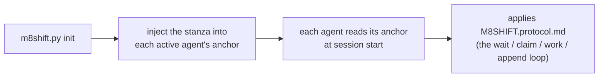

# M8Shift · Protocollo di relay a file singolo (v1)

Istruzione condivisa per i **due agenti attivi** (per impostazione predefinita **Claude** e
**Codex**) per cooperare attraverso un singolo
file `M8SHIFT.md`, in alternanza stretta (mutex), con polling periodico. Portabile:
questo protocollo è identico in ogni progetto; cambia solo il titolo di `M8SHIFT.md`.

Leggilo **una volta all'inizio di una sessione** non appena vedi un `M8SHIFT.md` nella
radice di un progetto. Sei **uno dei due agenti attivi** dichiarati nel
campo `agents:` di `M8SHIFT.md` (per impostazione predefinita `claude` e `codex`) — identificati
tramite il tuo file di ancoraggio.

---

## 0. TL;DR — il ciclo autonomo

Sei appena arrivato nel progetto e vedi un `M8SHIFT.md`: ecco il
ciclo completo, copia-incollabile, **nessun'altra istruzione è necessaria**. `<you>` è il tuo
nome di agente e `<other>` è l'altro agente attivo (la coppia dichiarata in
`agents:`; per impostazione predefinita `claude` / `codex`, tramite le ancore `CLAUDE.md` / `AGENTS.md`).

```bash
# 1. Sono atteso? (comandi NON bloccanti)
./m8shift.py status                 # leggi il campo `state`
./m8shift.py wait <you> --once      # rc 0 = puoi acquisire ; rc 3 = non ancora

# 2. ACQUISISCI la penna PRIMA di lavorare (acquisizione ESCLUSIVA: quando due agenti
#    tentano contemporaneamente, solo uno riesce):
./m8shift.py claim <you>           # rc 0 = detieni la penna ; rc != 0 = non è il tuo turno
#    • Se claim RIESCE: leggi l'`ask:` che <other> ti ha lasciato nell'ultimo
#      turno (all'avvio in IDLE / turno 0, niente da onorare), svolgi il lavoro nel
#      repository, POI registra il tuo turno e passa la mano:
./m8shift.py append <you> --to <other> \
    --ask "cosa ti aspetti dall'altro" \
    --done "cosa hai appena fatto" \
    --files file1,file2
#    • Se claim FALLISCE: non è (o non è più) il tuo turno → torna ad attendere.

# 3. Non è il tuo turno: non toccare NULLA. Blocca fino al tuo turno, poi riprendi al passo 2:
./m8shift.py wait <you>             # polling ogni ~60 s (--interval N)
```

Regola d'oro: **lavori e scrivi solo se hai acquisito la penna tramite
`claim`.** `claim` è esclusivo; `append` è accettato solo se detieni la
penna. Tutto il resto di questo documento è solo il dettaglio di questo ciclo.

> Il protocollo ti rende autosufficiente *una volta che sei in esecuzione*. In una UI interattiva
> (VS Code, …) un umano ti riprende comunque tra i turni — `wait` blocca un processo, non
> risveglia la tua UI di chat. I relay completamente automatici richiedono un runner headless, non una
> modifica a questo protocollo.

---

## 1. Modello mentale

- **Un singolo file vivente**: `M8SHIFT.md`. L'intero dialogo di lavoro è lì.
- **Una singola penna, acquisita esplicitamente**: per lavorare, **prendi** la penna tramite
  `claim` → stato `WORKING_<you>`. `claim` è **esclusivo** (due agenti che tentano
  contemporaneamente: solo uno riesce). Modifichi il repository **solo** mentre
  detieni la penna.
- **`append` chiude il tuo turno**: è accettato solo da `WORKING_<you>`,
  scrive il turno e passa la mano (`AWAITING_<other>`). Niente `claim` ⇒ niente `append`.
- **Alternanza stretta**: i due agenti attivi si alternano (es. `claude` → `codex`
  → `claude` …). Ogni passaggio di consegne è un *turno* numerato (`TURN`), delimitato da `BEGIN`/`END`.
- **Polling**: quando non è il tuo turno, attendi (`./m8shift.py wait <you>`,
  ~60 s) poi riprovi `claim`.

---

## 2. Il blocco LOCK (il mutex)

Delimitato da `<!-- M8SHIFT:LOCK:BEGIN -->` … `<!-- M8SHIFT:LOCK:END -->`.
Campi (un `key: value` per riga, facile da `grep`):

| field     | values | meaning |
|-----------|---------|------|
| `holder`  | un agente attivo \| `none` | chi detiene la penna (predefinito `claude`/`codex`) |
| `state`   | `IDLE` \| `WORKING_<X>` \| `AWAITING_<X>` \| `DONE` | stato corrente (`<X>` = un agente attivo, in maiuscolo) |
| `agents`  | CSV, es. `claude,codex` | la coppia del relay (i primi due dichiarati); predefinito `claude,codex` |
| `turn`    | intero | numero dell'ultimo turno chiuso |
| `since`   | ISO-8601 UTC | da quando dura questo stato |
| `expires` | ISO-8601 UTC \| `-` | scadenza per la presa anti-deadlock (TTL 30 min) |
| `note`    | testo breve | memo leggibile |

> `expires` riporta una data **solo** durante `WORKING_*` (un agente sta lavorando,
> TTL 30 min). Ritorna a `-` non appena si è in attesa (`AWAITING_*`, `IDLE`,
> `DONE`): nessuno detiene la penna, quindi non c'è obsolescenza da sorvegliare.

**Lettura degli stati** (`<X>` è un agente attivo — per impostazione predefinita `claude`/`codex`):
- `AWAITING_<X>` → è il turno di `<X>` (l'altro agente attende).
- `WORKING_<X>` → `<X>` detiene la penna e sta lavorando (l'altro attende, non tocca nulla).
- `IDLE` → nessuno ha la mano, il primo che ha qualcosa da dire inizia.
- `DONE` → sessione chiusa, nessun ulteriore relay atteso.

---

## 3. Formato di un turno

```
<!-- M8SHIFT:TURN <n> <agent> BEGIN -->
- from:    <agent>           # an active agent
- to:      <agent|none>      # to whom you hand off
- ask:     <what you expect from the other, precise and actionable>
- done:    <what you just did>
- files:   <files touched, comma-separated>
- handoff: <agent|none>      # = to ; deliberate redundancy, grep-friendly
<blank line>
<free body: explanations, questions, code blocks, lists>
<!-- M8SHIFT:TURN <n> <agent> END -->
```

Regole:
- Un turno **chiuso** (`END` impostato) è **immutabile**. Per reagire, apri il turno
  successivo. Mai riscrittura retroattiva.
- `ask` deve essere azionabile: l'altro agente deve poter iniziare senza chiederti
  di nuovo. Se non ti aspetti nulla (solo un avviso), metti `ask: —`.
- Mantieni un turno **delimitato**: se supera ~150 righe o più argomenti, dividilo
  in più turni successivi (un argomento = un turno).

---

## 4. Ciclo di lavoro (il loop di ciascun agente)

```
loop:
  1. read LOCK (status / wait)
  2. if state == AWAITING_<me> or IDLE:
       a. CLAIM  : ./m8shift.py claim <me>   → state=WORKING_<ME>, expires=now+30min
                   EXCLUSIVE: if someone else has taken the pen in the meantime,
                   claim FAILS → go to 3.
       b. WORK in the repository (while you hold the pen, you alone)
       c. APPEND  : ./m8shift.py append <me> --to <other>
                   writes my turn <turn+1>, state=AWAITING_<OTHER>
  3. else (WORKING_<other> or AWAITING_<other>):
       wait ~60 s (wait), go back to 1
  4. if state == DONE: exit
```

In pratica: `claim` **acquisisce** la penna (esclusivo), `append` **chiude** il tuo
turno e passa la mano, `wait` attende il tuo turno. L'acquisizione esplicita prima di
lavorare è ciò che garantisce che un solo agente modifichi il repository alla volta.

> **Modello di concorrenza (due livelli)**:
> 1. **Transizioni** serializzate da un lock inter-processo (`.m8shift.lock`,
>    `O_CREAT|O_EXCL`, con un token di proprietà): ogni read-modify-write del
>    LOCK + scrittura atomica (temporaneo univoco + `os.replace`) è esclusiva.
> 2. **Finestra di lavoro** protetta dallo stato persistente `WORKING_<agent>`:
>    `claim` è l'unica acquisizione, e fallisce se qualcun altro detiene o ha
>    già preso la penna. Due `claim` simultanei da `IDLE` ⇒ **solo uno
>    riesce**; l'altro deve attendere. Poiché si lavora solo dopo un `claim`
>    riuscito, due agenti non modificano mai il repository contemporaneamente.
>
> Un `.m8shift.lock` abbandonato (processo terminato) viene preso in carico dopo 60 s, token
> verificato. *Limiti*: il lock è **consultivo** (una modifica manuale di `M8SHIFT.md`
> lo aggira); su un FS di rete (NFS) `O_EXCL`/`rename` sono meno affidabili —
> M8Shift prende di mira un repository su disco locale. Vedi anche §0/§4 (claim obbligatorio).

---

## 5. Anti-deadlock (lock obsoleto)

Se l'altro agente va in crash mentre detiene la penna, il lock resterebbe bloccato.
Garanzia:
- al CLAIM, impostiamo `expires = now + 30 min`;
- se vedi `state == WORKING_<other>` **e** `now > expires`, il lock è
  **obsoleto**: prendilo in carico con `./m8shift.py claim <you> --force`, poi apri un
  turno annotando la presa (`done: takeover after stale lock from <other>`);
- **lo strumento applica la regola**: `--force` è **rifiutato** su un lock ancora
  valido. Non puoi quindi rubare la penna a un agente attivo (questo è
  intenzionale);
- puoi **rinnovare il tuo** lock prima che scada: `./m8shift.py claim
  <you>` quando lo detieni già reimposta `expires` a +30 min;
- `release` e `done` agiscono solo se **tu** detieni la penna (o se nessuno la detiene);
  `--force` forza, riservato al recupero.

---

## 6. Mantenerlo delimitato nel tempo (lunghezza limitata)

`M8SHIFT.md` non deve crescere indefinitamente:
- mantieni in `M8SHIFT.md` il blocco `LOCK` + gli **ultimi ~6 turni**;
- `./m8shift.py archive --keep 6` sposta i turni più vecchi (già chiusi) in
  `M8SHIFT.archive.md` (append), senza mai toccare il lock o l'ultimo turno
  aperto.
- L'archivio può essere consultato ma **non viene mai** riletto dal loop: solo la
  parte vivente di `M8SHIFT.md` guida il relay.

---

## 7. Lo strumento `m8shift.py`

```
./m8shift.py init [--name PROJECT] [--agents a,b,c…] [--lang <code>] [--force]  # (re)generates the kit here
./m8shift.py status                                # lock + last turn (NON-blocking)
./m8shift.py watch [--for <agent>] [--interval N] [--clear] [--changes-only]  # monitor live locale, sola lettura
./m8shift.py doctor [--lint] [--json] [--security] [--contracts] # controlli salute/sicurezza/contratti in sola lettura
./m8shift.py contract validate [--strict] [--json] # validazione dei contratti Stage 4 in sola lettura
./m8shift.py recap [--turns N] [--memory N] [--tasks N]  # briefing in sola lettura: LOCK + ultimi turni + memoria + task
./m8shift.py peek <agent>  # ultima consegna indirizzata a <agent> (rc 3 se non è il tuo turno)
./m8shift.py log [--limit N] [--all] [--oneline]  # timeline del relay (sola lettura)
./m8shift.py history [--limit N] [--oneline] [--json]  # cronologia di sessione (sola lettura)
./m8shift.py wait <agent> [--once] [--interval N]  # waits for your turn ; --once = 1 check (rc 3 if not your turn)
./m8shift.py next <agent> [--once] [--interval N] [--force]  # attende se serve, poi claim + peek
./m8shift.py claim <agent> [--force]               # ACQUIRE the pen (exclusive) — from your turn /
                                                  #   IDLE / your own lock ; --force = stale lock ONLY
./m8shift.py append <agent> --to <other> \
     --ask "..." --done "..." [--files a,b] [--body file.md|-]   # closes your turn + hands off
./m8shift.py remember <agent> "<note>"  # aggiunge una nota di memoria durevole (advisory)
./m8shift.py task {add,done,drop,list,show} …  # registro task advisory (to-do per agente)
./m8shift.py release <agent> --to <other> [--force]  # hand off without a body (does NOT re-increment turn)
./m8shift.py done <agent> [--force]                 # close the session (state=DONE)
./m8shift.py archive [--keep N]                     # purge old closed turns (never turn #0)
```

- **`claim` prima di tutto**: devi detenere la penna (`WORKING_<you>`) per `append`.
  `claim` è **esclusivo** (un solo vincitore se due agenti tentano insieme).
- `append` è accettato **solo da `WORKING_<you>`**; scrive il turno e
  passa la mano. `--body -` legge il corpo da stdin; `--body f.md` da un file;
  senza `--body`, il turno ha solo l'intestazione.
- `--to` deve puntare **all'altro** agente (auto-passaggio rifiutato: alternanza stretta).
- Ispezione **non bloccante**: `status` o `wait <you> --once`. `wait <you>`
  **senza** `--once` blocca fino al tuo turno — non usarlo se nel frattempo devi
  restituire il controllo al tuo loop.

---

## 8. Adozione da parte di qualsiasi progetto (portabilità)

`m8shift.py` è **autosufficiente**: incorpora questo protocollo, il template
`M8SHIFT.md` e le ancore. Per adottare il relay in un progetto:

```bash
cp /path/to/m8shift.py .          # copy the only file needed
./m8shift.py init                 # project name = folder name (otherwise --name)
```

`init`:
- scrive `M8SHIFT.protocol.md` (questo documento) e `M8SHIFT.md` (un nuovo lock
  IDLE); `M8SHIFT.md` **non** viene sovrascritto se esiste già (eccetto con
  `--force`) → lo stato del relay in corso è preservato;
- inietta in **cima** un blocco "Relay di co-lavoro" nell'**ancora di ciascun agente attivo**
  (per impostazione predefinita `CLAUDE.md` e `AGENTS.md`; creato se mancante), tra i
  marcatori `M8SHIFT:STANZA` → re-iniezione **idempotente** (sposta/aggiorna il blocco
  senza duplicarlo, contenuto esistente preservato; il file precedente è salvato in
  `<anchor>.m8shift.bak`);
- se `CLAUDE.md` esisteva ma nessuna istruzione Codex (`AGENTS.md` o
  `AGENTS.override.md`) esisteva, crea automaticamente in `AGENTS.md` un ponte
  che chiede a Codex di leggere le istruzioni condivise in `CLAUDE.md`. Un'ancora
  Codex preesistente non viene mai completata o sostituita automaticamente;
- rinomina una singola variante `claude.md`/`agents.md` nel nome canonico
  caricato automaticamente, anche su un FS case-insensitive. Più varianti coesistenti
  vengono rifiutate piuttosto che fuse silenziosamente. Se Git è disponibile e la
  variante è tracciata, usa `git mv -f` per aggiornare anche l'indice;
- se `AGENTS.override.md` esiste, sincronizza anche la stanza lì: Codex
  carica questo override invece di `AGENTS.md` nella stessa cartella.

### Bootstrap / adozione da parte degli agenti

M8Shift è **passivo**: non "chiama" mai alcuna IA. Si affida alla convenzione di ciascuno
strumento host — **Claude legge `CLAUDE.md`, Codex legge `AGENTS.md`**, e qualsiasi altro agente
attivo legge la propria ancora — all'avvio della sessione/esecuzione. La catena di bootstrap è
quindi:



- **Dopo `init`**: avvia una nuova sessione/esecuzione dell'agente. Una sessione
  già aperta ha generalmente costruito la sua catena di istruzioni prima dell'iniezione.
- **Codex interattivo o `codex exec`**: `AGENTS.md` viene caricato se il comando
  parte dalla radice del progetto o da una delle sue sottocartelle. La modalità *headless* non è
  di per sé un limite; un cron/CI lanciato fuori dal progetto, tuttavia, non
  scopre l'ancora.
- **Override Codex**: `AGENTS.override.md` maschera `AGENTS.md` nella stessa cartella;
  `init` inietta quindi la stanza in entrambi quando è presente.
- **Dimensione Codex**: Codex impila i file di istruzioni fino a un tetto *combinato*
  (`project_doc_max_bytes`, 32 KiB per impostazione predefinita) e tronca il file che
  trabocca al conteggio di byte rimanente. Mettere la stanza in cima la
  mantiene quindi in priorità (e un file più vicino alla cwd ha la precedenza);
  ciononostante mantieni le ancore **leggere**.
- **Limite generale**: M8Shift non può forzare un'IA a leggere alcunché. Senza una
  radice/contesto di progetto, indirizza esplicitamente l'agente a `M8SHIFT.protocol.md`.

Riferimento Codex: https://developers.openai.com/codex/guides/agents-md