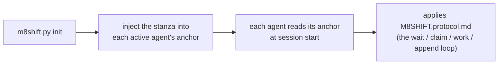

# M8Shift · 単一ファイルリレープロトコル（v1）

**2つのアクティブなエージェント**（デフォルトでは **Claude** と **Codex**）が単一の
`M8SHIFT.md` ファイルを通じて、厳密な交互（ミューテックス）で、定期的なポーリングにより
協働するための共有指示です。ポータブル: このプロトコルはすべてのプロジェクトで同一であり、
変わるのは `M8SHIFT.md` のタイトルだけです。

プロジェクトのルートに `M8SHIFT.md` を見つけたら、**セッション開始時に一度** これを読んで
ください。あなたは `M8SHIFT.md` の `agents:` フィールドで宣言された **2つのアクティブな
エージェントの1つ**です（デフォルトでは `claude` と `codex`）— 自分のアンカーファイルで
自分を識別してください。

---

## 0. TL;DR — 自己完結ループ

プロジェクトに到着したばかりで `M8SHIFT.md` が見えています: ここに完全でコピー＆ペースト可能な
ループを示します。**他の指示は一切不要です。** `<you>` はあなた自身のエージェント名、
`<other>` はもう一方のアクティブなエージェント（`agents:` で宣言されたペア; デフォルトでは
`claude` / `codex`、`CLAUDE.md` / `AGENTS.md` のアンカー経由）です。

```bash
# 1. 自分は期待されているか?（非ブロッキングコマンド）
./m8shift.py status                 # `state` フィールドを読む
./m8shift.py wait <you> --once      # rc 0 = 取得可能 ; rc 3 = まだ

# 2. 作業の前にペンを取得する（排他的取得: 2つのエージェントが
#    同時に試みた場合、成功するのは1つだけ）:
./m8shift.py claim <you>           # rc 0 = ペンを保持 ; rc != 0 = あなたの番ではない
#    • claim が成功した場合: <other> が直近のターンで残した `ask:` を読み
#      （IDLE 開始時 / ターン 0 では対応すべきものはない）、リポジトリで作業を行い、
#      その後ターンを記録して引き継ぐ:
./m8shift.py append <you> --to <other> \
    --ask "もう一方に期待すること" \
    --done "たった今行ったこと" \
    --files file1,file2
#    • claim が失敗した場合: あなたの番ではない（またはもう違う）→ 待機に戻る。

# 3. あなたの番でないとき: 何にも触れない。あなたの番までブロックし、その後 2 に戻る:
./m8shift.py wait <you>             # 約60秒ごとにポーリング（--interval N）
```

黄金律: **ペンを `claim` で取得した場合にのみ作業・書き込みを行う。** `claim` は
排他的; `append` はペンを保持している場合にのみ受け付けられます。このドキュメントの
その他すべては、このループの詳細にすぎません。

> プロトコルは、*実行されている状態であれば* あなたを自己完結させます。対話型 UI
> （VS Code など）では、ターンの間を人間があなたを再開させます — `wait` はプロセスを
> ブロックしますが、チャット UI を起動させるわけではありません。完全に人手を介さない
> リレーには、このプロトコルの変更ではなく、ヘッドレスランナーが必要です。

---

## 1. メンタルモデル

- **単一の生きたファイル**: `M8SHIFT.md`。作業上の対話全体がそこにあります。
- **明示的に取得される単一のペン**: 作業するには、`claim` でペンを**取得**します
  → 状態 `WORKING_<you>`。`claim` は**排他的**です（2つのエージェントが同時に試みた
  場合、成功するのは1つだけ）。ペンを保持している間**のみ**、リポジトリを変更します。
- **`append` がターンを閉じる**: `WORKING_<you>` からのみ受け付けられ、ターンを書き込み、
  引き継ぎます（`AWAITING_<other>`）。`claim` なし ⇒ `append` なし。
- **厳密な交互**: 2つのアクティブなエージェントが交互に動きます（例: `claude` → `codex`
  → `claude` …）。各引き継ぎは番号付きの*ターン*（`TURN`）で、`BEGIN`/`END` で囲まれます。
- **ポーリング**: あなたの番でないときは待機します（`./m8shift.py wait <you>`、
  約60秒）、その後 `claim` を再試行します。

---

## 2. LOCK ブロック（ミューテックス）

`<!-- M8SHIFT:LOCK:BEGIN -->` … `<!-- M8SHIFT:LOCK:END -->` で区切られます。
フィールド（1行に1つの `key: value`、`grep` しやすい）:

| field     | values | meaning |
|-----------|---------|------|
| `holder`  | アクティブなエージェント \| `none` | `WORKING_*` ではペン保持者、`AWAITING_*` では待たれているエージェント、`IDLE`/`PAUSED`/`DONE` では `none` |
| `state`   | `IDLE` \| `WORKING_<X>` \| `AWAITING_<X>` \| `PAUSED` \| `DONE` | 現在の状態（`<X>` = アクティブなエージェント、大文字） |
| `agents`  | CSV、例 `claude,codex` | リレーするペア（最初に宣言された2つ）; デフォルト `claude,codex` |
| `turn`    | 整数 | 最後に閉じたターンの番号 |
| `since`   | ISO-8601 UTC | この状態がいつから続いているか |
| `expires` | ISO-8601 UTC \| `-` | デッドロック防止の引き継ぎ期限（TTL 30分） |
| `note`    | 短いテキスト | 読みやすいメモ |

> `expires` は `WORKING_*` の間**のみ**日付を持ちます（エージェントが作業中、
> TTL 30分）。待機状態（`AWAITING_*`、`IDLE`、`PAUSED`、`DONE`）になり次第 `-` に戻ります:
> 誰もペンを保持していないため、監視すべき古さはありません。

**状態の読み方**（`<X>` はアクティブなエージェント — デフォルトでは `claude`/`codex`）:
- `AWAITING_<X>` → `<X>` の番です（もう一方のエージェントは待機）。
- `WORKING_<X>` → `<X>` がペンを保持して作業中（もう一方は待機し、何にも触れない）。
- `IDLE` → 誰も手番を持っていない、何か言うことのある最初の者が開始します。
- `PAUSED` → セッションは開いたままですが、割り当て済みの作業はありません。
  ユーザーが新しいスコープを与えたときだけ再開します。
- `DONE` → セッションは閉じられ、これ以上のリレーは期待されません。

---

## 3. ターンのフォーマット

```
<!-- M8SHIFT:TURN <n> <agent> BEGIN -->
- from:    <agent>           # アクティブなエージェント
- to:      <agent|none>      # 誰に引き継ぐか
- ask:     <もう一方に期待すること、正確かつ実行可能に>
- done:    <たった今行ったこと>
- files:   <変更したファイル、カンマ区切り>
- handoff: <agent|none>      # = to ; 意図的な冗長性、grep しやすい
<空行>
<自由本文: 説明、質問、コードブロック、リスト>
<!-- M8SHIFT:TURN <n> <agent> END -->
```

ルール:
- **閉じた**ターン（`END` 設定済み）は**不変**です。反応するには、次のターンを開きます。
  遡及的な書き換えは決して行いません。
- `ask` は実行可能でなければなりません: もう一方のエージェントが、あなたに再度尋ねることなく
  開始できなければなりません。何も期待しない場合（単なる FYI）は `ask: —` とします。
- ターンは**有界**に保ちます: 約150行または複数のトピックを超える場合は、連続する複数の
  ターンに分割します（1トピック = 1ターン）。

---

## 4. 作業サイクル（各エージェントのループ）

```
loop:
  1. read LOCK (status / wait)
  2. if state == AWAITING_<me> or IDLE:
       a. CLAIM  : ./m8shift.py claim <me>   → state=WORKING_<ME>, expires=now+30min
                   EXCLUSIVE: もし他の誰かがその間にペンを取得していたら、
                   claim は FAILS → 3 へ。
       b. WORK in the repository (ペンを保持している間、あなただけが)
       c. APPEND  : ./m8shift.py append <me> --to <other>
                   自分のターン <turn+1> を書き込み、state=AWAITING_<OTHER>
  3. else if state == PAUSED:
       do not claim; wait for new user scope, then resume explicitly.
  4. else (WORKING_<other> or AWAITING_<other>):
       約60秒待機（wait）、1 に戻る
  5. if state == DONE: exit
```

実際には: `claim` がペンを**取得**し（排他的）、`append` があなたのターンを**閉じて**
引き継ぎ、`wait` があなたの番を待ちます。作業前の明示的な取得こそが、一度に単一の
エージェントのみがリポジトリを変更することを保証します。

> **並行性モデル（2レベル）**:
> 1. **遷移** はプロセス間ロック（`.m8shift.lock`、`O_CREAT|O_EXCL`、所有権トークン付き）
>    によって直列化されます: LOCK の各 read-modify-write + アトミック書き込み
>    （一意の一時ファイル + `os.replace`）は排他的です。
> 2. **作業ウィンドウ** は永続状態 `WORKING_<agent>` によって保護されます:
>    `claim` が唯一の取得手段であり、他の誰かが保持しているかすでにペンを取得していた
>    場合は失敗します。`IDLE` からの2つの同時 `claim` ⇒ **1つだけが成功**;
>    もう一方は待機しなければなりません。`claim` の成功後にのみ作業するため、2つの
>    エージェントが同時にリポジトリを変更することは決してありません。
>
> 放棄された `.m8shift.lock`（プロセスが kill された）は、60秒後にトークンを検証した上で
> 引き継がれます。*制限*: ロックは**勧告的**です（`M8SHIFT.md` の手動編集はこれを
> バイパスします）; ネットワーク FS（NFS）では `O_EXCL`/`rename` の信頼性が低くなります —
> M8Shift はローカルディスク上のリポジトリを対象としています。§0/§4（必須の claim）も
> 参照してください。

---

## 5. デッドロック防止（古いロック）

もう一方のエージェントがペンを保持したままクラッシュした場合、ロックは固まったままに
なります。ガードレール:
- CLAIM 時に `expires = now + 30 min` を設定します;
- `state == WORKING_<other>` **かつ** `now > expires` が見える場合、ロックは
  **古い**: `./m8shift.py claim <you> --force` で引き継ぎ、その後引き継ぎを記録する
  ターンを開きます（`done: takeover after stale lock from <other>`）;
- **ツールがルールを強制します**: `--force` はまだ有効なロックに対しては**拒否**されます。
  したがって、アクティブなエージェントからペンを盗むことはできません（これは意図的です）;
- 期限切れ前に**自分自身の**ロックを**更新**できます: すでに保持している状態で
  `./m8shift.py claim <you>` を実行すると `expires` が +30分にリセットされます;
- `release` と `done` は、**あなた**がペンを保持している場合（または誰も保持していない場合）
  にのみ動作します; `--force` は上書きし、リカバリ用に予約されています。

---

## 6. 時間経過に伴う有界性の維持（長さの制限）

`M8SHIFT.md` は無限に成長してはなりません:
- `M8SHIFT.md` には `LOCK` ブロック + **直近の約6ターン**を保持します;
- `./m8shift.py archive --keep 6` は古いターン（すでに閉じたもの）を
  `M8SHIFT.archive.md` に移動します（追記）、ロックや最後の開いているターンには決して
  触れません。
- アーカイブは参照できますが、ループによって再読み込みされることは**決してありません**:
  `M8SHIFT.md` の生きている部分のみがリレーを駆動します。

---

## 7. `m8shift.py` ツール

```
./m8shift.py init [--name PROJECT] [--agents a,b,c…] [--lang <code>] [--force]  # ここにキットを（再）生成
./m8shift.py update --target DIR [--source DIR] [--components core,protocol,pack,anchors,companions] [--dry-run] [--json] [--allow-downgrade] [--allow-working] [--force-generated]  # RFC 048: ソース駆動のローカル更新 — 新しいソースコピーを実行し、すべての書き込みは --target に入る
./m8shift.py status                                # ロック + 直近のターン（非ブロッキング）
./m8shift.py watch [--for <agent>] [--interval N] [--clear] [--changes-only]  # ローカルのライブ監視（読み取り専用）
./m8shift.py doctor [--lint] [--json] [--security] [--contracts] # ヘルス/セキュリティ/契約の読み取り専用診断
./m8shift.py contract validate [--strict] [--json] # Stage 4 契約の読み取り専用検証
./m8shift.py recap [--turns N] [--memory N] [--tasks N]  # 読み取り専用の要約：LOCK + 直近のターン + メモリ + タスク
./m8shift.py peek <agent>  # <agent> 宛の最後のハンドオフ（自分の番でなければ rc 3）
./m8shift.py log [--limit N] [--all] [--oneline]  # リレーのタイムライン（読み取り専用）
./m8shift.py turn N [--json]  # 不変ターンの完全な done テキストを取得
./m8shift.py history [--limit N] [--oneline] [--json]  # セッション履歴（読み取り専用）
./m8shift.py time [current|SESSION_ID] [--json]  # 有効作業時間と非作業時間（読み取り専用）
./m8shift.py session {list,show,decisions,report} …  # セッション表示 + 任意のMarkdownレポート
./m8shift.py decisions {target,scaffold} …  # advisory decision trace target + Markdown/ADR scaffold
./m8shift.py wait <agent> [--once] [--interval N]  # あなたの番を待つ ; --once = 1回チェック（あなたの番でなければ rc 3）
./m8shift.py next <agent> [--once] [--interval N] [--force] [--resume --reason "..."]  # 必要なら待機し、claim + peek
./m8shift.py claim <agent> [--force]               # ペンを取得（排他的）— あなたの番 /
                                                  #   IDLE / 自分自身のロックから ; --force = 古いロックのみ
./m8shift.py may-i-write <agent>  # read-only hard guard: rc 0 only while <agent> holds a valid WORKING lock
./m8shift.py guard <agent>        # alias for may-i-write
./m8shift.py append <agent> --to <other> \
     --ask "..." --done "..." [--files a,b] [--body file.md|-]   # ターンを閉じて引き継ぐ
./m8shift.py request-turn <agent> --to <holder> --reason "..."  # ask current holder to yield (request ledger only)
./m8shift.py yield-turn <holder> --request N --to <agent>       # accept a cooperative turn request
./m8shift.py decline-turn <holder> --request N --reason "..."   # decline a cooperative turn request
./m8shift.py steer-turn <agent> --from <holder> --request N --force --reason "..."  # redirect idle AWAITING holder
./m8shift.py pause <holder> --reason "..."       # park an open session with no active task (state=PAUSED)
./m8shift.py cooldown --until ISO --reason "..." [--for agent] [--source SOURCE] [--wait-interval N] [--replace]
./m8shift.py resume <agent> --reason "..."       # resume PAUSED for a specific agent before claim
./m8shift.py remember <agent> "<note>"  # 永続的なメモリのメモを追記（advisory）
./m8shift.py work-tag <agent> <ref>  # WORKING ウィンドウに不透明な主要参照を割り当てる
./m8shift.py task {add,done,drop,list,show} …  # advisory なタスク台帳（エージェントごとの ToDo）
./m8shift.py bind <agent> [--candidate env|script] [--show|--clear|--list]  # このシフトを一つのプロジェクトリレーに固定（RFC 038 §9）。ペン不要。曖昧な場合はクローズドセレクタなしでは拒否
./m8shift.py heartbeat <agent> --source runtime-listener|wrapper --cadence-seconds N  # RFC 049：WORKING保持者を保護する生存ハートビート（管理プロデューサー用。ウィンドウ = max(120, min(2*N, TTL))。claim --refresh は監査用のみ）
./m8shift.py release <agent> --to <other> [--force]  # 本文なしで引き継ぐ（ターンを再インクリメントしない）
./m8shift.py done <agent> [--force]                 # セッションを閉じる（state=DONE）
./m8shift.py archive [--keep N]                     # 古い閉じたターンを削除（ターン #0 は決して削除しない）
```

- **まず `claim`**: `append` するにはペンを保持していなければなりません（`WORKING_<you>`）。
  `claim` は**排他的**です（2つのエージェントが一緒に試みた場合、勝者は1つだけ）。
- `append` は **`WORKING_<you>` からのみ**受け付けられます; ターンを書き込み、引き継ぎます。
  `--body -` は本文を stdin から読み込みます; `--body f.md` はファイルから; `--body` なしの場合、
  ターンはヘッダーのみになります。
- `--to` は**もう一方の**エージェントを対象にしなければなりません（自己引き継ぎは拒否: 厳密な交互）。
- **非ブロッキング**な検査: `status` または `wait <you> --once`。`wait <you>` を
  `--once` **なし**で実行すると、あなたの番までブロックします — その間に制御をループに
  返す必要がある場合は使用しないでください。

---

## 8. 任意のプロジェクトでの採用（ポータビリティ）

`m8shift.py` は**自己完結型**です: このプロトコル、`M8SHIFT.md` テンプレート、
アンカーを埋め込んでいます。プロジェクトでリレーを採用するには:

```bash
cp /path/to/m8shift.py .          # 必要な唯一のファイルをコピー
./m8shift.py init                 # プロジェクト名 = フォルダ名（それ以外は --name）
```

`init`:
- `M8SHIFT.protocol.md`（このドキュメント）と `M8SHIFT.md`（新しい IDLE ロック）を
  書き込みます; `M8SHIFT.md` はすでに存在する場合は上書きされません（`--force` を除く）
  → 進行中のリレーの状態が保持されます;
- **各アクティブなエージェントのアンカー**（デフォルトでは `CLAUDE.md` と `AGENTS.md`;
  なければ作成）の**先頭**に「協働リレー」ブロックを `M8SHIFT:STANZA` マーカーの間に
  注入します → **冪等**な再注入（重複させずにブロックを移動/更新し、既存のコンテンツは
  保持; 以前のファイルは `<anchor>.m8shift.bak` にバックアップ）;
- `CLAUDE.md` が存在したが Codex の指示（`AGENTS.md` または `AGENTS.override.md`）が
  存在しなかった場合、`AGENTS.md` に Codex へ `CLAUDE.md` の共有指示を読むよう求める
  ブリッジを自動的に作成します。既存の Codex アンカーは、自動的に補完または置換される
  ことは決してありません;
- 単一の `claude.md`/`agents.md` バリアントを正規の自動読み込み名にリネームします、
  大文字小文字を区別しない FS でも同様です。複数のバリアントが共存する場合は、暗黙的に
  マージするのではなく拒否されます。Git が利用可能でバリアントが追跡されている場合、
  インデックスも更新するために `git mv -f` を使用します;
- `AGENTS.override.md` が存在する場合、そこにもスタンザを同期します: Codex は同じ
  フォルダ内で `AGENTS.md` の代わりにこのオーバーライドを読み込みます。

### エージェントによるブートストラップ / 取り込み

M8Shift は**受動的**です: AI を「呼び出す」ことは決してありません。各ホストツールの規約に
依存しています — **Claude は `CLAUDE.md` を読み、Codex は `AGENTS.md` を読む**、その他の
アクティブなエージェントはそれぞれ自分のアンカーを読む — セッション/実行の開始時に。
したがってブートストラップチェーンは:



- **`init` の後**: エージェントの新しいセッション/実行を開始します。すでに開いている
  セッションは、一般に注入の前に指示チェーンを構築済みです。
- **対話型 Codex または `codex exec`**: コマンドがプロジェクトルートまたはそのサブフォルダの
  1つから開始される場合、`AGENTS.md` が読み込まれます。*ヘッドレス*モードはそれ自体が制限では
  ありません; ただし、プロジェクト外で起動された cron/CI はアンカーを発見しません。
- **Codex オーバーライド**: `AGENTS.override.md` は同じフォルダ内で `AGENTS.md` を
  マスクします; したがって `init` は、存在する場合は両方にスタンザを注入します。
- **Codex のサイズ**: Codex は指示ファイルを *combined* な上限まで積み重ね
  （`project_doc_max_bytes`、デフォルト 32 KiB）、オーバーフローしたファイルを残りの
  バイト数に切り詰めます。したがってスタンザを先頭に置くことで優先的に保持されます
  （また cwd により近いファイルが優先されます）; それでもアンカーは**軽量**に保ってください。
- **一般的な制限**: M8Shift は AI に何かを読むよう強制できません。プロジェクトの
  ルート/コンテキストがない場合は、エージェントに明示的に `M8SHIFT.protocol.md` を
  指定してください。

Codex リファレンス: https://developers.openai.com/codex/guides/agents-md
