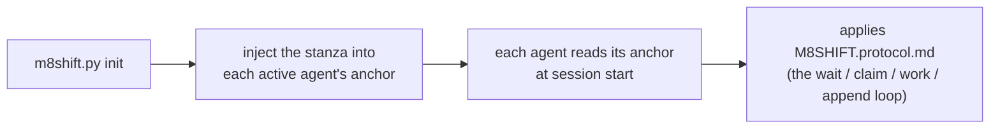

# M8Shift · Protocolo de relay de arquivo único (v1)

Instrução compartilhada para os **dois agentes ativos** (por padrão **Claude** e
**Codex**) cooperarem através de um único arquivo
`M8SHIFT.md`, em alternância estrita (mutex), com polling periódico. Portável:
este protocolo é idêntico em todos os projetos; apenas o título de `M8SHIFT.md`
muda.

Leia-o **uma vez no início de uma sessão** assim que você vir um `M8SHIFT.md` na
raiz de um projeto. Você é **um dos dois agentes ativos** declarados no campo
`agents:` de `M8SHIFT.md` (por padrão `claude` e `codex`) — identifique-se
pelo seu arquivo âncora.

---

## 0. TL;DR — o loop autossuficiente

Você acabou de chegar ao projeto e vê um `M8SHIFT.md`: aqui está o loop
completo, pronto para copiar e colar, **nenhuma outra instrução é necessária**. `<você>` é o
nome do seu próprio agente e `<outro>` é o outro agente ativo (o par declarado em
`agents:`; por padrão `claude` / `codex`, via as âncoras `CLAUDE.md` / `AGENTS.md`).

```bash
# 1. Sou esperado? (comandos NÃO bloqueantes)
./m8shift.py status                 # leia o campo `state`
./m8shift.py wait <you> --once      # rc 0 = você pode adquirir ; rc 3 = ainda não

# 2. ADQUIRA a caneta ANTES de trabalhar (aquisição EXCLUSIVA: quando dois agentes
#    tentam ao mesmo tempo, apenas um tem sucesso):
./m8shift.py claim <you>           # rc 0 = você detém a caneta ; rc != 0 = não é a sua vez
#    • Se o claim TIVER SUCESSO: leia o `ask:` que <outro> deixou para você no último
#      turno (no início em IDLE / turno 0, nada a honrar), faça o trabalho no
#      repositório, DEPOIS registre seu turno e passe adiante:
./m8shift.py append <you> --to <other> \
    --ask "o que você espera do outro" \
    --done "o que você acabou de fazer" \
    --files file1,file2
#    • Se o claim FALHAR: não é (ou não é mais) a sua vez → volte a aguardar.

# 3. Não é a sua vez: não toque em NADA. Bloqueie até a sua vez, depois retome no 2:
./m8shift.py wait <you>             # poll a cada ~60 s (--interval N)
```

Regra de ouro: **você trabalha e escreve apenas se tiver adquirido a caneta via
`claim`.** `claim` é exclusivo; `append` só é aceito se você detiver a
caneta. Todo o resto neste documento é apenas o detalhe deste loop.

> O protocolo o torna autossuficiente *uma vez que você esteja em execução*. Numa UI interativa
> (VS Code, …) um humano ainda o retoma entre turnos — `wait` bloqueia um processo, ele
> não desperta sua UI de chat. Relays totalmente autônomos precisam de um runner headless, não de uma
> mudança neste protocolo.

---

## 1. Modelo mental

- **Um único arquivo vivo**: `M8SHIFT.md`. Todo o diálogo de trabalho está ali.
- **Uma única caneta, adquirida explicitamente**: para trabalhar, você **toma** a caneta via
  `claim` → estado `WORKING_<você>`. `claim` é **exclusivo** (dois agentes tentando
  ao mesmo tempo: apenas um tem sucesso). Você modifica o repositório **somente** enquanto
  detém a caneta.
- **`append` fecha seu turno**: ele só é aceito a partir de `WORKING_<você>`,
  escreve o turno e passa adiante (`AWAITING_<outro>`). Sem `claim` ⇒ sem `append`.
- **Alternância estrita**: os dois agentes ativos se revezam (ex.: `claude` → `codex`
  → `claude` …). Cada passagem é um *turno* numerado (`TURN`), delimitado por `BEGIN`/`END`.
- **Poll**: quando não é a sua vez, você aguarda (`./m8shift.py wait <você>`,
  ~60 s) depois tenta `claim` novamente.

---

## 2. O bloco LOCK (o mutex)

Delimitado por `<!-- M8SHIFT:LOCK:BEGIN -->` … `<!-- M8SHIFT:LOCK:END -->`.
Campos (um `key: value` por linha, fácil de `grep`):

| campo     | valores | significado |
|-----------|---------|------|
| `holder`  | um agente ativo \| `none` | detentor da caneta em `WORKING_*`, agente aguardado em `AWAITING_*`, `none` em `IDLE`, `PAUSED` ou `DONE` |
| `state`   | `IDLE` \| `WORKING_<X>` \| `AWAITING_<X>` \| `PAUSED` \| `DONE` | estado atual (`<X>` = um agente ativo, em maiúsculas) |
| `agents`  | CSV, ex.: `claude,codex` | o par do relay (os dois primeiros declarados); padrão `claude,codex` |
| `turn`    | inteiro | número do último turno fechado |
| `since`   | ISO-8601 UTC | desde quando este estado dura |
| `expires` | ISO-8601 UTC \| `-` | prazo de tomada anti-deadlock (TTL 30 min) |
| `note`    | texto curto | memo legível |

> `expires` carrega uma data **apenas** durante `WORKING_*` (um agente está trabalhando,
> TTL 30 min). Volta a `-` assim que estamos aguardando (`AWAITING_*`, `IDLE`,
> `PAUSED`, `DONE`): ninguém detém a caneta, então não há obsolescência a vigiar.

**Lendo os estados** (`<X>` é um agente ativo — por padrão `claude`/`codex`):
- `AWAITING_<X>` → é a vez de `<X>` jogar (o outro agente aguarda).
- `WORKING_<X>` → `<X>` detém a caneta e está trabalhando (o outro aguarda, não toca em nada).
- `IDLE` → ninguém tem a mão, o primeiro que tiver algo a dizer começa.
- `PAUSED` → a sessão permanece aberta, mas nenhum agente tem trabalho atribuído;
  retomar apenas quando o usuário der um novo escopo.
- `DONE` → sessão fechada, nenhum relay adicional esperado.

---

## 3. Formato de um turno

```
<!-- M8SHIFT:TURN <n> <agent> BEGIN -->
- from:    <agent>           # um agente ativo
- to:      <agent|none>      # para quem você passa adiante
- ask:     <o que você espera do outro, preciso e acionável>
- done:    <o que você acabou de fazer>
- files:   <arquivos tocados, separados por vírgula>
- handoff: <agent|none>      # = to ; redundância deliberada, amigável ao grep
<linha em branco>
<corpo livre: explicações, perguntas, blocos de código, listas>
<!-- M8SHIFT:TURN <n> <agent> END -->
```

Regras:
- Um turno **fechado** (`END` definido) é **imutável**. Para reagir, você abre o próximo
  turno. Nunca reescrita retroativa.
- `ask` deve ser acionável: o outro agente deve conseguir começar sem perguntar
  novamente a você. Se você não espera nada (apenas um FYI), coloque `ask: —`.
- Mantenha um turno **limitado**: se ele exceder ~150 linhas ou vários tópicos, divida-o
  em vários turnos sucessivos (um tópico = um turno).

---

## 4. Ciclo de trabalho (o loop de cada agente)

```
loop:
  1. leia LOCK (status / wait)
  2. se state == AWAITING_<me> ou IDLE:
       a. CLAIM  : ./m8shift.py claim <me>   → state=WORKING_<ME>, expires=now+30min
                   EXCLUSIVO: se outra pessoa tiver tomado a caneta nesse meio-tempo,
                   o claim FALHA → vá para o 3.
       b. TRABALHE no repositório (enquanto detém a caneta, você sozinho)
       c. APPEND  : ./m8shift.py append <me> --to <other>
                   escreve meu turno <turn+1>, state=AWAITING_<OTHER>
  3. senão se state == PAUSED:
       não faça claim; aguarde novo escopo do usuário e retome explicitamente.
  4. senão (WORKING_<other> ou AWAITING_<other>):
       aguarde ~60 s (wait), volte ao 1
  5. se state == DONE: saia
```

Na prática: `claim` **adquire** a caneta (exclusivo), `append` **fecha** seu
turno e passa adiante, `wait` aguarda a sua vez. A aquisição explícita antes de
trabalhar é o que garante que um único agente modifica o repositório por vez.

> **Modelo de concorrência (dois níveis)**:
> 1. **Transições** serializadas por um bloqueio entre processos (`.m8shift.lock`,
>    `O_CREAT|O_EXCL`, com um token de propriedade): cada read-modify-write do
>    LOCK + escrita atômica (temporário único + `os.replace`) é exclusivo.
> 2. **Janela de trabalho** protegida pelo estado persistente `WORKING_<agent>`:
>    `claim` é a única aquisição, e ela falha se outra pessoa detém ou já tomou
>    a caneta. Dois `claim`s simultâneos a partir de `IDLE` ⇒ **apenas um
>    tem sucesso**; o outro deve aguardar. Como trabalhamos apenas após um `claim`
>    bem-sucedido, dois agentes nunca modificam o repositório ao mesmo tempo.
>
> Um `.m8shift.lock` abandonado (processo morto) é tomado após 60 s, token
> verificado. *Limites*: o bloqueio é **consultivo** (uma edição manual de `M8SHIFT.md`
> o contorna); num FS de rede (NFS) `O_EXCL`/`rename` são menos confiáveis —
> o M8Shift visa um repositório em disco local. Veja também §0/§4 (claim obrigatório).

---

## 5. Anti-deadlock (bloqueio obsoleto)

Se o outro agente travar enquanto detém a caneta, o bloqueio ficaria preso.
Salvaguarda:
- no CLAIM, definimos `expires = now + 30 min`;
- se você vir `state == WORKING_<other>` **e** `now > expires`, o bloqueio está
  **obsoleto**: tome-o com `./m8shift.py claim <you> --force`, depois abra um
  turno anotando a tomada (`done: takeover after stale lock from <other>`);
- **a ferramenta impõe a regra**: `--force` é **recusado** num bloqueio ainda
  válido. Você portanto não pode roubar a caneta de um agente ativo (isto é
  intencional);
- você pode **renovar o seu próprio** bloqueio antes que ele expire: `./m8shift.py claim
  <you>` quando você já o detém redefine `expires` para +30 min;
- `release` e `done` agem apenas se **você** detém a caneta (ou se ninguém a detém);
  `--force` sobrepõe, reservado para recuperação.

---

## 6. Mantendo limitado ao longo do tempo (comprimento limitado)

`M8SHIFT.md` não deve crescer indefinidamente:
- mantenha em `M8SHIFT.md` o bloco `LOCK` + os **~6 últimos turnos**;
- `./m8shift.py archive --keep 6` move os turnos mais antigos (já fechados) para
  `M8SHIFT.archive.md` (append), sem nunca tocar no bloqueio ou no último turno
  aberto.
- O arquivo pode ser consultado mas **nunca** é relido pelo loop: apenas a
  parte viva de `M8SHIFT.md` conduz o relay.

---

## 7. A ferramenta `m8shift.py`

```
./m8shift.py init [--name PROJECT] [--agents a,b,c…] [--lang <code>] [--force]  # (re)gera o kit aqui
./m8shift.py status                                # bloqueio + último turno (NÃO bloqueante)
./m8shift.py watch [--for <agent>] [--interval N] [--clear] [--changes-only]  # monitor local ao vivo, somente leitura
./m8shift.py doctor [--lint] [--json] [--security] [--contracts] # verificações de saúde/segurança/contratos somente leitura
./m8shift.py contract validate [--strict] [--json] # validação dos contratos Stage 4 somente leitura
./m8shift.py recap [--turns N] [--memory N] [--tasks N]  # resumo somente leitura: LOCK + últimos turnos + memória + tarefas
./m8shift.py peek <agent>  # última passagem endereçada a <agent> (rc 3 se não for sua vez)
./m8shift.py log [--limit N] [--all] [--oneline]  # linha do tempo do relé (somente leitura)
./m8shift.py history [--limit N] [--oneline] [--json]  # histórico de sessão (somente leitura)
./m8shift.py wait <agent> [--once] [--interval N]  # aguarda sua vez ; --once = 1 verificação (rc 3 se não for sua vez)
./m8shift.py next <agent> [--once] [--interval N] [--force] [--resume --reason "..."]  # espera se necessário, depois claim + peek
./m8shift.py claim <agent> [--force]               # ADQUIRE a caneta (exclusivo) — a partir da sua vez /
                                                  #   IDLE / seu próprio bloqueio ; --force = bloqueio obsoleto SOMENTE
./m8shift.py append <agent> --to <other> \
     --ask "..." --done "..." [--files a,b] [--body file.md|-]   # fecha seu turno + passa adiante
./m8shift.py request-turn <agent> --to <holder> --reason "..."  # ask current holder to yield (request ledger only)
./m8shift.py yield-turn <holder> --request N --to <agent>       # accept a cooperative turn request
./m8shift.py decline-turn <holder> --request N --reason "..."   # decline a cooperative turn request
./m8shift.py steer-turn <agent> --from <holder> --request N --force --reason "..."  # redirect idle AWAITING holder
./m8shift.py pause <holder> --reason "..."       # park an open session with no active task (state=PAUSED)
./m8shift.py resume <agent> --reason "..."       # resume PAUSED for a specific agent before claim
./m8shift.py remember <agent> "<note>"  # anexa uma nota de memória durável (advisory)
./m8shift.py task {add,done,drop,list,show} …  # registro de tarefas advisory (afazeres por agente)
./m8shift.py release <agent> --to <other> [--force]  # passa adiante sem corpo (NÃO re-incrementa o turno)
./m8shift.py done <agent> [--force]                 # fecha a sessão (state=DONE)
./m8shift.py archive [--keep N]                     # purga turnos fechados antigos (nunca o turno #0)
```

- **`claim` primeiro**: você deve deter a caneta (`WORKING_<you>`) para fazer `append`.
  `claim` é **exclusivo** (um único vencedor se dois agentes tentarem juntos).
- `append` é aceito **somente a partir de `WORKING_<you>`**; ele escreve o turno e
  passa adiante. `--body -` lê o corpo do stdin; `--body f.md` de um arquivo;
  sem `--body`, o turno tem apenas o cabeçalho.
- `--to` deve apontar para **o outro** agente (auto-passagem recusada: alternância estrita).
- Inspeção **não bloqueante**: `status` ou `wait <you> --once`. `wait <you>`
  **sem** `--once` bloqueia até a sua vez — não o use se você precisar devolver
  o controle ao seu loop nesse meio-tempo.

---

## 8. Adoção por qualquer projeto (portabilidade)

`m8shift.py` é **autossuficiente**: ele embute este protocolo, o template `M8SHIFT.md`
e as âncoras. Para adotar o relay num projeto:

```bash
cp /path/to/m8shift.py .          # copie o único arquivo necessário
./m8shift.py init                 # nome do projeto = nome da pasta (caso contrário --name)
```

`init`:
- escreve `M8SHIFT.protocol.md` (este documento) e `M8SHIFT.md` (um bloqueio IDLE
  novo); `M8SHIFT.md` **não** é sobrescrito se já existir (exceto com
  `--force`) → o estado do relay em andamento é preservado;
- injeta no **topo** um bloco "Relay de co-trabalho" na **âncora de cada agente ativo**
  (por padrão `CLAUDE.md` e `AGENTS.md`; criados se ausentes), entre
  marcadores `M8SHIFT:STANZA` → reinjeção **idempotente** (move/atualiza o bloco
  sem duplicar, conteúdo existente preservado; o arquivo anterior é salvo em
  `<anchor>.m8shift.bak`);
- se `CLAUDE.md` existia mas nenhuma instrução do Codex (`AGENTS.md` ou
  `AGENTS.override.md`) existia, cria automaticamente em `AGENTS.md` uma ponte
  pedindo ao Codex que leia as instruções compartilhadas em `CLAUDE.md`. Uma âncora
  do Codex pré-existente nunca é completada ou substituída automaticamente;
- renomeia uma única variante `claude.md`/`agents.md` para o nome canônico
  carregado automaticamente, inclusive num FS que ignora maiúsculas/minúsculas. Várias
  variantes coexistentes são recusadas em vez de mescladas silenciosamente. Se o Git estiver
  disponível e a variante for rastreada, ele usa `git mv -f` para também atualizar o índice;
- se `AGENTS.override.md` existir, ele também sincroniza a estrofe ali: o Codex
  carrega este override em vez de `AGENTS.md` na mesma pasta.

### Bootstrap / adoção pelos agentes

o M8Shift é **passivo**: ele nunca "chama" nenhuma IA. Ele se apoia na convenção de cada
ferramenta hospedeira — **Claude lê `CLAUDE.md`, Codex lê `AGENTS.md`**, e qualquer outro agente ativo
lê sua própria âncora — no início da sessão/execução. A cadeia de bootstrap é
portanto:



- **Após `init`**: inicie uma nova sessão/execução do agente. Uma sessão
  já aberta geralmente construiu sua cadeia de instruções antes da injeção.
- **Codex interativo ou `codex exec`**: `AGENTS.md` é carregado se o comando
  começar a partir da raiz do projeto ou de uma de suas subpastas. O modo *headless* não está
  em si um limite; um cron/CI lançado fora do projeto, no entanto, não
  descobre a âncora.
- **Override do Codex**: `AGENTS.override.md` mascara `AGENTS.md` na mesma pasta;
  `init` portanto injeta a estrofe em ambos quando ele está presente.
- **Tamanho do Codex**: o Codex empilha os arquivos de instrução até um teto *combinado*
  (`project_doc_max_bytes`, 32 KiB por padrão) e trunca o arquivo que
  transborda para a contagem de bytes restante. Colocar a estrofe no topo assim
  a mantém em prioridade (e um arquivo mais próximo do cwd tem precedência);
  no entanto mantenha as âncoras **leves**.
- **Limite geral**: o M8Shift não pode forçar uma IA a ler nada. Sem uma
  raiz/contexto de projeto, aponte o agente explicitamente para `M8SHIFT.protocol.md`.

Referência do Codex: https://developers.openai.com/codex/guides/agents-md
