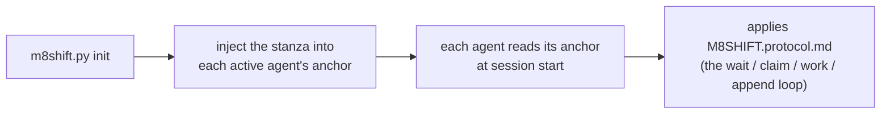

# M8Shift · Протокол однофайлового реле (v1)

Общая инструкция для **двух активных агентов** (по умолчанию **Claude** и
**Codex**) для совместной работы через единственный
файл `M8SHIFT.md`, в строгом чередовании (мьютекс), с периодическим опросом. Переносимо:
этот протокол одинаков в каждом проекте; меняется только заголовок `M8SHIFT.md`.

Прочтите его **один раз в начале сессии**, как только увидите `M8SHIFT.md` в
корне проекта. Вы — **один из двух активных агентов**, объявленных в
поле `agents:` файла `M8SHIFT.md` (по умолчанию `claude` и `codex`) — определите себя
по своему файлу-якорю.

---

## 0. TL;DR — самодостаточный цикл

Вы только что пришли в проект и видите `M8SHIFT.md`: вот
полный, готовый к копированию цикл, **никакой другой инструкции не требуется**. `<you>` — это ваше
собственное имя агента, а `<other>` — другой активный агент (пара, объявленная в
`agents:`; по умолчанию `claude` / `codex`, через якоря `CLAUDE.md` / `AGENTS.md`).

```bash
# 1. Меня ждут? (НЕблокирующие команды)
./m8shift.py status                 # прочитать поле `state`
./m8shift.py wait <you> --once      # rc 0 = можно брать ; rc 3 = ещё нет

# 2. ЗАХВАТИТЬ перо ПЕРЕД работой (ЭКСКЛЮЗИВНЫЙ захват: когда два агента
#    пытаются одновременно, успех только у одного):
./m8shift.py claim <you>           # rc 0 = перо у вас ; rc != 0 = не ваш ход
#    • Если claim УСПЕШЕН: прочтите `ask:`, который <other> оставил вам в последнем
#      ходе (при запуске в IDLE / ходе 0 выполнять нечего), сделайте работу в
#      репозитории, ЗАТЕМ запишите свой ход и передайте:
./m8shift.py append <you> --to <other> \
    --ask "что вы ожидаете от другого" \
    --done "что вы только что сделали" \
    --files file1,file2
#    • Если claim НЕУДАЧЕН: сейчас (или уже) не ваш ход → вернитесь к ожиданию.

# 3. Не ваш ход: НИЧЕГО не трогайте. Блокируйтесь до своего хода, затем продолжите с п. 2:
./m8shift.py wait <you>             # опрос каждые ~60 с (--interval N)
```

Золотое правило: **вы работаете и пишете только в том случае, если взяли перо через
`claim`.** `claim` эксклюзивен; `append` принимается, только если перо у вас. Всё
остальное в этом документе — лишь детализация этого цикла.

> Протокол делает вас самодостаточным *после того, как вы запущены*. В интерактивном UI
> (VS Code, …) человек всё же возобновляет вас между ходами — `wait` блокирует процесс, но
> не пробуждает ваш чат-UI. Полностью автономным реле нужен безголовый раннер, а не
> изменение этого протокола.

---

## 1. Ментальная модель

- **Единый живой файл**: `M8SHIFT.md`. Весь рабочий диалог находится там.
- **Единое перо, явно захватываемое**: чтобы работать, вы **берёте** перо через
  `claim` → состояние `WORKING_<you>`. `claim` **эксклюзивен** (два агента пробуют
  одновременно: успех только у одного). Вы изменяете репозиторий **только** пока
  держите перо.
- **`append` закрывает ваш ход**: он принимается только из `WORKING_<you>`,
  записывает ход и передаёт (`AWAITING_<other>`). Нет `claim` ⇒ нет `append`.
- **Строгое чередование**: два активных агента ходят по очереди (например, `claude` → `codex`
  → `claude` …). Каждая передача — это нумерованный *ход* (`TURN`), обрамлённый `BEGIN`/`END`.
- **Опрос**: когда не ваш ход, вы ждёте (`./m8shift.py wait <you>`,
  ~60 с), затем повторяете `claim`.

---

## 2. Блок LOCK (мьютекс)

Ограничен `<!-- M8SHIFT:LOCK:BEGIN -->` … `<!-- M8SHIFT:LOCK:END -->`.
Поля (одна пара `key: value` на строку, легко для `grep`):

| поле      | значения | смысл |
|-----------|---------|------|
| `holder`  | активный агент \| `none` | кто держит перо (по умолчанию `claude`/`codex`) |
| `state`   | `IDLE` \| `WORKING_<X>` \| `AWAITING_<X>` \| `DONE` | текущее состояние (`<X>` = активный агент, в верхнем регистре) |
| `agents`  | CSV, например `claude,codex` | реле-пара (первые два объявленных); по умолчанию `claude,codex` |
| `turn`    | целое | номер последнего закрытого хода |
| `since`   | ISO-8601 UTC | с какого момента длится это состояние |
| `expires` | ISO-8601 UTC \| `-` | срок перехвата для защиты от взаимоблокировки (TTL 30 мин) |
| `note`    | короткий текст | читаемая заметка |

> `expires` несёт дату **только** во время `WORKING_*` (агент работает,
> TTL 30 мин). Оно возвращается к `-`, как только мы ждём (`AWAITING_*`, `IDLE`,
> `DONE`): никто не держит перо, поэтому за устареванием следить не нужно.

**Чтение состояний** (`<X>` — активный агент, по умолчанию `claude`/`codex`):
- `AWAITING_<X>` → ход за `<X>` (другой агент ждёт).
- `WORKING_<X>` → `<X>` держит перо и работает (другой ждёт, ничего не трогает).
- `IDLE` → ни у кого нет хода, начинает первый, у кого есть что сказать.
- `DONE` → сессия закрыта, дальнейшего реле не ожидается.

---

## 3. Формат хода

```
<!-- M8SHIFT:TURN <n> <agent> BEGIN -->
- from:    <agent>           # активный агент
- to:      <agent|none>      # кому вы передаёте
- ask:     <что вы ожидаете от другого, точно и выполнимо>
- done:    <что вы только что сделали>
- files:   <затронутые файлы, через запятую>
- handoff: <agent|none>      # = to ; намеренная избыточность, удобно для grep
<пустая строка>
<свободное тело: пояснения, вопросы, блоки кода, списки>
<!-- M8SHIFT:TURN <n> <agent> END -->
```

Правила:
- **Закрытый** ход (`END` установлен) **неизменяем**. Чтобы отреагировать, вы открываете следующий
  ход. Никаких ретроактивных переписываний.
- `ask` должно быть выполнимым: другой агент должен суметь начать, не переспрашивая
  вас. Если вы ничего не ожидаете (просто к сведению), укажите `ask: —`.
- Держите ход **ограниченным**: если он превышает ~150 строк или несколько тем, разбейте его
  на несколько последовательных ходов (одна тема = один ход).

---

## 4. Рабочий цикл (цикл каждого агента)

```
loop:
  1. read LOCK (status / wait)
  2. if state == AWAITING_<me> or IDLE:
       a. CLAIM  : ./m8shift.py claim <me>   → state=WORKING_<ME>, expires=now+30min
                   EXCLUSIVE: if someone else has taken the pen in the meantime,
                   claim FAILS → go to 3.
       b. WORK in the repository (while you hold the pen, you alone)
       c. APPEND  : ./m8shift.py append <me> --to <other>
                   writes my turn <turn+1>, state=AWAITING_<OTHER>
  3. else (WORKING_<other> or AWAITING_<other>):
       wait ~60 s (wait), go back to 1
  4. if state == DONE: exit
```

На практике: `claim` **захватывает** перо (эксклюзивно), `append` **закрывает** ваш
ход и передаёт, `wait` ожидает вашего хода. Явный захват перед
работой и есть то, что гарантирует, что репозиторий изменяет только один агент за раз.

> **Модель конкурентности (два уровня)**:
> 1. **Переходы** сериализуются межпроцессной блокировкой (`.m8shift.lock`,
>    `O_CREAT|O_EXCL`, с токеном владения): каждое чтение-изменение-запись
>    LOCK + атомарная запись (уникальный временный файл + `os.replace`) эксклюзивны.
> 2. **Окно работы** защищено устойчивым состоянием `WORKING_<agent>`:
>    `claim` — единственный захват, и он завершается неудачей, если кто-то другой держит или уже
>    взял перо. Два одновременных `claim` из `IDLE` ⇒ **успех только у одного**;
>    другой должен ждать. Поскольку мы работаем только после успешного
>    `claim`, два агента никогда не изменяют репозиторий одновременно.
>
> Заброшенный `.m8shift.lock` (убитый процесс) перехватывается через 60 с, токен
> проверяется. *Ограничения*: блокировка **рекомендательная** (ручное редактирование `M8SHIFT.md`
> обходит её); в сетевой ФС (NFS) `O_EXCL`/`rename` менее надёжны —
> M8Shift рассчитан на репозиторий на локальном диске. См. также §0/§4 (обязательный claim).

---

## 5. Защита от взаимоблокировки (устаревшая блокировка)

Если другой агент аварийно завершится, держа перо, блокировка осталась бы заклиненной.
Защита:
- при CLAIM мы устанавливаем `expires = now + 30 min`;
- если вы видите `state == WORKING_<other>` **и** `now > expires`, блокировка
  **устарела**: перехватите её через `./m8shift.py claim <you> --force`, затем откройте
  ход с пометкой о перехвате (`done: takeover after stale lock from <other>`);
- **инструмент обеспечивает соблюдение правила**: `--force` **отклоняется** на ещё действительной
  блокировке. Поэтому вы не можете украсть перо у активного агента (это
  намеренно);
- вы можете **обновить свою собственную** блокировку до её истечения: `./m8shift.py claim
  <you>`, когда вы уже держите её, сбрасывает `expires` на +30 мин;
- `release` и `done` действуют, только если перо держите **вы** (или если его не держит никто);
  `--force` переопределяет, зарезервировано для восстановления.

---

## 6. Поддержание ограниченности во времени (ограниченная длина)

`M8SHIFT.md` не должен расти бесконечно:
- держите в `M8SHIFT.md` блок `LOCK` + **~6 последних ходов**;
- `./m8shift.py archive --keep 6` переносит более старые ходы (уже закрытые) в
  `M8SHIFT.archive.md` (дописывание), никогда не трогая блокировку или последний открытый
  ход.
- Архив можно просматривать, но он **никогда** не перечитывается циклом: реле управляет только
  живая часть `M8SHIFT.md`.

---

## 7. Инструмент `m8shift.py`

```
./m8shift.py init [--name PROJECT] [--agents a,b,c…] [--lang <code>] [--force]  # (пере)создаёт набор здесь
./m8shift.py status                                # блокировка + последний ход (НЕблокирующая)
./m8shift.py doctor [--lint] [--json] [--security] [--contracts] # проверки состояния/безопасности/контрактов только для чтения
./m8shift.py contract validate [--strict] [--json] # проверка контрактов Stage 4 только для чтения
./m8shift.py wait <agent> [--once] [--interval N]  # ожидает вашего хода ; --once = 1 проверка (rc 3, если не ваш ход)
./m8shift.py claim <agent> [--force]               # ЗАХВАТИТЬ перо (эксклюзивно) — из вашего хода /
                                                  #   IDLE / вашей собственной блокировки ; --force = ТОЛЬКО устаревшая блокировка
./m8shift.py append <agent> --to <other> \
     --ask "..." --done "..." [--files a,b] [--body file.md|-]   # закрывает ваш ход + передаёт
./m8shift.py release <agent> --to <other> [--force]  # передаёт без тела (НЕ инкрементирует turn повторно)
./m8shift.py done <agent> [--force]                 # закрывает сессию (state=DONE)
./m8shift.py archive [--keep N]                     # очищает старые закрытые ходы (никогда ход #0)
```

- **Сначала `claim`**: вы должны держать перо (`WORKING_<you>`), чтобы делать `append`.
  `claim` **эксклюзивен** (единственный победитель, если два агента пробуют вместе).
- `append` принимается **только из `WORKING_<you>`**; он записывает ход и
  передаёт. `--body -` читает тело из stdin; `--body f.md` — из файла;
  без `--body` ход содержит только заголовок.
- `--to` должно указывать на **другого** агента (самопередача отклоняется: строгое чередование).
- **Неблокирующая** инспекция: `status` или `wait <you> --once`. `wait <you>`
  **без** `--once` блокирует до вашего хода — не используйте его, если вы должны вернуть
  управление своему циклу в это время.

---

## 8. Внедрение в любой проект (переносимость)

`m8shift.py` **самодостаточен**: он встраивает этот протокол, шаблон `M8SHIFT.md`
и якоря. Чтобы внедрить реле в проект:

```bash
cp /path/to/m8shift.py .          # скопировать единственный нужный файл
./m8shift.py init                 # имя проекта = имя папки (иначе --name)
```

`init`:
- записывает `M8SHIFT.protocol.md` (этот документ) и `M8SHIFT.md` (свежую блокировку
  IDLE); `M8SHIFT.md` **не** перезаписывается, если уже существует (кроме как с
  `--force`) → состояние текущего реле сохраняется;
- внедряет в **начало** блок «Реле совместной работы» в **якорь каждого активного агента**
  (по умолчанию `CLAUDE.md` и `AGENTS.md`; создаются при отсутствии), между
  маркерами `M8SHIFT:STANZA` → **идемпотентное** повторное внедрение (перемещает/обновляет блок
  без дублирования, существующее содержимое сохраняется; предыдущий файл резервируется в
  `<anchor>.m8shift.bak`);
- если `CLAUDE.md` существовал, но не было инструкции для Codex (`AGENTS.md` или
  `AGENTS.override.md`), автоматически создаёт в `AGENTS.md` мост,
  просящий Codex прочитать общие инструкции в `CLAUDE.md`. Уже существующий
  якорь Codex никогда не дополняется и не заменяется автоматически;
- переименовывает единственный вариант `claude.md`/`agents.md` в каноническое
  автозагружаемое имя, в том числе в ФС без учёта регистра. Несколько сосуществующих
  вариантов отклоняются, а не молча объединяются. Если Git доступен и
  вариант отслеживается, используется `git mv -f`, чтобы также обновить индекс;
- если существует `AGENTS.override.md`, он также синхронизирует строфу там: Codex
  загружает это переопределение вместо `AGENTS.md` в той же папке.

### Начальная настройка / усвоение агентами

M8Shift **пассивен**: он никогда не «вызывает» какой-либо ИИ. Он полагается на соглашение каждого
хост-инструмента — **Claude читает `CLAUDE.md`, Codex читает `AGENTS.md`**, а любой другой активный
агент читает свой собственный якорь — при запуске сессии/выполнения. Поэтому цепочка начальной настройки
такова:



- **После `init`**: запустите новую сессию/выполнение агента. Уже открытая
  сессия, как правило, построила свою цепочку инструкций до внедрения.
- **Интерактивный Codex или `codex exec`**: `AGENTS.md` загружается, если команда
  запускается из корня проекта или одной из его подпапок. *Безголовый* режим сам по себе не
  является ограничением; однако cron/CI, запущенный вне проекта, не
  обнаружит якорь.
- **Переопределение Codex**: `AGENTS.override.md` маскирует `AGENTS.md` в той же папке;
  поэтому `init` внедряет строфу в оба, когда оно присутствует.
- **Размер Codex**: Codex складывает файлы инструкций до *совокупного* потолка
  (`project_doc_max_bytes`, 32 KiB по умолчанию) и усекает файл, который
  переполняет, до оставшегося числа байт. Размещение строфы вверху таким образом
  сохраняет её в приоритете (и файл ближе к cwd имеет преимущество);
  тем не менее держите якоря **лёгкими**.
- **Общее ограничение**: M8Shift не может заставить ИИ что-либо прочитать. Без
  корня/контекста проекта направьте агента явно на `M8SHIFT.protocol.md`.

Справочник Codex: https://developers.openai.com/codex/guides/agents-md