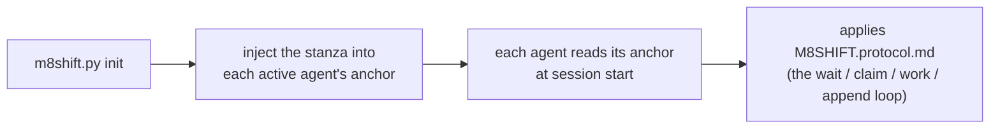

# M8Shift · 单文件中继协议（v1）

供 **两个活动 agent**（默认为 **Claude** 和
**Codex**）通过单个
`M8SHIFT.md` 文件协作的共享指令，采用严格交替（互斥）配合周期性轮询。可移植：
该协议在每个项目中都相同；只有 `M8SHIFT.md` 的标题
会改变。

当你在项目根目录看到 `M8SHIFT.md` 时，**在会话开始时通读一次**。
你是 `M8SHIFT.md` 的 `agents:` 字段中声明的 **两个活动 agent 之一**（默认为 `claude` 和 `codex`）——
请通过你的锚文件确认你自己的身份。

---

## 0. TL;DR —— 自包含循环

你刚到达项目并看到了一个 `M8SHIFT.md`：以下是
完整、可直接复制粘贴的循环，**无需任何其他指令**。`<you>` 是你
自己的 agent 名称，`<other>` 是另一个活动 agent（在 `agents:` 中声明的那一对；
默认为 `claude` / `codex`，通过 `CLAUDE.md` / `AGENTS.md` 锚文件）。

```bash
# 1. 是否轮到我？（非阻塞命令）
./m8shift.py status                 # 读取 `state` 字段
./m8shift.py wait <you> --once      # rc 0 = 你可以获取 ; rc 3 = 还不行

# 2. 在工作之前先获取笔（独占获取：当两个 agent
#    同时尝试时，只有一个成功）：
./m8shift.py claim <you>           # rc 0 = 你持有笔 ; rc != 0 = 还没轮到你
#    • 如果 claim 成功：阅读 <other> 在上一轮留给你的 `ask:`
#      （在 IDLE 启动 / 第 0 轮时，没有需要响应的内容），在仓库中完成工作，
#      然后记录你的轮次并交接：
./m8shift.py append <you> --to <other> \
    --ask "你对对方的期望" \
    --done "你刚刚做了什么" \
    --files file1,file2
#    • 如果 claim 失败：现在（或已经）不是你的轮次 → 回到等待。

# 3. 还没轮到你：什么都别碰。阻塞直到轮到你，然后回到第 2 步：
./m8shift.py wait <you>             # 约每 60 秒轮询一次（--interval N）
```

黄金法则：**只有在你通过 `claim` 取得笔之后才工作和写入。**
`claim` 是独占的；`append` 仅在你持有笔时才被接受。本文档中
的其他内容只是这个循环的细节。

> 该协议在你*运行起来之后*使你自给自足。在交互式 UI
> （VS Code 等）中，人类仍会在轮次之间唤醒你 —— `wait` 阻塞的是一个进程，它
> 不会唤醒你的聊天 UI。完全无人值守的中继需要一个无头运行器，而不是
> 修改本协议。

---

## 1. 心智模型

- **单个活动文件**：`M8SHIFT.md`。整个工作对话都在那里。
- **单支笔，需显式获取**：要工作，你通过
  `claim` **取得**笔 → 状态 `WORKING_<you>`。`claim` 是 **独占的**（两个 agent
  同时尝试：只有一个成功）。**只有**在你持有笔时，你才能修改仓库。
- **`append` 关闭你的轮次**：它仅在 `WORKING_<you>` 时被接受，
  写入轮次并交接（`AWAITING_<other>`）。没有 `claim` ⇒ 没有 `append`。
- **严格交替**：两个活动 agent 轮流进行（例如 `claude` → `codex`
  → `claude` …）。每次交接都是一个编号的 *轮次*（`TURN`），由 `BEGIN`/`END` 包裹。
- **轮询**：当不是你的轮次时，你等待（`./m8shift.py wait <you>`，
  约 60 秒），然后重试 `claim`。

---

## 2. LOCK 块（互斥锁）

由 `<!-- M8SHIFT:LOCK:BEGIN -->` … `<!-- M8SHIFT:LOCK:END -->` 界定。
字段（每行一个 `key: value`，便于 `grep`）：

| field     | values | meaning |
|-----------|---------|------|
| `holder`  | 一个活动 agent \| `none` | 谁持有笔（默认 `claude`/`codex`） |
| `state`   | `IDLE` \| `WORKING_<X>` \| `AWAITING_<X>` \| `DONE` | 当前状态（`<X>` = 一个活动 agent，大写） |
| `agents`  | CSV，例如 `claude,codex` | 中继的那一对（声明的前两个）；默认 `claude,codex` |
| `turn`    | 整数 | 最后一个已关闭轮次的编号 |
| `since`   | ISO-8601 UTC | 该状态持续的起始时间 |
| `expires` | ISO-8601 UTC \| `-` | 防死锁接管截止时间（TTL 30 分钟） |
| `note`    | 短文本 | 可读的备忘 |

> `expires` **仅**在 `WORKING_*` 期间携带日期（某个 agent 正在工作，
> TTL 30 分钟）。一旦进入等待状态（`AWAITING_*`、`IDLE`、
> `DONE`），它就回到 `-`：没有人持有笔，因此没有需要监视的失效。

**读取状态**（`<X>` 是一个活动 agent —— 默认为 `claude`/`codex`）：
- `AWAITING_<X>` → 轮到 `<X>` 行动（另一个 agent 等待）。
- `WORKING_<X>` → `<X>` 持有笔并正在工作（另一个等待，什么都不碰）。
- `IDLE` → 没有人持有控制权，第一个有话要说的人开始。
- `DONE` → 会话已关闭，不再期待进一步的中继。

---

## 3. 轮次格式

```
<!-- M8SHIFT:TURN <n> <agent> BEGIN -->
- from:    <agent>           # 一个活动 agent
- to:      <agent|none>      # 你交接给谁
- ask:     <你对对方的期望，精确且可执行>
- done:    <你刚刚做了什么>
- files:   <改动的文件，逗号分隔>
- handoff: <agent|none>      # = to ; 故意冗余，便于 grep
<空行>
<自由正文：说明、问题、代码块、列表>
<!-- M8SHIFT:TURN <n> <agent> END -->
```

规则：
- 一个 **已关闭** 的轮次（已设置 `END`）是 **不可变的**。要回应，你就开启下一个
  轮次。绝不进行追溯性的改写。
- `ask` 必须可执行：对方 agent 必须能够无需再次询问你就开始工作。
  如果你没有任何期望（仅供参考），请填 `ask: —`。
- 保持轮次 **有界**：如果它超过约 150 行或涉及多个主题，请将它
  拆分为多个连续的轮次（一个主题 = 一个轮次）。

---

## 4. 工作周期（每个 agent 的循环）

```
loop:
  1. read LOCK (status / wait)
  2. if state == AWAITING_<me> or IDLE:
       a. CLAIM  : ./m8shift.py claim <me>   → state=WORKING_<ME>, expires=now+30min
                   EXCLUSIVE: if someone else has taken the pen in the meantime,
                   claim FAILS → go to 3.
       b. WORK in the repository (while you hold the pen, you alone)
       c. APPEND  : ./m8shift.py append <me> --to <other>
                   writes my turn <turn+1>, state=AWAITING_<OTHER>
  3. else (WORKING_<other> or AWAITING_<other>):
       wait ~60 s (wait), go back to 1
  4. if state == DONE: exit
```

实践中：`claim` **获取**笔（独占），`append` **关闭**你的
轮次并交接，`wait` 等待你的轮次。在工作之前进行显式获取，
正是这一点保证了同一时间只有一个 agent 修改仓库。

> **并发模型（两个层级）**：
> 1. **状态转换** 由进程间锁（`.m8shift.lock`，
>    `O_CREAT|O_EXCL`，带有所有权令牌）串行化：每次对
>    LOCK 的读-改-写 + 原子写入（唯一临时文件 + `os.replace`）都是独占的。
> 2. **工作窗口** 由持久状态 `WORKING_<agent>` 保护：
>    `claim` 是唯一的获取方式，如果其他人持有或已经取走了笔，它就失败。
>    两个从 `IDLE` 发起的同时 `claim` ⇒ **只有一个
>    成功**；另一个必须等待。由于我们只在 `claim` 成功后才工作，
>    两个 agent 绝不会同时修改仓库。
>
> 一个被遗弃的 `.m8shift.lock`（进程被杀死）会在 60 秒后被接管，
> 并验证令牌。*限制*：该锁是 **建议性的**（手动编辑 `M8SHIFT.md`
> 会绕过它）；在网络文件系统（NFS）上，`O_EXCL`/`rename` 不太可靠 ——
> M8Shift 面向本地磁盘上的仓库。另见 §0/§4（强制 claim）。

---

## 5. 防死锁（失效锁）

如果另一个 agent 在持有笔时崩溃，锁就会一直卡住。
防护措施：
- 在 CLAIM 时，我们设置 `expires = now + 30 min`；
- 如果你看到 `state == WORKING_<other>` **且** `now > expires`，则该锁
  **已失效**：用 `./m8shift.py claim <you> --force` 接管它，然后开启一个
  轮次记录该接管（`done: takeover after stale lock from <other>`）；
- **工具会强制执行此规则**：对仍然有效的锁，`--force` 会被 **拒绝**。
  因此你无法从一个活动 agent 那里窃取笔（这是
  有意为之）；
- 你可以在自己的锁过期之前 **刷新它**：当你已经持有锁时执行
  `./m8shift.py claim <you>` 会将 `expires` 重置为 +30 分钟；
- `release` 和 `done` 仅在 **你** 持有笔时（或没有人持有时）才生效；
  `--force` 可覆盖，专用于恢复。

---

## 6. 长期保持有界（有界长度）

`M8SHIFT.md` 不得无限增长：
- 在 `M8SHIFT.md` 中保留 `LOCK` 块 + **最近约 6 个轮次**；
- `./m8shift.py archive --keep 6` 将较旧的轮次（已关闭的）移动到
  `M8SHIFT.archive.md`（追加），而绝不触碰锁或最后一个开启的
  轮次。
- 归档可以查阅，但循环 **绝不** 重新读取它：只有
  `M8SHIFT.md` 的活动部分驱动中继。

---

## 7. `m8shift.py` 工具

```
./m8shift.py init [--name PROJECT] [--agents a,b,c…] [--lang <code>] [--force]  # (re)generates the kit here
./m8shift.py status                                # lock + last turn (NON-blocking)
./m8shift.py watch [--for <agent>] [--interval N] [--clear] [--changes-only]  # 本地实时监视（只读）
./m8shift.py doctor [--lint] [--json] [--security] [--contracts] # 只读的健康/安全/合约检查
./m8shift.py contract validate [--strict] [--json] # Stage 4 合约的只读校验
./m8shift.py recap [--turns N] [--memory N] [--tasks N]  # 只读简报：LOCK + 最近的轮次 + 记忆 + 任务
./m8shift.py peek <agent>  # 发给 <agent> 的最后一次交接（不是你的轮次则 rc 3）
./m8shift.py log [--limit N] [--all] [--oneline]  # 中继时间线（只读）
./m8shift.py history [--limit N] [--oneline] [--json]  # 会话历史（只读）
./m8shift.py wait <agent> [--once] [--interval N]  # waits for your turn ; --once = 1 check (rc 3 if not your turn)
./m8shift.py next <agent> [--once] [--interval N] [--force]  # 需要时等待，然后 claim + peek
./m8shift.py claim <agent> [--force]               # ACQUIRE the pen (exclusive) — from your turn /
                                                  #   IDLE / your own lock ; --force = stale lock ONLY
./m8shift.py append <agent> --to <other> \
     --ask "..." --done "..." [--files a,b] [--body file.md|-]   # closes your turn + hands off
./m8shift.py request-turn <agent> --to <holder> --reason "..."  # ask current holder to yield (request ledger only)
./m8shift.py yield-turn <holder> --request N --to <agent>       # accept a cooperative turn request
./m8shift.py decline-turn <holder> --request N --reason "..."   # decline a cooperative turn request
./m8shift.py steer-turn <agent> --from <holder> --request N --force --reason "..."  # redirect idle AWAITING holder
./m8shift.py remember <agent> "<note>"  # 追加一条持久记忆笔记（advisory）
./m8shift.py task {add,done,drop,list,show} …  # advisory 任务清单（按代理的待办）
./m8shift.py release <agent> --to <other> [--force]  # hand off without a body (does NOT re-increment turn)
./m8shift.py done <agent> [--force]                 # close the session (state=DONE)
./m8shift.py archive [--keep N]                     # purge old closed turns (never turn #0)
```

- **先 `claim`**：你必须持有笔（`WORKING_<you>`）才能 `append`。
  `claim` 是 **独占的**（两个 agent 一起尝试时只有一个胜出）。
- `append` **仅在 `WORKING_<you>` 时** 被接受；它写入轮次并
  交接。`--body -` 从 stdin 读取正文；`--body f.md` 从文件读取；
  不带 `--body` 时，轮次只有头部。
- `--to` 必须指向 **另一个** agent（拒绝自我交接：严格交替）。
- **非阻塞** 检查：`status` 或 `wait <you> --once`。`wait <you>`
  **不带** `--once` 会一直阻塞，直到轮到你 —— 如果你在此期间必须将
  控制权交还给你的循环，请不要使用它。

---

## 8. 任意项目的采用（可移植性）

`m8shift.py` 是 **自给自足的**：它内嵌了本协议、`M8SHIFT.md`
模板和锚文件。要在某个项目中采用该中继：

```bash
cp /path/to/m8shift.py .          # copy the only file needed
./m8shift.py init                 # project name = folder name (otherwise --name)
```

`init`：
- 写入 `M8SHIFT.protocol.md`（本文档）和 `M8SHIFT.md`（一个全新的 IDLE
  锁）；如果 `M8SHIFT.md` 已存在，则 **不会** 被覆盖（除非使用
  `--force`）→ 正在进行的中继状态得以保留；
- 在 **顶部** 向 **每个活动 agent 的锚文件** 注入一个“协作中继”块
  （默认为 `CLAUDE.md` 和 `AGENTS.md`；缺失时创建），位于
  `M8SHIFT:STANZA` 标记之间 → **幂等** 的重新注入（移动/更新该块
  而不重复，保留现有内容；先前的文件会备份到
  `<anchor>.m8shift.bak`）；
- 如果 `CLAUDE.md` 已存在但不存在 Codex 指令（`AGENTS.md` 或
  `AGENTS.override.md`），则在 `AGENTS.md` 中自动创建一个桥接，
  要求 Codex 阅读 `CLAUDE.md` 中的共享指令。已存在的
  Codex 锚文件绝不会被自动补全或替换；
- 将单个 `claude.md`/`agents.md` 变体重命名为规范的
  自动加载名称，包括在不区分大小写的文件系统上。若存在多个共存的
  变体，则会被拒绝，而不是悄悄合并。如果 Git 可用且该
  变体已被跟踪，则使用 `git mv -f` 同时更新索引；
- 如果存在 `AGENTS.override.md`，它也会在那里同步段落：Codex
  在同一文件夹中加载此 override 而不是 `AGENTS.md`。

### 由 agent 引导 / 接管

M8Shift 是 **被动的**：它绝不“调用”任何 AI。它依赖于每个
宿主工具的约定 —— **Claude 读取 `CLAUDE.md`，Codex 读取 `AGENTS.md`**，任何其他活动
agent 在会话/执行启动时读取它自己的锚文件。因此引导链
为：



- **`init` 之后**：启动该 agent 的新会话/执行。一个
  已经打开的会话通常在注入之前就已经构建了它的指令链。
- **交互式 Codex 或 `codex exec`**：如果命令从项目根目录或其某个
  子文件夹启动，则会加载 `AGENTS.md`。*无头* 模式本身
  并不是限制；然而，在项目之外启动的 cron/CI 不会
  发现锚文件。
- **Codex override**：`AGENTS.override.md` 在同一文件夹中遮蔽 `AGENTS.md`；
  因此 `init` 在它存在时会向两者注入段落。
- **Codex 大小**：Codex 将指令文件堆叠到一个 *组合* 上限
  （`project_doc_max_bytes`，默认 32 KiB），并将溢出的文件
  截断到剩余的字节数。因此把段落放在顶部
  能让它保持优先（且更靠近 cwd 的文件优先）；
  尽管如此，请保持锚文件 **轻量**。
- **总体限制**：M8Shift 无法强迫 AI 阅读任何内容。在没有
  项目根/上下文的情况下，请明确地将 agent 指向 `M8SHIFT.protocol.md`。

Codex 参考：https://developers.openai.com/codex/guides/agents-md
